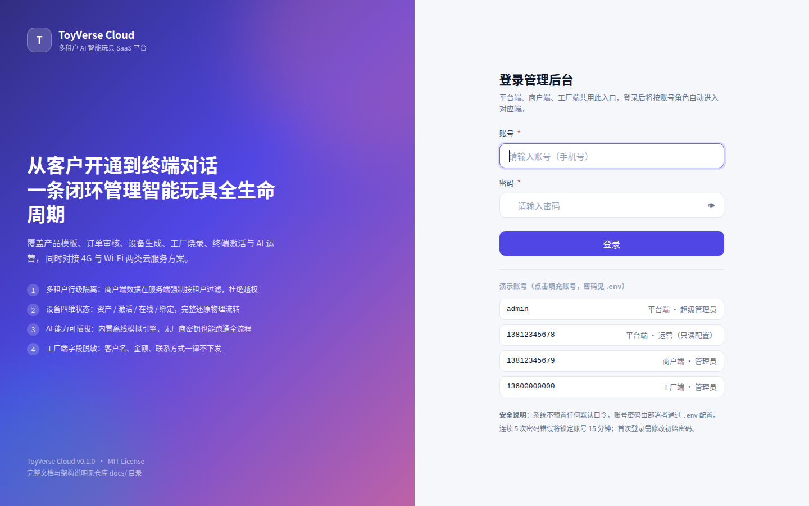
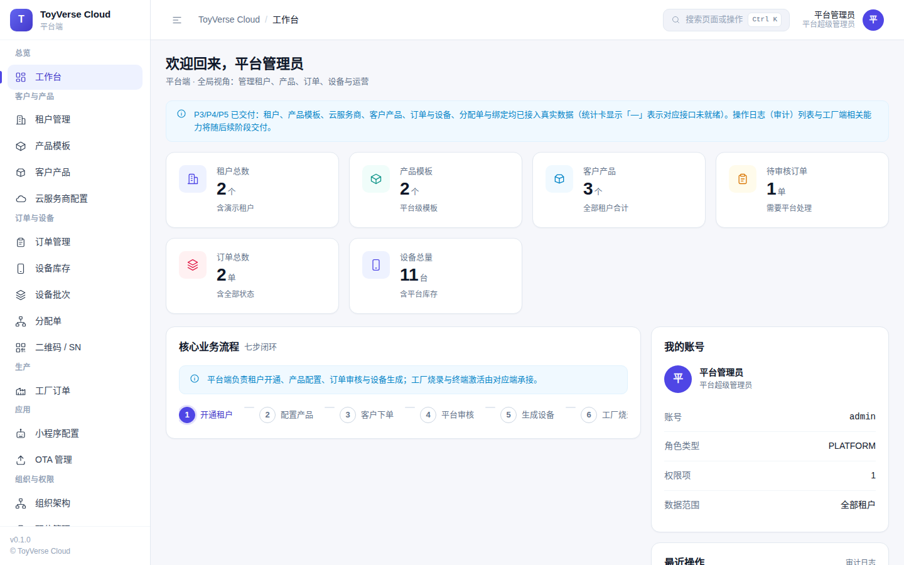
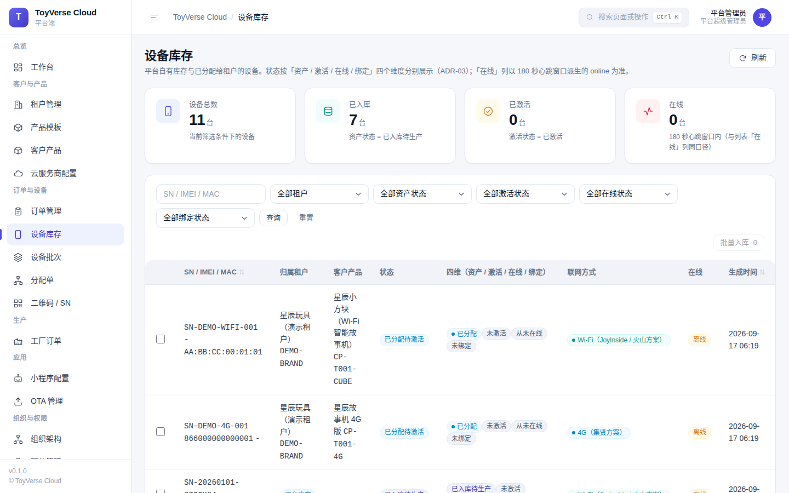
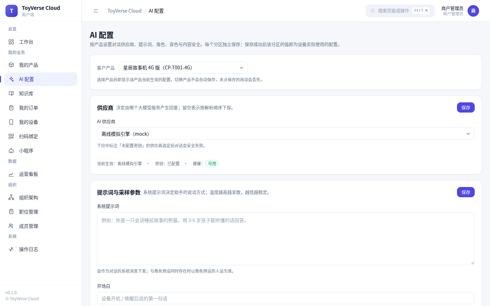
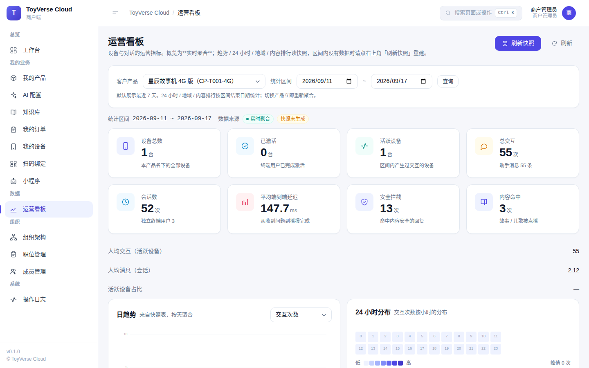
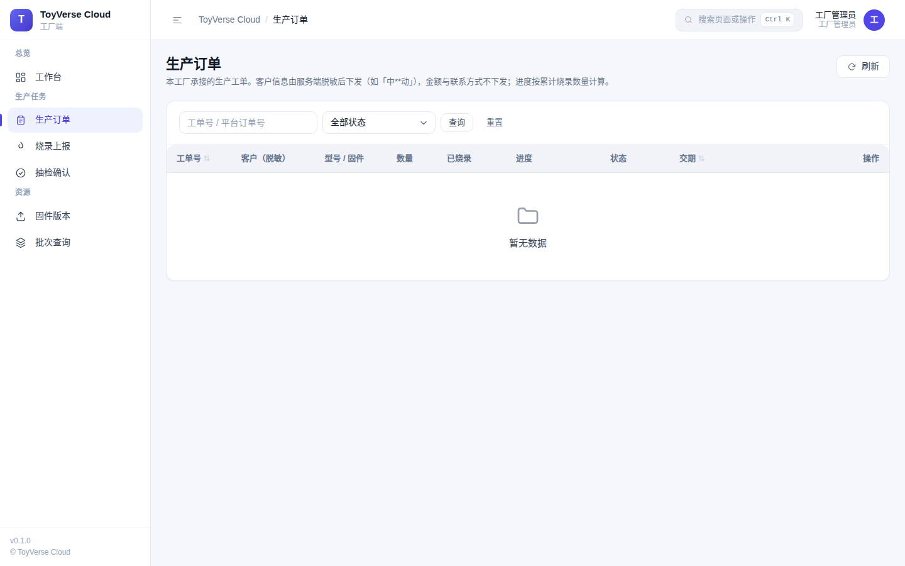
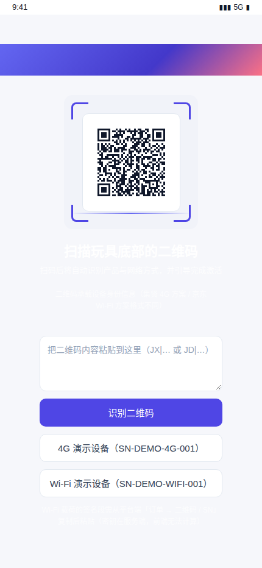
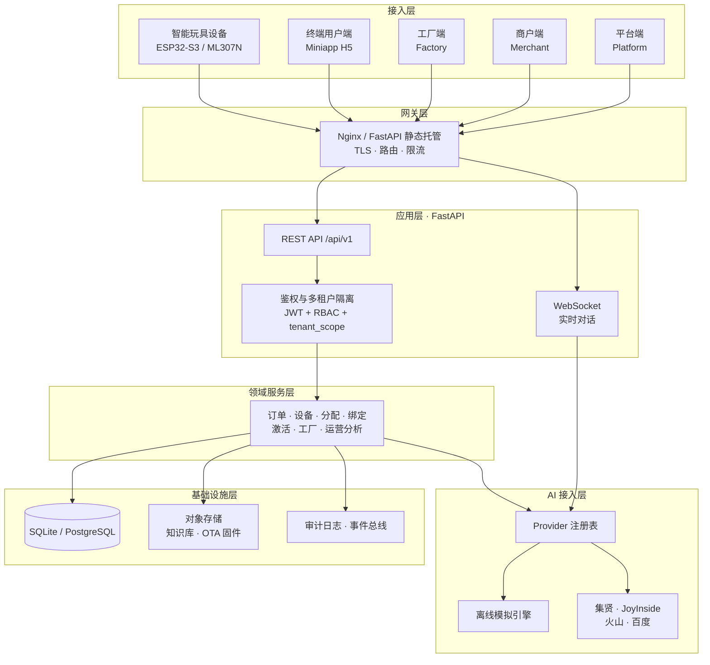

# ToyVerse Cloud

> 多租户 AI 智能玩具 SaaS 平台 —— 覆盖「客户开通 → 产品配置 → 下单 → 设备生成 → 工厂烧录 → 终端激活 → AI 运营」的全生命周期管理

[](./LICENSE)
[](https://www.python.org/)
[](https://fastapi.tiangolo.com/)
[](https://www.sqlalchemy.org/)
[](#测试与质量保障)
[](#测试与质量保障)
[](./docs/)

---

## 项目简介

一个面向 **AI 智能玩具**行业的多租户 SaaS 管理平台。它管理从品牌方开户、产品定义、设备生产、工厂烧录，到终端用户扫码激活并开始与玩具对话的**完整业务闭环**。

> ⚠️ **先读这一条，避免误解**：这是一个**作品集项目**，功能闭环完整且经过真实服务验收，
> 但**尚未与真实厂商联调**（AI 与设备链路走的是内置离线引擎）、**未实现儿童数据合规**
> （PIPL / COPPA，涉及儿童语音数据）、**代码覆盖率 70%**、
> 压测**只有一轮单机短测**（不能当容量规划依据）。
> 上线前必须补齐的部分见 [已知局限](#已知局限) 与 [`SECURITY.md`](./SECURITY.md)。

平台对接两类云服务商，并抽象出统一的接入层：

| 方案 | 网络 | 代表厂商 | 设备生成方 | 激活路径 | OTA |
|---|---|---|---|---|---|
| 4G 方案 | 4G（ML307N 模组） | 集贤系统 | 调用厂商 API 返回 SN/IMEI/ICCID | 开机 → 4G 上线 → 厂商激活 | 支持 |
| Wi-Fi 方案 | Wi-Fi（ESP32-S3） | 京东云 JoyInside | 平台本地生成 SN + 签名 | 配网 → 上报 SN/MAC → 校验 → 厂商激活 | 不支持（端侧升级） |

**AI 能力**（语音识别 / 大模型对话 / 语音合成）通过统一的 `AIProvider` 抽象接入，内置**完全离线的模拟引擎**——无需任何厂商密钥即可跑通全流程；切换到真实厂商只需填写 `.env` 中的密钥。

---

## 界面预览

> 以下截图取自本机真实运行的服务（`make dev`），非设计稿。

### 统一登录与平台端







### 商户端：配置 AI 与看运营数据





### 工厂端：生产、烧录、抽检（客户信息脱敏）



### 终端用户端：扫码激活与对话



完整截图清单（14 张，见 [`docs/assets/`](./docs/assets/)）：

| 端 | 截图 |
|---|---|
| 通用 | 登录页 |
| 平台端 | 工作台、租户管理、订单管理、设备库存、工厂订单、OTA 管理 |
| 商户端 | 工作台、我的产品、AI 配置、运营看板 |
| 工厂端 | 工作台、生产订单 |
| 终端用户端 | 扫码页 |

---

## 四端角色

| 端 | 使用者 | 核心职责 |
|---|---|---|
| **平台端** | 平台运营方 | 租户管理、云服务商配置、产品模板、订单审核、设备生成、批次导入、分配单、工厂订单、系统权限、运营看板 |
| **商户端** | 品牌方（租户） | 我的产品、AI 配置（角色 / Prompt / 知识库 / 音色 / 内容安全）、下单、我的设备、扫码预检与绑定、运营数据 |
| **工厂端** | 烧录工厂 | 生产订单（客户名脱敏）、烧录上报、抽检、固件版本 |
| **终端用户端** | 消费者（H5） | 扫码激活（4G / Wi-Fi 分支）、与玩具对话、4G 流量充值、设备设置 |

---

## 快速开始

### 方式一：Docker（推荐）

```bash
git clone <repo-url> && cd saas_ai_toy_platform
cp .env.example .env
# ⚠️ 必做：替换 .env 中的 6 项（.env.example 里是【带弱标记的占位符】，不替换则服务拒绝启动）
#   密钥类   JWT_SECRET_KEY（≥32 字节）、QR_SIGN_SECRET（≥16 字节）
#   口令类   PLATFORM_ADMIN_PASSWORD、MERCHANT_ADMIN_PASSWORD、
#            FACTORY_ADMIN_PASSWORD、PLATFORM_OPERATOR_PASSWORD
#   生成随机值：python3 -c "import secrets;print(secrets.token_urlsafe(48))"
docker compose up -d --build
```

打开 <http://localhost:8000/platform/>

### 方式二：本地开发

前置条件：**Python 3.12+**（无需 Node.js —— 前端为零构建 ES Module）

```bash
git clone <repo-url> && cd saas_ai_toy_platform
cp .env.example .env

# ⚠️ 必做：把 .env 里这 6 项替换为强随机值。
#    .env.example 的值带弱标记（如 dev-only-insecure-…），启动期安全校验会【拒绝启动】
#    并逐项列出是哪一行不合格；这是刻意设计——不让「配置错了但服务照常跑」发生。
#      密钥：JWT_SECRET_KEY（≥32 字节）、QR_SIGN_SECRET（≥16 字节）
#      口令：PLATFORM_ADMIN_PASSWORD、MERCHANT_ADMIN_PASSWORD、
#            FACTORY_ADMIN_PASSWORD、PLATFORM_OPERATOR_PASSWORD
make setup    # 创建虚拟环境 + 安装依赖 + 迁移 + 演示数据
make dev
```

**一行脚本自动替换上面 6 项**（可选，等价于手工编辑 `.env`）：

```bash
python3 - <<'PY'
import re, secrets
from pathlib import Path
p = Path(".env"); t = p.read_text(encoding="utf-8")
t = t.replace("JWT_SECRET_KEY=dev-only-insecure-secret-change-me-at-least-32-bytes",
              "JWT_SECRET_KEY=" + secrets.token_urlsafe(48))
t = t.replace("QR_SIGN_SECRET=dev-only-qr-sign-secret-change-me",
              "QR_SIGN_SECRET=" + secrets.token_urlsafe(24))
for n in ("PLATFORM_ADMIN_PASSWORD", "MERCHANT_ADMIN_PASSWORD",
          "FACTORY_ADMIN_PASSWORD", "PLATFORM_OPERATOR_PASSWORD"):
    t = re.sub(rf"^{n}=.*$", f"{n}=" + secrets.token_urlsafe(32), t, flags=re.M)
p.write_text(t, encoding="utf-8")
print("已写入强随机值（共 6 项）")
PY
```

> **不想启用平台运营账号？** 把 `.env` 里的 `PLATFORM_OPERATOR_ACCOUNT=` 留空即可，
> 该账号会被跳过初始化，其口令也就不再是必填项。

启动后可访问：

| 入口 | 地址 |
|---|---|
| 平台端 | <http://localhost:8000/platform/> |
| 商户端 | <http://localhost:8000/merchant/> |
| 工厂端 | <http://localhost:8000/factory/> |
| 终端用户端 | <http://localhost:8000/miniapp/> |
| API 交互式文档 | <http://localhost:8000/docs> |

> **演示账号**：账号见 `.env` 中的 `*_ADMIN_ACCOUNT`，密码为你自己设置的 `*_ADMIN_PASSWORD`。
> 全新种子下首次登录会**强制改密**（可用 `FORCE_PASSWORD_CHANGE_ON_FIRST_LOGIN=false` 关闭）。

验证装好了：

```bash
make check     # ruff + mypy strict + pytest + 接口契约 + 文档一致性
make smoke     # 对正在运行的服务做 57 项冒烟断言
```

> **实测耗时**（本机，pip 有缓存）：从 `git clone` 到**四端入口全部可访问**约 **91 秒**
> （`make setup` 72s + 启动约 18s）。**首次在冷机器上安装依赖会更久**——这里给的是量级参考，不是承诺。

---

## 系统架构



> 完整架构说明见 [`docs/03-系统架构图.md`](./docs/03-系统架构图.md)

---

## 技术栈

| 层次 | 选型 | 说明 |
|---|---|---|
| 后端框架 | FastAPI | 异步、自动生成 OpenAPI 文档（本项目用它做**契约门禁**） |
| ORM | SQLAlchemy 2.0（async） | 强类型（`Mapped`），可过 mypy strict |
| 数据校验 | Pydantic v2 | 与 FastAPI 深度集成 |
| 数据库 | SQLite（默认）/ PostgreSQL | SQLite 保证「克隆即跑」；PostgreSQL 用于生产 |
| 数据库迁移 | Alembic | 版本化管控 Schema 演进 + **零漂移门禁** |
| 鉴权 | JWT + bcrypt | 无状态鉴权，带刷新轮换与登录锁定 |
| 前端 | 原生 ES Module（零构建） | 无需 `npm install`，克隆即可打开 |
| AI 接入 | Provider 抽象 + 离线模拟引擎 | 无密钥可跑全流程，有密钥即切真实厂商 |
| 测试 | pytest | 单元 / 集成 / 端到端三层，含租户隔离矩阵 |

## 规模

| 项 | 数值 |
|---|---|
| HTTP 端点 | **145**（OpenAPI `paths` 119）+ WebSocket 1 |
| 数据库表 | **46**（15 个迁移版本） |
| 权限码 / 错误码 / 内置角色 | **54** / **31** / **6** |
| 前端模块 | 页面 **45** + 共享 **28**（零构建） |
| 测试 | **553** 个测试函数 / **814** 个用例 |

---

## 项目结构

```
saas_ai_toy_platform/
├── backend/              # FastAPI 后端
│   ├── app/
│   │   ├── core/         # 配置、鉴权、依赖注入、错误码、日志
│   │   ├── db/           # 数据库会话与种子数据（含租户作用域唯一收口点 scope.py）
│   │   ├── models/       # SQLAlchemy 模型
│   │   ├── schemas/      # Pydantic 模型
│   │   ├── api/v1/       # 各端 API 路由
│   │   ├── services/     # 领域服务（业务逻辑只写在这里）
│   │   ├── ai/           # AI Provider 抽象与适配器
│   │   └── realtime/     # WebSocket 实时对话
│   ├── alembic/          # 数据库迁移
│   └── tests/            # 单元 / 集成 / 端到端测试
├── frontend/             # 零构建前端
│   ├── shared/           # 四端共享：设计系统 / 核心库 / 组件库
│   └── pages/            # 平台端 / 商户端 / 工厂端 / 终端用户端页面
├── deploy/               # Docker 与 Nginx 部署配置
├── scripts/              # 冒烟、敏感信息扫描、二维码、契约导出、文档一致性等脚本
├── docs/                 # 完整文档集（14 篇，含 assets/ 截图）
├── tests/contract/       # OpenAPI 契约快照
├── todolist.md           # 任务清单
└── 项目进度.md            # 进度追踪
```

> `learning/`（学习手册，20 个文件 / 8177 行）已在 `.gitignore` 中排除，**不上传仓库**。

---

## 文档

| 文档 | 内容 |
|---|---|
| [文档导航](./docs/README.md) | **按「你想做什么」指路**，含三条推荐阅读路径 |
| [安装部署指南](./docs/01-安装部署指南.md) | 环境要求、本地与 Docker 部署、80 个环境变量、故障排查、生产加固清单 |
| [系统流程图](./docs/02-系统流程图.md) | 业务闭环、状态机、激活分支、对话时序（全部 mermaid） |
| [系统架构图](./docs/03-系统架构图.md) | 分层架构、部署拓扑、技术选型理由与**替代方案对比** |
| [产品需求文档 PRD](./docs/04-产品需求文档PRD.md) | 角色、术语表、页面清单、权限矩阵、非功能需求 |
| [数据模型与 ER 图](./docs/05-数据模型与ER图.md) | 分域 ER 图、**46 张表 × 655 个字段**字典、索引设计 |
| [API 接口文档](./docs/06-API接口文档.md) | 通用约定、31 个错误码、**145 个端点表**、WebSocket 协议 |
| [多租户与权限设计](./docs/07-多租户与权限设计.md) | 隔离层级、**54 个权限码**、越权测试策略、脱敏规则 |
| [AI 能力接入设计](./docs/08-AI能力接入设计.md) | Provider 抽象、四层解析、离线引擎、厂商接入指引 |
| [系统交付标准](./docs/09-系统交付标准.md) | **逐条可勾选**的验收清单、性能 SLO、安全基线、缺陷等级 |
| [AI 验证可用性](./docs/10-AI验证可用性.md) | 24 用例实测基准、指标定义、结论与局限 |
| [测试与质量保障](./docs/11-测试与质量保障.md) | 测试金字塔、覆盖率、隔离矩阵、契约门禁、CI |
| [项目复盘](./docs/12-项目复盘.md) | 架构演进、关键问题与解法、度量结果、经验沉淀 |
| [火山引擎硬件对话智能体配置说明](./docs/13-火山引擎硬件对话智能体配置说明.md) | 控制台配置、设备端接入路径、服务端 API（含取证边界） |
| [ESP32-S3 刷机与联调步骤清单](./docs/14-ESP32-S3刷机与联调步骤清单.md) | 真机联调执行清单与失败速查 F-01~F-10 |

---

## 开发

```bash
make help          # 查看全部命令

make setup         # 初始化环境
make dev           # 启动开发服务器（热重载）
make test          # 运行全部测试
make lint          # 代码检查
make format        # 代码格式化
make check         # 检查 + 类型检查 + 测试 + 契约 + 文档一致性
make openapi       # 导出 OpenAPI 契约快照
make docs-check    # 校验文档与代码是否一致（八类）
make smoke         # 对运行中的服务冒烟测试
make up / down     # Docker 启停
```

---

## 测试与质量保障

```bash
make test              # 全部测试（814 passed）
make test-unit         # 单元测试
make test-integration  # 集成测试（含租户隔离矩阵）
make test-e2e          # 端到端全闭环
make coverage          # 覆盖率报告
make docs-check        # 文档一致性门禁
```

**当前状态（如实记录）**：

| 项 | 实测 |
|---|---|
| 测试 | **814 passed**（553 个测试函数；差额来自参数化展开） |
| 类型检查 | mypy **strict**，95 个源文件无问题 |
| **代码覆盖率** | ⚠️ **70%**（`ai_config_service` / `metrics_service` / `ota_service` 低于 31%） |
| 接口契约 | 实现与快照一致（自建门禁，改端点连 `docstring` 都会让快照过期） |
| 文档一致性 | 八类校验通过（端点 / 表 / 错误码 / 权限码 / 枚举值 / 引用 / 测试计数 / 边界声明） |
| 敏感信息扫描 | 247 个被跟踪文件 **0 命中** |

> ⚠️ **「814 passed」不等于「测试充分」**：覆盖率只有 70%，
> 且三个 P9 服务低于 31%。原因与改进方向见 [`docs/11-测试与质量保障.md`](./docs/11-测试与质量保障.md)。

---

## 本项目的验收方式

除自动化测试外，每个阶段都在**真实服务**上跑一遍端到端验收，并用浏览器真实点一遍关键路径：

| 手段 | 用途 | 为什么不能省 |
|---|---|---|
| 自动化测试 | 守住已知行为的回归 | 覆盖的是「我以为的路径」 |
| 端到端接口验收（真实 HTTP） | 发现跨环节的真实缺陷 | 单元测试看不到跨模块问题 |
| 浏览器实测（真实 Chromium） | 发现界面上才看得见的问题 | 「界面显示成功但实际失败」只有点出来才发现 |
| **真跑一次 Docker** | 发现配置与环境的错 | 本项目 `make up` 曾坏掉 10 个阶段而无人发现 |

**实测结论（可复核）**：本项目 P6/P8/P9 共 7 个真缺陷**全部**由端到端验收或浏览器实测发现，
而当时自动化测试是全绿的；P10 的 12 个部署问题**没有一个**能靠读代码或跑集成测试发现。

---

## 安全设计

- **多租户隔离**：商户端所有查询在 repository 层强制注入 `tenant_id` 条件，从架构上杜绝越权（不在路由层手写过滤）
- **越权不可探测**：跨租户访问返回 **404** 而非 403，避免用错误码差异探测资源是否存在
- **密钥保护**：云服务商 `SecretKey` 加密存储，**任何 API 响应都不返回**
- **工厂端脱敏**：客户名、金额、联系方式按字段白名单脱敏，工厂端拿不到真实信息
- **无默认口令**：不预置任何默认密码；未配置强密码时服务**拒绝启动**
- **启动期安全校验**：弱密钥、生产环境 `DEBUG=true`、mock 通道、本机 CORS 等一律拒绝启动
- **登录保护**：连续 5 次失败锁定 15 分钟
- **厂商安全失败**：未配置密钥的厂商返回 `VENDOR_UNAVAILABLE`，**绝不伪造成功**
- **审计留痕**：29 种审计动作；「安全拒绝」的审计单独提交，业务回滚不丢证据

---

## 已知局限

本项目**刻意把没做到的事写在显眼处**——只看徽章会漏掉决定「能不能上线」的部分：

| 类别 | 局限 |
|---|---|
| **合规** | ⚠️ **未实现** PIPL / COPPA 等未成年人数据保护机制（涉及儿童语音数据，**不能直接用于真实商业场景**） |
| **AI 与设备链路** | ⚠️ 四家厂商适配器**全部未联调**（无密钥）；火山引擎**签名算法仍为占位**；语音链路前端未实现录音与播放 |
| **CI** | ✅ 已在真实 GitHub 跑通（五 job 全绿）；⚠️ CI 中不构建镜像、未接入依赖漏洞扫描 |
| **数据库** | ✅ PostgreSQL 16 已真跑（迁移 / 种子 / healthy / 冒烟 57/57）。★ 实测：**SQLite 并发写会 `database is locked`**（20 并发 → 30.7 QPS、4×500），PG **93.0 QPS、0 失败** → **需要并发写时必须上 PG** |
| **部署** | ✅ Nginx TLS（自签）与多实例轮询均已实测（`wss` 握手 4401、轮询 31/29）。★ 但**多实例共享 SQLite 卷无收益且报 500** → 多实例必须配 PG；⚠️ 多实例下的 WS 会话路由 / 限流仍缺共享状态；⚠️ 备份为同盘备份 |
| **性能** | ⚠️ 只有**单机 15 秒 × 20 并发**一轮基线（读 73.6 QPS / 写 30.7 QPS，SQLite），**无劣化曲线、无参数扫描、未长时间观测** —— **不要拿它做容量规划** |
| **测试** | ⚠️ 覆盖率 70%；e2e 只有 1 条用例；冒烟只覆盖读路径 |
| **功能缺口** | 内容库只读；知识库为关键词级检索（无向量化）；工厂端「批次查询」未交付 |

> 每份文档末尾都有「已知局限 / 取证边界」小节，逐条写「限制 → 具体后果 → 何时/如何补齐」。
> 完整清单见 [`docs/09-系统交付标准.md`](./docs/09-系统交付标准.md) 的附录。

---

## 许可证

[MIT](./LICENSE)
