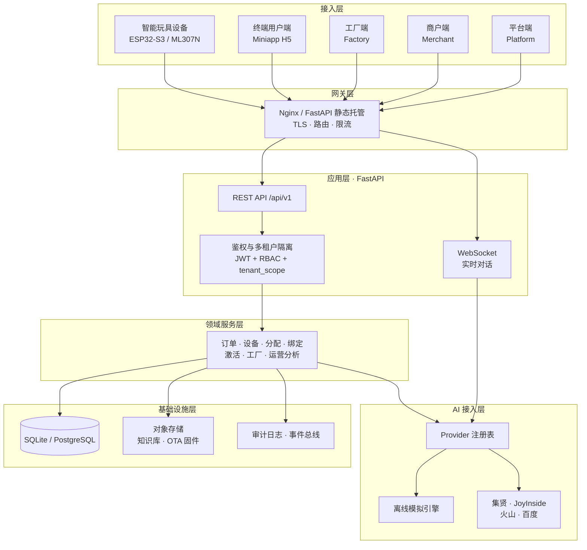

# ToyVerse Cloud

> 多租户 AI 智能玩具 SaaS 平台 —— 覆盖「客户开通 → 产品配置 → 下单 → 设备生成 → 工厂烧录 → 终端激活 → AI 运营」的全生命周期管理

[](./LICENSE)
[](https://www.python.org/)
[](https://fastapi.tiangolo.com/)
[](https://www.sqlalchemy.org/)
[](#测试)
[](./docs/)

---

## 项目简介

ToyVerse Cloud 是一个面向 **AI 智能玩具**行业的多租户 SaaS 管理平台。它管理从品牌方开户、产品定义、设备生产、工厂烧录，到终端用户扫码激活并开始与玩具对话的**完整业务闭环**。

平台对接两类云服务商，并抽象出统一的接入层：

| 方案 | 网络 | 代表厂商 | 设备生成方 | 激活路径 | OTA |
|---|---|---|---|---|---|
| 4G 方案 | 4G（ML307N 模组） | 集贤系统 | 调用厂商 API 返回 SN/IMEI/ICCID | 开机 → 4G 上线 → 厂商激活 | 支持 |
| Wi-Fi 方案 | Wi-Fi（ESP32-S3） | 京东云 JoyInside | 平台本地生成 SN + 签名 | 配网 → 上报 SN/MAC → 校验 → 厂商激活 | 不支持（端侧升级） |

**AI 能力**（语音识别 / 大模型对话 / 语音合成）通过统一的 `AIProvider` 抽象接入，内置**完全离线的模拟引擎**——无需任何厂商密钥即可跑通全流程；切换到真实厂商只需填写 `.env` 中的密钥。

---

## 四端角色

| 端 | 使用者 | 核心职责 |
|---|---|---|
| **平台端** | 平台运营方 | 租户管理、云服务商配置、产品模板、订单审核、设备生成、批次导入、分配单、工厂订单、系统权限、运营看板 |
| **商户端** | 品牌方（租户） | 我的产品、AI 配置（角色 / Prompt / 知识库 / 音色 / 内容安全）、下单、我的设备、扫码预检与绑定、运营数据 |
| **工厂端** | 烧录工厂 | 生产订单（客户名脱敏）、烧录上报、抽检、固件版本 |
| **终端用户端** | 消费者（H5） | 扫码激活（4G / Wi-Fi 分支）、与玩具对话、4G 流量充值、设备设置 |

---

## 快速开始

### 方式一：Docker（推荐）

```bash
git clone <repo-url> && cd saas_ai_toy_platform
cp .env.example .env          # 按注释填写管理员强密码
docker compose up -d --build
```

打开 <http://localhost:8000/platform/>

### 方式二：本地开发

前置条件：**Python 3.12+**（无需 Node.js —— 前端为零构建 ES Module）

```bash
git clone <repo-url> && cd saas_ai_toy_platform
cp .env.example .env          # ⚠️ 必须设置 PLATFORM_ADMIN_PASSWORD 等强密码
make setup                    # 创建虚拟环境 + 安装依赖 + 迁移 + 演示数据
make dev
```

启动后可访问：

| 入口 | 地址 |
|---|---|
| 平台端 | <http://localhost:8000/platform/> |
| 商户端 | <http://localhost:8000/merchant/> |
| 工厂端 | <http://localhost:8000/factory/> |
| 终端用户端 | <http://localhost:8000/miniapp/> |
| API 交互式文档 | <http://localhost:8000/docs> |

> **演示账号**：账号见 `.env` 中的 `*_ADMIN_ACCOUNT`，密码为你自己设置的 `*_ADMIN_PASSWORD`。
> 本项目**不预置任何默认口令**——未设置强密码时服务会拒绝启动。

---

## 系统架构



> 完整架构说明见 [`docs/03-系统架构图.md`](./docs/03-系统架构图.md)

---

## 技术栈

| 层次 | 选型 | 说明 |
|---|---|---|
| 后端框架 | FastAPI | 异步、自动生成 OpenAPI 文档 |
| ORM | SQLAlchemy 2.0（async） | 强类型、支持异步 |
| 数据校验 | Pydantic v2 | 与 FastAPI 深度集成 |
| 数据库 | SQLite（默认）/ PostgreSQL | SQLite 保证「克隆即跑」；PostgreSQL 用于生产 |
| 数据库迁移 | Alembic | 版本化管控 Schema 演进 |
| 鉴权 | JWT + bcrypt | 无状态鉴权，带刷新轮换与登录锁定 |
| 前端 | 原生 ES Module（零构建） | 无需 `npm install`，克隆即可打开 |
| AI 接入 | Provider 抽象 + 离线模拟引擎 | 无密钥可跑全流程，有密钥即切真实厂商 |
| 测试 | pytest | 单元 / 集成 / 端到端三层，含租户隔离矩阵 |

---

## 项目结构

```
saas_ai_toy_platform/
├── backend/              # FastAPI 后端
│   ├── app/
│   │   ├── core/         # 配置、鉴权、依赖注入、错误码、日志
│   │   ├── db/           # 数据库会话与种子数据
│   │   ├── models/       # SQLAlchemy 模型
│   │   ├── schemas/      # Pydantic 模型
│   │   ├── api/v1/       # 各端 API 路由
│   │   ├── services/     # 领域服务
│   │   ├── ai/           # AI Provider 抽象与适配器
│   │   └── realtime/     # WebSocket 实时对话
│   ├── alembic/          # 数据库迁移
│   └── tests/            # 单元 / 集成 / 端到端测试
├── frontend/             # 零构建前端
│   ├── shared/           # 四端共享：设计系统 / 核心库 / 组件库
│   └── pages/            # 平台端 / 商户端 / 工厂端 / 终端用户端页面
├── deploy/               # Docker 与 Nginx 部署配置
├── scripts/              # 种子数据、契约导出、冒烟测试等脚本
├── docs/                 # 完整文档集
├── tests/contract/       # OpenAPI 契约快照
├── todolist.md           # 任务清单
└── 项目进度.md            # 进度追踪
```

---

## 文档

| 文档 | 内容 |
|---|---|
| [安装部署指南](./docs/01-安装部署指南.md) | 环境要求、本地与 Docker 部署、环境变量、故障排查 |
| [系统流程图](./docs/02-系统流程图.md) | 业务闭环、状态机、激活分支、对话时序 |
| [系统架构图](./docs/03-系统架构图.md) | 分层架构、部署拓扑、技术选型理由 |
| [产品需求文档 PRD](./docs/04-产品需求文档PRD.md) | 角色、术语、页面清单、权限矩阵、非功能需求 |
| [数据模型与 ER 图](./docs/05-数据模型与ER图.md) | 分域 ER 图、字段字典、索引设计 |
| [API 接口文档](./docs/06-API接口文档.md) | 端点清单、请求响应示例、错误码 |
| [多租户与权限设计](./docs/07-多租户与权限设计.md) | 隔离层级、RBAC、越权测试策略、脱敏规则 |
| [AI 能力接入设计](./docs/08-AI能力接入设计.md) | Provider 抽象、模拟引擎、厂商接入指引 |
| [系统交付标准](./docs/09-系统交付标准.md) | 验收清单、性能 SLO、安全基线 |
| [AI 验证可用性](./docs/10-AI验证可用性.md) | 验证方法、指标定义、基准数据、结论与局限 |
| [测试与质量保障](./docs/11-测试与质量保障.md) | 测试金字塔、租户隔离矩阵、CI 流程 |
| [项目复盘](./docs/12-项目复盘.md) | 整合决策、架构演进、经验沉淀 |

---

## 开发

```bash
make help          # 查看全部命令

make setup         # 初始化环境
make dev           # 启动开发服务器（热重载）
make test          # 运行全部测试
make lint          # 代码检查
make format        # 代码格式化
make check         # 检查 + 类型检查 + 测试
make openapi       # 导出 OpenAPI 契约快照
make smoke         # 对运行中的服务冒烟测试
make up / down     # Docker 启停
```

---

## 测试

```bash
make test              # 全部测试
make test-unit         # 单元测试
make test-integration  # 集成测试（含租户隔离矩阵）
make test-e2e          # 端到端全闭环
make coverage          # 覆盖率报告
```

---

## 安全设计

- **多租户隔离**：商户端所有查询在 repository 层强制注入 `tenant_id` 条件，从架构上杜绝越权（不在路由层手写过滤）
- **密钥保护**：云服务商 `SecretKey` 加密存储，**任何 API 响应都不返回**
- **工厂端脱敏**：客户名、金额、联系方式在服务端按白名单脱敏，工厂端拿不到真实信息
- **无默认口令**：不预置任何默认密码；未配置强密码时服务拒绝启动
- **登录保护**：连续 5 次失败锁定 15 分钟
- **厂商安全失败**：未配置密钥的厂商返回 `VENDOR_UNAVAILABLE`，**绝不伪造成功**

---

## 许可证

[MIT](./LICENSE)
