# 系统流程图

> **适用对象**：需要理解业务如何流转的开发、产品与测试人员
> **本文定位**：**全部用图讲流程**——状态机与关键链路各一张图，配必要的「为什么这样设计」说明
> **配套文档**：[`05-数据模型与ER图.md`](./05-数据模型与ER图.md)（表与字段）、[`04-产品需求文档PRD.md`](./04-产品需求文档PRD.md)（页面与交互）、[`08-AI能力接入设计.md`](./08-AI能力接入设计.md)（对话链路细节）
> **最后更新**：2026-09-17
> **文档中标注说明**：✅ = 已实测或有代码原文可查（本文的图与状态迁移表**全部**来自 `backend/app/models/enums.py` 的迁移表原文）；⚠️ = 未验证

---

## 0. 结论先行

### 0.1 全局闭环

```mermaid
flowchart LR
    A["平台开通客户<br/>tenants"] --> B["授权产品模板<br/>product_authorizations"]
    B --> C["建客户产品<br/>client_products"]
    C --> D["商户下单<br/>orders"]
    D --> E{"平台审核"}
    E -->|驳回| D
    E -->|通过| F["生成设备<br/>devices"]
    F --> G["入库<br/>IN_STOCK"]
    G --> H["派单工厂<br/>factory_orders"]
    H --> I["烧录 / 抽检 / 出货"]
    I --> J["分配设备<br/>ALLOCATED"]
    J --> K["用户扫码<br/>precheck"]
    K --> L["激活 + 绑定<br/>ACTIVATED + BOUND"]
    L --> M["对话 / 充值 / 设置"]
    M --> N["运营指标<br/>实时聚合 + 快照"]
```

### 0.2 三个状态机速查

| 状态机 | 对象 | 状态数 | 定义位置 |
|---|---|---|---|
| `ORDER_TRANSITIONS` | 订单 `orders.status` | **9** | `backend/app/models/enums.py` |
| `ASSET_TRANSITIONS` | 设备资产状态 `devices.asset_status` | **10** | 同上 |
| `FACTORY_ORDER_TRANSITIONS` | 工单 `factory_orders.status` | **4** | 同上 |
| `ALLOCATION_TRANSITIONS` | 分配单 `allocation_orders.status` | **4** | 同上 |

**设备状态为什么是「四维」而不是一个状态列**：原型的 9 个状态标签试图把「货是谁的」「有没有激活」
「在线吗」「绑没绑」压进一个字段，结果无法表达「已分配但未激活」「已激活但已解绑」这类**合法组合**。
本项目按 `ADR-03` 拆成四维，展示标签由 `derive_device_label()` 从四维合成。

---

## 1. 全局业务闭环

### 1.1 完整链路（含状态变化）

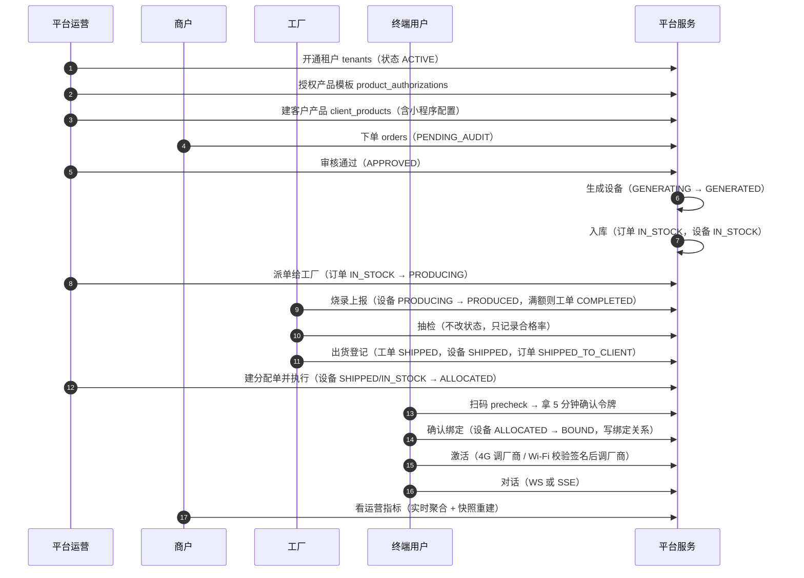

### 1.2 两条路线的分岔点

设备有**两条完全不同的技术路线**，分岔出现在「生成设备」与「激活」两处：

| 分岔点 | 4G 方案（集贤 / ML307N） | Wi-Fi 方案（JoyInside / ESP32-S3） |
|---|---|---|
| 设备从哪来 | **调厂商 API 生成**，SN / IMEI / ICCID 由厂商返回 | **平台本地生成** SN，并用 HMAC 签名 |
| 二维码载荷 | `JX\|SN\|IMEI\|ICCID\|deviceId`（无签名，靠 SHA-256 命中校验） | `JD\|tenantId\|productId\|sn\|sign`（HMAC-SHA256 签名，`compare_digest` 验签） |
| 用户怎么激活 | 开机 → 4G 上线 → 调厂商激活 | 配网 → 上报 SN/MAC → **校验 SN 与二维码一致** → 调厂商激活 |
| 能否 OTA | ✅ 支持 | ✘ 不支持（端侧升级）；平台推送会返回 `OTA_NOT_SUPPORTED` |
| 对话角色 | 平台可配置 | **由厂商侧智能体配置，平台不覆盖**（接口 409） |
| 流量充值 | ✅ 有（4G 流量包） | ✘ 无 |

---

## 2. 订单状态机

### 2.1 状态迁移图

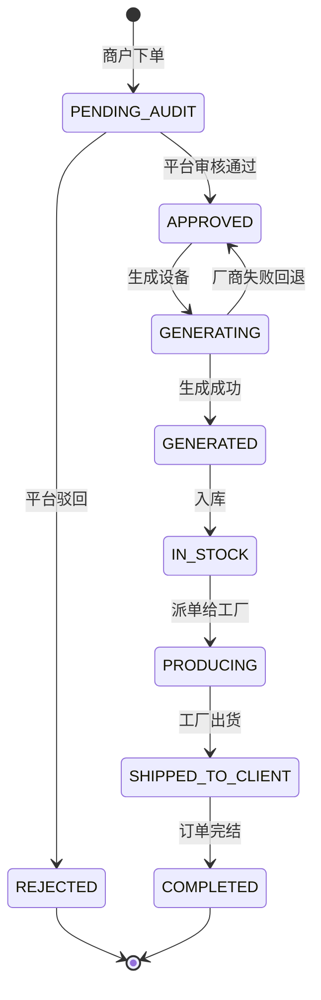

### 2.2 迁移表与要点 ✅

| 当前状态 | 允许迁移到 | 触发动作 |
|---|---|---|
| `PENDING_AUDIT` | `APPROVED`、`REJECTED` | 平台审核 |
| `APPROVED` | `GENERATING` | 生成设备 |
| `GENERATING` | `GENERATED`、**`APPROVED`** | 生成成功 / **厂商失败回退** |
| `GENERATED` | `IN_STOCK` | 入库 |
| `IN_STOCK` | `PRODUCING` | 派单给工厂 |
| `PRODUCING` | `SHIPPED_TO_CLIENT` | 工厂出货 |
| `SHIPPED_TO_CLIENT` | `COMPLETED` | 完结 |
| `REJECTED` / `COMPLETED` | — | **终态** |

**三个关键设计**：

1. **`GENERATING → APPROVED` 这条回退边是刻意存在的**。4G 路线的设备由厂商 API 生成，
   厂商未配置密钥时会按 `ADR-07` 返回 `VENDOR_UNAVAILABLE`。此时订单**必须退回 `APPROVED`**
   而不是留在 `GENERATING`——否则订单会被永久卡在一个无法完成的中间态，且**设备表零新增**
   （不留半成品）。这条边让「重试」成为可能。
2. **`IN_STOCK` 在订单与设备上是同名不同域**。订单的 `IN_STOCK` 表示「设备已入库、可派单」；
   设备的 `asset_status = IN_STOCK` 表示「平台库存、未分配给任何租户」。两者的对齐说明见
   [`05-数据模型与ER图.md`](./05-数据模型与ER图.md) 的「`in_stock` 语义对齐」一节。
3. **状态迁移一律经 `ORDER_TRANSITIONS` 校验**，禁止直接赋值（`CONTRIBUTING.md` 红线 8）。
   这使「非法迁移」变成可观测的 `INVALID_STATE_TRANSITION`，而不是库里的脏数据。

---

## 3. 设备四维状态机

设备的权威状态是四个**正交**维度：

| 维度 | 字段 | 取值 |
|---|---|---|
| ① 资产状态 | `devices.asset_status` | `PENDING_GEN` / `GENERATED` / `IN_STOCK` / `PRODUCING` / `PRODUCED` / `SHIPPED` / `ALLOCATED` / `BOUND` / `FROZEN` / `RETIRED` |
| ② 激活状态 | `devices.activation_status` | `NOT_ACTIVATED` / `ACTIVATING` / `ACTIVATED` / `BIND_FAILED` |
| ③ 在线状态 | `devices.online_status` | `NEVER_ONLINE` / `ONLINE` / `OFFLINE` |
| ④ 绑定状态 | `devices.bind_status` | `UNBOUND` / `BOUND` |

### 3.1 资产状态迁移图（第一维）

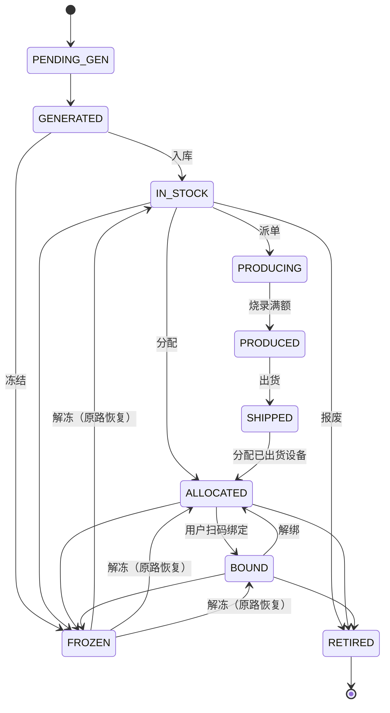

### 3.2 ★ 冻结与解冻：为什么解冻有「三条出边」

冻结一个设备（欠费停机、内容违规停用）时必须记住它**原来是什么状态**，
解冻时**原路恢复**——已分配给商户的设备不该在解冻后掉回平台库存。

```
FREEZABLE_ASSET_STATUSES = {IN_STOCK, ALLOCATED, BOUND}
```

这三个集合成员**与 `ASSET_TRANSITIONS[FROZEN]` 严格相等**，由单元测试断言钉死
（`ADR-10`）。这条约束是被实测逼出来的：

| 阶段 | 当时的选择 | 后果 |
|---|---|---|
| P4 | 为求对称，把可冻结集合收紧为 `{IN_STOCK}` | 「已出货给商户的设备」**无法停服**——业务能力出现缺口；绑定流程里的冻结校验退化成不可达的防御性代码 |
| P6 | 放宽为 `{IN_STOCK, ALLOCATED, BOUND}` 并**补齐三条入边** | 能力缺口补齐；解冻仍按 `previous_asset_status` 原路恢复 |

> **教训**：集合的定义依据应该是**业务能力**，而不是「让图看起来对称」。
> 对称性应该来自「入边与出边描述同一件事」，不是来自「集合小一点更好看」。

### 3.3 可分配集合

```
ALLOCATABLE_ASSET_STATUSES = {IN_STOCK, SHIPPED}
```

`SHIPPED` 之所以在集合里，是为了接通 P4 起就存在、却**无处使用**的 `SHIPPED → ALLOCATED` 边。
一条迁移表允许、而服务层拒绝的边，是自相矛盾的配置。

### 3.4 在线状态为什么不能直接用枚举

`online_status` 是**落库的枚举**，但「这台设备现在在线吗」这个**结论**一律按
`ONLINE_WINDOW_SECONDS`（默认 180 秒）从 `last_heartbeat_at` 派生：

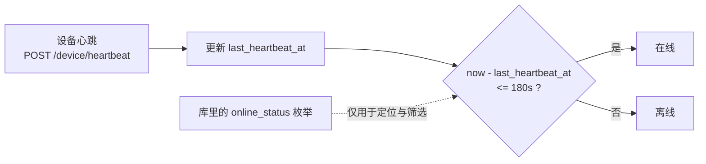

> **反例（本项目刻意避免的）**：只读库里的 `online_status`。设备掉线后没人来改这个字段，
> 于是界面会显示「在线」而实际上早已失联。180 秒窗口口径统一到 `last_heartbeat_at`
> **单一事实来源**，列表筛选与统计也走同一口径。

---

## 4. 激活分支（JX vs JD）

### 4.1 扫码解析

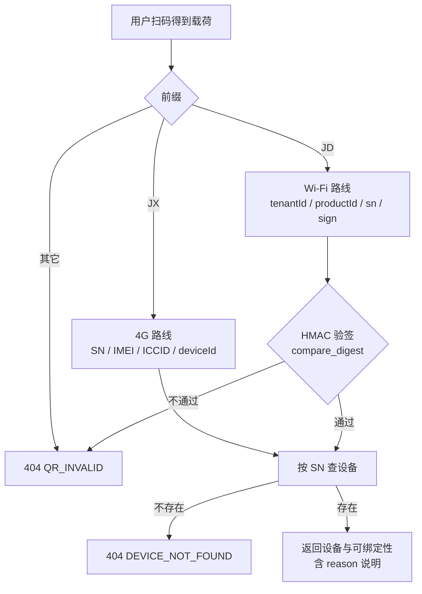

> ✅ **前缀大小写是宽容的，但签名比对是严格的，且两者不冲突**：`parse_payload` 用 `.upper()`
> 容忍 `jd|`，而 precheck 的 SHA-256 命中按字节严格比对。曾经因此出现「同一份输入先被判格式合法、
> 再被判伪造」的自相矛盾报错。修法是**只把前缀段归一为大写**，其余字节仍严格比对——
> 前缀是格式标签、不承载安全语义。

### 4.2 双路径激活

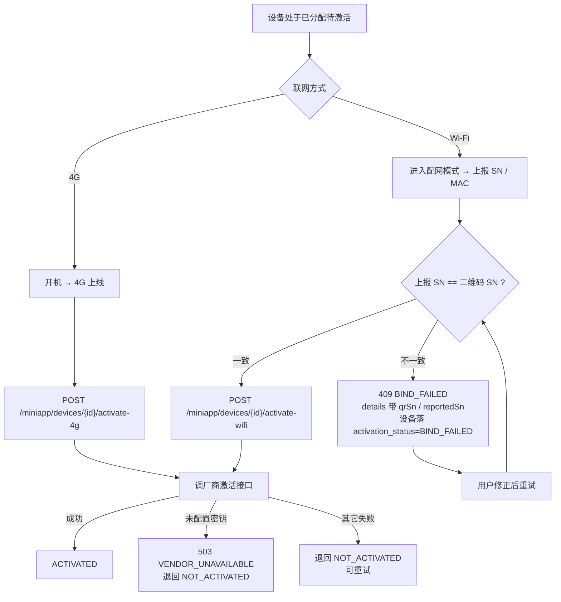

**激活与绑定是两件事，但幂等重复激活会补齐绑定**：

| 状态组合 | 是否合法 | 说明 |
|---|---|---|
| 未激活 + 未绑定 | ✅ | 初始态 |
| 已激活 + 已绑定 | ✅ | 正常可用 |
| **已激活 + 未绑定** | ✅ **合法** | 设备在别处激活过，或上一位用户**解绑**过——**解绑刻意不改变激活状态** |
| 未激活 + 已绑定 | ✘ | 不成立 |

> ★ 上面第三行曾导致一个真缺陷：用户扫码激活时界面显示「激活成功」，但库里没有绑定关系，
> 一进对话页就被 WebSocket 以 `4403` 拒绝（「这台设备不属于当前账号」），且界面上看不出原因。
> 修法是**幂等分支同时保证绑定关系**（已绑当前用户则空操作、未绑定则补绑、绑给别人则 409）。

---

## 5. 批次导入

设备有两种来源，除订单生成外还有一种「先把厂商已生产的设备批量导入」的路径：

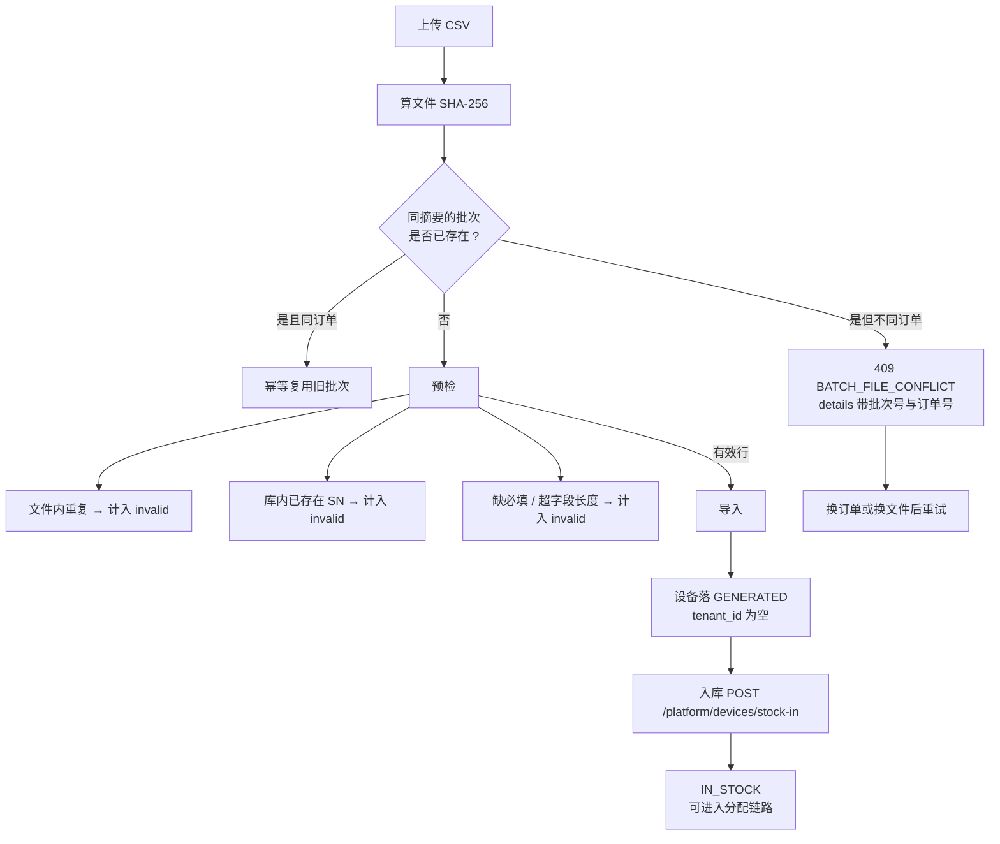

**三重安全限额**：5000 行 / 5MB / 按字段各自上限校验
（`sn` 64、`imei`/`iccid`/`mac` 32——统一用 128 会在换 PostgreSQL 时写库报错）。

> **「同文件 + 不同订单」必须显式拒绝**：曾经的行为是静默复用旧批次，
> 结果导入的设备会挂到**旧订单 / 旧租户**——一个静默的数据归属错误。
> 现在返回 `409 BATCH_FILE_CONFLICT` 并给出两个订单号，让调用方自己决定。

---

## 6. 分配与绑定

### 6.1 分配：两步且可重跑

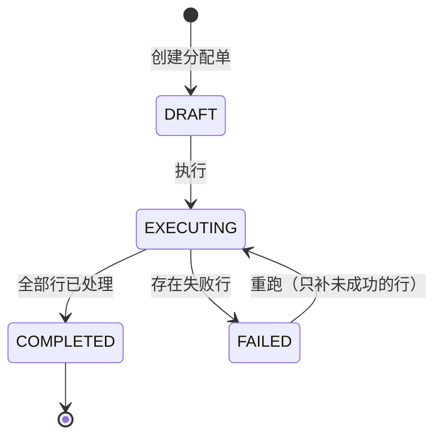

| 设计点 | 做法 | 为什么 |
|---|---|---|
| 逐行校验 | 每行独立判定（不存在 / 状态不可分配 / 不属于本租户 / 已分配） | 单台的错误不该让整单失败 |
| 部分失败不回滚 | 成功的行**保留** | 否则重跑会把已成功的设备再分配一次 |
| 重跑幂等 | `FAILED → EXECUTING` 只补未成功的行；`COMPLETED` 再次调用是**幂等回放** | 运维误点两次不该产生额外后果 |
| 明细可对账 | 每个明细行给出状态与失败原因 | 「失败了 3 台」不够，要知道是哪 3 台、为什么 |

### 6.2 绑定：precheck 与 bind 两步

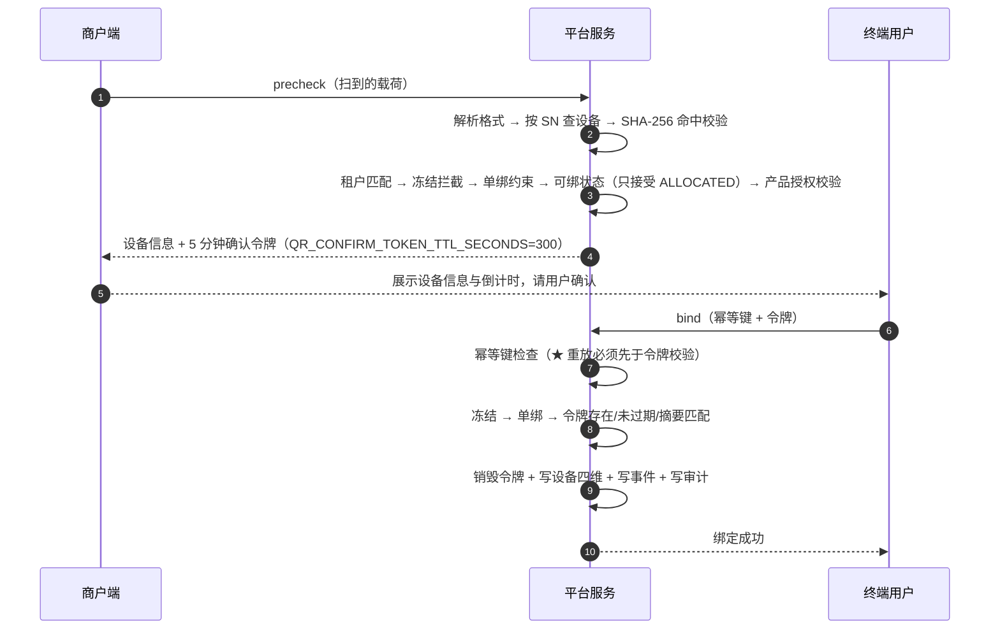

**四个刻意为之的顺序**：

1. **确认令牌不额外建表**，而是落在绑定行上（`device_bindings.status = PENDING` +
   `confirm_token_hash`）；bind 成功时把摘要**置空**即「销毁」。
2. **`UNIQUE(device_id)` 把单绑约束下沉到数据库层**，并发下也不依赖服务层的「先查后写」。
3. ★ **幂等键检查必须排在令牌校验之前**。否则第二次请求会因为「令牌已销毁」而报过期，
   那就不是「重放返回同一条」了。
4. **解绑不改变激活状态**（前面 4.2 已说明），但**会销毁令牌**——解绑后旧令牌不可复用，
   否则「解绑」就成了一次可以撤销的操作。

### 6.3 完整绑定分支

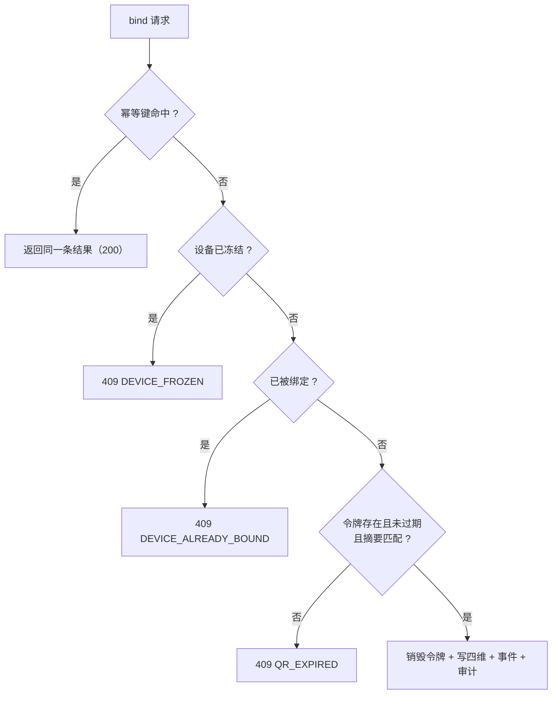

> 实测确认的语义：**单绑约束优先于令牌校验**，因此「已绑定 + 无幂等键的重放」
> 返回 `DEVICE_ALREADY_BOUND` 而不是 `QR_EXPIRED`。这个顺序更有用——
> 它告诉调用方「设备已经被绑走了」，而不是「你的令牌过期了」。

---

## 7. 对话时序

### 7.1 WebSocket 主链路

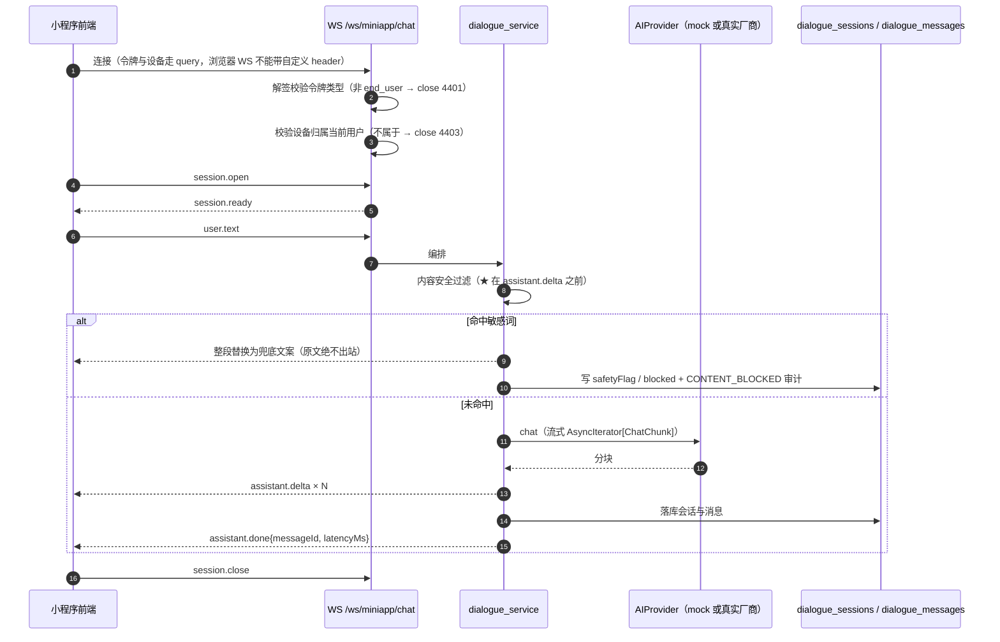

### 7.2 三种传输通道的分工

| 通道 | 端点 | 用在哪 | 为什么 |
|---|---|---|---|
| WebSocket | `WS /ws/miniapp/chat` | 小程序对话主链路 | 双向、低延迟；★ 注意**不在 `/api/v1` 前缀下** |
| SSE | `POST /miniapp/chat/stream` | 浏览器降级路径 | WebSocket 被拒（代理/防火墙）时仍可用 |
| NDJSON | `POST /ai/chat` | 调试台与设备侧 | 一行一个 JSON 对象，前端 `JSON.parse` 即可，与 WS 帧结构同构 |

> **为什么调试台用 NDJSON 而不是 SSE**：NDJSON 的前端解析更简单（无需处理 `data:` 前缀、
> 空行分帧、多行合并），且与 WebSocket 的帧结构同构——同一套解析代码可以复用，
> 前端只需要换传输层。代价是不兼容浏览器的 `EventSource`，因此另提供 SSE 降级端点。

### 7.3 内容安全的顺序为什么重要

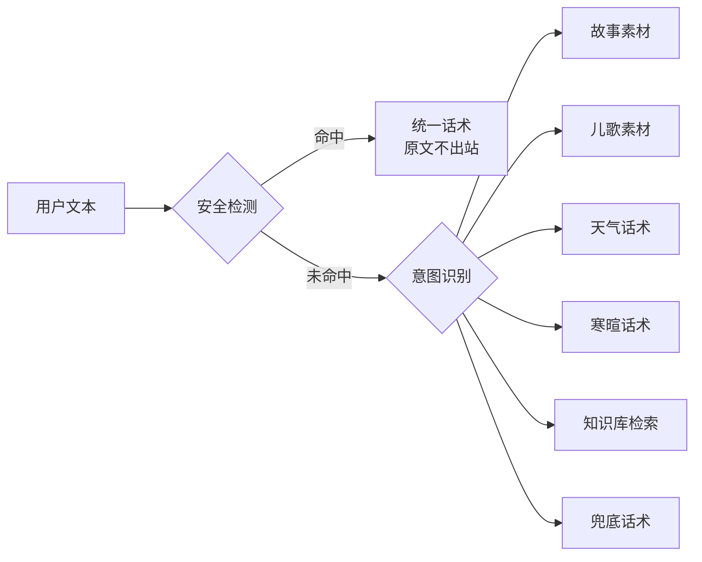

✅ 实测证据：用例「毒品是什么」的**引擎意图本是追问**（关键词命中「是什么」），
但回复分支是**安全拦截**——说明 `detect_safety` 确实排在最前，
且命中后**不进入素材选择**。安全拦截实测 6/6 = 100%（数据来源见
[`10-AI验证可用性.md`](./10-AI验证可用性.md)）。

---

## 8. 其余关键流程

### 8.1 入库（接通批次导入与分配）

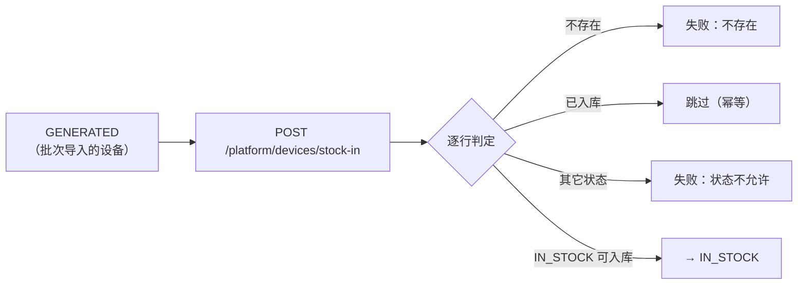

### 8.2 OTA 推送

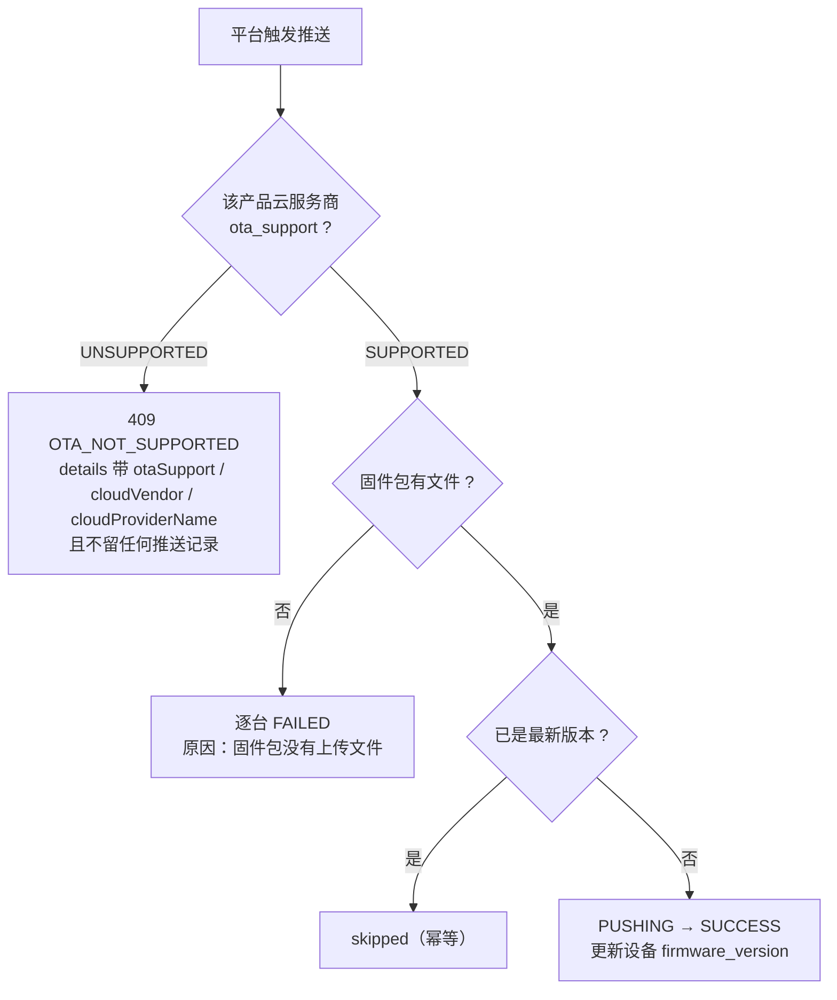

> ✅ **两个「诚实」的设计**：① 推送能力判定读 `cloud_providers.ota_support`，
> **数据驱动**而非写死厂商名；② 被拒绝时**不留任何推送记录**——
> 「拒绝」必须是真的没发生，而不是留下一条 `FAILED` 让人以为尝试过。

### 8.3 运营指标：实时聚合与快照分离

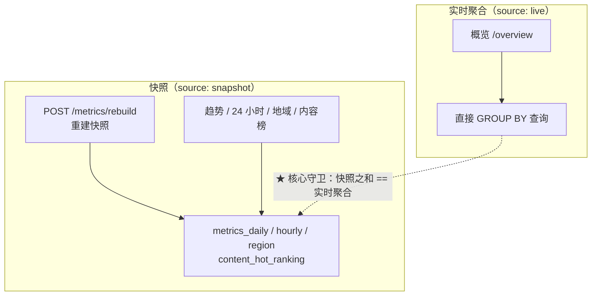

**核心守卫**：`test_metrics_isolation.py` 断言「**快照之和 == 实时聚合**」。
用系数摊派（而不是真实 `GROUP BY`）的实现**过不了这条断言**——这正是遗留缺陷 `P-07`
（维度数据非真实汇总）的守卫方式。同时所有指标端点强制 `productId` 且校验归属，
防住 `P-08`（运营数据全局共享）。

---

## 附录：已知局限与取证边界

1. **本文的图是按实现反推的**，不是先设计后实现。迁移表与状态取值**逐条来自
   `backend/app/models/enums.py`**（可核对），但图中的**业务解释**属于事后归纳。
   → 补齐方式：改动状态机时同步更新本文，并把 `docs/` 加入该 PR 的必改清单。
2. **未画出所有分支**。例如订单的 `rejectReason` 必填校验、批次导入的幂等复用细节、
   OTA 的部分失败（`PARTIAL_FAILED`）路径、知识库解析的 `PENDING`/`PARSED` 区分等，
   只画了主干。
3. **工厂端「批次查询」流程缺失**：该页面菜单存在但显示「建设中」，后端也还没有
   `/factory/batches` 端点（`factory:batch:read` 权限与 `/platform/batches` 已可用）。
4. **`outbox_events` 表已建但没有投递器**，因此图中未画事件投递链路。
5. **OTA 的成功路径未实测**：演示数据里的固件包**没有上传文件**，
   因此实测到的是「逐台如实失败」；`SUCCESS` 分支只有代码与单元测试覆盖。
6. **对话链路图描述的是离线模拟引擎的时序**。真实厂商的实时对话是 RTC/WebSocket 长连接，
   而当前 `chat()` 实现是「HTTP 取整段 + 本地分块」——对外接口
   （`AsyncIterator[ChatChunk]`）不变，但内部时序会在联调时替换。
7. **无截图**：本文全部用 mermaid 文本图，没有界面截图（截图属未完成的收尾范围）。
