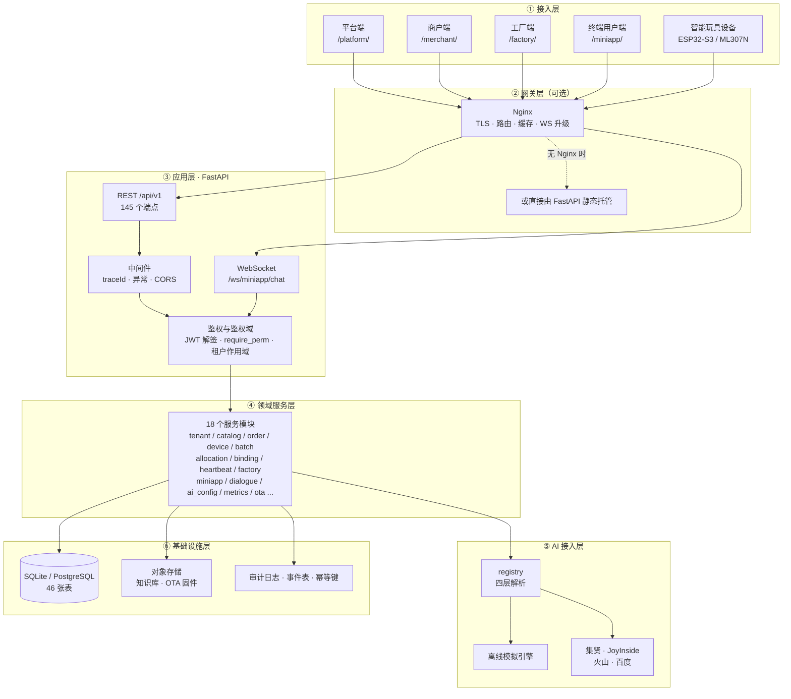
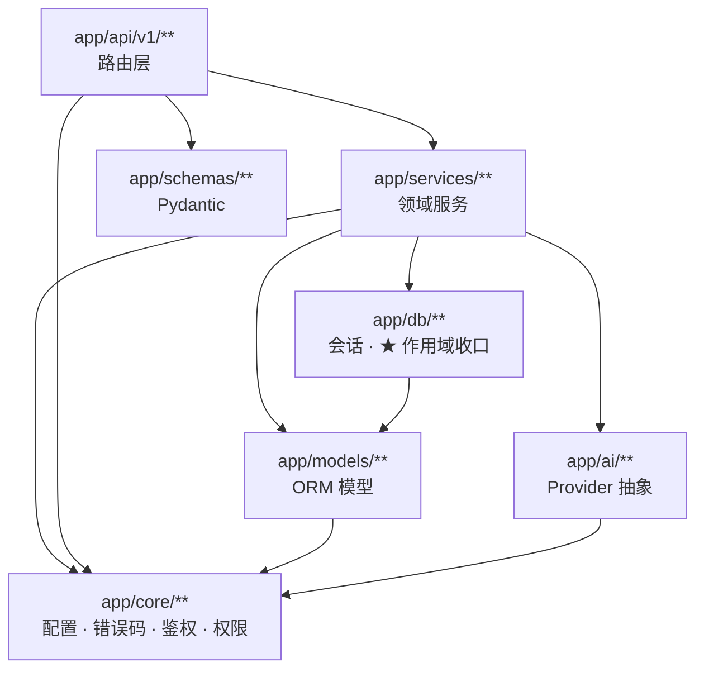
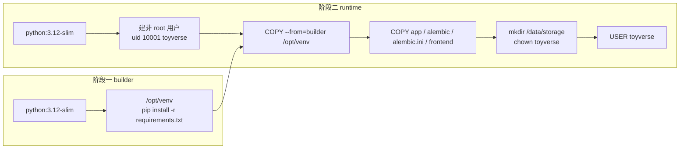
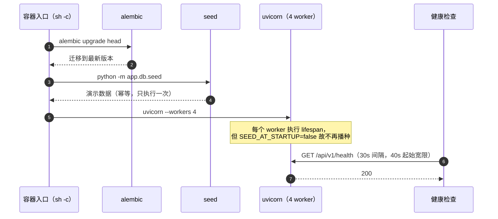
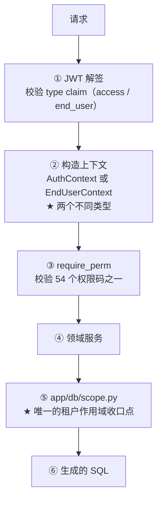
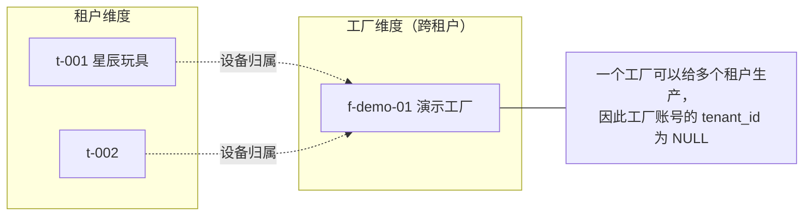
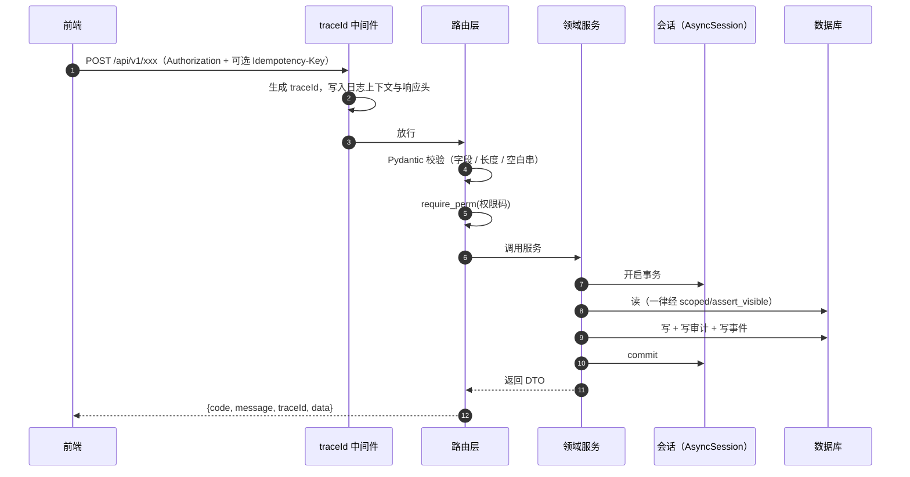
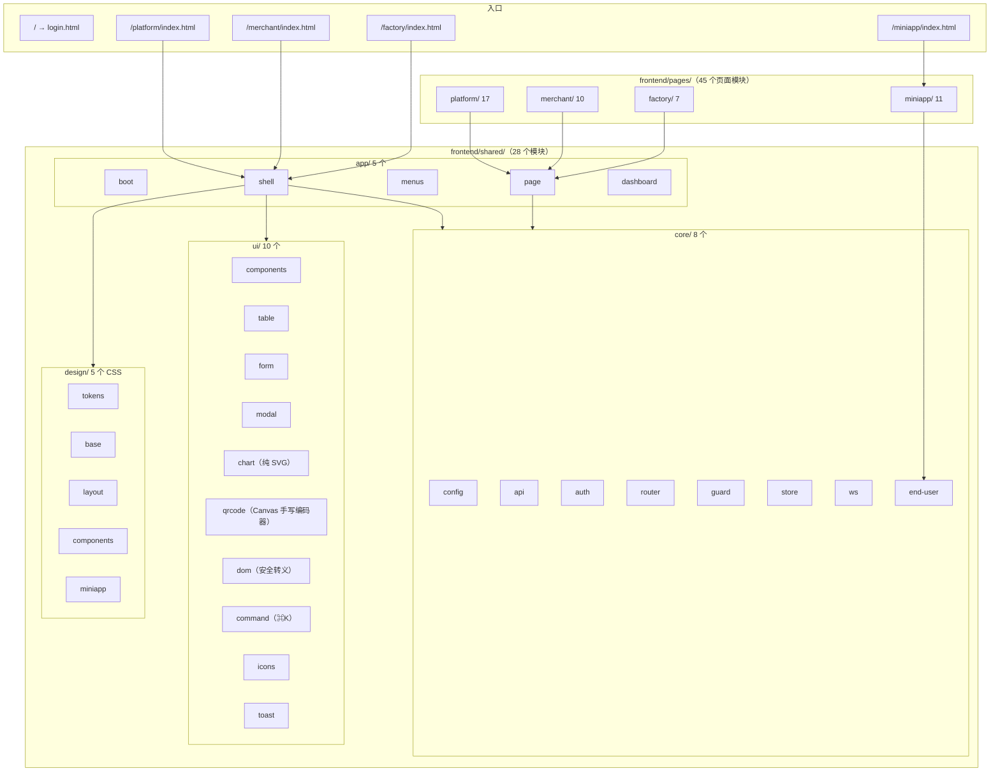

# 系统架构图

> **适用对象**：需要评审架构、接手维护、或评估技术选型的工程人员
> **本文定位**：讲清**分层与边界**、**部署形态**、以及**每个选型背后的取舍与替代方案**
> **配套文档**：[`02-系统流程图.md`](./02-系统流程图.md)（业务流转）、[`07-多租户与权限设计.md`](./07-多租户与权限设计.md)（隔离层细节）、[`05-数据模型与ER图.md`](./05-数据模型与ER图.md)（数据层）、[`../CONTRIBUTING.md`](../CONTRIBUTING.md)（八条架构红线）
> **最后更新**：2026-09-17
> **文档中标注说明**：✅ = 已实测或有代码原文可查；⚠️ = 未验证

---

## 0. 结论先行

### 0.1 一句话架构

一个**单体的、分层严格的 FastAPI 应用** + **零构建前端** + **可选的反向代理与 PostgreSQL**。
没有微服务、没有消息队列、没有缓存中间件——这是刻意的，理由见 `## 6.`。

### 0.2 六层



### 0.3 规模速查

| 项 | 数值 |
|---|---|
| HTTP 端点 | **145**（OpenAPI `paths` 119） |
| WebSocket 端点 | **1**（`/ws/miniapp/chat`，**不在 `/api/v1` 前缀下**） |
| 数据表 | **46** |
| 领域服务 | `backend/app/services/` 下 **18** 个模块（17 个领域服务 + 1 个脱敏序列化工具 `serializers.py`） |
| 后端源文件（mypy strict 口径） | **95** |
| 前端模块 | 页面 **45** + 共享 **28**，**零构建**（无 npm / 无打包器） |
| 容器 | 3 个（app / nginx / postgres），其中后两个按 profile 启用 |

---

## 1. 分层与依赖方向

### 1.1 依赖只能向下



**三条硬约束**（`CONTRIBUTING.md` 的「项目结构约定」）：

| 目录 | 职责 | 约定 |
|---|---|---|
| `backend/app/core/` | 配置、鉴权、依赖注入、错误码、日志 | **不含业务逻辑** |
| `backend/app/models/` | SQLAlchemy 模型 | 仅描述数据结构，**不含业务方法** |
| `backend/app/schemas/` | Pydantic 模型 | 与 `models/` 一一对应，命名加 `...Create` / `...Update` / `...Out` |
| `backend/app/services/` | 领域服务 | **业务逻辑只写在这里** |
| `backend/app/api/v1/` | 路由层 | 只做参数解析与调用服务，**不写业务逻辑** |
| `backend/app/ai/` | AI Provider 抽象与适配器 | 新厂商实现 `AIProvider` 接口后注册 |
| `frontend/shared/` | 四端共享代码 | 改动会影响全部四端，**需谨慎** |
| `frontend/pages/<端>/` | 各端页面 | **不跨端引用** |

> **为什么把「路由层不写业务逻辑」当成硬约束**：本项目的一个真实缺陷正是这条约束被打破的后果——
> P4 与 P9 各自在路由文件里定义了同一个路径 `/merchant/products`，**最终生效的取决于
> `router.py` 的 `include` 顺序**。改了别处的 import 顺序就会静默换实现。
> 收敛后路径唯一，且业务逻辑回到 service 层。

### 1.2 路由注册顺序是显式契约

`backend/app/api/v1/router.py` 里的 `include_router` 顺序**有意为之**：当两个模块存在路径重合时，
先注册者优先。这属于「隐式契约」，因此本项目在收敛后**消除了路径重合**，
把顺序从「决定行为」降级为「只影响 OpenAPI 分组顺序」。

---

## 2. 部署拓扑

### 2.1 三种 profile

```mermaid
flowchart TB
    subgraph host["宿主机"]
        U1["浏览器 / 设备"]
    end

    subgraph default["① 默认：docker compose up（无外部依赖）"]
        A1["toyverse-app<br/>uvicorn 4 worker<br/>非 root uid 10001"]
        V1[("命名卷<br/>toyverse-app-data<br/>挂载到 /data")]
        A1 --> V1
    end

    subgraph withnginx["② --profile nginx"]
        N2["toyverse-nginx<br/>nginx:1.27-alpine<br/>:8080 → :80"]
        A2["toyverse-app<br/>:8000"]
        N2 --> A2
    end

    subgraph full["③ --profile nginx --profile postgres"]
        N3["toyverse-nginx"]
        A3["toyverse-app"]
        PG["toyverse-postgres<br/>postgres:16-alpine<br/>命名卷 toyverse-postgres-data"]
        N3 --> A3
        A3 --> PG
    end

    U1 --> A1
    U1 --> N2
    U1 --> N3
```

| profile | 命令 | 什么时候用 |
|---|---|---|
| 默认 | `make up` | 本地验证、演示；SQLite 零外部依赖 |
| `nginx` | `make up-nginx` | 需要 TLS 终止、静态资源缓存、统一 80/443 入口 |
| `postgres` | `make up-full` | 需要真实并发写；SQLite 写并发能力有限 |

### 2.2 容器内布局

```
/app/                    ← WORKDIR，归 root
├── app/                 ← backend/app（★ 注意：没有 backend/ 这一层）
├── alembic/             ← 迁移
├── alembic.ini
├── frontend/            ← 零构建前端静态资源
└── (venv 在 /opt/venv，PATH 已注入)

/data/                   ← 命名卷，归 toyverse:toyverse（可写）
├── toyverse.db          ← SQLite
└── storage/             ← 本地对象存储（知识库 / OTA 固件）
```

> ★ **`/app/app` 这个双层结构是本项目踩过的坑**：代码里若靠「`__file__` 上溯固定级数」
> 推算前端目录，在容器布局下会数到 `/`，导致**整个 UI 404 而 API 完全正常**，日志里只有一条 WARNING。
> 现在改为 `_resolve_frontend_root()`（多级兜底）**加上** compose 里显式声明
> `FRONTEND_DIR=/app/frontend`——**部署配置不该依赖推算**。

### 2.3 镜像构建



| 做法 | 目的 |
|---|---|
| 多阶段构建 | 运行镜像不含编译工具链 |
| **先只复制 `requirements.txt`** 再装依赖 | 最大化利用 Docker 层缓存（源码变更不会重装依赖） |
| 非 root 用户运行 | 容器逃逸后的影响面更小 |
| `HEALTHCHECK` 打 `/api/v1/health` | 编排层可判断「真的可用」而不只是「进程活着」 |
| 入口脚本在 fork **之前**迁移与播种 | 多 worker 下避免 N 个进程并发写同一个 SQLite |
| 前端**不经过 Node 构建** | 镜像内不含 Node 工具链，构建更快、镜像更小 |

### 2.4 启动顺序（★ 顺序本身是设计）



---

## 3. 多租户隔离层

隔离不是一个函数，而是**一条链**，每一层都有明确职责：



| 层 | 拦截的是什么 | 失效的后果 |
|---|---|---|
| ① 解签 | 令牌伪造、令牌类型混用 | 小程序令牌可以调管理端接口 |
| ② 上下文类型 | 把终端用户当成管理端用户用 | 在不成立的输入上跑 `require_perm` / `scoped` |
| ③ 权限码 | 有身份但无权限 | 商户运营能做管理员的事 |
| ⑤ 作用域 | **有权限但跨租户** | A 租户读到 B 租户的数据 |

**第 ⑤ 层是最后一道，也是最关键的一道**，因为它拦的是「参数合法、权限合法、但不属于你」的请求。
`CONTRIBUTING.md` 红线 1 明确：**不得在路由层手写租户过滤**，必须走 `app/db/scope.py` 的
`scoped()` / `assert_visible()`。

> **为什么不在路由层过滤**：路由有 145 个端点，**漏掉一个就是一次越权**。
> 收口到一处后，「忘记过滤」在架构上不成立。细节见
> [`07-多租户与权限设计.md`](./07-多租户与权限设计.md)。

工厂维度与租户维度**正交**，因此另有一组 `factory_scoped()` / `assert_factory_visible()`：



---

## 4. 数据流

### 4.1 一次写请求的完整路径



### 4.2 关键的数据流原则

| 原则 | 做法 | 反例（本项目刻意避免的） |
|---|---|---|
| **归属落库，不做推断** | `devices.factory_order_id` 记录「这台设备属于哪张工单」（ADR-09） | 用「订单 + 状态」推断 → 工单委托 3 台却导出 5 张标签、未派工设备也能被计入合格率 |
| **两套指标路径显式标注** | 响应里带 `source: live` 或 `source: snapshot` | 看板上一个数字来源不明，出错时无法定位 |
| **未知不伪装成零** | 留存比率分母为 0 时返回 `null` | 返回 `0` 会让「没有数据」看起来像「用户全流失」 |
| **密钥只进不出** | 落库加密（Fernet）+ 响应只回掩码 | 参考实现把 `SecretKey` 明文下发到前端 |
| **安全失败** | 未配置密钥的厂商返回 `VENDOR_UNAVAILABLE`（ADR-07） | 返回伪造的成功结果，让调用方以为链路已通 |
| **审计与业务分离提交** | 「安全拒绝」的审计**单独提交** | 与业务事务绑定 → 业务回滚会把证据一起丢掉，事后无法证明「当时确实拒绝了」 |

---

## 5. 前端架构

### 5.1 零构建 ES Module



### 5.2 零构建的代价与收益

| | 说明 |
|---|---|
| **收益** | 克隆即可打开，**无需 `npm install`**（ADR-06、红线 7）；镜像内不含 Node 工具链；评审者打开链接就能看 |
| **代价** | 没有打包器的 tree-shaking 与压缩；文件名**不带内容哈希**，因此 Nginx **不能用 `immutable` 强缓存**（曾因此让用户卡在旧代码且无法失效，后改为 `no-cache, must-revalidate`） |
| **补偿措施** | 用 `make fe-check` 做**导入契约校验**：每个 `import` 的路径存在、且具名导出确实被导出（实测 **399 处**全部匹配）。缺了它，一个写错的 import 只有在浏览器里才会暴露，且表现为白屏 |

---

## 6. 技术选型理由与替代方案

### 6.1 后端

| 选型 | 理由 | 考虑过的替代 | 为什么不选 |
|---|---|---|---|
| **FastAPI** | 异步原生、自动生成 OpenAPI（本项目用它做**契约门禁**）、Pydantic 深度集成 | Flask | 同步模型下多 worker 的并发收益低；需自行拼装校验与文档 |
| | | Django | 自带 ORM/Admin 很重；本项目需要的是 API 而非全栈框架；异步支持较晚 |
| **SQLAlchemy 2.0 async** | 强类型（`Mapped` / `mapped_column`）能过 mypy strict；异步与 FastAPI 一致 | 原生 SQL | 46 张表的迁移与关联查询手写成本过高 |
| | | Tortoise ORM | 生态与迁移工具（Alembic）成熟度不如 SQLAlchemy |
| **Alembic** | 版本化迁移 + `alembic check` 能做**零漂移门禁**（模型与迁移不一致就报错） | 手写 SQL 迁移脚本 | 无法自动检测模型漂移，而漂移在生产是事故 |
| **SQLite 默认 + PostgreSQL 可选** | SQLite 保证「克隆即跑」（ADR-05）；PostgreSQL 用于生产 | 只用 PostgreSQL | 会让评审者在第一步就卡在「装数据库」上 |
| | | 只用 SQLite | 写并发能力有限，不适合真实多租户并发写 |
| **JWT（access + refresh）** | 无状态、便于多实例；本项目用 `type` claim 双向隔离管理端与终端用户令牌 | Session + Cookie | 终端用户走 H5 与 WebSocket，跨端场景下 Cookie 更麻烦；且需要服务端会话存储 |
| **bcrypt** | 口令哈希的成熟选择，`BCRYPT_ROUNDS` 可调 | Argon2 | 依赖与部署复杂度更高；本项目无特殊需求 |
| **Fernet（cryptography）** | 对称加密厂商密钥与小程序 appSecret，落库加密 | 明文存储 | 红线 2 与附录 B 的安全缺陷明确禁止 |
| **pytest** | 生态成熟，参数化能力适合租户隔离矩阵 | unittest | 参数化与夹具能力弱，写矩阵测试冗长 |

### 6.2 前端

| 选型 | 理由 | 考虑过的替代 | 为什么不选 |
|---|---|---|---|
| **原生 ES Module（零构建）** | 克隆即可运行（ADR-06）；作品集场景下降低使用门槛 | Vue 3 + Vite | 需要 `npm install` 与构建步骤，违反红线 7；评审者需先装 Node |
| | | React + 构建 | 同上，且体积更大 |
| **手写 Canvas 二维码编码器** | 前端零依赖，无法引 `qrcode` 库 | 引入 `qrcode.js` | 会打破「零依赖」；且本项目需要与后端载荷格式**逐字节一致** |
| **纯 SVG 图表** | 同上，避免图表库依赖 | ECharts / Chart.js | 体积大、需要构建或 CDN（CDN 会引入外部依赖与可用性风险） |

> **手写二维码编码器的风险与对策**：手写实现容易在掩码选择等细节上出错。
> 对策是 `make qr-verify`——用 Python 的 `qrcode` 库作为**独立实现**，
> 对 13 个载荷 × 8 个掩码 = **104 组矩阵逐模块比对**。

### 6.3 基础设施

| 选型 | 理由 | 考虑过的替代 | 为什么不选 |
|---|---|---|---|
| **单容器（app 内含静态托管）** | 零依赖可跑；四端与 API 同源，**无跨域问题** | 前后端分离部署 | 需要额外处理 CORS 与静态服务；作品集场景下增加部署步骤 |
| **Nginx 作为可选 profile** | TLS / 缓存 / 多实例是生产需求，但**不是跑起来的前提** | 强制 Nginx | 会让「一键跑通」变成「先配 Nginx」 |
| **命名卷存数据** | `down` 不丢数据（实测 `down && up` 后计数一致） | 绑定挂载宿主机目录 | 需要处理宿主机目录权限；命名卷更省事 |
| **无 Redis / 无消息队列** | 当前没有必须的用途 | Redis 做缓存或限流 | 引入一个需要运维的组件，而当前**没有实测依据**证明它是瓶颈 |
| **`outbox_events` 表已建但无投递器** | 为将来事件投递预留结构，但**不假装已经实现** | 直接上 Celery / MQ | 同上；且未实现的东西不该披上实现的皮 |

> ⚠️ **「没有 Redis」是一个待观察的决定，不是结论**。它成立的前提是当前负载与功能
> （无分布式锁、无跨实例限流、无会话共享需求）。一旦要多实例部署，限流与 WebSocket
> 会话路由就会需要外部状态—届时这个决定需要重新评估。

---

## 7. 架构红线与决策

### 7.1 八条红线（`CONTRIBUTING.md` 原文照录）

| # | 红线 | 原因 | 在架构上的落点 |
|---|---|---|---|
| 1 | 不得在路由层手写租户过滤，必须走 repository 层的 `tenant_scope` | 防止遗漏导致越权 | `app/db/scope.py` |
| 2 | 任何响应不得包含云服务商 `SecretKey` | 密钥泄漏 | `app/core/crypto.py` + 响应模型无该字段 |
| 3 | 工厂端接口不得返回真实客户名、金额、联系方式 | 商业信息隔离 | `FactoryOrderSerializer` 白名单 |
| 4 | 不得硬编码任何密码、密钥或 Token | 历史教训：曾出现硬编码弱口令 | 全部走 `.env` + 启动期校验 |
| 5 | 未配置密钥的厂商必须返回 `VENDOR_UNAVAILABLE` | 避免误导使用者 | `app/ai/base.py` + 审计 |
| 6 | 不得提交 `learning/` 目录内容 | 个人学习资料不上传 | `.gitignore` + `make docs-check` 检查 |
| 7 | 不得引入前端构建步骤 | 保持「克隆即可运行」 | 纯 ES Module |
| 8 | 领域状态只能通过状态机服务迁移 | 保证状态一致性 | `*_TRANSITIONS` 迁移表 |

### 7.2 十条架构决策（`ADR-01`–`ADR-10`）

| # | 决策 | 一句话理由 |
|---|---|---|
| `ADR-01` | 平台管理员 `tenant_id = NULL`（全局长） | 参考实现把它挂在 `t-001`，与「平台是全局长」矛盾 |
| `ADR-02` | 烧录工厂独立 `factories` 表，账号 `tenant_id = NULL` | 工厂跨租户，不属于任何单一租户 |
| `ADR-03` | 设备状态以**四维**为权威 | 单一状态列无法表达「已分配但未激活」这类合法组合 |
| `ADR-04` | AI 业务标准以原型与 PRD-03 为准 | 参考站**没有** AI 实现（只有 `PlaceholderView` 桩） |
| `ADR-05` | 默认 SQLite，PostgreSQL 可选 | 保证「克隆即跑」，同时保留生产级选项 |
| `ADR-06` | 前端零构建 ES Module | 无需 `npm install`，降低作品集使用门槛 |
| `ADR-07` | 未配置密钥的厂商返回 `VENDOR_UNAVAILABLE`，**绝不伪造成功** | 假成功比报错更危险 |
| `ADR-08` | 多租户过滤只在 repository 层收口 | 从架构上杜绝越权 |
| `ADR-09` | **设备与工单的归属落库**（`devices.factory_order_id`） | 「归属」是事实不是状态的函数 |
| `ADR-10` | 可冻结 / 可分配集合**按业务能力定义**并与迁移表严格对称 | 对称性应来自语义，不是来自把集合改小 |

> `ADR-09` 与 `ADR-10` 都是**被实测逼出来的**：
> 前者来自「工单委托 3 台却导出 5 张标签」与「未派工设备也能被抽检」；
> 后者来自「为求对称把可冻结集合收紧，结果已出货设备无法停服」。
> 完整经过见 [`12-项目复盘.md`](./12-项目复盘.md)。

---

## 8. 项目结构

```
saas_ai_toy_platform/
├── backend/
│   ├── app/
│   │   ├── core/           配置、错误码(31)、权限码(54)、鉴权、加密、日志、幂等
│   │   ├── db/             会话、★ scope.py（租户作用域唯一收口点）、种子
│   │   ├── models/         ORM 模型（12 个文件，46 张表，含 enums.py）
│   │   ├── schemas/        Pydantic 模型（按域分文件）
│   │   ├── api/v1/         路由层（13 个模块，145 个端点）
│   │   ├── services/       领域服务（17 个模块，业务逻辑只在这里）
│   │   ├── ai/             Provider 抽象 + registry（四层解析）+ mock/ + 4 个厂商适配器
│   │   ├── realtime/       WebSocket 帧协议、SSE
│   │   └── main.py         应用工厂 + lifespan + 静态托管
│   ├── alembic/versions/   15 个迁移（0001–0015）
│   └── tests/              unit(7 文件) / integration(16) / e2e(1) + conftest.py
├── frontend/               shared/{app,core,design,ui} + pages/{platform,merchant,factory,miniapp}
├── deploy/                 Dockerfile.backend · nginx.conf · .env.example（生产部署清单）
├── scripts/                冒烟、敏感信息扫描、二维码、重置、契约导出、前端导入校验、★ 文档一致性校验
├── docs/                   本套文档（01–14）
├── tests/contract/         ★ OpenAPI 快照（在仓库根，不在 backend/）
├── docker-compose.yml      ★ 编排入口在仓库根（相对路径以 compose 文件所在目录为基准）
└── Makefile                36 个统一命令
```

> **为什么编排文件在仓库根、构建资产在 `deploy/`**：Compose 的三个相对路径
> （`build.context`、`env_file: .env`、`${VAR}` 插值读的 `.env`）都以 **compose 文件所在目录**为基准。
> 放根目录时三者自然成立；放 `deploy/` 就要写 `..` 与 `../.env`，
> 那是一类「换个目录执行就失效」的易错配置。

---

## 附录：已知局限与取证边界

1. **没有压测数据**，因此本文对「单实例 4 worker 能扛多少」没有任何结论。
   → 补齐方式：需要真实并发指标时先补压测，再谈容量规划。
2. **多实例部署未验证**：`deploy/nginx.conf` 的 `upstream` 只有一个 server；
   多实例下 WebSocket 会话路由、限流、`outbox_events` 投递都缺少外部状态支撑。
3. **Nginx 只验证了 HTTP 与 WebSocket 转发**，TLS（配置里预留了 80→443 注释段）未验证。
4. **PostgreSQL 已真跑验证**：起真实 PG 16 → 迁移到 `0015` → 种子 → 应用 healthy → 冒烟 **57/57**。
   ⚠️ 但仍**未做 PG 上的并发/性能验证**，且**多实例与连接池参数未实测**。
5. **`STORAGE_BACKEND=s3` 是显式安全失败**（`S3Storage` 不假装可用），
   因此对象存储目前只能用本地磁盘 + 持久卷。
6. **事件表 `outbox_events` 已建但无投递器**，也没有消费方；`## 6.3` 已说明这是预留而非实现。
7. **无缓存层**：指标概览走实时聚合，快照需要显式「刷新快照」触发，没有自动定时任务。
8. **架构图是按实现反推的**：分层与依赖方向可对照代码核对，但图中「为什么这样分层」的解释
   属于事后归纳。
