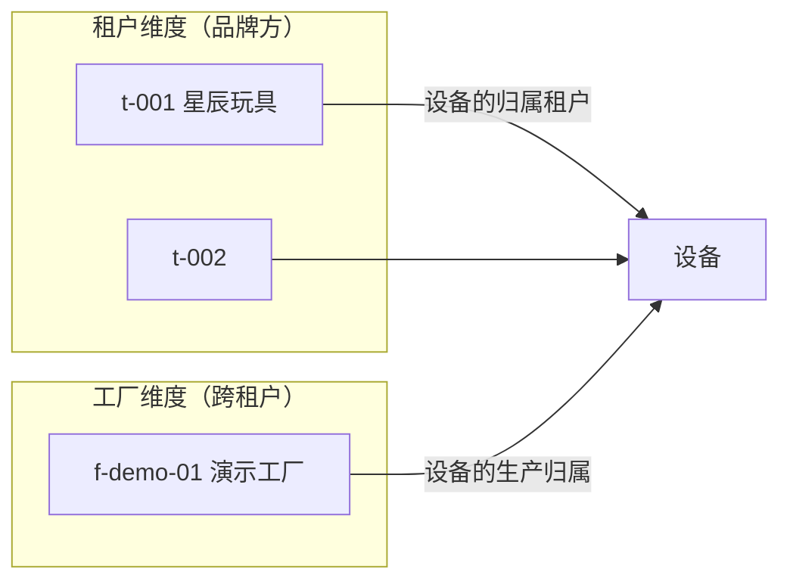
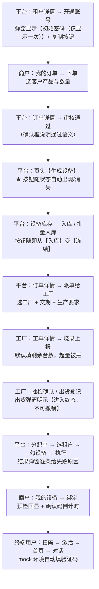

# 产品需求文档 PRD

> **适用对象**：产品、评审、测试与需要理解业务边界的开发人员
> **本文定位**：描述平台的**业务全景**——谁在用、有哪些页面、谁能做什么、关键交互怎么设计
> **配套文档**：[`02-系统流程图.md`](./02-系统流程图.md)（流程与状态机）、[`05-数据模型与ER图.md`](./05-数据模型与ER图.md)（数据支撑）、[`07-多租户与权限设计.md`](./07-多租户与权限设计.md)（54 个权限码的完整清单）
> **最后更新**：2026-09-17
> **文档中标注说明**：✅ = 已实测或有代码原文可查；⚠️ = 未实现 / 未验证
>
> ⚠️ **本文档为事后补写**：本项目先按任务清单实施、在收尾阶段才整理成正式 PRD，
> 因此它描述的是**已交付的能力**，而不是立项时的需求假设。详见文末「已知局限与取证边界」。

---

## 0. 结论先行

### 0.1 这个平台解决谁的什么问题

| 角色 | 痛点 | 平台提供的能力 | 验收标志 |
|---|---|---|---|
| **平台运营方**（本项目产品的购买方） | 多个品牌客户各有一套设备与 AI 后台，无法统一交付与运维 | 多租户开户与授权、产品模板、云服务商配置、订单审核、设备生成与批次导入、分配、工厂协同、OTA、跨租户运营看板 | 能给一个新品牌**从开户到设备出厂**走完全流程 |
| **品牌方 / 商户**（租户） | 自建 AI 与设备管理后台成本高；拿不到终端使用数据 | 我的产品、AI 配置（提示词/角色/音色/内容安全）、知识库、下单、我的设备、扫码绑定、运营数据 | 能**自己配置玩具的说话方式**并看到使用数据 |
| **烧录工厂** | 接到生产任务但看不到统一工单；也**不该看到**客户的商业信息 | 生产订单（客户名脱敏）、烧录上报、抽检、出货、固件版本 | 能按工单完成生产，且**拿不到客户真实信息** |
| **终端用户 / 家长** | 买到玩具后不知道怎么让孩子用起来 | 扫码即激活（无需注册复杂流程）、与玩具对话、4G 流量充值、设备设置 | 从**扫码到第一次对话**不超过几分钟 |
| **平台运营**（本项目的直接使用者） | — | 同「平台运营方」 | 同上 |

### 0.2 平台不做什么（非目标）

明确排除，避免范围蔓延：

| 非目标 | 为什么不做 |
|---|---|
| **不自研硬件** | 平台是软件层；硬件由品牌方选择 4G 或 Wi-Fi 方案 |
| **不做内容电商** | 内容库只服务「设备能讲什么」，不做售卖与分发 |
| **不做 C 端应用商店式的分发** | 终端用户端是 H5 小程序形态，不做原生 App |
| **不做自研大模型** | AI 能力通过 `AIProvider` 抽象接入第三方（见 [`08-AI能力接入设计.md`](./08-AI能力接入设计.md)） |
| **不做支付通道** | 支付是可配置的模拟通道（`PAYMENT_PROVIDER`），生产需接入真实通道 |

---

## 1. 产品定位

**ToyVerse Cloud** 是面向 **AI 智能玩具**行业的多租户 SaaS 管理平台，
覆盖「客户开通 → 产品配置 → 下单 → 设备生成 → 工厂烧录 → 终端激活 → AI 运营」的**全生命周期**。

### 1.1 核心价值：品牌方不必自建后台

一个品牌方要做 AI 玩具，本来需要自建：设备管理系统、烧录工厂协同、激活与绑定服务、
AI 供应商对接、内容安全、运营统计、OTA。本平台把这些**收敛成一套多租户能力**，
品牌方只需：

1. 选择硬件方案（4G 或 Wi-Fi）
2. 在平台上配置产品与 AI 能力
3. 下单、拿设备、卖出去
4. 看运营数据

### 1.2 两条产品线（同一个平台，两种技术路线）

| | 4G 方案 | Wi-Fi 方案 |
|---|---|---|
| 联网 | 4G 模组（ML307N） | Wi-Fi（ESP32-S3） |
| 代表厂商 | 集贤系统 | 京东云 JoyInside |
| 设备怎么来 | 调厂商 API 生成，SN/IMEI/ICCID 由厂商返回 | **平台本地生成 SN** + HMAC 签名 |
| 用户怎么激活 | 开机 → 4G 上线 → 厂商激活 | 配网 → 上报 SN/MAC → 校验 → 厂商激活 |
| 对话角色 | 平台可配置 | **由厂商侧智能体配置，平台不覆盖** |
| OTA | ✅ 支持 | ✘ 不支持（端侧升级） |
| 流量充值 | ✅ 有 | ✘ 无 |

---

## 2. 角色定义

### 2.1 六个内置角色（业务视角）

| 角色码 | 显示名 | 角色类型 | 业务定位 | 权限数 |
|---|---|---|---|---|
| `PLATFORM_ADMIN` | 平台超级管理员 | `PLATFORM` | 平台的**所有者视角**，权限为通配 `*` | `*` |
| `PLATFORM_OPERATOR` | 平台运营 | `PLATFORM` | 处理日常业务（产品、订单、设备、分配、工厂工单），**不能改平台级配置** | 17 |
| `MERCHANT_ADMIN` | 商户管理员 | `MERCHANT` | 品牌方的**管理员**，可配置 AI、下单、管设备、管成员 | 20 |
| `MERCHANT_OPERATOR` | 商户运营 | `MERCHANT` | 品牌方的**运营人员**，只能看不能改配置，但**可以绑定/解绑设备** | 10 |
| `FACTORY_ADMIN` | 工厂管理员 | `FACTORY` | 工厂的**管理员**，可生产、抽检、看出货与固件 | 6 |
| `FACTORY_OPERATOR` | 工厂操作员 | `FACTORY` | 工厂的**一线操作员**，只能生产与抽检 | 4 |

### 2.2 两条关键的业务含义

**① 平台账号不属于任何租户**

平台账号的 `tenant_id` 为 `NULL`，表示「全局长」。
—— 这不是偷懒，而是修正了一个真实矛盾：早期实现把平台管理员也挂在 `t-001` 下，
于是同一个 `t-001` 既是「平台」又是「某个品牌客户」，权限边界无法自洽（`ADR-01`）。

**② 工厂是跨租户角色**

工厂为**多个品牌方**生产设备，因此不属于任何单一租户：工厂账号的 `tenant_id` 也是 `NULL`，
但**`factory_id` 非空**（`ADR-02`）。

> ★ 两个维度**正交**：商户端按租户过滤，工厂端按工厂过滤，**不能互相替代**。
> 这也是为什么工厂端有独立的 `factory_scoped()` 而不是复用租户作用域。

### 2.3 终端用户

终端用户（消费者 / 家长）**没有角色码**，走独立的 `end_users` 账号体系：

| 项 | 设计 |
|---|---|
| 登录方式 | 手机号 + 短信验证码（演示环境为可配置的模拟通道，验证码会回显并标注 `mock: true`） |
| 令牌类型 | 与后台令牌**同密钥、以 `type` claim 区隔**（`end_user` vs `access`），双向互相拒绝 |
| 可见范围 | **由绑定关系决定**，而不是由租户决定 |
| 刻意不带 `tenant_id` | 一个家长可能买过两个品牌的玩具，把账号绑到某个租户会立刻产生「同一部手机在不同品牌下是两个账号」 |

---

## 3. 术语表

| 术语 | 英文 / 代码标识 | 含义 |
|---|---|---|
| 租户 | `tenant` / `tenants` | 品牌方客户。平台账号的 `tenant_id` 为 `NULL`（全局长） |
| 云服务商 | `cloud_provider` / `cloud_providers` | 提供设备云能力的厂商（集贤 / JoyInside 等），含 `ota_support` 能力标记 |
| 产品模板 | `product_template` / `product_templates` | 平台定义的产品规格（联网方式、固件、厂商绑定） |
| 产品授权 | `product_authorization` / `product_authorizations` | 平台把模板授权给某个租户，租户才能基于它建客户产品 |
| 客户产品 | `client_product` / `client_products` | 某租户具体在卖的一款产品，是**订单、设备、AI 配置、指标的归属主体** |
| 设备四维 | `asset_status` / `activation_status` / `online_status` / `bind_status` | 设备的权威状态，四个**正交**维度；展示标签由 `derive_device_label()` 合成（`ADR-03`） |
| 资产状态 | `asset_status` | 物理流转维度：`PENDING_GEN` … `BOUND` / `FROZEN` / `RETIRED`（共 10 态） |
| 激活状态 | `activation_status` | `NOT_ACTIVATED` / `ACTIVATING` / `ACTIVATED` / `BIND_FAILED` |
| 绑定状态 | `bind_status` | `UNBOUND` / `BOUND`；与**绑定记录**的状态（`PENDING`/`BOUND`/`UNBOUND`）是两个字段 |
| 在线窗口 | `ONLINE_WINDOW_SECONDS` | 默认 180 秒；超窗未心跳即判定离线。「是否在线」的**结论**一律由此派生 |
| 批次 | `batch` / `device_batches` | 一次 CSV 导入的设备集合，带预检结果与错误报告 |
| 分配单 | `allocation_order` / `allocation_orders` | 平台把库存设备分配给某个租户的单据，逐行校验、部分失败不回滚 |
| 工单 | `factory_order` / `factory_orders` | 派给工厂的生产任务；`quantity` 取**实际派工台数**而非合同数量 |
| 烧录上报 | `burn_report` / `burn_reports` | 工厂上报已烧录的 SN；分批累加，超量被拒 |
| 抽检 | `inspection` / `inspections` | 工厂抽检记录；**刻意不改设备状态**（不合格需要人决定返工或降级） |
| confirm-token | `confirm_token_hash` | 绑定的 5 分钟确认令牌。**不额外建表**，落在绑定行上，绑定成功即置空销毁 |
| 脱敏 | `mask_customer_name` | 工厂端只看到「首尾各一个文字字符」，长度恒等；金额与联系方式整字段不出现 |
| 内容安全 | `CONTENT_SAFETY_*` / `safetyFlag` | 三个开关（文本/音频/视觉）；**在 `assistant.delta` 之前**过滤，命中即整段替换，**原文绝不出站** |
| 知识库 | `knowledge_base` / `kb_files` | 商户上传的素材；解析成 `PARSED` 后**真的注入对话**。`PENDING` 与 `PARSED` 是两个独立事实 |
| 快照 vs 实时聚合 | `source: snapshot` / `source: live` | 概览走实时聚合，趋势/24 小时/地域/内容榜读快照；响应里**显式标注来源** |
| OTA | `ota_packages` / `ota_records` | 固件包与逐台推送记录；Wi-Fi 产品返回 `OTA_NOT_SUPPORTED` |
| 幂等键 | `Idempotency-Key` / `idempotency_keys` | 请求级幂等；重放返回同一条结果而不是产生第二次副作用 |
| traceId | `traceId` | 贯穿日志、响应头与响应体的追踪标识 |
| 安全失败 | `VENDOR_UNAVAILABLE` | 未配置密钥的厂商一律拒绝，**绝不伪造成功**（`ADR-07`） |

---

## 4. 页面清单

### 4.1 平台端（15 个路由，11 个列表/页面 + 4 个详情）

| 页面 | 路由 | 主要功能 | 主要接口 |
|---|---|---|---|
| 工作台 | `#/dashboard` | 6 张统计卡（租户/模板/客户产品/待审核订单/订单/设备） | `GET /platform/tenants`、`/templates`、`/client-products`、`/orders`、`/devices` |
| 租户管理 | `#/tenants` | 客户开户、启停、筛选、分页 | `GET /platform/tenants` |
| 租户详情 | `#/tenants/:id` | 四标签页：概览 / 产品授权 / 客户产品 / 登录账号（含一次性密码） | `GET /platform/tenants/{id}`、`POST .../accounts` |
| 产品模板 | `#/templates` | 模板维护、授权给租户、删除级联校验 | `GET/POST /platform/templates` |
| 云服务商配置 | `#/clouds` | 厂商密钥（密文落库）、连通性检测 | `GET/POST /platform/clouds`、`POST .../test` |
| 客户产品 | `#/client-products` | 客户产品维护 | `GET /platform/client-products` |
| 客户产品详情 | `#/client-products/:id` | 概览 / 小程序配置 / **运营** 三个 Tab | `GET/PUT .../miniapp-config`、`/content-items` |
| 订单管理 | `#/orders` | 订单列表、筛选 | `GET /platform/orders` |
| 订单详情 | `#/orders/:id` | 审核、生成设备、导出二维码、**派单给工厂**（页头动作随状态更新） | `POST .../audit`、`.../generate`、`.../dispatch`、`GET .../qrcodes` |
| 设备库存 | `#/devices` | 四维分列展示、冻结/解冻（**原路恢复**）/报废、**入库**、批量入库、模拟心跳、签发密钥 | `GET /platform/devices`、`POST .../freeze`、`.../thaw`、`.../retire`、`/platform/devices/stock-in` |
| 设备详情 | `#/devices/:id` | 三 Tab：概览 / 绑定 / 事件时间线 | `GET .../devices/{id}`、`.../events` |
| 设备批次 | `#/batches` | CSV 上传 → 预检 → 导入 → 错误报告（含 BOM 的 CSV） | `POST /platform/batches`、`.../import`、`GET .../error-report` |
| 分配单 | `#/allocations` | 创建（按租户联动产品 + 多选设备）→ 执行 → 明细 | `GET/POST /platform/allocations`、`POST .../execute` |
| 工厂订单 | `#/factory-orders` | 工单列表（客户名脱敏） | `GET /platform/factory-orders` |
| OTA 管理 | `#/ota` | 固件包登记/上传/删除、逐台推送记录 | `GET/POST /platform/ota/packages`、`POST .../push` |

### 4.2 商户端（9 个路由）

| 页面 | 路由 | 主要功能 | 主要接口 |
|---|---|---|---|
| 工作台 | `#/dashboard` | 统计卡（含审计与设备概览） | `GET /merchant/orders`、`/devices` |
| 我的产品 | `#/products` | 产品列表（含设备数 / 已激活 / 累计交互 / AI 配置摘要） | `GET /merchant/products` |
| 产品详情 | `#/products/:id` | 产品概览 | `GET /merchant/products/{id}` |
| AI 配置 | `#/ai-config` | 供应商 / 提示词与采样 / 角色 / 音色 / 内容安全三开关，**分区独立保存**；底部有「当前生效说明」 | `GET/PUT /merchant/products/{id}/ai-config` 及四个分区子端点 |
| 知识库 | `#/knowledge-bases` | 知识库 CRUD、文件上传/解析/删除（解析**诚实实现**：pdf/docx 报 `FAILED`） | `GET/POST /merchant/knowledge-bases`、`.../files`、`.../parse` |
| 我的订单 | `#/orders` | 下单、查单 | `GET/POST /merchant/orders` |
| 我的设备 | `#/devices` | 设备列表（仅本租户）、扫码绑定两步流程、模拟心跳 | `GET /merchant/devices`、`POST .../bind/precheck` |
| 扫码绑定 | `#/bindings` | 绑定记录、precheck 回显与确认码倒计时、解绑（原因必填） | `GET /merchant/bindings`、`POST .../bind`、`.../unbind` |
| 运营看板 | `#/metrics` | 概览（实时聚合）/ 趋势 / 24 小时热力 / 地域 / 内容榜（快照）、刷新快照 | `GET /merchant/metrics/*`、`POST .../rebuild` |

### 4.3 工厂端（6 个路由）

| 页面 | 路由 | 主要功能 | 权限 |
|---|---|---|---|
| 工作台 | `#/dashboard` | 待生产单数、累计烧录、固件版本数 | `factory:dashboard:read` |
| 生产订单 | `#/orders` | 工单列表，列含「客户（脱敏）」 | `factory:order:read` |
| 工单详情 | `#/orders/:id` | 三 Tab：概览 / 烧录记录 / 抽检记录；**页头动作随状态变化** | `factory:order:read` |
| 烧录上报 | `#/burn` | 默认填剩余台数；超量被拦并提示剩余 | `factory:burn:write` |
| 抽检确认 | `#/inspect` | 合格/不合格；**校验 SN 必须属于所选工单** | `factory:inspect:write` |
| 固件版本 | `#/firmware` | 按固件版本聚合的单数 / 台数 / 进度 | `factory:firmware:read` |

> **出货登记**没有独立页面——它是工单详情页头的动作，权限沿用 `factory:burn:write`。

### 4.4 终端用户端（9 屏，手机壳内的屏幕状态机，不是 hash 路由）

| 屏 | 标识 | 主要功能 |
|---|---|---|
| 扫码 | `scan` | 扫描/粘贴二维码载荷，含两个演示设备按钮 |
| 登录 | `login` | 手机号 + 验证码（mock 环境下验证码自动填入） |
| 开机激活 | `setup_4g` | 4G 路线的开机指引与激活 |
| 配网激活 | `setup_wifi` | Wi-Fi 路线的配网指引、SN 上报与激活 |
| 激活完成 | `activate_done` | 展示设备信息与厂商返回，标注「演示环境：厂商通道为模拟实现」 |
| 首页 | `home` | 设备卡、功能宫格（**流量充值仅 4G 可见**）、底部 Tab |
| 对话 | `chat` | WebSocket 对话，含降级提示 |
| 流量充值 | `recharge` | 4G 套餐选择与支付（mock 支付标注 `mock: true`） |
| 设备设置 | `settings` | 音量、儿童模式、唤醒词、解绑 |

### 4.5 ⚠️ 菜单存在但**页面未实现**（渲染「建设中」占位）

这些是**已知的内容缺口**，不是缺陷——菜单按目标形态预留，页面在后续迭代交付：

| 端 | 未实现的菜单项 |
|---|---|
| 平台端（7） | 二维码 / SN（`/qrcodes`）、小程序配置（`/miniapps`）、组织架构（`/organizations`）、职位管理（`/positions`）、成员管理（`/members`）、角色权限（`/roles`）、操作日志（`/audits`） |
| 商户端（5） | 小程序（`/miniapp`）、组织架构、职位管理、成员管理、操作日志 |
| 工厂端（1） | **批次查询**（`/batches`）——后端 `/factory/batches` 端点也尚未实现 |

> 未实现的菜单项通过 `shared/app/shell.js` 统一渲染为「（建设中）」占位页，
> 因此读者在界面上会看到提示而不是白屏。

---

## 5. 权限矩阵

### 5.1 按能力域的 6 角色矩阵

`✅` = 可读写 · `👁` = 仅可读 · `—` = 无权限

| 能力域 | 平台超管 | 平台运营 | 商户管理员 | 商户运营 | 工厂管理员 | 工厂操作员 |
|---|---|---|---|---|---|---|
| 客户档案（租户） | ✅ | 👁 | — | — | — | — |
| 云服务商配置 | ✅ | 👁 | — | — | — | — |
| 产品模板与授权 | ✅ | 👁 | — | — | — | — |
| 客户产品 | ✅ | ✅ | 👁 | 👁 | — | — |
| 订单（平台侧审核） | ✅ | ✅ | — | — | — | — |
| 订单（商户侧下单） | — | — | ✅ | 👁 | — | — |
| 设备（平台库存） | ✅ | ✅ | — | — | — | — |
| 设备（商户侧） | — | — | ✅ | 👁 | — | — |
| 设备批次导入 | ✅ | 👁 | — | — | — | — |
| 分配单 | ✅ | ✅ | — | — | — | — |
| 工厂工单（平台派单） | ✅ | 👁 | — | — | — | — |
| 工单生产 / 烧录 / 出货 | — | — | — | — | ✅ | ✅ |
| 抽检 | — | — | — | — | ✅ | ✅ |
| 固件版本 | — | — | — | — | ✅ | — |
| 工厂批次查询 | — | — | — | — | 👁 | — |
| 扫码绑定 / 解绑 | — | — | ✅ | ✅ | — | — |
| AI 配置 | — | — | ✅ | 👁 | — | — |
| 知识库 | — | — | ✅ | 👁 | — | — |
| 小程序配置 | — | — | ✅ | 👁 | — | — |
| 运营指标 | — | — | 👁 | 👁 | — | — |
| OTA 推送 | ✅ | — | — | — | — | — |
| 组织 / 职位 / 成员 | ✅ | 👁 | ✅ | 👁 | — | — |
| 角色权限 | ✅ | — | — | — | — | — |
| 操作日志 | ✅ | 👁 | 👁 | — | — | — |
| 工作台 | ✅ | ✅ | ✅ | ✅ | ✅ | ✅ |

### 5.2 三处**刻意的能力收窄**（评审时最容易被问到）

1. **平台运营不能改平台级配置**：客户档案、云服务商、产品模板、角色权限、OTA 都是「只读」或「无权限」。
   —— 日常业务（产品、订单、设备、分配）放开，**配置类与贯通类能力收口给超管**。
2. **商户运营不能改 AI 配置**：只能读。但**可以绑定/解绑设备**——
   因为绑定是运营动作、改 AI 配置是产品决策，两者风险不同。
3. **工厂操作员不能看固件版本与批次查询**：一线只需要生产与抽检。

> 权限码的完整清单（**54 个**，按 `PlatformPerm` 28 / `MerchantPerm` 20 / `FactoryPerm` 6 分组）
> 见 [`07-多租户与权限设计.md`](./07-多租户与权限设计.md)。

---

## 6. 交互说明与设计原则

### 6.1 主干流程的用户视角

### 6.2 七条设计原则（每条都有真实依据）

| # | 原则 | 具体表现 | 依据 |
|---|---|---|---|
| 1 | **状态相关的动作随状态出现/消失** | 订单审核后「审核通过」消失、「生成设备」出现；烧录完成后动作集从「烧录上报」变为「抽检确认/出货登记」 | 曾出现「必须手动 F5 才看到新按钮」的缺陷，已修（`setActions()`） |
| 2 | **破坏性操作需二次确认 + 原因必填** | 冻结/解冻/报废/解绑/出货都要填原因或确认 | 责任追溯；且**空白串不算填了**（`"   "` 会被 400 拒绝） |
| 3 | **失败要说明原因，不能静默** | OTA 推送逐台给失败原因；批次导入给带行号的错误报告 CSV | 「失败了 3 台」不够，要知道是哪 3 台、为什么 |
| 4 | **不伪造成功（`ADR-07` 的界面表现）** | OTA 对 Wi-Fi 产品返回 409 时弹窗明示「**这不是设备选择错误，换成其它设备也不会成功**」；激活走模拟通道时标注「演示环境：厂商通道为模拟实现」 | 假成功会让用户以为链路已通 |
| 5 | **无数据显示破折号而不是 0** | 运营看板「活跃设备占比 —」 | 0% 会被理解成「用户全流失」，而实际是「没有数据」 |
| 6 | **密钥只显示一次** | 开通账号的初始密码、签发的设备密钥都是「仅显示一次」弹窗 + 复制按钮，关闭后 DOM 中不再出现 | 明文可被截图、被日志采集 |
| 7 | **「建设中」要显式** | 未实现的菜单项渲染占位页而不是白屏 | 白屏会被当成故障 |

### 6.3 几个容易被误解的界面行为

| 界面表现 | 是不是缺陷 | 说明 |
|---|---|---|
| 冻结已分配的设备后，同一条记录还能解冻，且解冻后回到「已分配」 | **不是**。这是「原路恢复」的设计 | 已停服的商户设备在解冻后不该掉回平台库存 |
| Wi-Fi 产品的「AI 角色」分区整体禁用，并显示一段说明 | **不是页面故障** | Wi-Fi 方案的对话角色由厂商侧智能体配置，平台不覆盖 |
| 空原因提交时弹窗不关闭且输入框标红 | **不是卡住** | 校验在设计上就发生在关闭之前 |
| 运营看板显示「快照未生成」 | **不是报错** | 概览走实时聚合、趋势读快照；快照需要显式「刷新快照」 |
| 小程序解绑设备后，激活状态仍是「已激活」 | **不是状态没清** | 解绑**刻意不改变**激活状态（设备在别处激活过也是合法状态） |

---

## 7. 非功能需求

| 类别 | 要求 | 实现方式 |
|---|---|---|
| **租户隔离** | 任何跨租户访问必须被拒 | 作用域在 `app/db/scope.py` 收口（红线 1）；越权**返回 404 而非 403**，避免用错误码差异探测资源存在性 |
| **工厂信息隔离** | 工厂端拿不到客户真实信息 | 字段白名单序列化（红线 3）：响应模型里**根本没有** `customerName` 字段 |
| **密钥保护** | 任何响应不含厂商密钥明文 | 落库 Fernet 加密 + 响应只回掩码（红线 2） |
| **无默认口令** | 不存在任何预置口令 | 启动期校验，不合格即**拒绝启动**（红线 4） |
| **登录保护** | 连续 5 次失败锁定 15 分钟 | `MAX_LOGIN_FAILURES` / `LOCKOUT_MINUTES` |
| **在线判定** | 「是否在线」按 180 秒窗口从 `last_heartbeat_at` 派生 | 不用库里的枚举直接下结论（枚举只用于定位与筛选） |
| **审计留痕** | 关键动作必须留痕 | **29 种 `AuditAction`**；「安全拒绝」的审计**单独提交**，业务回滚不丢证据 |
| **幂等** | 重复请求不产生额外副作用 | `Idempotency-Key` + `idempotency_keys` 表；重放返回同一条结果 |
| **可追踪** | 每个请求可定位 | `traceId` 贯穿日志、响应头、响应体 |
| **零构建前端** | 克隆即可打开，无需 `npm install` | 纯 ES Module（红线 7） |
| **可降级运行** | 无任何外部依赖也能跑 | SQLite + 本地对象存储 + 离线模拟引擎 |
| **诚实失败** | 外部依赖不可用时不得伪造成功 | `ADR-07`；未配置密钥的厂商一律 `VENDOR_UNAVAILABLE` |
| **文档与代码一致** | 文档不能悄悄过期 | `make docs-check` 八类校验（端点 / 表 / 错误码 / 权限码 / 枚举值 / 引用 / 测试计数 / 边界声明） |

---

## 8. 版本变更

| 阶段 | 交付内容 | 关键决策与修复 |
|---|---|---|
| P0 | 脚手架、追踪文件、Makefile、Docker 与 Nginx 草案 | — |
| P1 | 后端地基：配置与启动期安全校验、31 个错误码、traceId、租户作用域收口、JWT 鉴权、审计、幂等 | 修 `P-04`（禁用租户登录被误判为账号问题） |
| P2 | 前端地基：设计系统、core/ui 组件层、四端入口与统一登录页、参数化 hash 路由 | 修 `P-01`（刷新丢状态）、`P-02`（返回目标错）、`P-05`（无路由守卫） |
| P3 | 目录域：云服务商（含连通性检测）、产品模板与授权、客户产品与小程序配置；密钥加密 | 修 `P-03`（新建产品未绑定客户）、`P-06`（删除无级联校验） |
| P7 | AI 抽象层与**离线模拟引擎**；四家厂商适配器骨架 | `ADR-04`、`ADR-07` |
| P4 | 订单与设备生成：订单状态机、二维码双格式、四维状态流转、批次 CSV 导入 | 修二维码参数顺序缺陷；`ADR-03`；收紧可冻结集合（后被 P6 修正） |
| P5 | 设备分配与扫码绑定：分配单、precheck/bind 两步、设备密钥与心跳 | `ADR-08`；5 分钟 confirm-token 不额外建表 |
| P6 | 烧录工厂端：派单、烧录、抽检、出货、入库、字段脱敏 | `ADR-09`（归属落库）、`ADR-10`（集合与迁移表对称）；实测发现 3 个真缺陷 |
| P8 | 终端用户小程序端：验证码登录、双路径激活、绑定、充值、对话（WS + SSE）、内容安全 | 修「已激活但未绑定导致对话被拒」；终端用户令牌与后台令牌双向隔离 |
| P9 | AI 配置与运营看板：供应商/提示词/角色/音色/内容安全、知识库、指标（实时 + 快照，含 `P-07`/`P-08` 守卫）、OTA | 修 `P-07`（维度数据非真实汇总）、`P-08`（运营数据全局共享） |
| P10 | 部署与质量保障：一键起服务、三种 profile、57 项冒烟、敏感信息扫描、CI | 真跑 Docker 发现并修复 **12 个「文档写了但跑不通」**的问题 |
| P11 | 文档集（本文所在）与文档一致性门禁 | ⚠️ 学习手册与截图尚未完成 |

---

## 附录：已知局限与取证边界

1. ★ **本文档为事后补写，不是事前需求文档**。
   → 后果：描述的是**已交付**能力；没有立项时的需求假设、优先级排序、用户访谈与竞品数据。
   → 补齐方式：若要作为真实产品立项文档使用，需补用户调研与需求优先级。
2. **页面清单里的路由已与代码核对（`frontend/pages/*/main.js` 的 `pattern`）**，
   但**界面细节描述**（文案、布局）属于概括，可能与实际渲染有细微差异。
3. ⚠️ **13 个菜单项未实现**（平台 7 / 商户 5 / 工厂 1），
   渲染为「（建设中）」占位。其中工厂端「批次查询」的**后端端点也尚未实现**。
4. **权限矩阵按角色权限集合归纳**，粒度到「能力域」。个别端点可能使用与本章归纳不同的权限码
   （例：工厂**出货登记**实际沿用 `factory:burn:write`）——**以 [`07-多租户与权限设计.md`](./07-多租户与权限设计.md)
   和 `backend/app/core/permissions.py` 为准**。
5. **无真实用户调研**：所有交互原则来自实现过程中的实测缺陷，而不是用户反馈。
6. **无可用性测试**：没有做过任务完成率、点击路径长度、无障碍（a11y）评估。
7. **移动端只做了 H5 小程序形态**，未适配平板与桌面浏览器的响应式细节。
8. **AI 相关能力未联调**：终端用户「与玩具对话」在演示环境走**离线模拟引擎**，
   真实厂商链路的行为（延迟、失败模式、内容安全策略）尚未验证。
