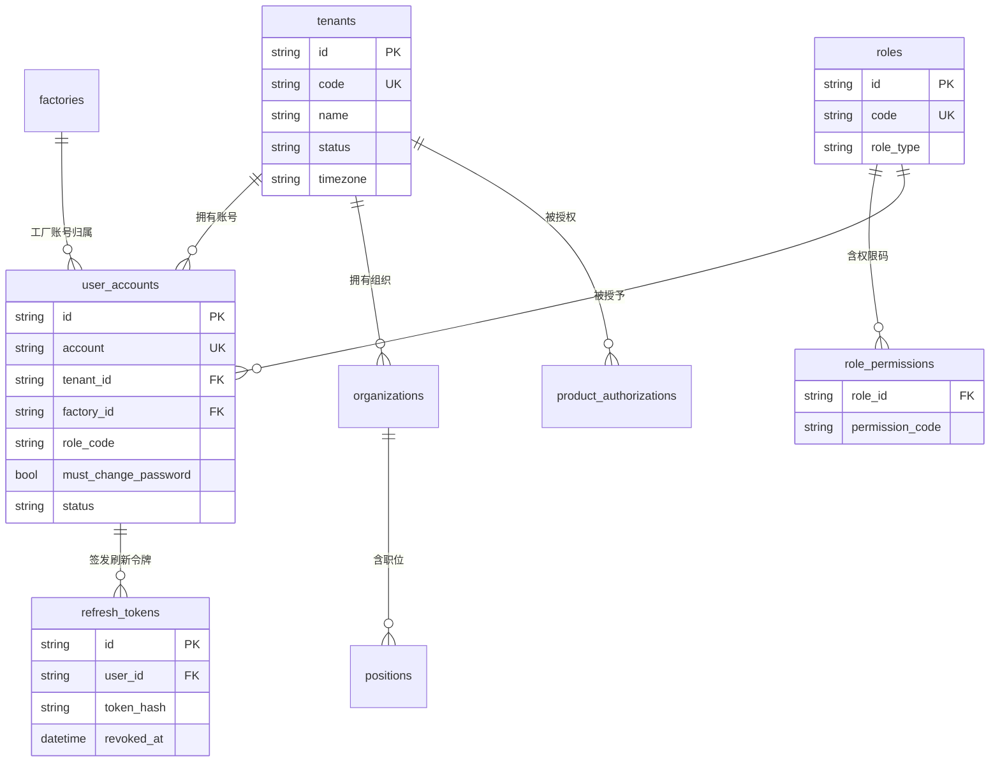
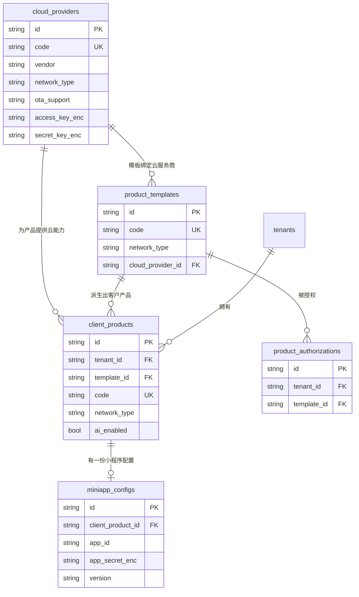
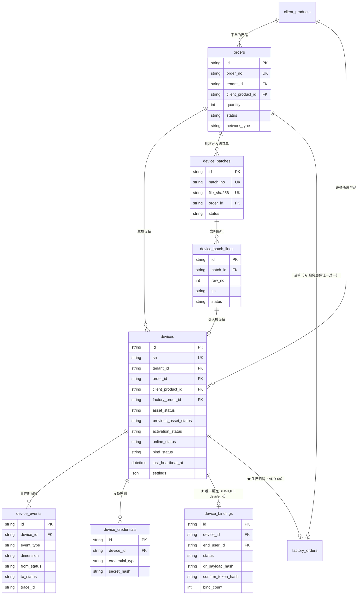
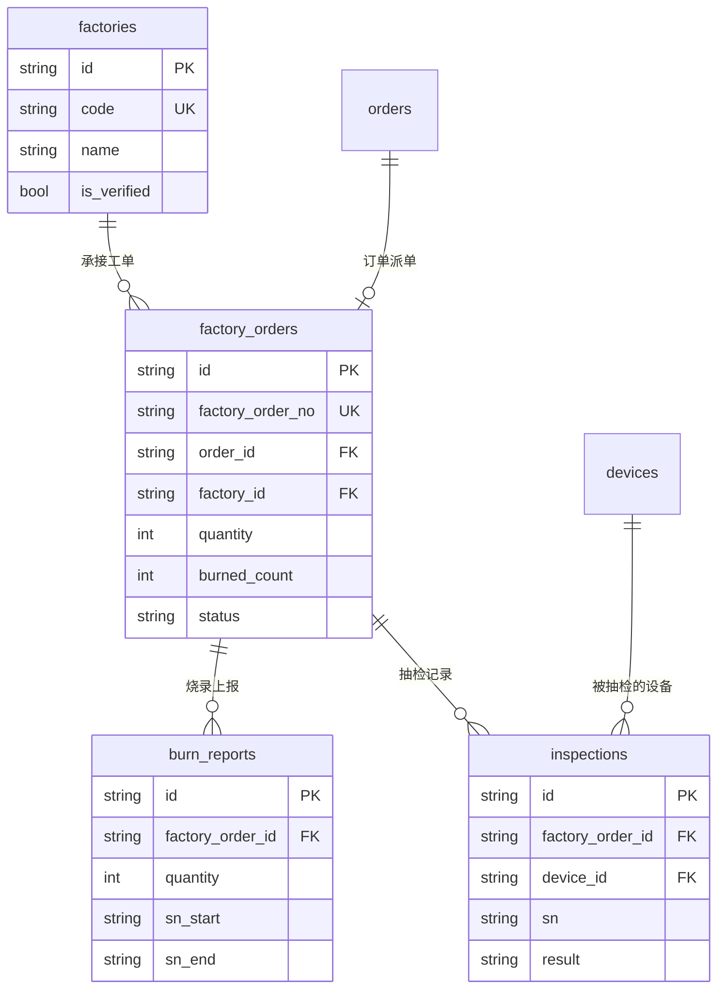
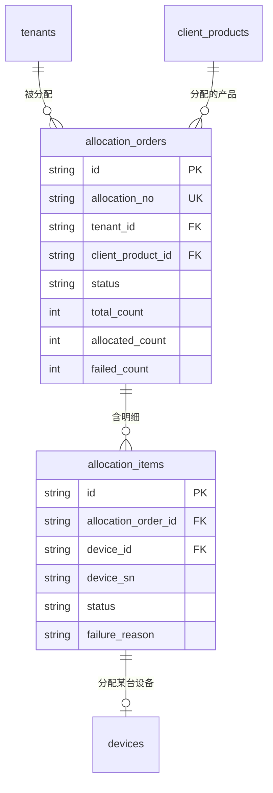
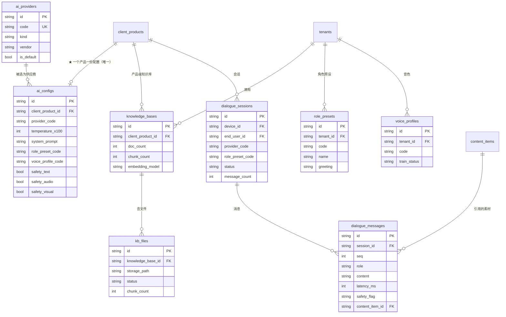
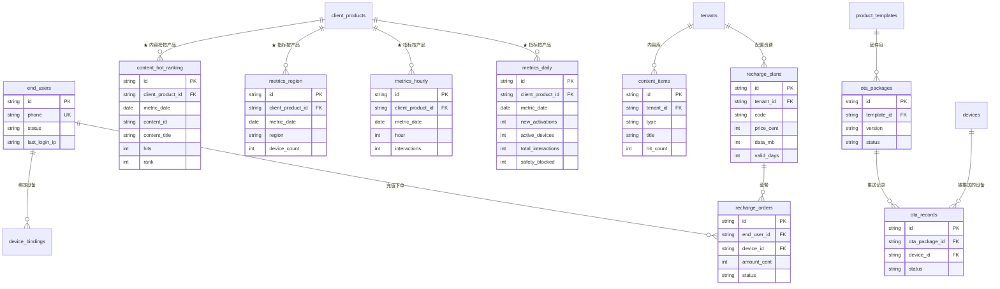
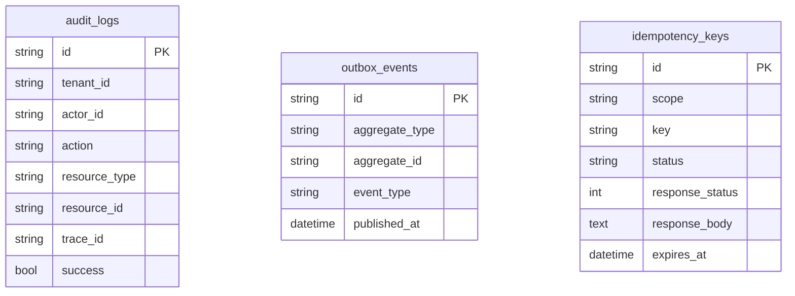

# 数据模型与 ER 图

> **适用对象**：需要写查询、加表、或核对数据语义的开发与 DBA
> **本文定位**：**46 张表的完整说明**——分域 ER 图、关键索引与约束、逐表字段字典、状态枚举、以及一处容易混淆的同名语义对齐
> **配套文档**：[`02-系统流程图.md`](./02-系统流程图.md)（状态机与流转）、[`06-API接口文档.md`](./06-API接口文档.md)（接口入参出参）、[`01-安装部署指南.md`](./01-安装部署指南.md)（迁移与种子）
> **最后更新**：2026-09-17
> **文档中标注说明**：✅ = 已实测或有代码原文可查（★ **本文第 `4.` 节的字段名、类型与约束均由 ORM 元数据（`Base.metadata`）程序化导出**，与 `backend/app/models/*.py` 一致）；⚠️ = 未验证

---

## 0. 结论先行

### 0.1 规模

| 项 | 数值 |
|---|---|
| 表总数 | **46** |
| 字段总数列 | **655** |
| 迁移版本 | **15**（`0001`–`0015`，其中 `0012`/`0013` 为纯 `ALTER`，不建表） |
| 模型文件 | 12 个（`backend/app/models/`） |
| 枚举类 | **35** 个 / **145** 个成员（`enums.py`） |

### 0.2 按业务域找表

| 业务域 | 表数 | 表 |
|---|---|---|
| **身份与租户** | 5 | `tenants`、`roles`、`role_permissions`、`user_accounts`、`refresh_tokens` |
| **组织与工厂档案** | 3 | `organizations`、`positions`、`factories` |
| **目录域** | 5 | `cloud_providers`、`product_templates`、`product_authorizations`、`client_products`、`miniapp_configs` |
| **订单** | 1 | `orders` |
| **设备与批次** | 5 | `device_batches`、`device_batch_lines`、`devices`、`device_credentials`、`device_events` |
| **工厂生产** | 3 | `factory_orders`、`burn_reports`、`inspections` |
| **分配与绑定** | 3 | `allocation_orders`、`allocation_items`、`device_bindings` |
| **AI 与对话** | 8 | `ai_providers`、`role_presets`、`voice_profiles`、`knowledge_bases`、`kb_files`、`ai_configs`、`dialogue_sessions`、`dialogue_messages` |
| **终端用户与充值** | 3 | `end_users`、`recharge_plans`、`recharge_orders` |
| **运营与 OTA** | 7 | `content_items`、`content_hot_ranking`、`metrics_daily`、`metrics_hourly`、`metrics_region`、`ota_packages`、`ota_records` |
| **基础设施** | 3 | `audit_logs`、`outbox_events`、`idempotency_keys` |

> **三个「归属主体」要分清**：`client_products`（客户产品）是**订单、设备、AI 配置、运营指标**的归属主体；
> `tenants` 是**隔离边界**；`factories` 是**跨租户的生产方**。

### 0.3 三个必读小节

| 想搞清楚 | 去哪 |
|---|---|
| 为什么 `in_stock` 在两处含义不同 | `## 6.` `in_stock` 语义对齐 |
| 索引为什么这么建（尤其指标表的唯一键） | `## 3.` 索引设计与关键约束 |
| 某张表每个字段是什么 | `## 4.` 字段字典（按域分组，46 张表） |

---

## 1. 分域 ER 图

> 图只画**关键字段与关系**，避免出现 655 个字段的可读性灾难；完整字段见 `## 4.`。

### 1.1 身份与租户



### 1.2 目录域



### 1.3 订单与设备



### 1.4 工厂生产



### 1.5 分配与绑定



### 1.6 AI 与对话



### 1.7 终端用户与运营



### 1.8 基础设施



---

## 2. 表清单与迁移对照 ✅

| 迁移 | 表 |
|---|---|
| `0001_identity_tenancy` | `tenants`、`roles`、`role_permissions` |
| `0002_org_position_factory` | `organizations`、`positions`、`factories` |
| `0003_user_accounts` | `user_accounts`、`refresh_tokens` |
| `0004_infrastructure` | `audit_logs`、`outbox_events`、`idempotency_keys` |
| `0005_catalog` | `cloud_providers`、`product_templates`、`product_authorizations` |
| `0006_client_product_miniapp` | `client_products`、`miniapp_configs` |
| `0007_ai_dialogue` | `ai_providers`、`role_presets`、`knowledge_bases`、`kb_files`、`voice_profiles`、`ai_configs`、`dialogue_sessions`、`dialogue_messages` |
| `0008_orders` | `orders` |
| `0009_devices_batches` | `device_batches`、`devices`、`device_batch_lines`、`device_credentials`、`device_events` |
| `0010_factory_production` | `factory_orders`、`burn_reports`、`inspections` |
| `0011_allocations_bindings` | `allocation_orders`、`allocation_items`、`device_bindings` |
| `0012_factory_account_link` | （**纯 ALTER**：`user_accounts.factory_id` + 索引 + 外键） |
| `0013_device_factory_order` | （**纯 ALTER**：`devices.factory_order_id` + 索引 + 外键） |
| `0014_miniapp_end_users_recharge` | `end_users`、`recharge_plans`、`recharge_orders` |
| `0015_ops_metrics_ota` | `content_items`、`metrics_daily`、`metrics_hourly`、`metrics_region`、`content_hot_ranking`、`ota_packages`、`ota_records` |

> ⚠️ **`0012`/`0013` 是纯 `ALTER` 迁移**，因此「迁移数 15」与「表数 46」不是一一对应关系。
> 另注：`end_users` / `recharge_*` 三张表**在需求上属 P9**，但 P8 的小程序登录与 4G 充值
> 直接依赖它们，因此先落到 `0014`，P9 顺延为 `0015`。

---

## 3. 索引设计与关键约束 ✅

### 3.1 六条复合唯一键（业务不变量下沉到数据库）

把「业务上只能有一条」的规则交给数据库强制，而不是只靠服务层的「先查后写」：

| 约束名 | 表 | 列 | 保证的业务事实 |
|---|---|---|---|
| `uq_metrics_daily_tenant_product_date` | `metrics_daily` | `tenant_id` + `client_product_id` + `metric_date` | 每个产品每天只有一行日汇总 |
| `uq_metrics_hourly_tenant_product_date_hour` | `metrics_hourly` | `+ hour` | 每产品每天每小时只有一行 |
| `uq_metrics_region_tenant_product_date_region` | `metrics_region` | `+ region` | 每产品每天每地域只有一行 |
| `uq_content_hot_ranking_tenant_product_date_content` | `content_hot_ranking` | `+ content_id` | 每产品每天每条内容只有一个名次 |
| `uq_product_authorizations_tenant_template` | `product_authorizations` | `tenant_id` + `template_id` | 同一租户对同一模板只有一条授权 |
| `uq_ota_packages_template_version` | `ota_packages` | `template_id` + `version` | 同一模板同一版本只有一个固件包 |

★ **四张指标表的唯一键里都有 `client_product_id`**，这不是巧合：
遗留缺陷 `P-08`（运营数据全局共享）的根因正是聚合时丢了产品维度。
把 `client_product_id` 做进唯一键后，**「漏掉产品维度」在表结构上就不成立了**——
漏掉它会导致主键冲突，而不是悄悄地把两个产品的数据合并成一个数。

### 3.2 另外八条重要的唯一约束

| 约束 / 索引 | 表 | 列 | 说明 |
|---|---|---|---|
| `ix_device_bindings_device_id`（`unique=True`） | `device_bindings` | `device_id` | ★ **单绑约束下沉到库层**：一台设备只有一条绑定记录，并发下也不依赖服务层判重 |
| `uq_idempotency_scope_key` | `idempotency_keys` | `scope` + `key` | 幂等键在同一作用域内唯一 |
| `uq_dialogue_messages_session_seq` | `dialogue_messages` | `session_id` + `seq` | 会话内消息序号唯一，流式重放不会产生重复行 |
| `uq_device_credentials_device_type` | `device_credentials` | `device_id` + `credential_type` | 同类型凭证**续签即覆盖**（设备丢失时正是靠这个作废旧钥） |
| `uq_device_batch_lines_batch_row` | `device_batch_lines` | `batch_id` + `row_no` | 同一批次内行号唯一 |
| `uq_allocation_items_order_device` | `allocation_items` | `allocation_order_id` + `device_id` | 同一分配单内一台设备只出现一次 |
| `uq_user_accounts_account` | `user_accounts` | `account` | 账号全局唯一 |
| `ix_device_batches_file_sha256`（`unique=True`） | `device_batches` | `file_sha256` | 同一份 CSV 只能对应一个批次（配合「不同订单则 409」的校验） |

### 3.3 复合索引：按真实查询形态建

索引**不是**给每个外键都建一个，而是按实际查询的**列组合**建：

| 索引 | 列 | 服务于什么查询 |
|---|---|---|
| `idx_devices_tenant_asset` | `tenant_id` + `asset_status` | 商户端按状态筛设备（最高频） |
| `idx_devices_tenant_online` | `tenant_id` + `online_status` | 商户端按在线状态筛选与统计 |
| `idx_device_events_device_created` | `device_id` + `created_at` | 设备时间线（按设备 + 时间倒序） |
| `idx_factory_orders_factory_status` | `factory_id` + `status` | 工厂端工单列表（工厂作用域 + 状态） |
| `idx_inspections_order_sn` | `factory_order_id` + `sn` | 抽检时校验「SN 是否属于本工单」（`ADR-09` 的判据） |
| `idx_audit_logs_tenant_created` | `tenant_id` + `created_at` | 租户维度的审计检索 |
| `idx_audit_logs_action_created` | `action` + `created_at` | 按动作类型检索（如查所有 `VENDOR_CALL_FAILED`） |
| `idx_allocation_orders_tenant_status` | `tenant_id` + `status` | 分配单列表 |
| `idx_device_bindings_tenant_status` | `tenant_id` + `status` | 绑定记录列表 |
| `idx_device_bindings_qr_hash` | `qr_payload_hash` | 二维码载荷的 SHA-256 命中校验 |
| `idx_metrics_daily_product_date` | `client_product_id` + `metric_date` | 趋势查询（按产品 + 日期区间） |
| `idx_ota_records_device_created` | `device_id` + `created_at` | 单台设备的推送历史 |
| `idx_ota_records_package_status` | `ota_package_id` + `status` | 一个固件包的推送进度 |
| `idx_content_hot_ranking_date_rank` | `metric_date` + `rank` | 内容榜按日取 Top N |
| `idx_content_items_tenant_type` | `tenant_id` + `type` | 内容库按类型筛选 |
| `idx_recharge_orders_user_created` | `end_user_id` + `created_at` | 终端用户的充值记录 |
| `idx_recharge_plans_tenant_status` | `tenant_id` + `status` | 商户的可用套餐 |
| `idx_outbox_events_aggregate` | `aggregate_type` + `aggregate_id` | 事件按聚合根检索 |
| `idx_ota_packages_template_status` | `template_id` + `status` | 模板的固件包列表 |

> ⚠️ **迁移里建的每个索引都必须在 ORM 模型上声明**，否则 `alembic check` 会报漂移。
> 这是本项目的一条硬约定（见 [`../CONTRIBUTING.md`](../CONTRIBUTING.md)）。

### 3.4 外键是否真的生效（一个容易误判的点）

**SQLite 默认不强制外键**——不显式打开的话，`FOREIGN KEY` 只是文档，插一条指向不存在记录的引用也不会报错。

本项目**显式开启**了它：`backend/app/db/session.py` 里的 `_enable_sqlite_foreign_keys`
对**每一个连接**执行 `PRAGMA foreign_keys=ON`（代码注释的原话是「否则 FK 形同虚设」）。

> 📌 **为什么要单独说明**：这是一个「默认行为与直觉相反」的坑。
> 如果你把本项目的数据层搬到另一套连接池、或换一个不设该 PRAGMA 的驱动，
> 外键会**静默失效**——不会有任何报错，只是约束不再生效。
> 所以追问一句「**在哪个库上、PRAGMA 开了没**」是有价值的。

### 3.5 未建的约束（已知缺口）

| 缺口 | 后果 | 补齐方式 |
|---|---|---|
| `factory_orders.order_id` **无唯一索引** | 「一单一张工单」目前是**服务层**约束（`dispatch_order` 拒绝二次派单），并发下理论上可派两次 | 补一次迁移加 `UNIQUE(order_id)` |
| `dialogue_sessions.device_id` / `end_user_id` **无外键** | 迁移顺序上这两列先于目标表存在；现在目标表已存在，可补外键 | 补一次轻量迁移 |
| `devices.settings` 用 JSON 而非逐列 | 设置项随型号与固件迭代，逐列开列意味着每加一项就要一次迁移；代价是**约束不再由数据库强制**（键白名单由服务层维护） | 接受该取舍，或对高频键单独提升为列 |

---

## 4. 字段字典

> 本节字段名、类型与约束**由 ORM 元数据程序化导出**（与 `backend/app/models/*.py` 一致），
> 表级语义与关键列注释为人工归纳。`UK` 表示复合唯一约束，见 `## 3.1`。

### 4.1 身份与租户

#### 4.1.1 `tenants`（12 列）

品牌方（租户）。平台账号的 `tenant_id` 为 `NULL`（全局长，`ADR-01`）；`timezone` 已存在但**未参与指标聚合**。

| 字段 | 类型 | 约束 | 说明 |
|---|---|---|---|
| `id` | String | PK · NOT NULL |  |
| `code` | String | NOT NULL · UNIQUE |  |
| `name` | String | NOT NULL |  |
| `status` | String | NOT NULL |  |
| `timezone` | String | NOT NULL | ★ 已存在但未参与指标聚合（快照按 UTC 归档） |
| `contact_name` | String | — |  |
| `contact_phone` | String | — |  |
| `email` | String | — |  |
| `industry` | String | — |  |
| `remark` | Text | — |  |
| `created_at` | DateTime | NOT NULL |  |
| `updated_at` | DateTime | NOT NULL |  |

#### 4.1.2 `roles`（8 列）

角色定义。6 个内置角色由种子写入，`role_type` 区分平台 / 商户 / 工厂三类。

| 字段 | 类型 | 约束 | 说明 |
|---|---|---|---|
| `id` | String | PK · NOT NULL |  |
| `code` | String | NOT NULL · UNIQUE |  |
| `name` | String | NOT NULL |  |
| `role_type` | String | NOT NULL |  |
| `description` | Text | — |  |
| `is_builtin` | Boolean | NOT NULL |  |
| `created_at` | DateTime | NOT NULL |  |
| `updated_at` | DateTime | NOT NULL |  |

#### 4.1.3 `role_permissions`（2 列）

角色 → 权限码的映射（多对多）。**只有 2 列**，因为权限码本身是常量而不是表。

| 字段 | 类型 | 约束 | 说明 |
|---|---|---|---|
| `role_id` | String | PK · NOT NULL · FK → `roles.id` |  |
| `permission` | String | PK · NOT NULL |  |

#### 4.1.4 `user_accounts`（18 列）

后台登录账号（平台 / 商户 / 工厂三种角色共用一张表）。`factory_id` 非空表示这是工厂账号（`ADR-02`）；`must_change_password` 支撑「首次登录强制改密」。

| 字段 | 类型 | 约束 | 说明 |
|---|---|---|---|
| `id` | String | PK · NOT NULL |  |
| `account` | String | NOT NULL |  |
| `password_hash` | String | NOT NULL |  |
| `nickname` | String | — |  |
| `avatar` | String | — |  |
| `role_code` | String | NOT NULL | 6 个内置角色之一 |
| `tenant_id` | String | FK → `tenants.id` |  |
| `factory_id` | String | FK → `factories.id` | 非空 = 工厂账号（`tenant_id` 同时为 NULL） |
| `organization_id` | String | FK → `organizations.id` |  |
| `position_id` | String | FK → `positions.id` |  |
| `status` | String | NOT NULL |  |
| `must_change_password` | Boolean | NOT NULL | 首次登录强制改密 |
| `login_failures` | Integer | NOT NULL |  |
| `locked_until` | DateTime | — |  |
| `last_login_at` | DateTime | — |  |
| `last_login_ip` | String | — |  |
| `created_at` | DateTime | NOT NULL |  |
| `updated_at` | DateTime | NOT NULL |  |

**复合唯一约束**：`uq_user_accounts_account`（`account`）

#### 4.1.5 `refresh_tokens`（10 列）

刷新令牌（存摘要）。`revoked_at` 支撑「重放检测」——已撤销的令牌再次使用会被识别。

| 字段 | 类型 | 约束 | 说明 |
|---|---|---|---|
| `id` | String | PK · NOT NULL |  |
| `user_id` | String | NOT NULL · FK → `user_accounts.id` |  |
| `token_hash` | String | NOT NULL · UNIQUE |  |
| `expires_at` | DateTime | NOT NULL |  |
| `revoked_at` | DateTime | — |  |
| `rotated_to` | String | — |  |
| `user_agent` | String | — |  |
| `client_ip` | String | — |  |
| `created_at` | DateTime | NOT NULL |  |
| `updated_at` | DateTime | NOT NULL |  |

### 4.2 组织与工厂档案

#### 4.2.1 `organizations`（8 列）

组织架构（部门 / 公司）。菜单已开放但**页面未实现**，属预留结构。

| 字段 | 类型 | 约束 | 说明 |
|---|---|---|---|
| `id` | String | PK · NOT NULL |  |
| `name` | String | NOT NULL |  |
| `parent_id` | String | FK → `organizations.id` |  |
| `sort_order` | Integer | NOT NULL |  |
| `tenant_id` | String | NOT NULL · FK → `tenants.id` |  |
| `remark` | Text | — |  |
| `created_at` | DateTime | NOT NULL |  |
| `updated_at` | DateTime | NOT NULL |  |

#### 4.2.2 `positions`（8 列）

职位。同上，页面未实现。

| 字段 | 类型 | 约束 | 说明 |
|---|---|---|---|
| `id` | String | PK · NOT NULL |  |
| `code` | String | NOT NULL |  |
| `name` | String | NOT NULL |  |
| `tenant_id` | String | NOT NULL · FK → `tenants.id` |  |
| `sort_order` | Integer | NOT NULL |  |
| `remark` | Text | — |  |
| `created_at` | DateTime | NOT NULL |  |
| `updated_at` | DateTime | NOT NULL |  |

#### 4.2.3 `factories`（12 列）

烧录工厂档案。`is_verified` 标记已认证工厂（派单下拉里会显示）。**工厂跨租户**，因此工厂账号的 `tenant_id` 为 `NULL`。

| 字段 | 类型 | 约束 | 说明 |
|---|---|---|---|
| `id` | String | PK · NOT NULL |  |
| `code` | String | NOT NULL · UNIQUE |  |
| `name` | String | NOT NULL |  |
| `contact_name` | String | — |  |
| `contact_phone` | String | — |  |
| `address` | String | — |  |
| `status` | String | NOT NULL |  |
| `remark` | Text | — |  |
| `daily_capacity` | Integer | NOT NULL |  |
| `is_verified` | Boolean | NOT NULL |  |
| `created_at` | DateTime | NOT NULL |  |
| `updated_at` | DateTime | NOT NULL |  |

### 4.3 目录域

#### 4.3.1 `cloud_providers`（19 列）

云服务商配置。`access_key_enc` / `secret_key_enc` 是 **Fernet 密文**，明文永不落库也不出响应；只回 `*_hint` 掩码。`ota_support` 是 **OTA 能力的唯一判据**（数据驱动，不写死厂商名）。

| 字段 | 类型 | 约束 | 说明 |
|---|---|---|---|
| `id` | String | PK · NOT NULL |  |
| `code` | String | NOT NULL · UNIQUE |  |
| `name` | String | NOT NULL |  |
| `vendor` | String | NOT NULL |  |
| `network_type` | String | NOT NULL |  |
| `api_base` | String | — |  |
| `access_key_enc` | Text | — | Fernet 密文，明文永不落库也不出响应 |
| `secret_key_enc` | Text | — | 同上；响应只回 `secret_key_hint` |
| `access_key_hint` | String | — |  |
| `secret_key_hint` | String | — |  |
| `extra_config` | JSON | — | 厂商特有配置（JSON） |
| `status` | String | NOT NULL |  |
| `ota_support` | String | NOT NULL | ★ OTA 能力的唯一判据（数据驱动而非写死厂商） |
| `last_tested_at` | DateTime | — |  |
| `last_test_ok` | Boolean | — |  |
| `last_test_message` | String | — |  |
| `remark` | Text | — |  |
| `created_at` | DateTime | NOT NULL |  |
| `updated_at` | DateTime | NOT NULL |  |

#### 4.3.2 `product_templates`（16 列）

产品模板（平台定义的产品规格）。`vendor` 决定走哪家厂商适配器，是 Provider 四层解析的第 2 层。

| 字段 | 类型 | 约束 | 说明 |
|---|---|---|---|
| `id` | String | PK · NOT NULL |  |
| `code` | String | NOT NULL · UNIQUE |  |
| `name` | String | NOT NULL |  |
| `category` | String | — |  |
| `model` | String | — |  |
| `chip` | String | — |  |
| `network_type` | String | NOT NULL |  |
| `cloud_provider_id` | String | FK → `cloud_providers.id` |  |
| `firmware_version` | String | — |  |
| `reference_price` | Numeric | — |  |
| `ai_features` | JSON | — |  |
| `specs` | JSON | — |  |
| `status` | String | NOT NULL |  |
| `description` | Text | — |  |
| `created_at` | DateTime | NOT NULL |  |
| `updated_at` | DateTime | NOT NULL |  |

#### 4.3.3 `product_authorizations`（11 列）

模板 → 租户的授权。租户必须先被授权，才能基于模板创建客户产品。

| 字段 | 类型 | 约束 | 说明 |
|---|---|---|---|
| `id` | String | PK · NOT NULL |  |
| `tenant_id` | String | NOT NULL · FK → `tenants.id` |  |
| `template_id` | String | NOT NULL · FK → `product_templates.id` |  |
| `status` | String | NOT NULL |  |
| `authorized_at` | DateTime | — |  |
| `authorized_by` | String | — |  |
| `expires_at` | DateTime | — |  |
| `max_devices` | Integer | — |  |
| `remark` | Text | — |  |
| `created_at` | DateTime | NOT NULL |  |
| `updated_at` | DateTime | NOT NULL |  |

**复合唯一约束**：`uq_product_authorizations_tenant_template`（`tenant_id` + `template_id`）

#### 4.3.4 `client_products`（13 列）

**客户产品**——订单、设备、AI 配置、运营指标的归属主体。这是整个模型里最重要的业务实体。

| 字段 | 类型 | 约束 | 说明 |
|---|---|---|---|
| `id` | String | PK · NOT NULL |  |
| `tenant_id` | String | NOT NULL · FK → `tenants.id` |  |
| `template_id` | String | NOT NULL · FK → `product_templates.id` |  |
| `code` | String | NOT NULL · UNIQUE |  |
| `name` | String | NOT NULL |  |
| `network_type` | String | NOT NULL | 4G 或 WIFI，决定生成与激活路径 |
| `cloud_provider_id` | String | FK → `cloud_providers.id` |  |
| `firmware_version` | String | — |  |
| `status` | String | NOT NULL |  |
| `ai_enabled` | Boolean | NOT NULL | 是否启用 AI 能力 |
| `remark` | Text | — |  |
| `created_at` | DateTime | NOT NULL |  |
| `updated_at` | DateTime | NOT NULL |  |

#### 4.3.5 `miniapp_configs`（20 列）

小程序配置。`app_secret_enc` 为密文，只回 `app_secret_hint`；`version` 支撑发布版本管理。

| 字段 | 类型 | 约束 | 说明 |
|---|---|---|---|
| `id` | String | PK · NOT NULL |  |
| `client_product_id` | String | NOT NULL · UNIQUE · FK → `client_products.id` |  |
| `tenant_id` | String | NOT NULL · FK → `tenants.id` |  |
| `app_name` | String | NOT NULL |  |
| `app_id` | String | — |  |
| `app_secret_enc` | Text | — | 密文，只回 `app_secret_hint` |
| `app_secret_hint` | String | — |  |
| `original_id` | String | — |  |
| `theme_color` | String | — |  |
| `logo_url` | String | — |  |
| `share_title` | String | — |  |
| `share_desc` | String | — |  |
| `service_phone` | String | — |  |
| `service_qr_url` | String | — |  |
| `version` | String | — |  |
| `status` | String | NOT NULL |  |
| `published_at` | DateTime | — |  |
| `remark` | Text | — |  |
| `created_at` | DateTime | NOT NULL |  |
| `updated_at` | DateTime | NOT NULL |  |

### 4.4 订单

#### 4.4.1 `orders`（21 列）

订单。`status` 走 `ORDER_TRANSITIONS`（9 态）；`network_type` 在**下单时定格**，因为 4G 与 Wi-Fi 的生成方式完全不同。

| 字段 | 类型 | 约束 | 说明 |
|---|---|---|---|
| `id` | String | PK · NOT NULL |  |
| `order_no` | String | NOT NULL · UNIQUE |  |
| `tenant_id` | String | NOT NULL · FK → `tenants.id` |  |
| `client_product_id` | String | NOT NULL · FK → `client_products.id` |  |
| `quantity` | Integer | NOT NULL | 订单台数（工单的 quantity 是实际派工台数，两者可能不同） |
| `unit_price` | Numeric | — |  |
| `total_amount` | Numeric | — |  |
| `status` | String | NOT NULL |  |
| `network_type` | String | NOT NULL | 下单时定格 |
| `applicant_name` | String | — |  |
| `applicant_phone` | String | — |  |
| `remark` | Text | — |  |
| `audited_by` | String | — |  |
| `audited_at` | DateTime | — |  |
| `audit_remark` | String | — |  |
| `reject_reason` | String | — |  |
| `generated_count` | Integer | NOT NULL | 已生成设备数 |
| `generated_at` | DateTime | — |  |
| `generation_detail` | JSON | — |  |
| `created_at` | DateTime | NOT NULL |  |
| `updated_at` | DateTime | NOT NULL |  |

### 4.5 设备与批次

#### 4.5.1 `device_batches`（20 列）

CSV 导入批次。`file_sha256` **唯一**：同一份文件只能对应一个批次（配合「不同订单则 409」的校验，防止设备静默挂到旧订单）。

| 字段 | 类型 | 约束 | 说明 |
|---|---|---|---|
| `id` | String | PK · NOT NULL |  |
| `batch_no` | String | NOT NULL · UNIQUE |  |
| `order_id` | String | FK → `orders.id` |  |
| `tenant_id` | String | FK → `tenants.id` |  |
| `network_type` | String | NOT NULL |  |
| `file_name` | String | — |  |
| `file_sha256` | String | UNIQUE | ★ 唯一；同一文件只能对应一个批次 |
| `total_rows` | Integer | NOT NULL |  |
| `valid_rows` | Integer | NOT NULL |  |
| `invalid_rows` | Integer | NOT NULL |  |
| `duplicated_rows` | Integer | NOT NULL | 只统计**文件内**重复；库内已存在计入无效行 |
| `imported_rows` | Integer | NOT NULL |  |
| `status` | String | NOT NULL |  |
| `error_report` | JSON | — |  |
| `created_by` | String | — |  |
| `started_at` | DateTime | — |  |
| `finished_at` | DateTime | — |  |
| `remark` | Text | — |  |
| `created_at` | DateTime | NOT NULL |  |
| `updated_at` | DateTime | NOT NULL |  |

#### 4.5.2 `device_batch_lines`（13 列）

批次明细行（逐行保留原始数据与校验结果）。`raw` 保存原始行内容，便于错误报告回溯。

| 字段 | 类型 | 约束 | 说明 |
|---|---|---|---|
| `id` | String | PK · NOT NULL |  |
| `batch_id` | String | NOT NULL · FK → `device_batches.id` |  |
| `row_no` | Integer | NOT NULL |  |
| `sn` | String | — |  |
| `imei` | String | — |  |
| `iccid` | String | — |  |
| `mac` | String | — |  |
| `raw` | JSON | — |  |
| `status` | String | NOT NULL |  |
| `error_message` | String | — |  |
| `device_id` | String | FK → `devices.id` |  |
| `created_at` | DateTime | NOT NULL |  |
| `updated_at` | DateTime | NOT NULL |  |

**复合唯一约束**：`uq_device_batch_lines_batch_row`（`batch_id` + `row_no`）

#### 4.5.3 `devices`（32 列）

**设备**——四维状态（`asset_status` / `activation_status` / `online_status` / `bind_status`）为权威（`ADR-03`）；`previous_asset_status` 支撑冻结后**原路恢复**；`factory_order_id` 是「设备↔工单」归属的落库（`ADR-09`）。

| 字段 | 类型 | 约束 | 说明 |
|---|---|---|---|
| `id` | String | PK · NOT NULL |  |
| `tenant_id` | String | FK → `tenants.id` |  |
| `order_id` | String | FK → `orders.id` |  |
| `client_product_id` | String | FK → `client_products.id` |  |
| `batch_id` | String | FK → `device_batches.id` |  |
| `factory_order_id` | String | FK → `factory_orders.id` | ★ 「设备↔工单」归属落库（`ADR-09`） |
| `cloud_provider_id` | String | FK → `cloud_providers.id` |  |
| `sn` | String | NOT NULL · UNIQUE |  |
| `imei` | String | — |  |
| `iccid` | String | — |  |
| `mac` | String | — |  |
| `vendor_device_id` | String | — |  |
| `network_type` | String | NOT NULL |  |
| `firmware_version` | String | — |  |
| `region` | String | — | 地域分布的数据源 |
| `asset_status` | String | NOT NULL | ★ 四维之一：物理流转（10 态） |
| `previous_asset_status` | String | — | ★ 冻结时记录，解冻时**原路恢复** |
| `activation_status` | String | NOT NULL | ★ 四维之二。解绑**刻意不改变**它 |
| `online_status` | String | NOT NULL | ★ 四维之三。**结论**按 180 秒窗口从 `last_heartbeat_at` 派生 |
| `bind_status` | String | NOT NULL | ★ 四维之四 |
| `generated_at` | DateTime | — |  |
| `activated_at` | DateTime | — |  |
| `bound_at` | DateTime | — |  |
| `frozen_at` | DateTime | — |  |
| `freeze_reason` | String | — |  |
| `retired_at` | DateTime | — |  |
| `retire_reason` | String | — |  |
| `last_heartbeat_at` | DateTime | — | 在线判定的**单一事实来源** |
| `settings` | JSON | — | JSON；键白名单由服务层维护，数据库不强制 |
| `remark` | Text | — |  |
| `created_at` | DateTime | NOT NULL |  |
| `updated_at` | DateTime | NOT NULL |  |

#### 4.5.4 `device_credentials`（12 列）

设备凭证（存摘要，明文只回一次）。`uq_device_credentials_device_type` 保证**同类型续签即覆盖**——设备丢失时正是靠这个作废旧钥。

| 字段 | 类型 | 约束 | 说明 |
|---|---|---|---|
| `id` | String | PK · NOT NULL |  |
| `device_id` | String | NOT NULL · FK → `devices.id` |  |
| `credential_type` | String | NOT NULL |  |
| `secret_hash` | String | NOT NULL | 只存摘要，明文仅回一次 |
| `secret_hint` | String | — |  |
| `algorithm` | String | NOT NULL |  |
| `issued_at` | DateTime | — |  |
| `expires_at` | DateTime | — |  |
| `last_used_at` | DateTime | — |  |
| `revoked_at` | DateTime | — |  |
| `created_at` | DateTime | NOT NULL |  |
| `updated_at` | DateTime | NOT NULL |  |

**复合唯一约束**：`uq_device_credentials_device_type`（`device_id` + `credential_type`）

#### 4.5.5 `device_events`（15 列）

设备事件时间线。记 `dimension`（哪个维度变了）、前后状态、操作者与 `trace_id`，是设备「四维变更史」的唯一来源。

| 字段 | 类型 | 约束 | 说明 |
|---|---|---|---|
| `id` | String | PK · NOT NULL |  |
| `device_id` | String | NOT NULL · FK → `devices.id` |  |
| `tenant_id` | String | — |  |
| `event_type` | String | NOT NULL |  |
| `dimension` | String | — | 哪个维度发生了变化（18 个键） |
| `from_status` | String | — |  |
| `to_status` | String | — |  |
| `actor_id` | String | — |  |
| `actor_account` | String | — |  |
| `summary` | String | — |  |
| `detail` | JSON | — |  |
| `trace_id` | String | — | 可回连到那次请求的日志 |
| `client_ip` | String | — |  |
| `created_at` | DateTime | NOT NULL |  |
| `updated_at` | DateTime | NOT NULL |  |

### 4.6 工厂生产

#### 4.6.1 `factory_orders`（15 列）

工单。`quantity` 取**实际派工台数**（合同数量另经接口下发 `orderQuantity`）——取合同数量会让「烧录台数」与「实际出货设备数」永久对不上账。⚠️ `order_id` **无唯一索引**，「一单一张工单」是服务层约束。

| 字段 | 类型 | 约束 | 说明 |
|---|---|---|---|
| `id` | String | PK · NOT NULL |  |
| `factory_order_no` | String | NOT NULL · UNIQUE |  |
| `order_id` | String | NOT NULL · FK → `orders.id` | ⚠️ 无唯一索引，「一单一张工单」是服务层约束 |
| `factory_id` | String | NOT NULL · FK → `factories.id` |  |
| `product_model` | String | — |  |
| `firmware_version` | String | — |  |
| `quantity` | Integer | NOT NULL | ★ 实际派工台数，不是合同数量 |
| `burned_count` | Integer | NOT NULL | 累计烧录台数（分批累加） |
| `status` | String | NOT NULL |  |
| `assigned_at` | DateTime | — |  |
| `due_at` | DateTime | — |  |
| `shipped_at` | DateTime | — |  |
| `remark` | Text | — |  |
| `created_at` | DateTime | NOT NULL |  |
| `updated_at` | DateTime | NOT NULL |  |

#### 4.6.2 `burn_reports`（10 列）

烧录上报记录（分批累加）。超量上报会被拒（`BURN_COUNT_EXCEEDED` 且带 `remaining`）。

| 字段 | 类型 | 约束 | 说明 |
|---|---|---|---|
| `id` | String | PK · NOT NULL |  |
| `factory_order_id` | String | NOT NULL · FK → `factory_orders.id` |  |
| `burned_count` | Integer | NOT NULL |  |
| `sn_from` | String | — |  |
| `sn_to` | String | — |  |
| `operator` | String | — |  |
| `note` | Text | — |  |
| `reported_at` | DateTime | — |  |
| `created_at` | DateTime | NOT NULL |  |
| `updated_at` | DateTime | NOT NULL |  |

#### 4.6.3 `inspections`（11 列）

抽检记录。**刻意不改任何设备状态**——「不合格」的真实含义是「需要人决定返工或降级」，自动打回只会把质量问题淹没成一次普通状态变化。

| 字段 | 类型 | 约束 | 说明 |
|---|---|---|---|
| `id` | String | PK · NOT NULL |  |
| `factory_order_id` | String | NOT NULL · FK → `factory_orders.id` |  |
| `device_id` | String | FK → `devices.id` |  |
| `sn` | String | NOT NULL |  |
| `result` | String | NOT NULL | PASS / FAIL；**不触发设备状态变更** |
| `inspector` | String | — |  |
| `defect_code` | String | — |  |
| `note` | Text | — |  |
| `inspected_at` | DateTime | — |  |
| `created_at` | DateTime | NOT NULL |  |
| `updated_at` | DateTime | NOT NULL |  |

### 4.7 分配与绑定

#### 4.7.1 `allocation_orders`（15 列）

分配单。逐行校验、**部分失败不回滚**（成功的行必须保留，否则重跑会重复分配）；`FAILED → EXECUTING` 可重跑，`COMPLETED` 重放是幂等回放。

| 字段 | 类型 | 约束 | 说明 |
|---|---|---|---|
| `id` | String | PK · NOT NULL |  |
| `allocation_no` | String | NOT NULL · UNIQUE |  |
| `tenant_id` | String | NOT NULL · FK → `tenants.id` |  |
| `client_product_id` | String | NOT NULL · FK → `client_products.id` |  |
| `status` | String | NOT NULL |  |
| `total_count` | Integer | NOT NULL |  |
| `allocated_count` | Integer | NOT NULL |  |
| `failed_count` | Integer | NOT NULL |  |
| `created_by` | String | — |  |
| `executed_by` | String | — |  |
| `executed_at` | DateTime | — |  |
| `failure_reason` | String | — |  |
| `remark` | Text | — |  |
| `created_at` | DateTime | NOT NULL |  |
| `updated_at` | DateTime | NOT NULL |  |

#### 4.7.2 `allocation_items`（9 列）

分配明细（逐行保留状态与失败原因）。「失败了 3 台」不够——运维要知道是哪 3 台、为什么。

| 字段 | 类型 | 约束 | 说明 |
|---|---|---|---|
| `id` | String | PK · NOT NULL |  |
| `allocation_order_id` | String | NOT NULL · FK → `allocation_orders.id` |  |
| `device_id` | String | NOT NULL · FK → `devices.id` |  |
| `device_sn` | String | — |  |
| `status` | String | NOT NULL |  |
| `error_message` | String | — |  |
| `allocated_at` | DateTime | — |  |
| `created_at` | DateTime | NOT NULL |  |
| `updated_at` | DateTime | NOT NULL |  |

**复合唯一约束**：`uq_allocation_items_order_device`（`allocation_order_id` + `device_id`）

#### 4.7.3 `device_bindings`（20 列）

设备绑定。**不额外建表存放 5 分钟确认令牌**：以 `status=PENDING` + `confirm_token_hash` 落在绑定行上，绑定成功时把摘要置空即「销毁」。`UNIQUE(device_id)` 把**单绑约束下沉到数据库层**。

| 字段 | 类型 | 约束 | 说明 |
|---|---|---|---|
| `id` | String | PK · NOT NULL |  |
| `device_id` | String | NOT NULL · UNIQUE · FK → `devices.id` | ★ UNIQUE：单绑约束下沉到库层 |
| `tenant_id` | String | NOT NULL · FK → `tenants.id` |  |
| `client_product_id` | String | FK → `client_products.id` |  |
| `end_user_id` | String | — |  |
| `status` | String | NOT NULL |  |
| `qr_format` | String | — |  |
| `qr_payload_hash` | String | — | 二维码载荷 SHA-256，用于「防篡改」命中校验 |
| `confirm_token_hash` | String | — | ★ 5 分钟确认令牌；绑定成功置空 = 销毁 |
| `confirm_expires_at` | DateTime | — |  |
| `confirmed_at` | DateTime | — |  |
| `bound_at` | DateTime | — |  |
| `bound_by` | String | — |  |
| `unbound_at` | DateTime | — |  |
| `unbind_reason` | String | — |  |
| `unbound_by` | String | — |  |
| `bind_count` | Integer | NOT NULL | 绑定次数，用于识别反复解绑重绑的异常设备 |
| `remark` | Text | — |  |
| `created_at` | DateTime | NOT NULL |  |
| `updated_at` | DateTime | NOT NULL |  |

### 4.8 AI 与对话

#### 4.8.1 `ai_providers`（20 列）

AI 供应商平台配置行。`kind` 区分设备云侧 / 模型侧 / 本地；`is_default` 是 Provider 四层解析的第 3 层。

| 字段 | 类型 | 约束 | 说明 |
|---|---|---|---|
| `id` | String | PK · NOT NULL |  |
| `code` | String | NOT NULL · UNIQUE |  |
| `name` | String | NOT NULL |  |
| `kind` | String | NOT NULL |  |
| `vendor` | String | — |  |
| `api_base` | String | — |  |
| `api_key_enc` | Text | — |  |
| `secret_key_enc` | Text | — |  |
| `api_key_hint` | String | — |  |
| `secret_key_hint` | String | — |  |
| `config` | JSON | — |  |
| `status` | String | NOT NULL |  |
| `is_default` | Boolean | NOT NULL |  |
| `last_health_at` | DateTime | — |  |
| `last_health_status` | String | — |  |
| `last_health_message` | String | — |  |
| `description` | Text | — |  |
| `remark` | Text | — |  |
| `created_at` | DateTime | NOT NULL |  |
| `updated_at` | DateTime | NOT NULL |  |

#### 4.8.2 `role_presets`（15 列）

对话角色预设（温柔姐姐 / 搞笑哥哥 / 小恐龙 / 知识小博士）。**内置一份在代码里**，因此数据库还没有种子时也能演示角色切换。

| 字段 | 类型 | 约束 | 说明 |
|---|---|---|---|
| `id` | String | PK · NOT NULL |  |
| `tenant_id` | String | FK → `tenants.id` |  |
| `code` | String | NOT NULL |  |
| `name` | String | NOT NULL |  |
| `persona` | Text | — |  |
| `system_prompt` | Text | — |  |
| `greeting` | String | — |  |
| `age_group` | String | — |  |
| `tone` | String | — |  |
| `keywords` | JSON | — |  |
| `is_builtin` | Boolean | NOT NULL |  |
| `status` | String | NOT NULL |  |
| `remark` | Text | — |  |
| `created_at` | DateTime | NOT NULL |  |
| `updated_at` | DateTime | NOT NULL |  |

**复合唯一约束**：`uq_role_presets_tenant_code`（`tenant_id` + `code`）

#### 4.8.3 `voice_profiles`（15 列）

音色档案。`train_status` 反映音色训练状态（`VoiceTrainStatus` 4 态）。

| 字段 | 类型 | 约束 | 说明 |
|---|---|---|---|
| `id` | String | PK · NOT NULL |  |
| `tenant_id` | String | NOT NULL · FK → `tenants.id` |  |
| `client_product_id` | String | FK → `client_products.id` |  |
| `name` | String | NOT NULL |  |
| `provider_code` | String | — |  |
| `external_voice_id` | String | — |  |
| `language` | String | — |  |
| `sample_url` | String | — |  |
| `status` | String | NOT NULL |  |
| `train_status` | String | — |  |
| `train_task_id` | String | — |  |
| `config` | JSON | — |  |
| `remark` | Text | — |  |
| `created_at` | DateTime | NOT NULL |  |
| `updated_at` | DateTime | NOT NULL |  |

#### 4.8.4 `knowledge_bases`（13 列）

知识库。`embedding_model` 字段**保留未用**——当前是关键词级检索，无向量化。`doc_count` / `chunk_count` 是解析结果的汇总。

| 字段 | 类型 | 约束 | 说明 |
|---|---|---|---|
| `id` | String | PK · NOT NULL |  |
| `tenant_id` | String | NOT NULL · FK → `tenants.id` |  |
| `client_product_id` | String | FK → `client_products.id` |  |
| `name` | String | NOT NULL |  |
| `description` | Text | — |  |
| `status` | String | NOT NULL |  |
| `doc_count` | Integer | NOT NULL |  |
| `chunk_count` | Integer | NOT NULL |  |
| `embedding_model` | String | — | ⚠️ 保留未用（当前为关键词级检索） |
| `config` | JSON | — |  |
| `remark` | Text | — |  |
| `created_at` | DateTime | NOT NULL |  |
| `updated_at` | DateTime | NOT NULL |  |

#### 4.8.5 `kb_files`（13 列）

知识库文件。`status` 的 `PENDING` 与 `PARSED` 是**两个独立事实**：上传成功不代表能被检索命中。`error_message` 记录解析失败原因（例：pdf/docx 返回「文本抽取尚未实现」）。

| 字段 | 类型 | 约束 | 说明 |
|---|---|---|---|
| `id` | String | PK · NOT NULL |  |
| `knowledge_base_id` | String | NOT NULL · FK → `knowledge_bases.id` |  |
| `tenant_id` | String | NOT NULL · FK → `tenants.id` |  |
| `filename` | String | NOT NULL |  |
| `content_type` | String | — |  |
| `size_bytes` | Integer | — |  |
| `storage_path` | String | — |  |
| `checksum` | String | — |  |
| `status` | String | NOT NULL | ★ `PENDING` 与 `PARSED` 是两个独立事实 |
| `chunk_count` | Integer | NOT NULL |  |
| `error_message` | String | — | 解析失败原因（pdf/docx 为「文本抽取尚未实现」） |
| `created_at` | DateTime | NOT NULL |  |
| `updated_at` | DateTime | NOT NULL |  |

#### 4.8.6 `ai_configs`（19 列）

**一个客户产品一份 AI 配置**（`ix_ai_configs_client_product_id` 唯一）。`temperature_x100` 库里存**×100 的整数**、出入参换算 0–2 小数（避免浮点比较问题）；三个 `safety_*` 开关是内容安全三开关。

| 字段 | 类型 | 约束 | 说明 |
|---|---|---|---|
| `id` | String | PK · NOT NULL |  |
| `tenant_id` | String | NOT NULL · FK → `tenants.id` |  |
| `client_product_id` | String | NOT NULL · UNIQUE · FK → `client_products.id` |  |
| `provider_code` | String | — |  |
| `role_preset_code` | String | — |  |
| `knowledge_base_id` | String | FK → `knowledge_bases.id` |  |
| `voice_profile_id` | String | FK → `voice_profiles.id` |  |
| `system_prompt` | Text | — |  |
| `greeting` | String | — |  |
| `temperature` | Integer | — |  |
| `max_tokens` | Integer | — |  |
| `safety_enabled` | Boolean | NOT NULL |  |
| `safety_sensitive_words` | Boolean | NOT NULL |  |
| `safety_llm_review` | Boolean | NOT NULL |  |
| `status` | String | NOT NULL |  |
| `extra` | JSON | — |  |
| `remark` | Text | — |  |
| `created_at` | DateTime | NOT NULL |  |
| `updated_at` | DateTime | NOT NULL |  |

#### 4.8.7 `dialogue_sessions`（15 列）

对话会话。`message_count` / `total_latency_ms` 是会话级汇总；⚠️ `device_id` / `end_user_id` **刻意未建外键**（迁移顺序所致）。

| 字段 | 类型 | 约束 | 说明 |
|---|---|---|---|
| `id` | String | PK · NOT NULL |  |
| `tenant_id` | String | NOT NULL · FK → `tenants.id` |  |
| `client_product_id` | String | FK → `client_products.id` |  |
| `device_id` | String | — | ⚠️ 刻意未建外键（迁移顺序所致） |
| `end_user_id` | String | — |  |
| `provider_code` | String | — |  |
| `role_preset_code` | String | — |  |
| `status` | String | NOT NULL |  |
| `message_count` | Integer | NOT NULL |  |
| `total_latency_ms` | Integer | NOT NULL |  |
| `started_at` | DateTime | — |  |
| `ended_at` | DateTime | — |  |
| `close_reason` | String | — |  |
| `created_at` | DateTime | NOT NULL |  |
| `updated_at` | DateTime | NOT NULL |  |

#### 4.8.8 `dialogue_messages`（18 列）

对话消息。`seq` 与会话组成唯一键，流式重放不会产生重复行；`latency_ms` 是逐条延迟；`safety_flag` 记录**命中类型**而不记具体敏感词（敏感词本身是风险源）；`content_item_id` 是内容热度榜的数据源。

| 字段 | 类型 | 约束 | 说明 |
|---|---|---|---|
| `id` | String | PK · NOT NULL |  |
| `session_id` | String | NOT NULL · FK → `dialogue_sessions.id` |  |
| `tenant_id` | String | NOT NULL · FK → `tenants.id` |  |
| `seq` | Integer | NOT NULL | 与会话组成唯一键，流式重放不产生重复行 |
| `role` | String | NOT NULL |  |
| `content_type` | String | NOT NULL |  |
| `content` | Text | NOT NULL |  |
| `audio_url` | String | — |  |
| `latency_ms` | Integer | — |  |
| `provider_code` | String | — |  |
| `provider_message_id` | String | — |  |
| `chunk_count` | Integer | NOT NULL |  |
| `safety_flag` | String | — | 只记命中类型，不记具体敏感词 |
| `safety_detail` | JSON | — |  |
| `content_item_id` | String | FK → `content_items.id` | 内容热度榜的数据源 |
| `raw` | JSON | — |  |
| `created_at` | DateTime | NOT NULL |  |
| `updated_at` | DateTime | NOT NULL |  |

**复合唯一约束**：`uq_dialogue_messages_session_seq`（`session_id` + `seq`）

### 4.9 终端用户与充值

#### 4.9.1 `end_users`（13 列）

终端用户（消费者 / 家长）。**刻意不带 `tenant_id`**：一个家长可能买过两个品牌的玩具，把账号绑到某个租户会立刻产生「同一部手机在不同品牌下是两个账号」。可见范围由**绑定关系**决定。

| 字段 | 类型 | 约束 | 说明 |
|---|---|---|---|
| `id` | String | PK · NOT NULL |  |
| `phone` | String | NOT NULL · UNIQUE | ★ 刻意不带 tenant_id；可见范围由绑定关系决定 |
| `nickname` | String | — |  |
| `avatar` | String | — |  |
| `status` | String | NOT NULL |  |
| `login_code_hash` | String | — |  |
| `login_code_expires_at` | DateTime | — |  |
| `login_code_attempts` | Integer | NOT NULL |  |
| `last_login_at` | DateTime | — |  |
| `last_login_ip` | String | — |  |
| `remark` | Text | — |  |
| `created_at` | DateTime | NOT NULL |  |
| `updated_at` | DateTime | NOT NULL |  |

#### 4.9.2 `recharge_plans`（14 列）

流量套餐（按租户配置）。流量是租户向运营商采购再零售的资费，因此**不存在平台通用套餐**。

| 字段 | 类型 | 约束 | 说明 |
|---|---|---|---|
| `id` | String | PK · NOT NULL |  |
| `tenant_id` | String | NOT NULL · FK → `tenants.id` |  |
| `code` | String | NOT NULL |  |
| `name` | String | NOT NULL |  |
| `description` | String | — |  |
| `data_mb` | Integer | NOT NULL |  |
| `valid_days` | Integer | NOT NULL |  |
| `price` | Numeric | NOT NULL |  |
| `sort_order` | Integer | NOT NULL |  |
| `is_recommended` | Boolean | NOT NULL |  |
| `status` | String | NOT NULL |  |
| `remark` | Text | — |  |
| `created_at` | DateTime | NOT NULL |  |
| `updated_at` | DateTime | NOT NULL |  |

**复合唯一约束**：`uq_recharge_plans_tenant_code`（`tenant_id` + `code`）

#### 4.9.3 `recharge_orders`（17 列）

充值订单，**快照**金额 / 流量 / 有效期——套餐改价不回溯历史订单。

| 字段 | 类型 | 约束 | 说明 |
|---|---|---|---|
| `id` | String | PK · NOT NULL |  |
| `order_no` | String | NOT NULL · UNIQUE |  |
| `end_user_id` | String | NOT NULL · FK → `end_users.id` |  |
| `device_id` | String | NOT NULL · FK → `devices.id` |  |
| `plan_id` | String | NOT NULL · FK → `recharge_plans.id` |  |
| `tenant_id` | String | NOT NULL · FK → `tenants.id` |  |
| `amount` | Numeric | NOT NULL |  |
| `data_mb` | Integer | NOT NULL |  |
| `valid_days` | Integer | NOT NULL |  |
| `plan_name` | String | — |  |
| `status` | String | NOT NULL |  |
| `paid_at` | DateTime | — |  |
| `failed_reason` | String | — |  |
| `refunded_at` | DateTime | — |  |
| `remark` | Text | — |  |
| `created_at` | DateTime | NOT NULL |  |
| `updated_at` | DateTime | NOT NULL |  |

### 4.10 运营与 OTA

#### 4.10.1 `content_items`（17 列）

内容库（儿歌 / 故事）。`hit_count` 是累计命中次数。⚠️ 当前**只读**：只有列表端点，写能力与内容审核流程未实现。

| 字段 | 类型 | 约束 | 说明 |
|---|---|---|---|
| `id` | String | PK · NOT NULL |  |
| `tenant_id` | String | FK → `tenants.id` |  |
| `type` | String | NOT NULL |  |
| `title` | String | NOT NULL |  |
| `description` | String | — |  |
| `age_group` | String | — |  |
| `tags` | JSON | — |  |
| `audio_url` | String | — |  |
| `cover_url` | String | — |  |
| `duration_seconds` | Integer | — |  |
| `body` | Text | — |  |
| `status` | String | NOT NULL |  |
| `sort_order` | Integer | NOT NULL |  |
| `hit_count` | Integer | NOT NULL |  |
| `remark` | Text | — |  |
| `created_at` | DateTime | NOT NULL |  |
| `updated_at` | DateTime | NOT NULL |  |

#### 4.10.2 `content_hot_ranking`（11 列）

内容热度榜快照。存**标题快照**：内容下架或改名后，历史排行仍显示当时的名字，复盘不会看到空标题。

| 字段 | 类型 | 约束 | 说明 |
|---|---|---|---|
| `id` | String | PK · NOT NULL |  |
| `tenant_id` | String | NOT NULL · FK → `tenants.id` |  |
| `client_product_id` | String | NOT NULL · FK → `client_products.id` |  |
| `metric_date` | Date | NOT NULL |  |
| `content_id` | String | FK → `content_items.id` |  |
| `content_title` | String | NOT NULL | ★ 标题快照：改名/下架后历史排行仍可读 |
| `content_type` | String | NOT NULL |  |
| `hits` | Integer | NOT NULL |  |
| `rank` | Integer | NOT NULL |  |
| `created_at` | DateTime | NOT NULL |  |
| `updated_at` | DateTime | NOT NULL |  |

**复合唯一约束**：`uq_content_hot_ranking_tenant_product_date_content`（`tenant_id` + `client_product_id` + `metric_date` + `content_id`）

#### 4.10.3 `metrics_daily`（15 列）

日汇总快照。`source: snapshot` 的那几条曲线读它；`avg_latency_ms` 由 `total_latency_ms` 与交互数算出。

| 字段 | 类型 | 约束 | 说明 |
|---|---|---|---|
| `id` | String | PK · NOT NULL |  |
| `tenant_id` | String | NOT NULL · FK → `tenants.id` |  |
| `client_product_id` | String | NOT NULL · FK → `client_products.id` |  |
| `metric_date` | Date | NOT NULL |  |
| `new_activations` | Integer | NOT NULL |  |
| `active_devices` | Integer | NOT NULL |  |
| `total_interactions` | Integer | NOT NULL |  |
| `assistant_messages` | Integer | NOT NULL |  |
| `session_count` | Integer | NOT NULL |  |
| `unique_end_users` | Integer | NOT NULL |  |
| `safety_blocked` | Integer | NOT NULL |  |
| `total_latency_ms` | Integer | NOT NULL |  |
| `avg_latency_ms` | Integer | NOT NULL |  |
| `created_at` | DateTime | NOT NULL |  |
| `updated_at` | DateTime | NOT NULL |  |

**复合唯一约束**：`uq_metrics_daily_tenant_product_date`（`tenant_id` + `client_product_id` + `metric_date`）

#### 4.10.4 `metrics_hourly`（9 列）

24 小时分布快照。★ 这张表曾被一个真缺陷影响：聚合用了 `select(func.count())` 基座再叠加行级列，生成无 `GROUP BY` 的 SQL，SQLite 只返回一行，于是 24 小时分布被算成「某个小时 1 次」。

| 字段 | 类型 | 约束 | 说明 |
|---|---|---|---|
| `id` | String | PK · NOT NULL |  |
| `tenant_id` | String | NOT NULL · FK → `tenants.id` |  |
| `client_product_id` | String | NOT NULL · FK → `client_products.id` |  |
| `metric_date` | Date | NOT NULL |  |
| `hour` | Integer | NOT NULL |  |
| `interactions` | Integer | NOT NULL |  |
| `active_devices` | Integer | NOT NULL |  |
| `created_at` | DateTime | NOT NULL |  |
| `updated_at` | DateTime | NOT NULL |  |

**复合唯一约束**：`uq_metrics_hourly_tenant_product_date_hour`（`tenant_id` + `client_product_id` + `metric_date` + `hour`）

#### 4.10.5 `metrics_region`（9 列）

地域分布快照。数据源是 `devices.region`。

| 字段 | 类型 | 约束 | 说明 |
|---|---|---|---|
| `id` | String | PK · NOT NULL |  |
| `tenant_id` | String | NOT NULL · FK → `tenants.id` |  |
| `client_product_id` | String | NOT NULL · FK → `client_products.id` |  |
| `metric_date` | Date | NOT NULL |  |
| `region` | String | NOT NULL |  |
| `device_count` | Integer | NOT NULL |  |
| `interactions` | Integer | NOT NULL |  |
| `created_at` | DateTime | NOT NULL |  |
| `updated_at` | DateTime | NOT NULL |  |

**复合唯一约束**：`uq_metrics_region_tenant_product_date_region`（`tenant_id` + `client_product_id` + `metric_date` + `region`）

#### 4.10.6 `ota_packages`（17 列）

固件包。★ 演示数据里的固件包**没有上传文件**，因此推送会如实失败（`ADR-07` 的预期表现，不是缺陷）。`uq_ota_packages_template_version` 保证同模板同版本只有一个包。

| 字段 | 类型 | 约束 | 说明 |
|---|---|---|---|
| `id` | String | PK · NOT NULL |  |
| `template_id` | String | NOT NULL · FK → `product_templates.id` |  |
| `tenant_id` | String | FK → `tenants.id` |  |
| `version` | String | NOT NULL |  |
| `release_notes` | Text | — |  |
| `file_name` | String | — |  |
| `file_size` | Integer | — |  |
| `storage_path` | String | — | 演示包里为空 → 推送会如实失败 |
| `checksum` | String | — |  |
| `min_version` | String | — |  |
| `is_forced` | Boolean | NOT NULL |  |
| `status` | String | NOT NULL |  |
| `published_at` | DateTime | — |  |
| `created_by` | String | — |  |
| `remark` | Text | — |  |
| `created_at` | DateTime | NOT NULL |  |
| `updated_at` | DateTime | NOT NULL |  |

**复合唯一约束**：`uq_ota_packages_template_version`（`template_id` + `version`）

#### 4.10.7 `ota_records`（15 列）

OTA 推送记录（逐台）。`PENDING → PUSHING → SUCCESS|PARTIAL_FAILED|FAILED`；**被能力判定拒绝时不留任何记录**——「拒绝」必须是真的没发生。

| 字段 | 类型 | 约束 | 说明 |
|---|---|---|---|
| `id` | String | PK · NOT NULL |  |
| `ota_package_id` | String | NOT NULL · FK → `ota_packages.id` |  |
| `device_id` | String | NOT NULL · FK → `devices.id` |  |
| `tenant_id` | String | NOT NULL · FK → `tenants.id` |  |
| `client_product_id` | String | FK → `client_products.id` |  |
| `status` | String | NOT NULL | PENDING/PUSHING/SUCCESS/PARTIAL_FAILED/FAILED |
| `from_version` | String | — |  |
| `to_version` | String | NOT NULL |  |
| `pushed_at` | DateTime | — |  |
| `finished_at` | DateTime | — |  |
| `error_message` | String | — |  |
| `vendor_message` | String | — |  |
| `remark` | Text | — |  |
| `created_at` | DateTime | NOT NULL |  |
| `updated_at` | DateTime | NOT NULL |  |

### 4.11 基础设施

#### 4.11.1 `audit_logs`（16 列）

审计日志。**29 种 `AuditAction`**；「安全拒绝」类的审计（如 `VENDOR_CALL_FAILED`）**单独提交**，避免业务回滚把证据一起丢掉。

| 字段 | 类型 | 约束 | 说明 |
|---|---|---|---|
| `id` | String | PK · NOT NULL |  |
| `tenant_id` | String | — |  |
| `actor_id` | String | — |  |
| `actor_account` | String | — |  |
| `actor_role` | String | — |  |
| `action` | String | NOT NULL |  |
| `resource_type` | String | — |  |
| `resource_id` | String | — |  |
| `summary` | String | — |  |
| `detail` | JSON | — |  |
| `trace_id` | String | — |  |
| `client_ip` | String | — |  |
| `user_agent` | String | — |  |
| `success` | Boolean | NOT NULL | 失败审计（如 VENDOR_CALL_FAILED）单独提交 |
| `created_at` | DateTime | NOT NULL |  |
| `updated_at` | DateTime | NOT NULL |  |

#### 4.11.2 `outbox_events`（12 列）

事件表。⚠️ **已建但没有投递器**，也没有消费方——属于为将来预留的结构，当前无数据。

| 字段 | 类型 | 约束 | 说明 |
|---|---|---|---|
| `id` | String | PK · NOT NULL |  |
| `event_type` | String | NOT NULL |  |
| `aggregate_type` | String | NOT NULL |  |
| `aggregate_id` | String | NOT NULL |  |
| `tenant_id` | String | — |  |
| `payload` | JSON | — |  |
| `trace_id` | String | — |  |
| `published_at` | DateTime | — | ⚠️ 无投递器，因此该列始终为空 |
| `attempts` | Integer | NOT NULL |  |
| `last_error` | Text | — |  |
| `created_at` | DateTime | NOT NULL |  |
| `updated_at` | DateTime | NOT NULL |  |

#### 4.11.3 `idempotency_keys`（12 列）

幂等键。`scope` + `key` 唯一；`response_body` 缓存的正是「重放返回同一条结果」所需的内容。

| 字段 | 类型 | 约束 | 说明 |
|---|---|---|---|
| `id` | String | PK · NOT NULL |  |
| `key` | String | NOT NULL |  |
| `scope` | String | NOT NULL |  |
| `tenant_id` | String | — |  |
| `user_id` | String | — |  |
| `status` | String | NOT NULL |  |
| `response_status` | Integer | — |  |
| `response_body` | JSON | — | 缓存的响应，用于「重放返回同一条结果」 |
| `request_hash` | String | — |  |
| `expires_at` | DateTime | — |  |
| `created_at` | DateTime | NOT NULL |  |
| `updated_at` | DateTime | NOT NULL |  |

**复合唯一约束**：`uq_idempotency_scope_key`（`scope` + `key`）

> **字段字典完整性自检**：本节覆盖 46 张表 / 655 个字段，
> 可用 `make docs-check` 校验表名与迁移是否一致。

---

## 5. 状态枚举 ✅

### 5.1 订单状态（9 态）

| 状态 | 中文 | 允许迁移到 |
|---|---|---|
| `PENDING_AUDIT` | 待审核 | `APPROVED`、`REJECTED` |
| `APPROVED` | 已审核 | `GENERATING` |
| `REJECTED` | 已驳回 | —（终态） |
| `GENERATING` | 生成中 | `GENERATED`、**`APPROVED`**（厂商失败回退） |
| `GENERATED` | 已生成 | `IN_STOCK` |
| `IN_STOCK` | 已入库 | `PRODUCING` |
| `PRODUCING` | 生产中 | `SHIPPED_TO_CLIENT` |
| `SHIPPED_TO_CLIENT` | 已发货 | `COMPLETED` |
| `COMPLETED` | 已完成 | —（终态） |

### 5.2 设备四维

| 维度 | 字段 | 取值 |
|---|---|---|
| ① 资产状态 | `devices.asset_status` | `PENDING_GEN`、`GENERATED`、`IN_STOCK`、`PRODUCING`、`PRODUCED`、`SHIPPED`、`ALLOCATED`、`BOUND`、`FROZEN`、`RETIRED`（**10 态**） |
| ② 激活状态 | `devices.activation_status` | `NOT_ACTIVATED`、`ACTIVATING`、`ACTIVATED`、`BIND_FAILED`（4 态） |
| ③ 在线状态 | `devices.online_status` | `NEVER_ONLINE`、`ONLINE`、`OFFLINE`（3 态） |
| ④ 绑定状态 | `devices.bind_status` | `UNBOUND`、`BOUND`（2 态） |

**资产状态迁移表**（`ASSET_TRANSITIONS`）：

| 当前 | 可迁移到 |
|---|---|
| `PENDING_GEN` | `GENERATED` |
| `GENERATED` | `IN_STOCK`、`FROZEN` |
| `IN_STOCK` | `PRODUCING`、`ALLOCATED`、`FROZEN`、`RETIRED` |
| `PRODUCING` | `PRODUCED` |
| `PRODUCED` | `SHIPPED` |
| `SHIPPED` | `ALLOCATED` |
| `ALLOCATED` | `BOUND`、`RETIRED`、`FROZEN` |
| `BOUND` | `ALLOCATED`、`RETIRED`、`FROZEN` |
| `FROZEN` | `IN_STOCK`、`ALLOCATED`、`BOUND`（**原路恢复**） |
| `RETIRED` | —（终态） |

**两个集合与迁移表严格对称**（由单元测试钉死，`ADR-10`）：

```
FREEZABLE_ASSET_STATUSES  = {IN_STOCK, ALLOCATED, BOUND}   ← 与 ASSET_TRANSITIONS[FROZEN] 相等
ALLOCATABLE_ASSET_STATUSES = {IN_STOCK, SHIPPED}
```

### 5.3 其它状态枚举

| 枚举 | 取值 |
|---|---|
| `TenantStatus` | `ACTIVE`、`DISABLED` |
| `UserStatus` | `ACTIVE`、`DISABLED` |
| `NetworkType` | `4G`、`WIFI` |
| `CloudProviderStatus` | `CONNECTED`、`NOT_CONNECTED` |
| `OtaSupport` | `SUPPORTED`、`UNSUPPORTED` |
| `CloudVendor` | `JIXIAN`、`JOYINSIDE`、`VOLCANO`、`OTHER` |
| `TestResult` | `SUCCESS`、`FAILED`、`NOT_CONFIGURED` |
| `BatchStatus` | `UPLOADED`、`PRE_CHECKED`、`IMPORTING`、`IMPORTED`、`FAILED` |
| `BatchLineStatus` | `VALID`、`INVALID`、`IMPORTED`、`SKIPPED`、`FAILED` |
| `AllocationStatus` | `DRAFT`、`EXECUTING`、`COMPLETED`、`FAILED` |
| `AllocationItemStatus` | `PENDING`、`ALLOCATED`、`FAILED`、`SKIPPED` |
| `BindingStatus`（设备维度） | `UNBOUND`、`BOUND` |
| `BindingRecordStatus`（记录维度） | `PENDING`、`BOUND`、`UNBOUND` |
| `CredentialType` | `DEVICE_SECRET`、`PRODUCT_SECRET`、`VENDOR_TOKEN` |
| `FactoryOrderStatus` | `PENDING`、`PRODUCING`、`COMPLETED`、`SHIPPED` |
| `InspectionResult` | `PASS`、`FAIL` |
| `AiProviderKind` | `DEVICE_CLOUD`、`MODEL`、`LOCAL` |
| `AiProviderStatus` | `ACTIVE`、`DISABLED` |
| `MessageRole` | `USER`、`ASSISTANT`、`SYSTEM` |
| `MessageContentType` | `TEXT`、`AUDIO` |
| `DialogueSessionStatus` | `ACTIVE`、`CLOSED` |
| `ContentItemType` | `SONG`、`STORY` |
| `ProviderHealth` | `UP`、`DEGRADED`、`DOWN` |
| `VoiceTrainStatus` | `PENDING`、`TRAINING`、`SUCCESS`、`FAILED` |
| `KbFileStatus` | `PENDING`、`PARSING`、`PARSED`、`FAILED` |
| `RechargeOrderStatus` | `PENDING`、`PAID`、`FAILED`、`REFUNDED` |
| `OtaPushStatus` | `PENDING`、`PUSHING`、`SUCCESS`、`PARTIAL_FAILED`、`FAILED` |
| `AuditAction` | **29 种**：`LOGIN`、`LOGIN_FAILED`、`LOGOUT`、`CREATE`、`UPDATE`、`DELETE`、`AUTHORIZE`、`AUDIT_ORDER`、`GENERATE_DEVICES`、`FREEZE_DEVICE`、`THAW_DEVICE`、`RETIRE_DEVICE`、`ALLOCATE_DEVICE`、`BIND_DEVICE`、`UNBIND_DEVICE`、`ACTIVATE_DEVICE`、`SIMULATE_HEARTBEAT`、`DISPATCH_FACTORY_ORDER`、`BURN_REPORT`、`INSPECT`、`SHIP_FACTORY_ORDER`、`STOCK_IN_DEVICE`、`END_USER_LOGIN`、`RECHARGE_ORDER`、`CONTENT_BLOCKED`、`OTA_PUSH`、`REBUILD_METRICS`、`PERMISSION_DENIED`、`VENDOR_CALL_FAILED` |
| `EnableStatus` | `ENABLED`、`DISABLED` |

> **两个容易看错的枚举对**：
> ① `BindingStatus`（设备维度，2 值）与 `BindingRecordStatus`（绑定记录维度，3 值）**刻意分开**——
> 合成一个会造出「设备已绑定、但记录还在等待确认」这种类型上无法自洽的状态。
> ② `OtaSupport`（云服务商的**能力**）与 `OtaPushStatus`（一次推送的**结果**）是两个不同层面的枚举。

---

## 6. `in_stock` 语义对齐

★ 这是本模型里**最容易误读的一处**：`IN_STOCK` 在两张表里同名，但**域不同、含义不同**。

### 6.1 两处 `IN_STOCK` 的准确含义

| 位置 | 枚举 | 准确含义 | 谁来改它 |
|---|---|---|---|
| `orders.status` | `OrderStatus.IN_STOCK` | **订单维度**：设备已入库，订单**可以派单给工厂**了 | 入库动作（`stock-in`） |
| `devices.asset_status` | `AssetStatus.IN_STOCK` | **设备维度**：这台设备在**平台库存**里——已入库、**未分配给任何租户**（`tenant_id` 为空） | 入库、分配、冻结、报废 |

### 6.2 为什么必须说清这一条

**误解的代价**：如果以为「设备的 `IN_STOCK` 是订单状态的镜像」，就会写出这样的查询——
「查所有 `IN_STOCK` 的设备来分配」。但订单生成的设备**建时就带 `tenant_id`**
（它属于某个商户的订单），它们**不是**平台库存。

真正的「可分配设备」判据是**两个条件的交集**：

```
ALLOCATABLE_ASSET_STATUSES = {IN_STOCK, SHIPPED}
  ∧ 设备属于平台（tenant_id 为空 或 已出货给某租户待分配）
```

**这正是种子数据里必须补 4 台「平台自有库存设备」的原因**：
订单生成的设备带 `tenant_id`、批次导入的设备停在 `GENERATED`，
**没有这批数据时分配页的「选择设备」永远是空的**——分配链路在界面上不可达。

### 6.3 与早期实现的差异

| 项 | 早期实现（其数据库 Schema） | 本项目 | 为什么改 |
|---|---|---|---|
| 状态表达 | 单一状态列（9 态标签） | **四维**（`ADR-03`） | 单列无法表达「已分配但未激活」「已激活但已解绑」这类**合法组合** |
| `in_stock` 的归属 | 混在同一个状态机的标签里 | **订单与设备各有一个同名但独立的枚举** | 让「货在谁手里」和「订单走到哪一步」不再耦合 |
| 可冻结范围 | 未明确 | P4 收紧为 `{IN_STOCK}`，**P6 放宽为 `{IN_STOCK, ALLOCATED, BOUND}`** | P4 为求对称收紧，结果「已出货给商户的设备无法停服」；P6 按**业务能力**重新定义（`ADR-10`） |
| 可分配范围 | 未明确 | `{IN_STOCK, SHIPPED}` | 接通 P4 起就存在却无处使用的 `SHIPPED → ALLOCATED` 边 |

### 6.4 一条自检规则

> 看到 `IN_STOCK` 时先问自己：**这是订单的，还是设备的？**
> 订单的 `IN_STOCK` 回答「能不能派单」；设备的 `IN_STOCK` 回答「这批货是不是平台自己的」。

---

## 7. 数据保留与清理

| 数据 | 当前策略 | 说明 |
|---|---|---|
| `audit_logs` | 不清理 | 审计需长期留存；本阶段无归档任务 |
| `outbox_events` | 不清理 | ⚠️ 表已建但**没有投递器**，因此不会有数据 |
| `idempotency_keys` | 带 `expires_at` | 过期键的清理**没有定时任务**，需外部调度 |
| `refresh_tokens` | 带 `revoked_at` | 同上 |
| `dialogue_messages` | 不清理 | 运营指标依赖它做实时聚合，删除会导致指标回溯变化 |
| `metrics_*` / `content_hot_ranking` | 快照，可重建 | `POST /merchant/metrics/rebuild` 可重建；重建是幂等的 |
| `device_credentials` | 续签即覆盖 | `uq_device_credentials_device_type` 保证同类型只有一条 |
| 本地对象存储（知识库 / 固件包） | 不清理 | 删除需走接口，直接删磁盘会留下脏引用 |

> ⚠️ **没有定时任务基础设施**（无 Celery、无调度器），因此所有「过期清理」目前都依赖人工或外部调度。
> 这是已知缺口，不是遗漏。

---

## 附录：已知局限与取证边界

1. ★ **第 `4.` 节的字段名、类型与约束由 `Base.metadata` 程序化导出**（与 ORM 模型一致），
   但**未逐列核对 SQLite 实际 DDL**。
   → 后果：SQLite 的类型亲和性会改变实际存储类型（例如 `String` 与 `Text` 在 SQLite 里几乎等价）。
   → 补齐方式：需要精确 DDL 时执行 `sqlite3 data/toyverse.db .schema`，或换 PostgreSQL 后核对 `information_schema`。
2. **字段的业务语义靠人工归纳**（第 `4.` 节每表前的一段说明），可能与实现的细微行为有差异。
3. **ER 图只画关键字段与关系**，不是完整 ER 图；完整字段以第 `4.` 节为准。
4. **`dialogue_sessions.device_id` / `end_user_id` 无外键**（迁移顺序导致），
   因此这两列上不存在数据库级引用完整性。
5. **`factory_orders.order_id` 无唯一索引**：「一单一张工单」是**服务层**约束，并发下有理论缺口。
6. **`devices.settings` 是 JSON 列**：键白名单由服务层维护，数据库不强制。
7. **`outbox_events` 已建但无投递器**，属于「为将来预留」的结构，当前无数据、无消费方。
8. **无分库分表与读写分离**：46 张表都在单一数据库，指标聚合直接打业务表。
9. **演示库中存在验收痕迹**（终端用户 3 个、绑定与充值记录、设备冻结/解冻记录等）；
   `make reset-db && make seed` 可回到纯净演示态。
10. **迁移 `0013` 不回填历史设备的 `factory_order_id`**：回填只能靠「订单 + 状态」反推，
    而那正是要消除的不可靠来源。旧数据抽检会被拒，需 `make reset-db && make seed`。
