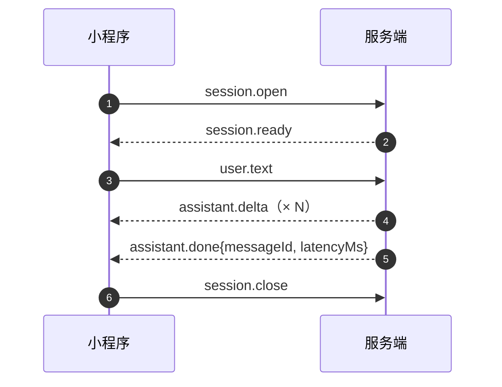
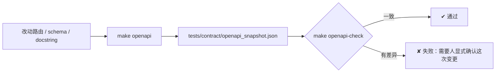

# API 接口文档

> **适用对象**：对接接口的前后端开发、联调与测试人员
> **本文定位**：**145 个端点的完整清单** + 通用约定（认证 / 错误码 / 幂等 / 分页 / 追踪）+ WebSocket 协议 + 示例
> **配套文档**：[`07-多租户与权限设计.md`](./07-多租户与权限设计.md)（54 个权限码详解）、[`05-数据模型与ER图.md`](./05-数据模型与ER图.md)（字段语义）、[`03-系统架构图.md`](./03-系统架构图.md)（分层与调用链）
> **最后更新**：2026-09-17
> **文档中标注说明**：✅ = 已实测或有代码原文可查（★ **第 `3.` 节的方法、路径与摘要在生成时已与 OpenAPI 快照双向核对**）；⚠️ = 未验证

---

## 0. 结论先行

### 0.1 按端总览

| 端 | 端点数 | 认证方式 | 作用域维度 |
|---|---|---|---|
| 平台端 | **67** | `Authorization: Bearer <accessToken>` | 全局（平台账号 `tenantId` 为 `null`） |
| 商户端 | **38** | 同上 | **租户**（强制注入 `tenant_id`） |
| 小程序 / 终端用户端 | **16** | 同上（令牌 `type=end_user`） | **绑定关系**（不是租户） |
| 工厂端 | **9** | 同上（令牌含 `factoryId`） | **工厂**（跨租户） |
| AI 调试台 | **6** | 同上 | — |
| 鉴权与个人信息 | **6** | 部分公开（登录/刷新） | — |
| 设备侧 | **1** | **不用 JWT**：`sn` + 设备密钥 | 设备自身 |
| 健康检查 | **2** | 公开 | — |
| **合计** | **145** | | |

**与契约快照的关系**：

| 项 | 值 | 说明 |
|---|---|---|
| OpenAPI `paths` | **119** | 去重后的路径数（同一路径多个方法只算一条） |
| OpenAPI operations | **145** | = 本表端点数；`get 72` / `post 52` / `put 13` / `delete 8`，**无 `patch`** |
| WebSocket | **1** | `WS /ws/miniapp/chat`，**不在 OpenAPI 内**（见 `## 4.`） |
| 快照文件 | `tests/contract/openapi_snapshot.json` | ★ **在仓库根**，不在 `backend/` |

### 0.2 接口地址的组织

```
http://<host>:8000/api/v1/<端前缀>/<资源>
                        └─ 平台 platform · 商户 merchant · 工厂 factory
                           · 小程序 miniapp · AI ai · 设备 device · 鉴权 auth
                        └─ 健康 health（无端前缀）
```

> ★ **唯一的例外**：WebSocket 的 `WS /ws/miniapp/chat` **不在 `/api/v1` 前缀下**。
> 这不是笔误——小程序端通过 `include_router(ws_router)` 直接挂载。
> 客户端拼 URL 时若统一加 `/api/v1`，WebSocket 会连到一个不存在的路径。
> 这个坑在部署时真实发生过：Nginx 的 WS location 被写成 `/api/v1/ws/`，
> 握手落到了 SPA 回退、返回了一段 HTML。

---

## 1. 通用约定

### 1.1 响应契约

**成功**：直接返回业务对象（或分页对象），字段名为 **camelCase**（FastAPI 以 `by_alias=True` 序列化）。

**失败**：统一为 `{code, message, traceId}`，必要时附加 `details`：

```json
{
  "code": "DEVICE_ALREADY_BOUND",
  "message": "该设备已被绑定",
  "traceId": "ba5264b926dc496ba59912d0be619510",
  "details": { "deviceId": "d-demo-01" }
}
```

| 字段 | 说明 |
|---|---|
| `code` | 稳定错误码，**前端按它做分支**（不要解析 `message`） |
| `message` | 面向人的中文说明，可能随文案调整 |
| `traceId` | 与响应头同值，用于回查日志 |
| `details` | 可选的结构化补充。**关键失败都会带上可操作的信息**（例：`BURN_COUNT_EXCEEDED` 带 `remaining`、`OTA_NOT_SUPPORTED` 带 `{otaSupport, cloudVendor, cloudProviderName}`） |

### 1.2 追踪：`traceId`

每个请求都会生成或沿用 `x-trace-id` 请求头，贯穿日志上下文与响应头，并在错误响应体的 `traceId` 字段回显。

```bash
# 自带 traceId 便于跨系统串联
curl -s -H "x-trace-id: my-debug-001" http://localhost:8000/api/v1/health
```

### 1.3 认证

| 场景 | 方式 |
|---|---|
| 所有管理端与小程序 HTTP 接口 | `Authorization: Bearer <accessToken>` |
| **WebSocket** | **走 query 参数**（`?token=...&deviceId=...`）——浏览器 WebSocket 不能带自定义 header |
| **设备心跳** | **不用 JWT**：请求体带 `sn` + 设备密钥，服务端比对摘要 |

**双令牌**：登录返回 `accessToken`（默认 120 分钟）与 `refreshToken`（默认 7 天）。
`POST /auth/refresh` 轮换刷新令牌，**旧令牌再使用会被识别为重放**（`refresh_tokens.revoked_at`）。

★ **令牌类型双向隔离**：后台令牌的 `type` 是 `access`，终端用户令牌是 `end_user`，
**在解签阶段就互相拒绝**——小程序令牌调管理端接口返回 401，反之亦然。
这比「只靠作用域检查」更可靠：不依赖业务代码记得检查。

### 1.4 幂等

需要防重复副作用的写接口接受 `Idempotency-Key` 请求头：

```bash
curl -X POST http://localhost:8000/api/v1/platform/allocations/{id}/execute \
  -H "Authorization: Bearer $TOKEN" \
  -H "Idempotency-Key: alloc-exec-20260917-001"
```

| 行为 | 结果 |
|---|---|
| 首次请求 | 正常执行，结果与响应状态存入 `idempotency_keys` |
| 相同键重放 | **返回同一条结果**（不产生第二次副作用） |
| 相同键但请求体不同 | `409 IDEMPOTENCY_CONFLICT` |

> ★ **一个易错点**：在绑定流程里，**幂等键检查必须排在「令牌是否有效」校验之前**。
> 否则第二次请求会因为「确认令牌已被首次请求销毁」而被判过期——
> 那就不是「重放返回同一条」了，而是「重放失败」。
> 对应实现见 `binding_service`。

### 1.5 分页

**请求参数**（`PageParams`，默认每页 **20** 条）：

| 参数 | 默认 | 说明 |
|---|---|---|
| `page` | `1` | 页码，从 1 开始 |
| `pageSize` | `20` | 每页条数 |
| `sortBy` | 无 | 排序字段名，**只接受模型上真实存在的字段**（避免 SQL 注入与拼写错误导致的 500） |
| `order` | `desc` | `asc` / `desc` |

**响应结构**（`PageResult`）：

```json
{
  "records": [ ... ],
  "total": 42,
  "page": 1,
  "pageSize": 20,
  "totalPages": 3
}
```

下拉选项等小数据集用不分页的 `ListResult`：`{ "records": [...], "total": 12 }`。

### 1.6 越权与「不存在」的响应刻意一致

| 情况 | 响应 |
|---|---|
| 资源不存在 | `404 RESOURCE_NOT_FOUND` |
| 资源存在但**不属于你**（跨租户、跨工厂） | **也是 `404`** |

> **为什么不用 403**：如果「无权访问」返回 403 而「不存在」返回 404，
> 攻击者就能用错误码差异**探测资源是否存在**（例如枚举设备 ID 判断某个 SN 是否已入库）。
> 因此本项目统一用 404 消除这个信息通道。
> 唯一例外是**权限码不足**（`403 PERMISSION_DENIED`）——那说明身份是有效的，
> 只是角色不该有这个能力，属于配置问题而非信息泄漏。

### 1.7 时间与编号

| 项 | 约定 |
|---|---|
| 时间 | ISO 8601，**UTC**，带 `Z`（例 `2026-09-17T00:33:48.246932Z`） |
| 业务日期 | 指标按 **UTC 日期**归档。⚠️ 与商户本地日期可能差一天，详见 [`05-数据模型与ER图.md`](./05-数据模型与ER图.md) |
| 单号 | 带前缀与日期，例 `AL-20260916-QP5F`（分配单）、`FO-20260916-ECN9`（工单）、`BATCH-20260916-4RBY`（批次） |

---

## 2. 错误码表（31 个）

`code` 与 HTTP 状态的映射定义在 `backend/app/core/errors.py` 的 `_STATUS_MAP`。

### 2.1 认证与授权（7 个）

| code | HTTP | 含义 | 常见触发 |
|---|---|---|---|
| `UNAUTHENTICATED` | 401 | 未认证或令牌无效 | 缺 `Authorization`、令牌过期、令牌类型不匹配 |
| `INVALID_CREDENTIALS` | 401 | 账号或口令错误 | 登录失败 |
| `ACCOUNT_DISABLED` | 403 | 账号已禁用 | 管理员停用该账号 |
| `ACCOUNT_LOCKED` | 403 | 账号被锁定 | 连续失败达 `MAX_LOGIN_FAILURES`（默认 5 次 / 15 分钟） |
| `PASSWORD_CHANGE_REQUIRED` | 403 | 必须先改密 | 首次登录（`FORCE_PASSWORD_CHANGE_ON_FIRST_LOGIN=true`） |
| `PERMISSION_DENIED` | 403 | 权限码不足 | `details.requiredPermission` 给出缺失的权限码 |
| `TENANT_DISABLED` | 403 | 租户已停用 | 被停用的租户下账号登录（**账号本身仍是 ACTIVE**） |

### 2.2 通用（5 个）

| code | HTTP | 含义 | 常见触发 |
|---|---|---|---|
| `VALIDATION_ERROR` | 400 | 参数校验失败 | 缺字段、超长、**空白串**、取值越界 |
| `RESOURCE_NOT_FOUND` | 404 | 资源不存在**或不可见** | 也用于跨租户访问（见 `## 1.6`） |
| `CASCADE_CONFLICT` | 409 | 存在关联数据，不能删除 | `details` 给出各项引用数量（如 `{authorizations:1, clientProducts:0}`） |
| `IDEMPOTENCY_CONFLICT` | 409 | 相同幂等键但请求体不同 | 见 `## 1.4` |
| `INTERNAL_ERROR` | 500 | 服务内部错误 | 未预期的异常；`traceId` 用于回查堆栈 |

### 2.3 目录域（3 个）

| code | HTTP | 含义 |
|---|---|---|
| `TENANT_CODE_EXISTS` | 409 | 租户编码重复 |
| `CLOUD_CODE_EXISTS` | 409 | 云服务商编码重复 |
| `TEMPLATE_CODE_EXISTS` | 409 | 产品模板编码重复 |

> 另有 `PRODUCT_CODE_EXISTS`（见下）——目录域的三个「编码重复」统一用 409，
> 修正了历史上返回 400 的不一致。

### 2.4 订单与设备（10 个）

| code | HTTP | 含义 | 常见触发 |
|---|---|---|---|
| `PRODUCT_CODE_EXISTS` | 409 | 客户产品编码重复 | 创建/更新客户产品 |
| `PRODUCT_NOT_AUTHORIZED` | 409 | 产品未获授权 | 租户用了未授权的模板 |
| `BATCH_FILE_CONFLICT` | 409 | 同一份 CSV 已用于**另一个订单** | `details` 带 `existingBatchNo` / `existingOrderId` / `requestedOrderId` |
| `DEVICE_NOT_AVAILABLE` | 409 | 设备状态不允许该操作 | 例：分配一台不在可分配集合里的设备 |
| `DEVICE_NOT_FOUND` | 404 | 设备不存在 | 按 SN 查不到 |
| `DEVICE_ALREADY_BOUND` | 409 | 设备已被绑定 | ★ **单绑约束优先于令牌校验**，因此无幂等键的重放会得到它 |
| `DEVICE_FROZEN` | 409 | 设备已冻结 | 冻结设备的绑定/流转被拒 |
| `DEVICE_NOT_IN_TENANT` | 403 | 设备不属于当前租户 | 商户操作他人设备 |
| `INVALID_STATE_TRANSITION` | 409 | 状态迁移不被允许 | `details` 带 `current` / `target`；迁移表见 [`02-系统流程图.md`](./02-系统流程图.md) |
| `QR_INVALID` | 404 | 二维码载荷非法或被篡改 | SHA-256 未命中、格式不合法 |
| `QR_EXPIRED` | 409 | 确认令牌不存在或已过期 | 超过 `QR_CONFIRM_TOKEN_TTL_SECONDS`（默认 300 秒） |

### 2.5 工厂生产（2 个）

| code | HTTP | 含义 | 常见触发 |
|---|---|---|---|
| `FACTORY_ORDER_EXISTS` | 409 | 该订单已有工单 | `details.existingFactoryOrderNo` 可直接跳转 |
| `BURN_COUNT_EXCEEDED` | 400 | 烧录上报超量 | `details.remaining` 给出剩余台数 |

### 2.6 绑定与厂商（3 个）

| code | HTTP | 含义 | 常见触发 |
|---|---|---|---|
| `BIND_FAILED` | 409 | 绑定失败（Wi-Fi 报的 SN 与二维码不一致） | `details` 带 `qrSn` / `reportedSn`；设备落 `activation_status=BIND_FAILED` |
| `VENDOR_UNAVAILABLE` | 503 | 厂商未配置密钥或不可用 | ★ `ADR-07`：**绝不伪造成功**。`details.vendor` 给出厂商 |
| `OTA_NOT_SUPPORTED` | 409 | 该联网方案不支持平台侧 OTA | ★ `details` 带 `{otaSupport, cloudVendor, cloudProviderName}`，前端据此说明「换成其它设备也不会成功」 |

---

## 3. 端点清单（145 个）

> 本节的**方法、路径与摘要在生成时已与 `tests/contract/openapi_snapshot.json` 双向核对**
> （源码提取集合 == 快照集合，不一致则拒绝生成），因此不会与实现脱节。
> 权限码列取自路由源码的 `require_perm(...)`；「认证」列取自参数的上下文类型。

### 3.1 平台端 · 基础（租户 / 云服务商 / 模板 / 客户产品）（30）

| 方法 | 路径 | 说明 | 权限码 | 认证 |
|---|---|---|---|---|
| `DELETE` | `/api/v1/platform/authorizations/{authorization_id}` | 撤销授权 | `PlatformPerm.TEMPLATE_WRITE` | 平台账号 |
| `GET` | `/api/v1/platform/client-products` | 客户产品列表 | `PlatformPerm.PRODUCT_READ` | 平台账号 |
| `POST` | `/api/v1/platform/client-products` | 创建客户产品 | `PlatformPerm.PRODUCT_WRITE` | 平台账号 |
| `DELETE` | `/api/v1/platform/client-products/{product_id}` | 删除客户产品 | `PlatformPerm.PRODUCT_WRITE` | 平台账号 |
| `GET` | `/api/v1/platform/client-products/{product_id}` | 客户产品详情 | `PlatformPerm.PRODUCT_READ` | 平台账号 |
| `PUT` | `/api/v1/platform/client-products/{product_id}` | 更新客户产品 | `PlatformPerm.PRODUCT_WRITE` | 平台账号 |
| `GET` | `/api/v1/platform/client-products/{product_id}/miniapp-config` | 查询小程序配置 | `PlatformPerm.PRODUCT_READ` | 平台账号 |
| `PUT` | `/api/v1/platform/client-products/{product_id}/miniapp-config` | 保存小程序配置 | `PlatformPerm.PRODUCT_WRITE` | 平台账号 |
| `GET` | `/api/v1/platform/clouds` | 云服务商列表 | `PlatformPerm.CLOUD_READ` | 平台账号 |
| `POST` | `/api/v1/platform/clouds` | 新增云服务商 | `PlatformPerm.CLOUD_WRITE` | 平台账号 |
| `DELETE` | `/api/v1/platform/clouds/{cloud_id}` | 删除云服务商 | `PlatformPerm.CLOUD_WRITE` | 平台账号 |
| `GET` | `/api/v1/platform/clouds/{cloud_id}` | 云服务商详情 | `PlatformPerm.CLOUD_READ` | 平台账号 |
| `PUT` | `/api/v1/platform/clouds/{cloud_id}` | 更新云服务商 | `PlatformPerm.CLOUD_WRITE` | 平台账号 |
| `POST` | `/api/v1/platform/clouds/{cloud_id}/test` | 云服务商连通性检测 | `PlatformPerm.CLOUD_WRITE` | 平台账号 |
| `GET` | `/api/v1/platform/templates` | 产品模板列表 | `PlatformPerm.TEMPLATE_READ` | 平台账号 |
| `POST` | `/api/v1/platform/templates` | 新增产品模板 | `PlatformPerm.TEMPLATE_WRITE` | 平台账号 |
| `DELETE` | `/api/v1/platform/templates/{template_id}` | 删除产品模板 | `PlatformPerm.TEMPLATE_WRITE` | 平台账号 |
| `GET` | `/api/v1/platform/templates/{template_id}` | 产品模板详情 | `PlatformPerm.TEMPLATE_READ` | 平台账号 |
| `PUT` | `/api/v1/platform/templates/{template_id}` | 更新产品模板 | `PlatformPerm.TEMPLATE_WRITE` | 平台账号 |
| `GET` | `/api/v1/platform/templates/{template_id}/authorizations` | 模板的授权租户列表 | `PlatformPerm.TEMPLATE_READ` | 平台账号 |
| `POST` | `/api/v1/platform/templates/{template_id}/authorize` | 授权模板给租户 | `PlatformPerm.TEMPLATE_WRITE` | 平台账号 |
| `GET` | `/api/v1/platform/tenant-industries` | 租户行业取值 | `PlatformPerm.TENANT_READ` | 平台账号 |
| `GET` | `/api/v1/platform/tenants` | 租户列表 | `PlatformPerm.TENANT_READ` | 平台账号 |
| `POST` | `/api/v1/platform/tenants` | 开通租户 | `PlatformPerm.TENANT_WRITE` | 平台账号 |
| `DELETE` | `/api/v1/platform/tenants/{tenant_id}` | 删除租户 | `PlatformPerm.TENANT_WRITE` | 平台账号 |
| `GET` | `/api/v1/platform/tenants/{tenant_id}` | 租户详情 | `PlatformPerm.TENANT_READ` | 平台账号 |
| `PUT` | `/api/v1/platform/tenants/{tenant_id}` | 更新租户资料 | `PlatformPerm.TENANT_WRITE` | 平台账号 |
| `POST` | `/api/v1/platform/tenants/{tenant_id}/accounts` | 为租户创建登录账号 | `PlatformPerm.TENANT_WRITE` | 平台账号 |
| `POST` | `/api/v1/platform/tenants/{tenant_id}/reset-password` | 重置租户账号密码 | `PlatformPerm.TENANT_WRITE` | 平台账号 |
| `POST` | `/api/v1/platform/tenants/{tenant_id}/status` | 启用 / 禁用租户 | `PlatformPerm.TENANT_WRITE` | 平台账号 |

### 3.2 平台端 · 订单与设备（19）

| 方法 | 路径 | 说明 | 权限码 | 认证 |
|---|---|---|---|---|
| `GET` | `/api/v1/platform/batches` | 批次列表 | `PlatformPerm.BATCH_READ` | 平台账号 |
| `POST` | `/api/v1/platform/batches` | 上传批次 CSV（预检） | `PlatformPerm.BATCH_WRITE` | 平台账号 |
| `GET` | `/api/v1/platform/batches/{batch_id}/error-report` | 下载批次错误报告 | `PlatformPerm.BATCH_READ` | 平台账号 |
| `POST` | `/api/v1/platform/batches/{batch_id}/import` | 导入批次 | `PlatformPerm.BATCH_WRITE` | 平台账号 |
| `GET` | `/api/v1/platform/batches/{batch_id}/lines` | 批次明细 | `PlatformPerm.BATCH_READ` | 平台账号 |
| `GET` | `/api/v1/platform/devices` | 设备列表 | `PlatformPerm.DEVICE_READ` | 平台账号 |
| `GET` | `/api/v1/platform/devices/stats` | 设备统计 | `PlatformPerm.DEVICE_READ` | 平台账号 |
| `GET` | `/api/v1/platform/devices/{device_id}` | 设备详情 | `PlatformPerm.DEVICE_READ` | 平台账号 |
| `POST` | `/api/v1/platform/devices/{device_id}/credentials` | 签发设备密钥 | `PlatformPerm.DEVICE_WRITE` | 平台账号 |
| `GET` | `/api/v1/platform/devices/{device_id}/events` | 设备事件时间线 | `PlatformPerm.DEVICE_READ` | 平台账号 |
| `POST` | `/api/v1/platform/devices/{device_id}/freeze` | 冻结设备 | `PlatformPerm.DEVICE_WRITE` | 平台账号 |
| `POST` | `/api/v1/platform/devices/{device_id}/retire` | 报废设备 | `PlatformPerm.DEVICE_WRITE` | 平台账号 |
| `POST` | `/api/v1/platform/devices/{device_id}/simulate-heartbeat` | 模拟设备心跳 / 掉线 | `PlatformPerm.DEVICE_WRITE` | 平台账号 |
| `POST` | `/api/v1/platform/devices/{device_id}/thaw` | 解冻设备 | `PlatformPerm.DEVICE_WRITE` | 平台账号 |
| `GET` | `/api/v1/platform/orders` | 订单列表 | `PlatformPerm.ORDER_READ` | 平台账号 |
| `GET` | `/api/v1/platform/orders/{order_id}` | 订单详情 | `PlatformPerm.ORDER_READ` | 平台账号 |
| `POST` | `/api/v1/platform/orders/{order_id}/audit` | 审核订单 | `PlatformPerm.ORDER_WRITE` | 平台账号 |
| `POST` | `/api/v1/platform/orders/{order_id}/generate` | 生成设备 | `PlatformPerm.ORDER_WRITE` | 平台账号 |
| `GET` | `/api/v1/platform/orders/{order_id}/qrcodes` | 导出订单二维码 | `PlatformPerm.ORDER_READ` | 平台账号 |

### 3.3 平台端 · 分配（5）

| 方法 | 路径 | 说明 | 权限码 | 认证 |
|---|---|---|---|---|
| `GET` | `/api/v1/platform/allocations` | 分配单列表 | `PlatformPerm.ALLOCATION_READ` | 平台账号 |
| `POST` | `/api/v1/platform/allocations` | 创建分配单 | `PlatformPerm.ALLOCATION_WRITE` | 平台账号 |
| `GET` | `/api/v1/platform/allocations/{allocation_id}` | 分配单详情 | `PlatformPerm.ALLOCATION_READ` | 平台账号 |
| `POST` | `/api/v1/platform/allocations/{allocation_id}/execute` | 执行分配单 | `PlatformPerm.ALLOCATION_WRITE` | 平台账号 |
| `GET` | `/api/v1/platform/allocations/{allocation_id}/items` | 分配明细 | `PlatformPerm.ALLOCATION_READ` | 平台账号 |

### 3.4 平台端 · 工厂生产（5）

| 方法 | 路径 | 说明 | 权限码 | 认证 |
|---|---|---|---|---|
| `POST` | `/api/v1/platform/devices/stock-in` | 批量入库设备 | `PlatformPerm.DEVICE_WRITE` | 平台账号 |
| `GET` | `/api/v1/platform/factories` | 工厂列表 | `PlatformPerm.ORG_READ` | 平台账号 |
| `GET` | `/api/v1/platform/factory-orders` | 生产工单列表 | `PlatformPerm.FACTORY_ORDER_READ` | 平台账号 |
| `GET` | `/api/v1/platform/factory-orders/{factory_order_id}` | 生产工单详情 | `PlatformPerm.FACTORY_ORDER_READ` | 平台账号 |
| `POST` | `/api/v1/platform/orders/{order_id}/dispatch` | 派单给工厂 | `PlatformPerm.FACTORY_ORDER_WRITE` | 平台账号 |

### 3.5 平台端 · OTA 与内容库（8）

| 方法 | 路径 | 说明 | 权限码 | 认证 |
|---|---|---|---|---|
| `GET` | `/api/v1/platform/content-items` | 内容库列表（只读） | `PlatformPerm.TEMPLATE_READ` | 平台账号 |
| `GET` | `/api/v1/platform/ota/packages` | 固件包列表 | `PlatformPerm.OTA_READ` | 平台账号 |
| `POST` | `/api/v1/platform/ota/packages` | 登记固件包 | `PlatformPerm.OTA_WRITE` | 平台账号 |
| `DELETE` | `/api/v1/platform/ota/packages/{package_id}` | 删除固件包 | `PlatformPerm.OTA_WRITE` | 平台账号 |
| `GET` | `/api/v1/platform/ota/packages/{package_id}` | 固件包详情 | `PlatformPerm.OTA_READ` | 平台账号 |
| `PUT` | `/api/v1/platform/ota/packages/{package_id}` | 更新固件包 | `PlatformPerm.OTA_WRITE` | 平台账号 |
| `POST` | `/api/v1/platform/ota/packages/{package_id}/push` | 推送固件包 | `PlatformPerm.OTA_WRITE` | 平台账号 |
| `GET` | `/api/v1/platform/ota/records` | 推送记录列表 | `PlatformPerm.OTA_READ` | 平台账号 |

### 3.6 商户端 · 产品与订单（10）

| 方法 | 路径 | 说明 | 权限码 | 认证 |
|---|---|---|---|---|
| `GET` | `/api/v1/merchant/bindings` | 绑定记录列表 | `MerchantPerm.DEVICE_READ` | 商户账号 |
| `GET` | `/api/v1/merchant/devices` | 我的设备列表 | `MerchantPerm.DEVICE_READ` | 商户账号 |
| `POST` | `/api/v1/merchant/devices/bind/precheck` | 扫码预检 | `MerchantPerm.BINDING_WRITE` | 商户账号 |
| `GET` | `/api/v1/merchant/devices/{device_id}` | 我的设备详情 | `MerchantPerm.DEVICE_READ` | 商户账号 |
| `POST` | `/api/v1/merchant/devices/{device_id}/bind` | 确认绑定 | `MerchantPerm.BINDING_WRITE` | 商户账号 |
| `GET` | `/api/v1/merchant/devices/{device_id}/events` | 我的设备事件时间线 | `MerchantPerm.DEVICE_READ` | 商户账号 |
| `POST` | `/api/v1/merchant/devices/{device_id}/unbind` | 解绑设备 | `MerchantPerm.BINDING_WRITE` | 商户账号 |
| `GET` | `/api/v1/merchant/orders` | 我的订单列表 | `MerchantPerm.ORDER_READ` | 商户账号 |
| `POST` | `/api/v1/merchant/orders` | 下单 | `MerchantPerm.ORDER_WRITE` | 商户账号 |
| `GET` | `/api/v1/merchant/orders/{order_id}` | 我的订单详情 | `MerchantPerm.ORDER_READ` | 商户账号 |

### 3.7 商户端 · AI 配置与运营（28）

| 方法 | 路径 | 说明 | 权限码 | 认证 |
|---|---|---|---|---|
| `GET` | `/api/v1/merchant/ai/providers` | 可用供应商清单 | `MerchantPerm.AI_CONFIG_READ` | 商户账号 |
| `GET` | `/api/v1/merchant/content-items` | 内容库列表（平台公共 + 本租户，只读） | `MerchantPerm.AI_CONFIG_READ` | 商户账号 |
| `GET` | `/api/v1/merchant/knowledge-bases` | 知识库列表 | `MerchantPerm.KB_READ` | 商户账号 |
| `POST` | `/api/v1/merchant/knowledge-bases` | 创建知识库 | `MerchantPerm.KB_WRITE` | 商户账号 |
| `DELETE` | `/api/v1/merchant/knowledge-bases/{kb_id}` | 删除知识库 | `MerchantPerm.KB_WRITE` | 商户账号 |
| `GET` | `/api/v1/merchant/knowledge-bases/{kb_id}` | 知识库详情 | `MerchantPerm.KB_READ` | 商户账号 |
| `PUT` | `/api/v1/merchant/knowledge-bases/{kb_id}` | 更新知识库 | `MerchantPerm.KB_WRITE` | 商户账号 |
| `GET` | `/api/v1/merchant/knowledge-bases/{kb_id}/files` | 知识库文件列表 | `MerchantPerm.KB_READ` | 商户账号 |
| `POST` | `/api/v1/merchant/knowledge-bases/{kb_id}/files` | 上传知识库文件 | `MerchantPerm.KB_WRITE` | 商户账号 |
| `DELETE` | `/api/v1/merchant/knowledge-bases/{kb_id}/files/{file_id}` | 删除知识库文件 | `MerchantPerm.KB_WRITE` | 商户账号 |
| `POST` | `/api/v1/merchant/knowledge-bases/{kb_id}/files/{file_id}/parse` | 解析知识库文件 | `MerchantPerm.KB_WRITE` | 商户账号 |
| `GET` | `/api/v1/merchant/metrics/contents` | 内容热度榜（读快照） | `MerchantPerm.METRICS_READ` | 商户账号 |
| `GET` | `/api/v1/merchant/metrics/hourly` | 24 小时热力（读快照） | `MerchantPerm.METRICS_READ` | 商户账号 |
| `GET` | `/api/v1/merchant/metrics/overview` | 运营概览（实时聚合） | `MerchantPerm.METRICS_READ` | 商户账号 |
| `POST` | `/api/v1/merchant/metrics/rebuild` | 重建运营快照 | `MerchantPerm.METRICS_READ` | 商户账号 |
| `GET` | `/api/v1/merchant/metrics/regions` | 地域分布（读快照） | `MerchantPerm.METRICS_READ` | 商户账号 |
| `GET` | `/api/v1/merchant/metrics/retention` | 留存（实时计算，按设备） | `MerchantPerm.METRICS_READ` | 商户账号 |
| `GET` | `/api/v1/merchant/metrics/trend` | 日趋势（读快照） | `MerchantPerm.METRICS_READ` | 商户账号 |
| `GET` | `/api/v1/merchant/products` | 我的产品列表（P9：每行含设备计数与 AI 摘要） | `MerchantPerm.PRODUCT_READ` | 商户账号 |
| `GET` | `/api/v1/merchant/products/{product_id}` | 我的产品详情（P9：含设备计数与 AI 摘要） | `MerchantPerm.PRODUCT_READ` | 商户账号 |
| `GET` | `/api/v1/merchant/products/{product_id}/ai-config` | 读取 AI 配置 | `MerchantPerm.AI_CONFIG_READ` | 商户账号 |
| `PUT` | `/api/v1/merchant/products/{product_id}/ai-config` | 更新 AI 配置（部分更新） | `MerchantPerm.AI_CONFIG_WRITE` | 商户账号 |
| `PUT` | `/api/v1/merchant/products/{product_id}/ai-config/prompt` | 更新提示词与采样参数 | `MerchantPerm.AI_CONFIG_WRITE` | 商户账号 |
| `PUT` | `/api/v1/merchant/products/{product_id}/ai-config/role` | 更新对话角色 | `MerchantPerm.AI_CONFIG_WRITE` | 商户账号 |
| `PUT` | `/api/v1/merchant/products/{product_id}/ai-config/safety` | 更新内容安全开关 | `MerchantPerm.AI_CONFIG_WRITE` | 商户账号 |
| `PUT` | `/api/v1/merchant/products/{product_id}/ai-config/voice` | 更新音色 | `MerchantPerm.AI_CONFIG_WRITE` | 商户账号 |
| `GET` | `/api/v1/merchant/role-presets` | 角色预设清单（平台内置 + 本租户） | `MerchantPerm.AI_CONFIG_READ` | 商户账号 |
| `GET` | `/api/v1/merchant/voice-profiles` | 音色清单（本租户） | `MerchantPerm.AI_CONFIG_READ` | 商户账号 |

### 3.8 工厂端 · 生产（9）

| 方法 | 路径 | 说明 | 权限码 | 认证 |
|---|---|---|---|---|
| `GET` | `/api/v1/factory/firmwares` | 固件版本列表 | `FactoryPerm.FIRMWARE_READ` | 工厂账号 |
| `GET` | `/api/v1/factory/inspections` | 抽检记录列表 | `FactoryPerm.ORDER_READ` | 工厂账号 |
| `GET` | `/api/v1/factory/orders` | 生产工单列表 | `FactoryPerm.ORDER_READ` | 工厂账号 |
| `GET` | `/api/v1/factory/orders/{factory_order_id}` | 生产工单详情 | `FactoryPerm.ORDER_READ` | 工厂账号 |
| `POST` | `/api/v1/factory/orders/{factory_order_id}/burn` | 烧录上报 | `FactoryPerm.BURN_WRITE` | 工厂账号 |
| `POST` | `/api/v1/factory/orders/{factory_order_id}/inspect` | 抽检上报 | `FactoryPerm.INSPECT_WRITE` | 工厂账号 |
| `GET` | `/api/v1/factory/orders/{factory_order_id}/qrcodes` | 工单二维码清单 | `FactoryPerm.ORDER_READ` | 工厂账号 |
| `POST` | `/api/v1/factory/orders/{factory_order_id}/ship` | 出货登记 | `FactoryPerm.BURN_WRITE` | 工厂账号 |
| `GET` | `/api/v1/factory/stats` | 工厂工作台统计 | `FactoryPerm.DASHBOARD_READ` | 工厂账号 |

### 3.9 小程序 · 终端用户（16）

| 方法 | 路径 | 说明 | 权限码 | 认证 |
|---|---|---|---|---|
| `POST` | `/api/v1/miniapp/auth/code` | 发送登录验证码 | — | — |
| `POST` | `/api/v1/miniapp/auth/login` | 验证码登录 | — | — |
| `POST` | `/api/v1/miniapp/chat/stream` | AI 对话（SSE 降级流） | — | — |
| `GET` | `/api/v1/miniapp/devices` | 我的设备 | — | — |
| `GET` | `/api/v1/miniapp/devices/{device_id}` | 设备详情 | — | — |
| `POST` | `/api/v1/miniapp/devices/{device_id}/activate-4g` | 4G 设备激活 | — | — |
| `POST` | `/api/v1/miniapp/devices/{device_id}/activate-wifi` | Wi-Fi 设备配网激活 | — | — |
| `GET` | `/api/v1/miniapp/devices/{device_id}/settings` | 读取设备设置 | — | — |
| `PUT` | `/api/v1/miniapp/devices/{device_id}/settings` | 更新设备设置 | — | — |
| `POST` | `/api/v1/miniapp/devices/{device_id}/unbind` | 解绑设备 | — | — |
| `GET` | `/api/v1/miniapp/profile` | 个人资料 | — | — |
| `GET` | `/api/v1/miniapp/recharge/orders` | 充值记录 | — | — |
| `POST` | `/api/v1/miniapp/recharge/orders` | 充值下单 | — | — |
| `POST` | `/api/v1/miniapp/recharge/orders/{order_id}/pay` | 支付充值订单 | — | — |
| `GET` | `/api/v1/miniapp/recharge/plans` | 流量套餐列表 | — | — |
| `POST` | `/api/v1/miniapp/scan/resolve` | 扫码解析 | — | — |

### 3.10 AI · 供应商与调试台（6）

| 方法 | 路径 | 说明 | 权限码 | 认证 |
|---|---|---|---|---|
| `POST` | `/api/v1/ai/asr` | 语音识别（ASR） | — | 登录用户（任意后台角色） |
| `POST` | `/api/v1/ai/chat` | AI 对话（默认流式 NDJSON） | — | 登录用户（任意后台角色） |
| `GET` | `/api/v1/ai/mock/scenarios` | 离线模拟引擎素材与规则 | — | 登录用户（任意后台角色） |
| `GET` | `/api/v1/ai/providers` | AI 供应商列表 | `PlatformPerm.CLOUD_READ` | 平台账号 |
| `GET` | `/api/v1/ai/providers/{code}/health` | 供应商健康探测 | `PlatformPerm.CLOUD_READ` | 平台账号 |
| `POST` | `/api/v1/ai/tts` | 语音合成（TTS） | — | 登录用户（任意后台角色） |

### 3.11 鉴权与个人信息（6）

| 方法 | 路径 | 说明 | 权限码 | 认证 |
|---|---|---|---|---|
| `POST` | `/api/v1/auth/login` | 账号密码登录 | — | — |
| `POST` | `/api/v1/auth/logout` | 登出 | — | 登录用户（任意后台角色） |
| `POST` | `/api/v1/auth/refresh` | 刷新访问令牌 | — | — |
| `GET` | `/api/v1/auth/tenants` | 登录页租户下拉 | — | — |
| `GET` | `/api/v1/me` | 当前登录用户 | — | 登录用户（任意后台角色） |
| `POST` | `/api/v1/me/password` | 修改密码 | — | 登录用户（任意后台角色） |

### 3.12 设备侧（无 JWT）（1）

| 方法 | 路径 | 说明 | 权限码 | 认证 |
|---|---|---|---|---|
| `POST` | `/api/v1/device/heartbeat` | 设备心跳上报 | — | — |

### 3.13 健康检查（2）

| 方法 | 路径 | 说明 | 权限码 | 认证 |
|---|---|---|---|---|
| `GET` | `/api/v1/health` | 存活探针 | — | — |
| `GET` | `/api/v1/health/ready` | 就绪探针 | — | — |

**合计 145 个 HTTP 端点。**

### 3.14 WebSocket（1 个，不在 OpenAPI 内）

| 协议 | 路径 | 说明 | 认证 |
|---|---|---|---|
| `WS` | `/ws/miniapp/chat` | 终端用户与玩具对话（帧协议见 `## 4.`） | query 参数 `token` + `deviceId` |

---

## 4. WebSocket 协议

### 4.1 连接

```
ws://<host>:8000/ws/miniapp/chat?token=<endUserToken>&deviceId=<deviceId>
```

★ **令牌与设备 ID 走 query 参数**，因为浏览器 WebSocket API 不能设置自定义请求头。
代价是 URL 可能进日志——因此服务端对非法令牌一律以 `4401` 关闭，不做任何业务处理。

### 4.2 关闭码

| 码 | 含义 | 触发 |
|---|---|---|
| `4401` | 未认证 | 令牌缺失 / 无效 / 类型不是 `end_user` |
| `4403` | 越权 | 令牌有效，但该设备**不属于当前终端用户** |

> ✅ **实测证据**：部署验收时用真实 WS 握手连接经 Nginx 的服务，
> 得到「握手成功建立 → 以 `4401` 关闭」——这恰好证明请求打到了真正的 WS 端点，
> 而不是落到 SPA 回退拿回一段 HTML。

### 4.3 帧协议

全部帧为 JSON 文本（上行与下行对称命名）：



| 方向 | 帧 `type` | 关键字段 | 说明 |
|---|---|---|---|
| ↑ | `session.open` | — | 打开会话 |
| ↓ | `session.ready` | `sessionId` | 会话就绪，含会话 ID |
| ↑ | `user.text` | `text` | 用户文本输入 |
| ↑ | `user.audio` | `audio` | 用户语音输入（⚠️ 前端未实现录音） |
| ↓ | `asr.partial` | `text` | 语音识别中间结果 |
| ↓ | `assistant.delta` | `delta`、`index` | 回复分块，前端逐字渲染 |
| ↓ | `assistant.audio` | `audio` | 回复语音（⚠️ 前端未实现播放） |
| ↓ | `assistant.done` | `messageId`、`latencyMs`、`finishReason` | 回复完成 |
| ↓ | `error` | `code`、`message` | 业务错误（连接保持） |
| ↑ | `session.close` | — | 关闭会话 |

### 4.4 与 SSE 降级、NDJSON 调试通道的对比

| 通道 | 端点 | 用在哪 | 为什么这样选 |
|---|---|---|---|
| **WebSocket** | `WS /ws/miniapp/chat` | 小程序对话主链路 | 双向、低延迟；帧结构与 NDJSON 同构 |
| **SSE** | `POST /miniapp/chat/stream` | 浏览器降级路径 | WebSocket 被代理/防火墙拦截时仍可用 |
| **NDJSON** | `POST /ai/chat` | 调试台与设备侧 | 一行一个 JSON，`JSON.parse` 即可；与 WS 帧同构，解析代码可复用 |

> **调试台为什么用 NDJSON 而不是 SSE**：SSE 只能传文本载荷，
> `type` / `index` / `latencyMs` 这些结构化字段都得塞进 JSON 字符串里再解析一次，反而绕了一圈。
> 代价是不兼容浏览器的 `EventSource`——因此专门保留了 SSE 降级端点。

### 4.5 `POST /ai/chat` 的 NDJSON 事件

`Content-Type: application/x-ndjson`，每行一个 JSON 对象：

```json
{"type":"session","sessionId":"ds-xxx"}
{"type":"delta","delta":"姐姐","index":0}
{"type":"delta","delta":"轻声说：","index":1}
{"type":"done","messageId":"dm-xxx","latencyMs":184,"finishReason":"stop"}
```

| `type` | 含义 |
|---|---|
| `session` | 会话建立（新会话时返回 `sessionId`） |
| `delta` | 文本分块，按 `index` 顺序拼接 |
| `done` | 结束，含 `messageId` / `latencyMs` / `finishReason` |
| `error` | 业务错误 |

`finishReason` 实测取值：`stop`（正常结束）、`safety`（内容安全拦截）。

★ **注意**：**平台账号调用 `/ai/chat` 必须指定 `clientProductId`**。
实测报错原文为「平台账号调用 AI 能力需指定 clientProductId」——
因为供应商解析需要落到某个客户产品的 AI 配置上。

---

## 5. 请求 / 响应示例

> ⚠️ 以下示例为**构造值**（字段名与结构与实现一致，取值是为说明目的编的），
> 不是某次真实调用的逐字节照录。

### 5.1 登录

```http
POST /api/v1/auth/login
Content-Type: application/json

{ "account": "admin", "password": "<你的口令>" }
```

```json
{
  "accessToken": "eyJhbGciOi...",
  "refreshToken": "eyJhbGciOi...",
  "tokenType": "Bearer",
  "expiresIn": 7200,
  "user": {
    "id": "ua-xxx",
    "account": "admin",
    "nickname": "平台管理员",
    "roleCode": "PLATFORM_ADMIN",
    "tenantId": null,
    "permissions": ["*"],
    "mustChangePassword": false
  }
}
```

> `tenantId: null` 表示平台账号（全局长，`ADR-01`）；`permissions: ["*"]` 是通配。

### 5.2 商户下单

```http
POST /api/v1/merchant/orders
Authorization: Bearer <merchantToken>

{ "clientProductId": "prod-t001-cube", "quantity": 5, "remark": "首批试产" }
```

```json
{
  "id": "o-xxx",
  "orderNo": "SO-20260917-A1B2",
  "status": "PENDING_AUDIT",
  "quantity": 5,
  "networkType": "WIFI",
  "clientProductId": "prod-t001-cube",
  "createdAt": "2026-09-17T00:00:00Z"
}
```

### 5.3 平台审核通过

```http
POST /api/v1/platform/orders/{orderId}/audit
Authorization: Bearer <platformToken>

{ "approved": true, "remark": "通过" }
```

驳回时 `approved: false` 且 `rejectReason` 必填（**空白串不算填了**）。

### 5.4 派单给工厂

```http
POST /api/v1/platform/orders/{orderId}/dispatch
Authorization: Bearer <platformToken>

{ "factoryId": "f-demo-01", "dueAt": "2026-10-01T00:00:00Z", "productionNote": "外壳需加固" }
```

```json
{
  "id": "fo-xxx",
  "factoryOrderNo": "FO-20260917-C3D4",
  "quantity": 3,
  "orderQuantity": 5,
  "status": "PENDING",
  "factoryName": "演示工厂"
}
```

> ★ **`quantity` 与 `orderQuantity` 不相等是正常的**：`quantity` 是**实际派工台数**
> （订单 5 台中若有 2 台被冻结或已分配，就只派 3 台），`orderQuantity` 是合同数量。
> 取合同数量会让「烧录台数」与「实际出货设备数」永久对不上账。

### 5.5 烧录上报（超量被拒）

```http
POST /api/v1/factory/orders/{factoryOrderId}/burn
Authorization: Bearer <factoryToken>

{ "quantity": 99, "snStart": "SN-...-0001", "snEnd": "SN-...-0099" }
```

```json
{
  "code": "BURN_COUNT_EXCEEDED",
  "message": "本单还剩 3 台（需求量 3，已烧录 0）",
  "traceId": "ba5264b926dc496ba59912d0be619510",
  "details": { "remaining": 3 }
}
```

### 5.6 扫码预检

```http
POST /api/v1/merchant/devices/bind/precheck
Authorization: Bearer <merchantToken>

{ "payload": "JD|t-001|prod-t001-cube|SN-DEMO-WIFI-001|<sign>" }
```

```json
{
  "deviceId": "d-demo-wifi-01",
  "sn": "SN-DEMO-WIFI-001",
  "clientProductName": "星辰小方块",
  "assetStatus": "ALLOCATED",
  "networkType": "WIFI",
  "confirmToken": "ct-xxx",
  "expiresInSeconds": 300,
  "bindable": true
}
```

不可绑定时返回 `bindable: false` 与 `reason`（例如「尚未分配给本租户」）——**而不是直接报错**，
因为「不可绑定」是一个合法且需要向用户解释的状态。

### 5.7 终端用户激活（4G）

```http
POST /api/v1/miniapp/devices/{deviceId}/activate-4g
Authorization: Bearer <endUserToken>
```

```json
{
  "deviceId": "d-demo-4g-01",
  "activationStatus": "ACTIVATED",
  "assetStatus": "BOUND",
  "vendorResponse": { "ok": true },
  "mock": true
}
```

★ **`mock: true` 是刻意回显的**：它告诉调用方「这次走的是离线模拟通道」，
不让人误以为已经打通了真实厂商链路（`ADR-07`）。

### 5.8 SSE 对话

```http
POST /api/v1/miniapp/chat/stream
Authorization: Bearer <endUserToken>
Accept: text/event-stream

{ "deviceId": "d-demo-4g-01", "text": "给我讲个故事吧" }
```

```
event: session.ready
data: {"sessionId":"ds-xxx"}

event: assistant.delta
data: {"delta":"姐姐轻声说：好呀，我给你讲《小狐狸的月亮灯》。","index":0}

event: assistant.done
data: {"messageId":"dm-xxx","latencyMs":366,"finishReason":"stop"}
```

### 5.9 OTA 推送（Wi-Fi 被拒）

```http
POST /api/v1/platform/ota/packages/{packageId}/push
Authorization: Bearer <platformToken>

{ "deviceIds": ["d-demo-wifi-01"] }
```

```json
{
  "code": "OTA_NOT_SUPPORTED",
  "message": "该设备的云服务商不支持平台侧 OTA 推送",
  "traceId": "ba5264b926dc496ba59912d0be619510",
  "details": {
    "otaSupport": "UNSUPPORTED",
    "cloudVendor": "JOYINSIDE",
    "cloudProviderName": "京东云 JoyInside"
  }
}
```

> ★ `details` 里的三个字段是**数据驱动**的（读 `cloud_providers.ota_support`），
> 前端据此渲染成「这不是设备选择错误，换成其它设备也不会成功」。
> **被拒绝时不会留下任何推送记录**——「拒绝」必须是真的没发生。
> 厂商名也是从数据里读的，因此不会出现「换供应商后文案变误导」的问题。

---

## 6. OpenAPI 契约门禁

### 6.1 三个命令

```bash
make openapi         # 导出契约快照到 tests/contract/openapi_snapshot.json
make openapi-check   # 校验实现与快照一致（有差异则失败，退出码非 0）
make docs-check      # 校验本文档声明的端点与快照一致
```

### 6.2 为什么需要它

前端是按**契约**写的，因此「接口悄悄变了」就是破坏性变更。契约快照把这件事变成红灯：



> ⚠️ **改端点的 `docstring` 或字段描述也会让快照过期**。这类差异不会被类型检查发现，
> 只有 `make openapi-check` 会报出来——所以它是 `make check` 的一部分。

### 6.3 本文档与契约的关系

本文档第 `3.` 节的表格是**从源码 AST 与快照联合生成的**，生成时执行双向断言：

```
断言：源码提取的 (method, path) 集合 == 快照的 (method, path) 集合
      不一致则拒绝生成文档
```

结果：**源码 145 == 快照 145，差集为空**。
因此本文档的端点清单不可能与实现脱节。

### 6.4 在线文档

服务启动后可直接打开交互式文档：

| 入口 | 地址 |
|---|---|
| Swagger UI | <http://localhost:8000/docs> |
| OpenAPI JSON | <http://localhost:8000/api/v1/openapi.json>（以实际配置为准） |

---

## 附录：已知局限与取证边界

1. ★ **第 `5.` 节的示例响应为构造值**，不是某次真实调用的逐字节照录。
   字段名与结构经源码核对，但**取值、单号、ID 都是编的**。
2. **WebSocket 的二进制音频帧未在本文档覆盖**：`user.audio` / `assistant.audio` 的编码细节
   以 `backend/app/realtime/ws_chat.py` 为准，且**前端尚未实现录音与播放**。
3. **NDJSON 的 `error` 事件字段可能与 HTTP 错误体不完全一致**（`## 4.5` 只列了常见取值）。
4. **未列出每个端点的完整请求/响应 schema**：145 个端点的 schema 以
   `tests/contract/openapi_snapshot.json` 与 `/docs` 为准，本文档只列端点与关键示例。
5. **`## 1.7` 的「时间均为 UTC」有一个已知例外**：运营快照按 UTC 日期归档，
   与商户本地日期可能差一天（凌晨 8 点前尤为明显）。这是已登记的遗留问题。
6. **未覆盖 `429`（限流）**：本项目**没有实现限流**，
   因此不存在该状态码——生产部署需在入口层补（见 [`09-系统交付标准.md`](./09-系统交付标准.md) 的安全基线）。
7. **未覆盖错误码的完整 `details` 结构**：只列了最常被前端使用的几个，
   其余以源码为准。
8. **AI 相关端点未与真实厂商联调**：`/ai/*` 与 `/miniapp/chat/*` 的行为
   在演示环境全部来自**离线模拟引擎**（`AI_DEFAULT_PROVIDER=mock`）。
