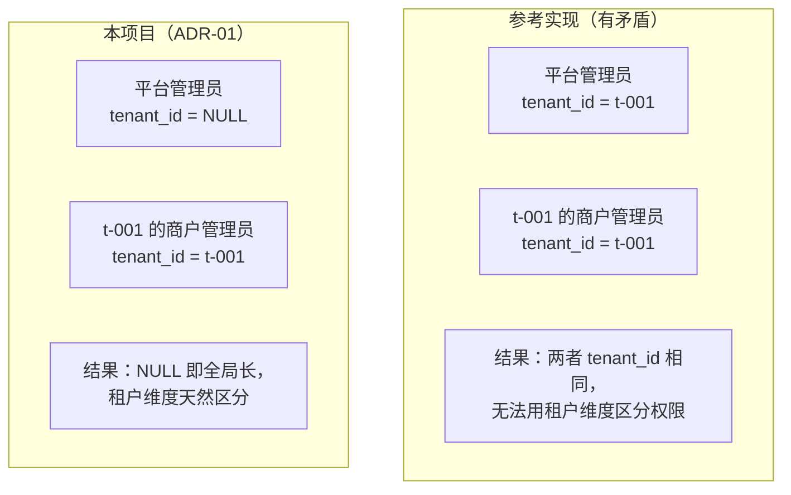
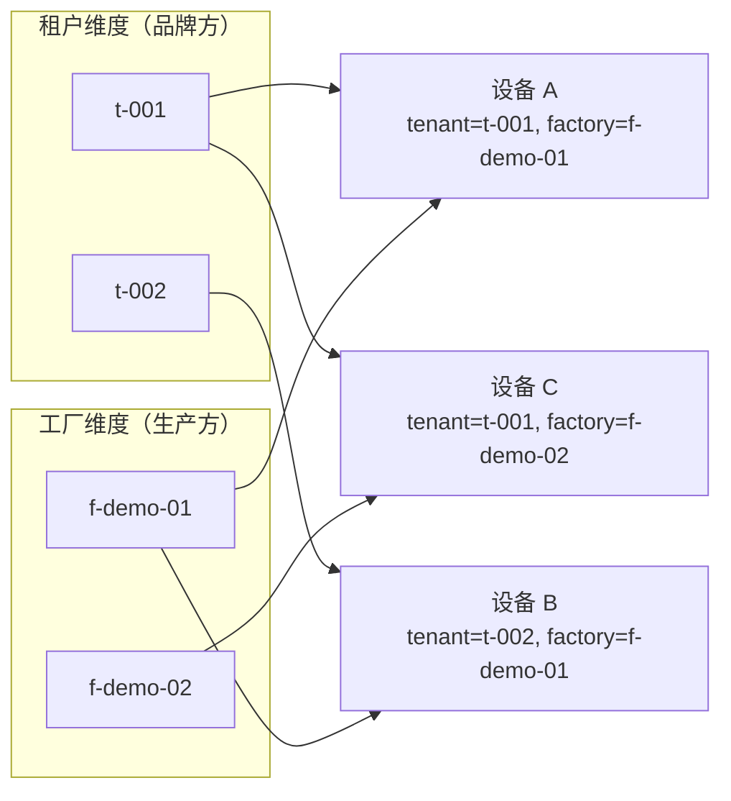
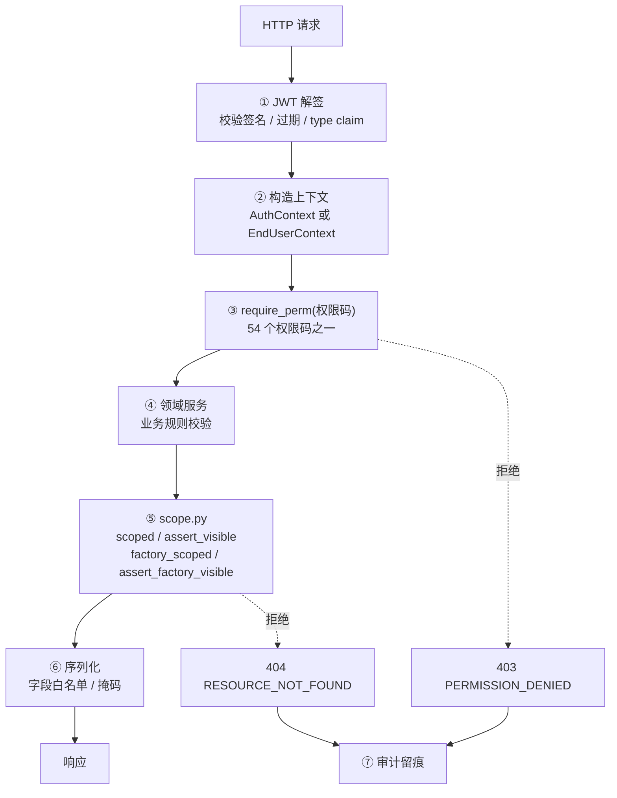
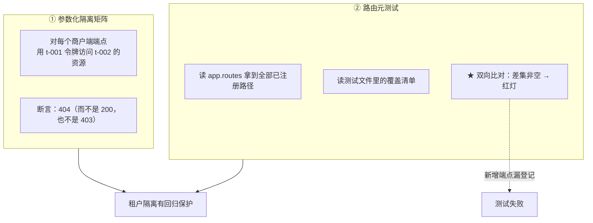
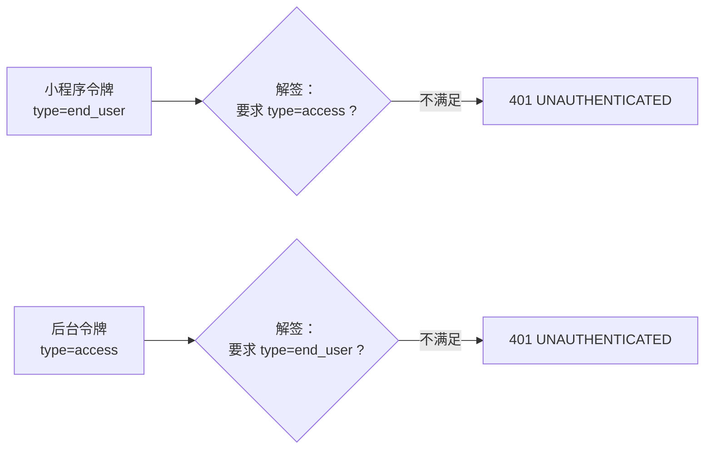
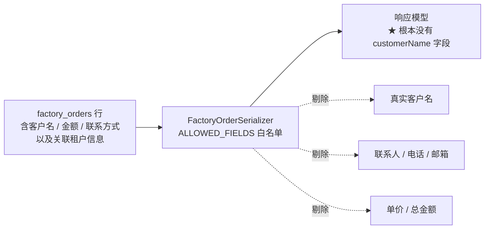

# 多租户与权限设计

> **适用对象**：需要判断「谁能看到什么」的开发、安全与测试人员
> **本文定位**：讲清**隔离是怎么做的、为什么这样做**——租户模型、隔离层级、54 个权限码、越权测试策略、脱敏规则
> **配套文档**：[`06-API接口文档.md`](./06-API接口文档.md)（端点与错误码）、[`05-数据模型与ER图.md`](./05-数据模型与ER图.md)（表结构）、[`../CONTRIBUTING.md`](../CONTRIBUTING.md)（八条架构红线）、[`../SECURITY.md`](../SECURITY.md)（已知安全边界）
> **最后更新**：2026-09-17
> **文档中标注说明**：✅ = 已实测或有代码原文可查；⚠️ = 未实现 / 未验证

---

## 0. 结论先行

### 0.1 一句话

**隔离不是一个函数，而是一条链**——从 JWT 解签 → 上下文类型 → 权限码 → 领域服务 → **作用域收口** → SQL，
每一层拦一类问题；而**最后一道（作用域）是唯一不可绕过的一道**，因为前几道拦的都是
「身份不对」「权限不够」，只有它拦的是「**参数合法、权限合法、但不是你的**」。

### 0.2 三类角色的可见范围

| 角色类型 | 可见范围 | 保护手段 | 失效的后果 |
|---|---|---|---|
| `PLATFORM` | **全部租户** | 鉴权（RBAC 权限码） | 平台运营越权改平台级配置 |
| `MERCHANT` | **仅自身租户** | 租户作用域过滤（`scoped` / `assert_visible`） | A 品牌读到 B 品牌的设备与数据 |
| `FACTORY` | **仅本厂工单**（且仍跨租户） | **工厂作用域过滤 + 字段白名单脱敏** | A 厂看到 B 厂的工单量、产能与客户信息 |

### 0.3 隔离层级速查

| # | 层 | 拦什么 | 实现位置 |
|---|---|---|---|
| ① | JWT 解签 | 令牌伪造；**令牌类型混用** | `app/core/security.py` |
| ② | 上下文类型 | 把终端用户当管理端用户用 | `AuthContext` 与 `EndUserContext` **两个类型** |
| ③ | 权限码 | 有身份但**角色不该有**这个能力 | `require_perm(...)` |
| ④ | 领域服务 | 业务规则（状态、归属、配额） | `app/services/**` |
| ⑤ | **作用域收口** | **有权限但跨租户 / 跨工厂** | `app/db/scope.py` ★ |
| ⑥ | 序列化 | 字段级泄漏（客户名、金额、密钥） | `serializers.py` · `FactoryOrderSerializer` |
| ⑦ | 审计 | 越权尝试留痕 | `audit_logs`（含 `PERMISSION_DENIED`） |

---

## 1. 租户模型

### 1.1 `tenant_id` 的三种取值语义

| 主体 | `tenant_id` | `factory_id` | 含义 |
|---|---|---|---|
| 平台账号（超管 / 运营） | **`NULL`** | `NULL` | **全局长**（`ADR-01`） |
| 商户账号（管理员 / 运营） | 有值 | `NULL` | 归属某个品牌方 |
| 工厂账号（管理员 / 操作员） | **`NULL`** | **有值** | 跨租户的生产方（`ADR-02`） |
| 终端用户 | 无该列 | — | 走 `end_users` 表；可见范围由**绑定关系**决定 |

### 1.2 为什么平台账号必须是 `NULL`

参考实现把平台管理员也挂在 `t-001` 下，于是同一个 `t-001` 既是「平台」又是「某个品牌客户」：



### 1.3 为什么工厂「必须跨租户」

一家烧录工厂**同时给多个品牌方生产**。如果给工厂账号也塞一个 `tenant_id`：

- 要么它只能看到一个租户的工单（业务上不成立）
- 要么它被迫看到全部工单，且**与租户维度混在同一个过滤条件里**（语义崩溃）

因此工厂是**独立的第二维度**，与租户维度**正交**：



> ★ **两个维度不可互替**：商户端按 `tenant_id` 过滤，工厂端按 `factory_id` 过滤。
> 复用同一套过滤代码会在语义上产生「用工厂去筛租户」这类错误。

### 1.4 终端用户：可见范围由**绑定关系**决定

`end_users` 表**刻意不带 `tenant_id`**：

> 一个家长可能买过两个品牌的玩具。把账号绑到某个租户，会立刻产生
> 「同一部手机在不同品牌下是两个账号」——这不是产品想要的。

因此终端用户的可见范围由 `device_bindings` 决定：**你绑定了哪台设备，就只看得到哪台**。
收口点是**绑定**，而不是租户。

---

## 2. 八条架构红线中与本文相关的四条

`CONTRIBUTING.md` 原文照录（本项目约定「不可违反，评审时会被直接驳回」）：

| # | 红线 | 与本文的关系 |
|---|---|---|
| 1 | 不得在路由层手写租户过滤，必须走 repository 层的 `tenant_scope` | ★ 本文核心：`## 4.` |
| 2 | 任何响应不得包含云服务商 `SecretKey` | `## 8.` 密钥保护 |
| 3 | 工厂端接口不得返回真实客户名、金额、联系方式 | `## 9.` 脱敏规则 |
| 5 | 未配置密钥的厂商必须返回 `VENDOR_UNAVAILABLE`，不得伪造成功 | 与权限无关，但同属「安全失败」体系 |

---

## 3. 隔离层级



### 3.1 为什么越权返回 404 而不是 403

| 情况 | 响应 | 理由 |
|---|---|---|
| 权限码不足（角色不该有这个能力） | `403 PERMISSION_DENIED` | 身份有效、能力缺失——这是**配置问题**，说清楚更有用 |
| 资源存在但**不属于你**（跨租户 / 跨工厂） | **`404 RESOURCE_NOT_FOUND`** | 若返回 403，攻击者可用错误码差异**探测资源是否存在** |

**具体攻击场景**：如果「设备不存在」返回 404、而「设备存在但不属于当前租户」返回 403，
那么攻击者只要枚举 SN，就能判断**某个 SN 是否已经在平台上入库**——
这是竞争对手也需要的商业情报。统一成 404 就消除了这个信息通道。

---

## 4. 强制作用域的实现

### 4.1 收口点：`app/db/scope.py`

> **所有**商户端的租户过滤都必须经过此模块，禁止在路由层手写 `WHERE tenant_id = ...`。

**集中收口的三个价值**（代码 docstring 原文）：

1. 新增端点时**不会因为忘记加过滤而越权**
2. 越权行为可被**单元测试统一覆盖**
3. 平台角色与工厂角色的差异**在此一处表达**

### 4.2 四个函数

| 函数 | 作用 | 拒绝方式 |
|---|---|---|
| `scoped(stmt, model, auth)` | 给 `SELECT` 注入租户过滤条件 | — |
| `scoped_value(auth)` | 返回应当用于过滤的租户 ID（平台账号返回 `None` 表示不过滤） | — |
| `assert_visible(tenant_id_of_resource, auth, *, resource)` | 断言资源对当前上下文**可见** | 抛 404 语义的异常 |
| `assert_tenant_writable(tenant_id, auth)` | 断言有权**写入**指定租户的数据 | 抛异常 |
| `factory_scoped(stmt, model, auth)` | 给 `SELECT` 注入**工厂**过滤条件 | — |
| `assert_factory_visible(...)` | 断言资源在工厂维度可见 | 抛 404 语义的异常 |

### 4.3 ★ 工厂为什么需要**两层**保护

> 工厂角色需要**两层**保护，缺一不可：

| 层 | 决定什么 | 保护的信息 | 实现 |
|---|---|---|---|
| ① 工厂作用域过滤 | 「能看到**哪些**工单」 | 工单量、产能、其他工厂的**存在性** | `factory_scoped` / `assert_factory_visible` |
| ② 字段白名单脱敏 | 「看到工单的**哪些字段**」 | **客户身份**（名称 / 联系方式 / 金额） | `FactoryOrderSerializer` |

> **为什么两层都必须有**：P6 之前只有第 ② 层，因为当时工厂账号**根本没有工厂归属**
> （公司/工厂关联是迁移 `0012` 才补的）。只做脱敏不做作用域，
> 等于「把 A 厂的数据也发给 B 厂，只是把客户名打了码」——
> **B 厂因此能推断出 A 厂的订单量与产能**。

### 4.4 一个「静默换实现」的真实缺陷

P4 与 P9 各自在路由文件里定义了同一个路径 `/merchant/products`，
**最终生效的取决于 `router.py` 的 `include` 顺序**。

| 问题 | 后果 | 处理 |
|---|---|---|
| 同一路径两个处理函数 | 改了别处的 import 顺序就会**静默换实现**；且其中一个版本缺少富化字段 | 收敛为一个富化版本，删除 P4 版并在原处留下说明 |

> **教训**：路径唯一性应被视为**契约**，而不是「碰巧现在只有一个」。
> 新增端点前先 grep 一遍路径是否已存在。

---

## 5. RBAC：54 个权限码

### 5.1 格式

```
<领域>:<资源>:<动作>
   │       │       └─ read | write（只有这两种）
   │       └─ 资源名，可含连字符（如 factory-order、ai-config）
   └─ platform | merchant | factory
```

### 5.2 `PlatformPerm`（28 个）

| 常量名 | 权限码值 | 说明 |
|---|---|---|
| `TENANT_READ` | `platform:tenant:read` | 查看客户档案 |
| `TENANT_WRITE` | `platform:tenant:write` | **开通 / 修改客户档案** |
| `CLOUD_READ` | `platform:cloud:read` | 查看云服务商 |
| `CLOUD_WRITE` | `platform:cloud:write` | **配置云服务商（含密钥）** |
| `TEMPLATE_READ` | `platform:template:read` | 查看产品模板 |
| `TEMPLATE_WRITE` | `platform:template:write` | **维护产品模板与授权** |
| `PRODUCT_READ` | `platform:product:read` | 查看客户产品 |
| `PRODUCT_WRITE` | `platform:product:write` | 维护客户产品与小程序配置 |
| `ORDER_READ` | `platform:order:read` | 查看订单 |
| `ORDER_WRITE` | `platform:order:write` | **审核 / 生成设备 / 派单** |
| `DEVICE_READ` | `platform:device:read` | 查看设备库存 |
| `DEVICE_WRITE` | `platform:device:write` | **冻结 / 解冻 / 报废 / 签密钥 / 入库** |
| `BATCH_READ` | `platform:batch:read` | 查看批次 |
| `BATCH_WRITE` | `platform:batch:write` | **导入批次** |
| `ALLOCATION_READ` | `platform:allocation:read` | 查看分配单 |
| `ALLOCATION_WRITE` | `platform:allocation:write` | **建 / 执行分配单** |
| `FACTORY_ORDER_READ` | `platform:factory-order:read` | 查看工厂工单 |
| `FACTORY_ORDER_WRITE` | `platform:factory-order:write` | 维护工厂工单 |
| `ORG_READ` | `platform:org:read` | 查看组织架构 |
| `ORG_WRITE` | `platform:org:write` | 维护组织架构 |
| `MEMBER_READ` | `platform:member:read` | 查看成员 |
| `MEMBER_WRITE` | `platform:member:write` | 维护成员 |
| `ROLE_READ` | `platform:role:read` | 查看角色权限 |
| `ROLE_WRITE` | `platform:role:write` | **改角色权限** |
| `OTA_READ` | `platform:ota:read` | 查看固件包与推送记录 |
| `OTA_WRITE` | `platform:ota:write` | **登记固件包 / 触发推送** |
| `AUDIT_READ` | `platform:audit:read` | 查看操作日志 |
| `DASHBOARD_READ` | `platform:dashboard:read` | 查看工作台 |

### 5.3 `MerchantPerm`（20 个）

| 常量名 | 权限码值 | 说明 |
|---|---|---|
| `PRODUCT_READ` | `merchant:product:read` | 查看我的产品 |
| `PRODUCT_WRITE` | `merchant:product:write` | 维护我的产品 |
| `AI_CONFIG_READ` | `merchant:ai-config:read` | 查看 AI 配置 |
| `AI_CONFIG_WRITE` | `merchant:ai-config:write` | **改 AI 配置（提示词 / 角色 / 音色 / 内容安全）** |
| `KB_READ` | `merchant:kb:read` | 查看知识库 |
| `KB_WRITE` | `merchant:kb:write` | **维护知识库与上传文件** |
| `ORDER_READ` | `merchant:order:read` | 查看我的订单 |
| `ORDER_WRITE` | `merchant:order:write` | **下单** |
| `DEVICE_READ` | `merchant:device:read` | 查看我的设备 |
| `DEVICE_WRITE` | `merchant:device:write` | 设备写操作（冻结等） |
| `BINDING_WRITE` | `merchant:binding:write` | **扫码绑定 / 解绑** |
| `MINIAPP_READ` | `merchant:miniapp:read` | 查看小程序配置 |
| `MINIAPP_WRITE` | `merchant:miniapp:write` | 维护小程序配置 |
| `METRICS_READ` | `merchant:metrics:read` | **查看运营数据** |
| `ORG_READ` | `merchant:org:read` | 查看组织架构 |
| `ORG_WRITE` | `merchant:org:write` | 维护组织架构 |
| `MEMBER_READ` | `merchant:member:read` | 查看成员 |
| `MEMBER_WRITE` | `merchant:member:write` | 维护成员 |
| `AUDIT_READ` | `merchant:audit:read` | 查看操作日志 |
| `DASHBOARD_READ` | `merchant:dashboard:read` | 查看工作台 |

### 5.4 `FactoryPerm`（6 个）

| 常量名 | 权限码值 | 说明 |
|---|---|---|
| `ORDER_READ` | `factory:order:read` | 查看本厂工单 |
| `BURN_WRITE` | `factory:burn:write` | **烧录上报 + 出货登记** |
| `INSPECT_WRITE` | `factory:inspect:write` | **抽检确认** |
| `FIRMWARE_READ` | `factory:firmware:read` | 查看固件版本 |
| `BATCH_READ` | `factory:batch:read` | 批次查询（⚠️ 端点未实现，权限已预留） |
| `DASHBOARD_READ` | `factory:dashboard:read` | 查看工作台 |

> **注意权限码值的领域前缀**：`ORDER_READ` 这个**常量名**在三个枚举里都出现，
> 但**值**不同（`platform:order:read` / `merchant:order:read` / `factory:order:read`）。
> 因此「54 个权限码」指 54 个**不同的值**，而不是 54 个常量名。

> ⚠️ **出货登记沿用 `factory:burn:write`**（**没有**单独的出货权限码）——
> 端点的实际权限码以源码为准，见 [`06-API接口文档.md`](./06-API接口文档.md) 第 `3.` 节的表格。

---

## 6. 六个内置角色

### 6.1 角色 → 权限集合

| 角色码 | 显示名 | 类型 | 权限数 | 说明 |
|---|---|---|---|---|
| `PLATFORM_ADMIN` | 平台超级管理员 | `PLATFORM` | **通配 `*`** | 拥有全部权限 |
| `PLATFORM_OPERATOR` | 平台运营 | `PLATFORM` | **17** | 日常业务全开，**配置类只读** |
| `MERCHANT_ADMIN` | 商户管理员 | `MERCHANT` | **20** | 商户侧全部能力 |
| `MERCHANT_OPERATOR` | 商户运营 | `MERCHANT` | **10** | 只读为主 + **可绑定设备** |
| `FACTORY_ADMIN` | 工厂管理员 | `FACTORY` | **6** | 生产 + 抽检 + 出货 + 固件 + 批次查询 |
| `FACTORY_OPERATOR` | 工厂操作员 | `FACTORY` | **4** | 生产 + 抽检（**无固件与批次查询**） |

> 角色集合常量：`PLATFORM_ROLE_CODES` / `MERCHANT_ROLE_CODES` / `FACTORY_ROLE_CODES`（各 2 个）。
> `role_type_of()` 按角色码前缀推断类型。

### 6.2 `PLATFORM_OPERATOR` 的 17 个权限（对比超管看「收窄了什么」）

**有**（17）：
`platform:tenant:read`、`platform:cloud:read`、`platform:template:read`、`platform:product:read`、
`platform:product:write`、`platform:order:read`、`platform:order:write`、`platform:device:read`、
`platform:device:write`、`platform:batch:read`、`platform:allocation:read`、`platform:allocation:write`、
`platform:factory-order:read`、`platform:org:read`、`platform:member:read`、`platform:audit:read`、
`platform:dashboard:read`

**没有**（11）：
`platform:tenant:write`、`platform:cloud:write`、`platform:template:write`、`platform:batch:write`、
`platform:factory-order:write`、`platform:org:write`、`platform:member:write`、`platform:role:read`、
`platform:role:write`、`platform:ota:read`、`platform:ota:write`

★ **收窄的规律很清晰**：**配置类与贯通类能力收口给超管**
（客户档案、云服务商密钥、产品模板、角色权限、OTA 推送），
日常业务（订单、设备、分配、批次读）放开给运营。

### 6.3 `MERCHANT_OPERATOR` 的 10 个权限（★ 一处反直觉的设计）

**有**（10）：
`merchant:product:read`、`merchant:ai-config:read`、`merchant:kb:read`、`merchant:order:read`、
`merchant:device:read`、**`merchant:binding:write`**、`merchant:miniapp:read`、`merchant:metrics:read`、
`merchant:member:read`、`merchant:dashboard:read`

**全是只读——除了 `binding:write`**。

为什么这个例外是刻意的：**绑定是运营动作，改 AI 配置是产品决策**。
一线运营需要能帮客户把设备绑上（这是高频的客服动作），
但不该改玩具的说话方式（那会影响成千上万台设备的内容）。

> 对照：`MERCHANT_OPERATOR` **没有** `merchant:device:write`——
> 因此运营能绑定/解绑，但**不能冻结设备**。

### 6.4 `FACTORY_OPERATOR` 的 4 个权限

**有**：`factory:order:read`、`factory:burn:write`、`factory:inspect:write`、`factory:dashboard:read`

**没有**：`factory:firmware:read`、`factory:batch_read`

★ 一线需要的是「照单生产、抽检、出货」，**不需要**看固件版本分布或批次统计。

---

## 7. 越权测试策略

### 7.1 两条防线



### 7.2 隔离矩阵（参数化）

`backend/tests/integration/test_tenant_isolation.py` 用 `@pytest.mark.parametrize`
把「端点 × 越权形态」展开成矩阵。演进过程（来自 `项目进度.md`）：

| 阶段 | 覆盖范围 | 新增能力 |
|---|---|---|
| P5 补账 | 36 条 | 首次建立矩阵与路由元测试 |
| P6 | 26 条新增 | 工厂维度的跨厂隔离 |
| P9 | **扩到 26 条 P9 商户路由** | ★ 首次覆盖**查询参数形态的越权**（`productId` 传他人产品 → 404） |

**「查询参数形态的越权」值得单独说**：路径参数越权（`/devices/{他人的device_id}`）
比较直观；但 `?productId=<他人的产品>` 这种**查询参数**形态容易被漏掉——
它不改变路径，只改变筛选条件，如果服务层没有校验参数归属，
返回的就不是「别人的某条资源」而是「**别人的全部数据**」。

### 7.3 路由元测试（防「漏登记」）

```python
# 思路（伪代码）
registered = {r.path for r in app.routes}
declared = load_covered_paths_from_test_matrix()
assert registered - declared == set()   # 有端点没被覆盖 → 红灯
assert declared - registered == set()   # 清单里有不存在的端点 → 也红灯
```

**为什么这条元测试很重要**：矩阵测试的价值取决于「清单是否完整」。
如果新增了端点但忘了加进清单，矩阵**依然全绿**——它只是没测而已。
双向比对把这种「静默漏测」变成了红灯。

> 这与本项目的一条通用教训一致：**会静默通过的检查比没有检查更危险**。

### 7.4 三个方向的负向断言

| 方向 | 断言 | 出处 |
|---|---|---|
| 商户令牌 → 平台端接口 | `403 PERMISSION_DENIED` | P5 接口验收 |
| 平台令牌 → 商户端指标接口 | `403 PERMISSION_DENIED` | P9 接口验收 |
| 工厂令牌 → 平台端接口 | `403 PERMISSION_DENIED` | P6 接口验收 |
| 小程序令牌 → 管理端接口 | `401 UNAUTHENTICATED`（**解签阶段就拒**） | P8 接口验收 |
| 管理端令牌 → 小程序接口 | `401 UNAUTHENTICATED` | P8 接口验收 |
| 商户 A → 商户 B 的设备 | `404 RESOURCE_NOT_FOUND` | P5/P8 接口验收 |

---

## 8. 令牌与声明

### 8.1 两种令牌，同密钥、靠 `type` 区隔

| 令牌 | `type` claim | 有效期（默认） | 用途 |
|---|---|---|---|
| 后台访问令牌 | `access` | 120 分钟 | 平台 / 商户 / 工厂 |
| 后台刷新令牌 | — | 7 天 | 轮换（旧令牌重放会被识别） |
| 终端用户令牌 | `end_user` | 由 `END_USER_TOKEN_EXPIRE_MINUTES` 决定 | 小程序 |

★ **两个方向在「解签阶段」就互相拒绝**：



> **为什么用「同密钥 + type 区隔」而不是「两份密钥」**：
> 少一个需要轮换的秘密（少一处配置错误的机会）；
> 而「不依赖业务代码记得检查」这一点，比「只靠作用域检查」更可靠。

### 8.2 工厂令牌额外带 `factoryId`

工厂端的作用域依据是**令牌里的 `factoryId`**，不是请求参数。
工厂账号未绑定工厂时直接 `403`，**不退化为「看全部」**。
这与「平台账号 `tenant_id = NULL` 时不过滤」形成对照：

| 角色 | 标识缺失时的行为 |
|---|---|
| 平台账号 | `tenant_id = NULL` 是**正常状态**（全局长），不过滤 |
| 工厂账号 | `factory_id` 缺失是**异常状态**，**拒绝**而不是放开 |

> ⚠️ 这个差异是刻意的：`NULL` 在租户维度表示「平台」，在工厂维度表示「没绑定」——
> 两者含义完全不同，不能用同一套「空值即不过滤」的逻辑。

### 8.3 两个上下文类型

`AuthContext`（后台）与 `EndUserContext`（终端用户）是**两个不同的类型**：

| | `AuthContext` | `EndUserContext` |
|---|---|---|
| 有角色 / 权限码 | ✅ | ✘ |
| 有 `tenant_id` | ✅（平台为 `None`） | ✘ |
| 有 `factory_id` | ✅（工厂账号） | ✘ |
| 可用的作用域函数 | `scoped` / `factory_scoped` | **不适用** |

> **为什么不复用同一个结构**：复用意味着 `require_perm` / `scoped` / `assert_visible`
> 会跑在**语义上不成立的输入**上（终端用户没有权限码，也从不按租户过滤）。
> 用不同类型可以在 **mypy strict 阶段**就把这类误用挡住——这是「让不成立的输入写不出来」的思路。

---

## 9. 脱敏规则

### 9.1 工厂端：字段白名单



**三层保证**（由单元测试断言）：

| # | 保证 | 实现方式 |
|---|---|---|
| 1 | 序列化**只用显式传参构造** | **不**调用 `model_validate(order)`——否则 ORM 上新增的敏感字段会被自动搬运进来 |
| 2 | 白名单字段集合与响应模型的 `model_fields` **完全一致** | 单测断言两侧相等，改动必须同步 |
| 3 | 脱敏字段命名为 `customerNameMasked` | 响应模型里**根本没有** `customerName`，因此「忘了脱敏」**在类型层面写不出来** |

### 9.2 客户名脱敏：取「首个/末个文字字符」

| 输入 | ✘ 按字面首尾取 | ✔ 按文字字符取 |
|---|---|---|
| `星辰玩具（演示租户）` | `星********）` | `星********户` |

**为什么按字面首尾取是错的**：括号占用了可见位，看起来像坏数据；
更重要的是它**泄漏了「这个名字后面跟着一段括号备注」**这一结构信息。

现在取「首个/末个**文字字符**」，且**长度恒等**——脱敏是可幂等的，
「再脱敏一次结果不变」，相关不变量（长度、幂等性）由 132 条单测覆盖。

### 9.3 密钥：只进不出

| 场景 | 落库 | 响应 |
|---|---|---|
| 云服务商 `accessKey` / `secretKey` | Fernet 密文（`*_enc`） | 只回掩码提示（`*_hint`，如 `SENT****`） |
| 小程序 `appSecret` | Fernet 密文 | 只回 `appSecretHint` |
| 设备密钥 | 只存摘要（`secret_hash`） | **明文仅回一次**（签发时），之后只回掩码 |
| 初始账号口令 | bcrypt 哈希 | **明文仅回一次**（开通账号时） |

**为什么这些是「红线 2」级别的约束**：参考实现（第三方 JAR 的编译产物）曾把
`SecretKey` 明文展现在前端页面上。这类泄漏的修复成本远高于预防成本——
密钥一旦进了浏览器缓存、截图或日志，就只能轮换。

### 9.4 无自带 Key 时的行为

| 情况 | 行为 |
|---|---|
| 云服务商未配密钥 | 连通性检测返回 `NOT_CONFIGURED` 且**跳过真实调用**（不伪造成功） |
| AI 厂商未配密钥 | 返回 `VENDOR_UNAVAILABLE`（503）并写 `VENDOR_CALL_FAILED` 审计 |
| `SECRET_ENCRYPTION_KEY` 为空 | 由 `JWT_SECRET_KEY` 派生；⚠️ **生产环境为空则拒绝启动** |

---

## 附录：已知局限与取证边界

1. **`shop` / 组织 / 职位 / 成员 / 角色页面的前端未实现**（菜单渲染「建设中」），
   相关权限码已定义但界面上不可达。
   → 后果：`platform:role:*`、`platform:org:*`、`platform:member:*` 目前只能用接口调用验证。
2. **权限码不足返回 403，而跨租户返回 404**——这是刻意设计，但意味着
   「为什么访问不了」这类排查需要看 `code` 而不能只看状态码。
3. **`shared/core/ws.js` 与 `api.js` 的共享模块与真实协议不符**：
   小程序端用「继承并覆盖」绕开，**共享模块本身不可用**。
   → 影响：其他端若直接复用这两个模块会出问题。
4. **未实现 PIPL / COPPA 等未成年人数据保护能力**（原样承接 [`../SECURITY.md`](../SECURITY.md) 的已知安全边界）。
   → 后果：本项目**不能**直接用于面向儿童的真实商业场景。
5. **未实现限流与防爆破之外的防护**：登录有「5 次失败锁定 15 分钟」，
   但**其他端点没有限流**，因此越权枚举在理论上仍可行（只是每次都要付请求代价）。
6. **审计日志没有归档与保留策略**，也没有对外查询页面（仅后端可查）。
7. **多实例部署未验证**：JWT 无状态因此鉴权本身可水平扩展，
   但限流与 WebSocket 会话路由缺少外部状态支撑。
8. **工厂端「批次查询」端点未实现**（权限码 `factory:batch:read` 已预留）。
9. **隔离矩阵的覆盖清单需人工维护**：路由元测试能发现「有端点没登记」，
   但**登记的方式是否正确**（例如是否真的用 B 租户令牌访问了 A 租户资源）仍需人判断。
