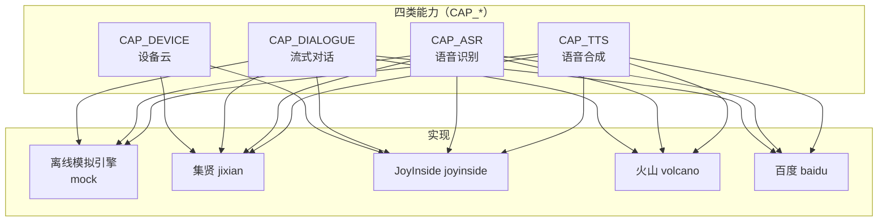
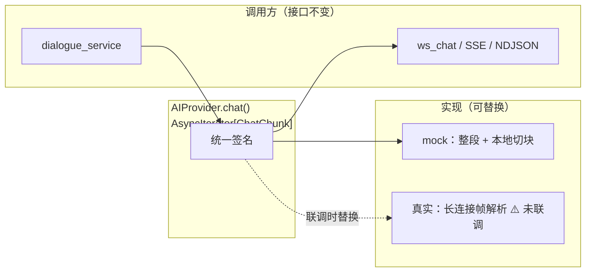
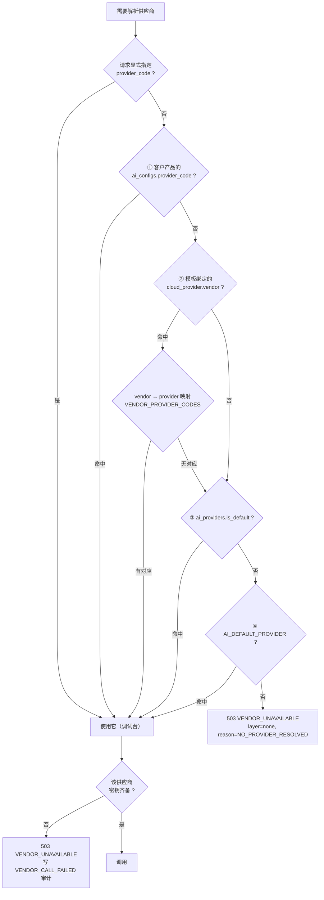
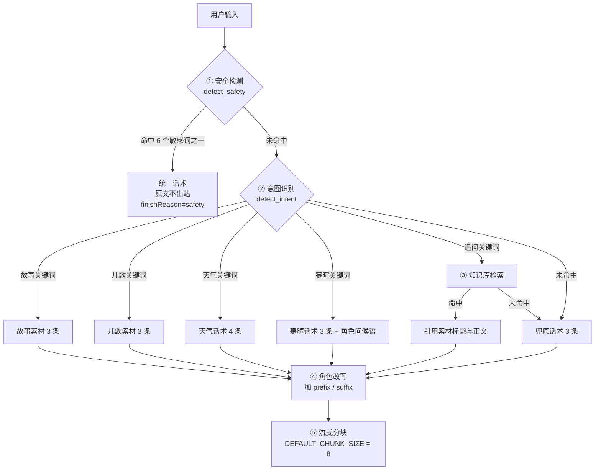
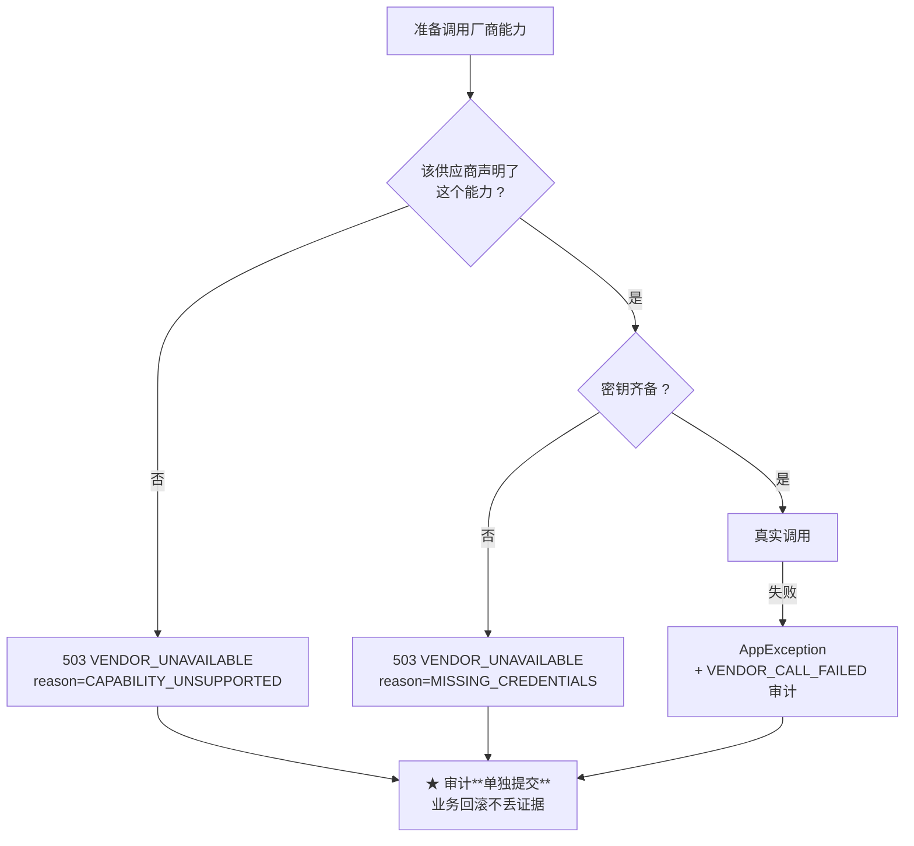
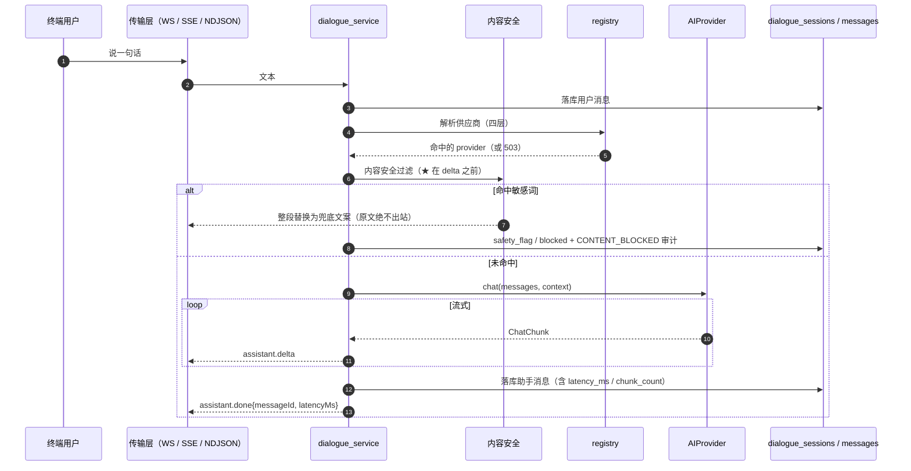

# AI 能力接入设计

> **适用对象**：需要接入新 AI 厂商、调整对话策略、或判断「AI 这部分到底做到哪一步」的开发与产品人员
> **本文定位**：讲清**能力怎么抽象、供应商怎么选、离线引擎怎么工作、真实厂商要接哪些东西**
> **配套文档**：[`13-火山引擎硬件对话智能体配置说明.md`](./13-火山引擎硬件对话智能体配置说明.md)（火山引擎控制台实测与取证边界）、[`14-ESP32-S3刷机与联调步骤清单.md`](./14-ESP32-S3刷机与联调步骤清单.md)（真机联调清单）、[`10-AI验证可用性.md`](./10-AI验证可用性.md)（离线引擎实测基准）、[`02-系统流程图.md`](./02-系统流程图.md)（对话时序）
> **最后更新**：2026-09-17
> **文档中标注说明**：✅ = 已实测或有代码原文可查；⚠️ = **未联调 / 未验证 / 未实现**（本文中该标记出现频率较高，因为本项目**没有任何真实厂商密钥**）

---

## 0. 结论先行

### 0.1 一句话

AI 能力被抽象成一个 **`AIProvider` 接口**，四类能力（**设备云 / 对话 / ASR / TTS**）
后面既可以是**完全离线的模拟引擎**，也可以是四家真实厂商的适配器；
**供应商由四层解析顺序决定**，「最具体的声明优先」。**没有密钥也能跑通全流程**。

### 0.2 能力矩阵

| 能力 | 含义 | `mock`（离线引擎） | 集贤 | JoyInside | 火山引擎 | 百度 |
|---|---|---|---|---|---|---|
| `device` 设备云 | 设备生成 / 激活 / 停用 / OTA | ⚠️ 不支持（设备侧走平台自身逻辑） | ✅ 已实现骨架 | ✅ 已实现骨架 | — | — |
| `dialogue` 对话 | 流式文本对话 | ✅ **已实测** | ✅ 骨架 | ✅ 骨架 | ✅ 骨架 | ✅ 骨架 |
| `asr` 语音识别 | 音频 → 文本 | ✅ **已实测** | ✅ 骨架 | ✅ 骨架 | ✅ 骨架 | ✅ 骨架 |
| `tts` 语音合成 | 文本 → 音频 | ✅ **已实测** | ✅ 骨架 | ✅ 骨架 | ✅ 骨架 | ✅ 骨架 |
| 设备端联调 | 真机接入 | — | ⚠️ 未联调 | ⚠️ 未联调 | ⚠️ 未联调 | — |

> ★ **「骨架」这个词是认真的**：四家适配器都实现了接口、参数映射与错误语义，
> 但**没有任何一家经过真实联调**（无密钥、无联调环境）。
> 其中火山引擎的**签名算法仍是占位**——详见 [`13-火山引擎硬件对话智能体配置说明.md`](./13-火山引擎硬件对话智能体配置说明.md)
> 文末的取证边界表。**不要把「骨架」读成「可用」。**

> **`device` 能力为什么 `mock` 不支持**：设备生成与激活在离线引擎里由**平台自身的逻辑**
> 完成（Wi-Fi 走本地生成 SN + HMAC 签名），不需要一个「假的厂商」。
> 因此 `mock` 的 `capabilities` 里没有 `device`。

### 0.3 四类能力与各层的关系



---

## 1. Provider 抽象

### 1.1 接口分组

`backend/app/ai/base.py` 定义 `AIProvider(ABC)`，按**生命周期 / 设备侧 / 对话侧 / 语音侧**分组：

| 分组 | 方法 | 说明 |
|---|---|---|
| **生命周期** | `startup()` / `shutdown()` | 建连与释放（真实适配器可在此建 HTTP 客户端） |
| | `health_check()` → `HealthCheckResult` | 健康探测；**未配置密钥时返回 `DOWN`**（不是伪造 `UP`） |
| | `descriptor()` → `ProviderDescriptor` | 自描述（供 `/ai/providers` 列表） |
| | `missing_credentials()` → `list[str]` | 缺哪些密钥——**这是 `VENDOR_UNAVAILABLE` 报错的依据** |
| **设备侧** | `open_session()` / `close_session()` | 设备会话 |
| | `provision_device()` → `DeviceProvisionResult` | 设备生成（4G 路线由厂商返回 SN/IMEI/ICCID） |
| | `device_action()` → `DeviceActionResult` | 设备激活动作（激活 / 停用 / OTA 共用） |
| **对话侧** | `chat(messages, ...)` → **`AsyncIterator[ChatChunk]`** | ★ 流式对话；**这是全项目最重要的一个签名** |
| **语音侧** | `asr(...)` → `AsrResult` | 语音识别 |
| | `tts(...)` → `TtsResult` | 语音合成 |

### 1.2 ★ 为什么 `chat()` 必须是 `AsyncIterator[ChatChunk]`

> 当前 `mock` 的实现是「一次性生成整段文本 → 本地按标点切块」。
> **真实厂商的实时对话是 RTC / WebSocket 长连接**，与「HTTP 取整段 + 本地分块」完全不同。

但**对外接口不变**：调用方（`dialogue_service` / `ws_chat` / SSE 端点）只依赖
`AsyncIterator[ChatChunk]`，因此联调时**只需要替换 `chat()` 的内部实现**，
上层一行都不用改：



**这是本项目在 AI 部分最重要的一条设计决策**：把「传输形态的差异」关在 `chat()` 里面，
而不是让它渗到业务编排层。

### 1.3 真实适配器的公共基类

`BaseHttpProvider(AIProvider)` 收口真实厂商适配器的公共部分：

| 收口项 | 说明 |
|---|---|
| 密钥读取与 `missing_credentials()` | 统一「缺哪些密钥」的判断 |
| `build_headers()` | 各厂商覆写（如百度的 `Bearer` + token） |
| HTTP 重试与超时（`HttpRetryConfig`） | 统一超时 / 重试 / 错误分类 |
| `_call_failed(...)` | 统一把厂商错误转成 `AppException` |
| `chunk_text(text, chunk_size=24)` | 真实适配器把整段响应切块（与 mock 的 8 字切分不同） |

> ⚠️ **`sign()`（签名）只有一处**：所有厂商的签名逻辑都收口在 `BaseHttpProvider.sign()`，
> 便于联调时集中替换。目前火山引擎的签名**是占位实现**。

---

## 2. 注册与解析顺序

### 2.1 四层解析（先命中先返回）

`backend/app/ai/registry.py` 的 docstring 原文：

| 层 | 常量 | 依据 | 具体程度 |
|---|---|---|---|
| ① | `LAYER_CLIENT_PRODUCT` | `ai_configs.provider_code` | **最具体**（产品级显式指定） |
| ② | `LAYER_TEMPLATE_VENDOR` | `template.cloud_provider.vendor` | 模板绑定的云厂商 |
| ③ | `LAYER_PROVIDER_DEFAULT` | `ai_providers.is_default` | 平台标记的默认供应商 |
| ④ | `LAYER_PLATFORM_DEFAULT` | `AI_DEFAULT_PROVIDER` | **最泛化**（配置兜底） |
| — | `LAYER_REQUEST` | 请求里显式传 `provider_code` | 仅调试台使用（比①更优先，不参与常规解析） |
| — | `LAYER_NONE` | 四层全未命中 | 抛 `VENDOR_UNAVAILABLE` |

### 2.2 为什么是这个顺序

代码 docstring 给出的两条理由（原文照录）：

> * 同一租户可能同时卖多款玩具，其中一款要用百度（客户指定），
>   其余用平台默认——若**租户级**覆盖优先，就没法只改一款产品；
> * 模板绑定了云厂商（如 JoyInside Wi-Fi），说明该产品**在设计上**就走这条链路，
>   因此它的优先级高于平台默认供应商，但低于管理员对该产品的显式覆盖。

### 2.3 解析流程图



### 2.4 显式的厂商 → 供应商映射

```python
VENDOR_PROVIDER_CODES = { "JIXIAN": "jixian", "JOYINSIDE": "joyinside", "VOLCANO": "volcano" }
```

> **为什么需要这层映射**：`CloudVendor` 是「**设备云厂商**」的词汇表，
> 而注册键是「**AI 供应商**」的词汇表，两者**大部分重合但不完全相同**
> （如百度不在 `CloudVendor` 内）。
> 显式映射让这种不一致**不会变成隐式约定**。

### 2.5 无数据库也能测

`resolve_provider()` 是**纯函数**：四层候选值由调用方传入，不碰数据库。
「值 → 候选值」的 SQL 读取收在 `resolve_for_product()` 里。
因此单元测试可以**只验证顺序本身**，不必搭数据库（`test_provider_registry.py` 共 31 条）。

> 这是「把纯逻辑与 IO 分开」的一个具体收益：顺序这种东西最容易写错，
> 而它恰好是最容易测的——前提是它没和数据库纠缠在一起。

---

## 3. 离线模拟引擎

### 3.1 目标：无密钥跑通全流程

`AI_DEFAULT_PROVIDER=mock`（**默认值**）时，整条链路不需要任何厂商密钥：

| 环节 | 离线实现 |
|---|---|
| 对话 | 规则引擎：按关键词识别意图 → 选取素材 → 加角色语气前缀/后缀 → 流式分块 |
| ASR | `echo`（回显输入）/ `fixed`（固定转写） |
| TTS | `text`（返回文本）/ `wav`（生成占位音频） |
| 设备激活 | 平台自身逻辑（Wi-Fi 本地生成 SN + HMAC 签名） |

### 3.2 意图识别与素材



**关键词表**（`scenarios.py`）：

| 意图 | 关键词 |
|---|---|
| 故事 | `故事`、`讲故事`、`童话`、`睡前`、`讲一个`、`讲个` |
| 儿歌 | `歌`、`唱歌`、`儿歌`、`唱首`、`唱一`、`唱个`、`童谣` |
| 天气 | `天气`、`下雨`、`下雪`、`气温`、`冷`、`热`、`风` |
| 寒暄 | `你好`、`您好`、`早上好`、`晚上好`、`嗨`、`hello`、`hi`、`在吗` |
| 追问 | `为什么`、`是什么`、`怎么`、`知道`、`告诉我`、`什么是` |
| **安全（6 个词）** | `暴力`、`自杀`、`赌博`、`毒品`、`恐怖袭击`、`黄色` |

**素材量**：故事 **3** 条、儿歌 **3** 条、天气话术 **4** 条、寒暄话术 **3** 条、兜底话术 **3** 条。

### 3.3 内置角色预设（4 个）

`BUILTIN_ROLE_PRESETS` 内置在**代码里**（不只在数据库），因此**数据库还没有种子数据时也能演示角色切换**：

| 角色 | 编码 | 语气实现 |
|---|---|---|
| 温柔姐姐（默认） | `gentle_sister` | 前缀「姐姐轻声说：」+ 后缀「慢慢来，姐姐陪着你。」 |
| 搞笑哥哥 | `funny_brother` | 前缀「哥哥挤挤眼睛说：」+ 后缀「哈哈哈，是不是很好玩！」 |
| 小恐龙 | `little_dinosaur` | 前缀「小恐龙吼了一声说：」+ 后缀「嗷呜，我们下次再聊！」 |
| 知识小博士 | `teacher` | 前缀「小博士推了推眼镜说：」+ 后缀「你记住啦吗？我们下次继续探索。」 |

> **角色改写让「不同角色真的听起来不一样」**——否则角色切换只是换了一个下拉框的值。

### 3.4 可复现性

| 配置 | 作用 |
|---|---|
| `MOCK_RANDOM_SEED`（默认 `20260916`） | 固定随机种子，**决定素材挑选结果**。同一输入 + 同一种子 ⇒ 同一素材 |
| `MOCK_LATENCY_MS`（默认 `120`） | 模拟响应延迟，用于生成可复现的延迟基准 |
| `MOCK_ASR_MODE` / `MOCK_TTS_MODE` | 语音侧的行为模式 |

> **可复现为什么重要**：延迟基准、演示演示效果、以及「这条回复是不是变了」的回归判断，
> 都依赖「同样的输入给同样的输出」。加上固定种子后，这三件事才成立。

### 3.5 知识库**真的**影响对话

`dialogue_service` 会把 `kb_files.status = PARSED` 的文件文本块
作为 `context["knowledge"]` 注入供应商，离线引擎在**追问**与**兜底**两个分支里检索它：

| 分支 | 命中知识库时的回复形态 |
|---|---|
| 追问（`question`） | 「我从《标题》里找到了答案：正文」 |
| 兜底 | 「关于这个，我从《标题》里想到：正文」 |

★ **反向实证**（来自 [`10-AI验证可用性.md`](./10-AI验证可用性.md) 的实测）：
24 个用例里有 **3 个追问类用例**，引擎**正确识别了追问意图**，
但因为**知识库为空**，回复落到了兜底话术。这既是一个局限（答案没给出），
也正是「知识库真的会被用到」的证据——**如果知识库不影响对话，这 3 条就该给出兜底而不是「找不到素材」**。

> **诚实边界**：`PENDING`（已上传）与 `PARSED`（可被检索）是**两个独立事实**。
> 上传成功不等于能被检索命中。pdf/docx 的文本抽取**尚未实现**，会返回 `FAILED` 并说明原因。

---

## 4. 两条技术路线的传输差异

- 4G 方案（集贤 / ML307N）：设备由**厂商 API 生成**，SN/IMEI/ICCID 由厂商返回；支持 OTA；有流量充值。
- Wi-Fi 方案（JoyInside / ESP32-S3）：设备由**平台本地生成** SN 并 HMAC 签名；不支持平台侧 OTA（端侧升级）；无流量充值。

★ 因此 **Wi-Fi 产品不允许平台覆盖对话角色**——角色由厂商侧智能体配置，
接口返回 `409` 并带 `roleSupported` / `roleUnsupportedReason`，前端直接禁用该分区。

| 差异点 | 4G | Wi-Fi |
|---|---|---|
| 二维码载荷 | `JX\|SN\|IMEI\|ICCID\|deviceId` | `JD\|tenantId\|productId\|sn\|sign` |
| 防篡改 | 按设备记录**重算规范载荷**做 SHA-256 命中 | HMAC-SHA256 + `compare_digest` 验签 |
| 激活 | 开机 → 4G 上线 → 厂商激活 | 配网 → 上报 SN/MAC → **校验 SN 与二维码一致** → 厂商激活 |
| OTA | ✅ 平台可推送 | ✘ `409 OTA_NOT_SUPPORTED`（数据驱动判定） |
| 对话角色 | 平台可配置 | **厂商侧配置，平台不覆盖** |

---

## 5. 火山引擎接入指引

> **必读**：[`13-火山引擎硬件对话智能体配置说明.md`](./13-火山引擎硬件对话智能体配置说明.md)
> 本文只做**与本项目数据模型的映射**，控制台操作步骤与取证边界以 `docs/13` 为准。

### 5.1 控制台四步（详见 `docs/13`）


### 5.2 与本项目数据模型的映射

| 火山引擎概念 | 本项目 | 说明 |
|---|---|---|
| 产品 | `client_products` + `product_templates` | 火山的产品对应平台的「客户产品」；模板记录厂商绑定 |
| License | `devices`（逐台）+ `device_credentials` | 一个 License 对应一台设备 |
| 智能体 | `ai_configs` | 提示词 / 角色 / 音色 / 采样参数映射到 AI 配置 |
| 服务端 OpenAPI | `backend/app/ai/volcano.py` | 统一 `POST https://rtc.volcengineapi.com?Action=<Action>&Version=2025-08-01`；`Aibot*` 系列 Action |

> **不能**让商户直接用火山账号：商户产品必须映射到平台的 `client_products`（带 `tenant_id`），
> 否则多租户隔离在 AI 这一层就断了。

### 5.3 ⚠️ 当前状态（必须如实说明）

| 项 | 状态 |
|---|---|
| 接口形态（Action、URL、请求体结构） | ✅ 已按官方文档校对 |
| **签名算法与签名位置** | ⚠️ **仍是占位**（官方《调用方法》页正文不可读） |
| 部分 Body 字段名 | ⚠️ 按官方 PascalCase 惯例统一，**未逐字核对**（风险示例：`AibotId` vs `AgentId`） |
| `TTSConfig` / `LLMConfig` 层级 | ⚠️ 同构推断（仅 `ASRConfig` 逐字来自官方示例） |
| 真实调用 | ⚠️ **从未发生**（无密钥） |

> **签名逻辑收口在 `BaseHttpProvider.sign()` 一处**，联调时集中替换，
> 不需要在四个适配器里各改一遍。

---

## 6. 百度接入指引

`backend/app/ai/baidu.py` 的实现程度（比其他三家**更完整**，因为百度用 OpenAI 兼容形态）：

| 能力 | 状态 |
|---|---|
| `capabilities` | `{CAP_DIALOGUE, CAP_ASR, CAP_TTS}` —— **不声明 `CAP_DEVICE`**（百度不做设备云/设备绑定） |
| `ensure_access_token()` | ✅ 实现了 **access_token 换取与缓存**（`invalidate_token()` 支持失效重取） |
| `chat()` | ✅ 按 OpenAI 兼容形状解析（`_first_choice_content` 取第一条回复） |
| `asr()` / `tts()` | ✅ 已实现（TTS 有 `_synthesize_bytes` 多轮尝试） |
| 真实调用 | ⚠️ 未联调（无密钥） |

> **对比的意义**：百度适配器说明「同一套 `AIProvider` 抽象能覆盖形态不同的厂商」——
> 火山是自有 Action 风格，百度是 OpenAI 兼容风格，而对上层完全一致。

---

## 7. 密钥管理

### 7.1 `.env` 中的 23 个厂商变量

| 厂商 | 变量数 | 变量 |
|---|---|---|
| 集贤 | 6 | `JIXIAN_API_BASE`、`ACCESS_KEY`、`SECRET_KEY`、`VENDOR_ID`、`APP_ID`、`TIMEOUT_SECONDS` |
| JoyInside | 6 | `JOYINSIDE_API_BASE`、`ACCESS_KEY`、`SECRET_KEY`、`TENANT_ID`、`APP_ID`、`TIMEOUT_SECONDS` |
| 火山引擎 | 6 | `VOLCANO_API_BASE`、`ACCESS_KEY`、`SECRET_KEY`、`APP_ID`、`MODEL_ENDPOINT`、`TIMEOUT_SECONDS` |
| 百度 | 5 | `BAIDU_API_BASE`、`API_KEY`、`SECRET_KEY`、`APP_ID`、`TIMEOUT_SECONDS` |

### 7.2 三条密钥约束

| # | 约束 | 实现 |
|---|---|---|
| 1 | **留空即视为未接入** | `missing_credentials()` 非空 → `VENDOR_UNAVAILABLE`（503） |
| 2 | **密钥只进不出**（红线 2） | `/ai/providers` **只回 `configured` 布尔与健康状态**，密钥明文与密文都不在响应契约里 |
| 3 | 落库加密 | 云服务商密钥与小程序 appSecret 用 Fernet（`SECRET_ENCRYPTION_KEY`） |

> ⚠️ `SECRET_ENCRYPTION_KEY` 留空时由 `JWT_SECRET_KEY` 派生；
> **生产环境留空会拒绝启动**——否则「更换 JWT 密钥」会导致库里已加密的厂商密钥全部无法解密。

### 7.3 安全失败（`ADR-07` / 红线 5）



**为什么审计要单独提交**：这条审计是「安全拒绝」的**证据**。
若与业务事务绑在一起，业务回滚会把证据一起丢掉——
运维就再也无法证明「当时确实拒绝了，而不是悄悄成功了」。

★ **一个实现顺序上的坑**：**流式响应一旦开始就无法改 HTTP 状态码**。
因此「能力是否支持」「密钥是否齐备」这类校验**必须在构造 `StreamingResponse` 之前**完成。
这就是 `ai_chat` 端点里校验排在返回之前的唯一原因。

---

## 8. 对话链路时序



### 8.1 内容安全：为什么顺序不能反

| 顺序 | 后果 |
|---|---|
| ✅ 安全在 `delta` **之前** | 命中即整段替换，**原文绝不出站** |
| ✘ 安全在 `delta` **之后** | 敏感内容已经流到了设备上，再拦截也晚了 |

**代价**：开关开启时牺牲首字延迟（需要等整段生成完才能判断）。
这是**刻意的取舍**：安全 > 首字体验。三个开关（文本 / 音频 / 视觉）可以在商户端配置。

✅ **实测证据**（见 [`10-AI验证可用性.md`](./10-AI验证可用性.md)）：24 个用例中安全拦截 **6/6 = 100%**，
且顺序正确——用例「毒品是什么」的引擎意图本是**追问**（关键词命中「是什么」），
但回复分支是**安全拦截**，说明 `detect_safety` 确实排在最前且命中后不进入素材选择。

---

## 9. 设备端联调路径

真机接入有四条路径（**详细步骤与失败速查见 [`14-ESP32-S3刷机与联调步骤清单.md`](./14-ESP32-S3刷机与联调步骤清单.md)**）：

| 路径 | 适用 | 工作量 |
|---|---|---|
| A 官方 Demo 板 | 手上有官方开发板 | 最小 |
| B 预编译体验包 | 想最快看到效果 | 小 |
| C 自行移植（ESP32-S3 Sense） | 有自己的板子 | **最大** |
| D 低负载 WebSocket | 不想用官方实时链路 | 中 |

> 本文不重复 `docs/14` 的内容——那里是**照着做就行**的执行清单，
> 且明确标注了「哪些步骤已验证、哪些只是移植路径而非已验证步骤」。

---

## 附录：已知局限与取证边界

以下**每一条都是「未做到」**，请勿把本文描述的能力读成已验证：

1. ★ **没有任何真实厂商联调**：本项目无任何厂商密钥，四家适配器全部只到「实现 + 单元测试」，
   真实链路（网络、鉴权、错误形态、限流）**从未验证**。
   → 后果：**不能**据此判断接入成本或可用性。
   → 补齐方式：填 `.env` 密钥后按 [`14-ESP32-S3刷机与联调步骤清单.md`](./14-ESP32-S3刷机与联调步骤清单.md) 联调。
2. **火山引擎签名算法与部分 Body 字段名是占位**（`TTSConfig` / `LLMConfig` 层级为同构推断）。
   → 详见 [`13-火山引擎硬件对话智能体配置说明.md`](./13-火山引擎硬件对话智能体配置说明.md) 的取证边界表。
3. **实时对话的真实形态未接入**：真实链路是 RTC / WebSocket 长连接，
   而当前 `chat()` 是「HTTP 取整段 + 本地分块」。对外接口 `AsyncIterator[ChatChunk]` 不变，
   但**首字延迟与流式体验会在联调后显著不同**。
4. **语音链路前端未实现**：后端 `user.audio` / `assistant.audio` 帧与 `provider.asr/tts` 已就绪，
   但前端**没有录音与播放**，因此语音能力实际上不可用。
5. **内容安全词表是最小集（6 个词）**：实测「拦截率 100%」只说明**这 6 个词有效**，
   **不代表内容安全能力**。真实产品需要可配置词库与 LLM 复核。
6. **知识库无向量化检索**：当前是关键词级匹配，`knowledge_bases.embedding_model` **保留未用**；
   注入对话有上限（5 文件 / 20 块）。
7. **pdf / docx 文本抽取未实现**：解析会返回 `FAILED` 并注明「文本抽取尚未实现」。
8. **追问类在知识库为空时落兜底**：实测 3 个追问用例均如此（见 `docs/10`）。
9. **`mock` 不支持 `CAP_DEVICE`**：4G 设备生成必须依赖真实厂商，
   因此**离线环境无法完整演示 4G 设备生成链路**（演示数据用的是平台自有库存与预置设备）。
10. **`VENDOR_PROVIDER_CODES` 不包含百度**：百度不在 `CloudVendor` 词汇表内，
    只能通过 `ai_configs.provider_code` 或 `AI_DEFAULT_PROVIDER` 显式指定。
11. **供应商健康探测（`/ai/providers/{code}/health`）在未配置密钥时返回 `DOWN`**，
    这是设计而非故障；但因此**健康检查不能用来判断「链路是否可达」**（缺密钥时永远 DOWN）。
