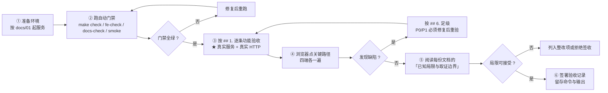

# 系统交付标准

> **适用对象**：验收方、甲方技术负责人、接手维护者、需要判断「能不能上线」的人
> **本文定位**：**逐条可勾选的验收依据**——功能清单、性能目标、安全基线、兼容性、缺陷等级与验收流程
> **配套文档**：[`11-测试与质量保障.md`](./11-测试与质量保障.md)（自动化覆盖了什么、没覆盖什么）、[`01-安装部署指南.md`](./01-安装部署指南.md)（部署与加固清单）、[`../SECURITY.md`](../SECURITY.md)（安全设计与**已知安全边界**）
> **最后更新**：2026-09-17
> **文档中标注说明**：✅ = 已实测或有代码原文可查；⚠️ = **未验证 / 未实现**（本项目的验收标准明确要求：**没做到的要写在显眼处**）

---

## 0. 结论先行

### 0.1 四道门禁 + 客观凭据

| 门禁 | 命令 | 实测结果 | 客观凭据 |
|---|---|---|---|
| 代码规范与类型 | `make lint` / `make typecheck` | ✅ ruff 0 问题；mypy **strict**，**95 个源文件**无问题 | 命令退出码 + 输出行数 |
| 测试 | `make check` | ✅ **814 passed**（**553 个测试函数**，差额来自 `@pytest.mark.parametrize` 展开） | pytest 汇总行 |
| 接口契约 | `make openapi-check` | ✅ 实现与 `tests/contract/openapi_snapshot.json` 一致（**119 paths / 145 operations**） | 差异为空 |
| 前端导入契约 | `make fe-check` | ✅ **399 处** import 的路径与具名导出全部匹配 | 输出统计 |
| 文档一致性 | `make docs-check` | ✅ 端点 / 表 / 错误码 / 权限码 / 枚举值 / 引用 / 测试计数 / 边界声明 **八类校验** | 各类命中数 |
| 迁移一致性 | `python -m alembic check` | ✅ 模型与迁移**零漂移**；升降往返可逆 | 无漂移输出 |
| 全端点冒烟 | `make smoke` | ✅ **57/57**（直连与经 Nginx 各一次） | 断言计数（带最低断言数守卫） |
| 敏感信息扫描 | `scripts/scan_secrets.py` | ✅ 扫描 **247 个被跟踪文件，0 命中** | 命中数 |
| 代码覆盖率 | `make coverage` | ⚠️ **70%**（10501 语句 / 3141 未覆盖） | 见 `## 1.9` 与 [`11-测试与质量保障.md`](./11-测试与质量保障.md) |

> ★ **「814 passed」不等于「测试充分」**。本项目的覆盖率只有 **70%**，
> 且 `ai_config_service`（29%）、`metrics_service`（29%）、`ota_service`（30%）
> 三个服务低于 31%。验收时**不要只看绿灯**。

### 0.2 五个里程碑的达成情况

| 里程碑 | 交付标志 | 状态 |
|---|---|---|
| M0 项目启动 | 脚手架、追踪文件、仓库初始化就绪 | ✅ |
| M1 可登录骨架 | 后端可登录鉴权 + 前端可登录进工作台 | ✅ |
| M2 业务闭环（无 AI） | 客户开通 → 下单 → 生成设备 → 烧录 → 分配 → 扫码激活 | ✅ |
| M3 AI 闭环 | 终端设备可对话（离线模拟引擎），商户可配置 AI | ✅ |
| M4 可部署交付 | `docker compose up` 一键起服务 + 全端点冒烟通过 | ✅ |
| M5 公开就绪 | 专业文档集齐备 + 学习手册 + README 终版 | ⚠️ **部分**（文档集完成，学习手册与截图未完成） |

---

## 1. 功能验收清单

> **用法**：逐条在**真实服务**上操作并勾选。每条都给出了「可观察的预期结果」。
> 依据列指出该能力在代码或既有验收记录中的出处，便于复核。

### 1.1 目录域（平台侧）

- [ ] 开通租户：填编码 / 名称 / 联系人 / 行业 → 创建成功，列表出现新租户 —— *依据：`platform.py`、P3 验收*
- [ ] 租户编码重复 → `409 TENANT_CODE_EXISTS`（**不是 400**） —— *依据：错误码表*
- [ ] 停用租户后，该租户账号登录 → `403 TENANT_DISABLED`，且**账号本身仍为 ACTIVE** —— *依据：`P-04` 修复*
- [ ] 开通登录账号时口令留空 → 响应含**一次性初始密码**，回读该账号 `mustChangePassword=true` —— *依据：P3 浏览器实测*
- [ ] 删除仍有关联数据的租户 / 云服务商 / 模板 → `409 CASCADE_CONFLICT`，`details` 给出各项引用数量 —— *依据：`P-06` 修复*
- [ ] 云服务商未配置密钥时点「连通性检测」→ `result=NOT_CONFIGURED`、`ok=false`、**`latencyMs` 为空**（不伪造成功） —— *依据：`ADR-07`*
- [ ] 保存云服务商密钥后，任何 GET 响应**不含明文密钥**，只回掩码 —— *依据：红线 2*
- [ ] 产品模板授权给租户后，该租户才能基于它创建客户产品 —— *依据：`PRODUCT_NOT_AUTHORIZED`*
- [ ] 未授权的模板被使用时 → `409 PRODUCT_NOT_AUTHORIZED` —— *同上*

### 1.2 订单与设备生成

- [ ] 商户下单 → 订单号符合规则，状态 `PENDING_AUDIT` —— *依据：P4 验收*
- [ ] 平台审核通过 → `APPROVED`；页头动作**自动**从「审核/驳回」变为「生成设备」（**无需 F5**） —— *依据：`setActions()` 修复*
- [ ] 驳回时 `rejectReason` **空白串被拒**（`400 VALIDATION_ERROR`） —— *依据：P5 修复*
- [ ] Wi-Fi 产品生成设备 → **平台本地生成 SN**（不调厂商） —— *依据：`network_type=WIFI` 分支*
- [ ] 4G 产品在厂商未配置密钥时生成 → `VENDOR_UNAVAILABLE`(503)、订单**退回 `APPROVED`**、**设备表零新增**、写入 `VENDOR_CALL_FAILED` 审计 —— *依据：`ADR-07` + P4 独立验证*
- [ ] 已生成订单再次调用生成接口 → **幂等回放 200**（不新增设备） —— *依据：P4 遗留观察④*
- [ ] 设备库存页**四维分列**展示（资产 / 激活 / 在线 / 绑定），并提供中文说明 —— *依据：`ADR-03`*
- [ ] 冻结设备（原因必填）→ `FROZEN` 且 `previousAssetStatus` 记录原状态 —— *依据：P4 验收*
- [ ] 解冻 → **原路恢复**（已分配的设备回到 `ALLOCATED`，**不回落平台库存**） —— *依据：`ADR-10`*
- [ ] 删除 / 报废设备需二次确认且原因必填；空白原因被拒 —— *依据：P5 修复⑤*

### 1.3 批次导入与入库

- [ ] 上传 CSV → 预检给出 `总行数 / 有效 / 无效 / 重复`，与构造的异常行**完全对应** —— *依据：P4 浏览器实测*
- [ ] 错误报告为 `text/csv` 且带 **BOM**，含行号与原因 —— *依据：P4 验收*
- [ ] 同一份 CSV 上传到**另一个订单** → `409 BATCH_FILE_CONFLICT`，`details` 含两个订单号 —— *依据：P4 独立验证 D2*
- [ ] 同一份 CSV 上传到**同一订单** → 幂等复用（返回同一批次号） —— *依据：同上*
- [ ] 文件内重复行计入 `invalid`；库内已存在的 SN 计入 `invalid`；`duplicatedRows` **只统计文件内重复** —— *依据：P4 独立验证 O4*
- [ ] 超 5000 行或超 5MB → 被拒并说明限额 —— *依据：批次三重限额*
- [ ] 批次导入的设备停在 `GENERATED`；调「入库」后 → `IN_STOCK`，重复入库计 `skipped`（幂等） —— *依据：P5 遗留②、P6 交付*

### 1.4 工厂生产

- [ ] 平台派单 → 订单 `IN_STOCK → PRODUCING`，本单设备 → `PRODUCING`，工单号生成 —— *依据：P6 接口验收 71/71*
- [ ] **工单 `quantity` = 实际派工台数**，且响应另含 `orderQuantity`（合同数量）；两者不等是正常的 —— *依据：P6 独立验证*
- [ ] 重复派单 → `409 FACTORY_ORDER_EXISTS` 且 `details.existingFactoryOrderNo` 可直接跳转 —— *依据：P6 独立验证*
- [ ] 未入库的订单派单 → `409 INVALID_STATE_TRANSITION` —— *依据：P6 接口验收*
- [ ] ★ **脱敏红线**：工厂端任何响应中**真实客户名 / 联系人 / 电话 / 邮箱出现 0 次**；
      `unitPrice` / `totalAmount` / `applicantName` / `contactPhone` / `email` / `tenantName` 等**字段名也不存在** —— *依据：P6 接口验收（在 DOM 全文检索为 -1）*
- [ ] 客户名脱敏形状为「首尾各一个**文字字符**」，长度与原名一致（`星辰玩具（演示租户）` → `星********户`） —— *依据：P6 修复*
- [ ] ★ **跨厂隔离**：他厂工单在列表为 0 条；详情 / 二维码 / 烧录一律 **404**（不泄漏存在性） —— *依据：P6 接口验收*
- [ ] 工厂账号未绑定工厂 → `403`（**不退化为「看全部」**） —— *依据：`factory_scoped`*
- [ ] 烧录上报分批累加；超量 → `400 BURN_COUNT_EXCEEDED` 且 `details.remaining` 给出剩余台数；上报 0 台 → 400 —— *依据：P6 接口验收*
- [ ] 烧满额 → 工单 `COMPLETED`、订单 `SHIPPED_TO_CLIENT`、设备 `PRODUCED` —— *依据：P6 接口验收*
- [ ] 抽检：不存在 SN → 404；空白 SN → 400；**同订单但未派工的 SN → 400**（判据是 `factory_order_id` 而非 `order_id`） —— *依据：P6 修复②*
- [ ] 抽检**不改变设备状态** —— *依据：抽检的刻意设计*
- [ ] 出货登记 → 工单 `SHIPPED`、设备 `SHIPPED`、出货时间回填；**已出货再上报 → 409** —— *依据：P6 接口验收*
- [ ] 工单二维码清单条数 = **工单委托台数**（不是订单下全部设备） —— *依据：`ADR-09`*
- [ ] 页头动作随状态变化：烧录完成 → 出现「抽检确认 / 出货登记」；出货后仅剩「刷新 / 导出二维码」 —— *依据：P6 浏览器实测*

### 1.5 分配与绑定

- [ ] 创建分配单（选租户 → 产品按租户联动过滤 → 勾多台设备）→ `DRAFT` —— *依据：P5 浏览器实测*
- [ ] 相同 `Idempotency-Key` 重放 → 返回同一条（同 `id`） —— *依据：P5 接口验收*
- [ ] 执行分配：逐行校验，返回 `allocated / failed / skipped` 计数 —— *依据：P5 接口验收*
- [ ] **部分失败不回滚**：成功的行保留；重跑只补未成功的行 —— *依据：`allocation_service`*
- [ ] 重复执行幂等：不重复分配，计入 `skipped` —— *依据：P5 接口验收*
- [ ] 分配后设备归属同步：`asset=ALLOCATED tenant=... product=...` —— *同上*
- [ ] 扫码预检 → 回显 SN / 设备标签 / 产品 / 资产状态 / 联网方式 / 归属租户，并返回 **5 分钟**确认令牌（`expiresInSeconds=300`） —— *依据：P5 接口验收*
- [ ] **篡改载荷被拒** → `404 QR_INVALID`（SHA-256 未命中） —— *同上*
- [ ] 确认绑定 → `status=BOUND`、写设备四维、写事件；`confirm_token_hash` **被置空（已销毁）** —— *同上*
- [ ] 绑定幂等重放（带幂等键）→ 返回同一条，`bindCount` 不变 —— *同上*
- [ ] 不带幂等键重放 → `409 DEVICE_ALREADY_BOUND`（**单绑约束优先于令牌校验**） —— *同上*
- [ ] 解绑（原因必填）→ `UNBOUND`、设备回落 `ALLOCATED`、`bindCount` 保留 —— *同上*
- [ ] **旧令牌在解绑后不可用** → `409 QR_EXPIRED`（解绑不会复活旧令牌） —— *同上*
- [ ] 冻结的设备无法被绑定 → `409 DEVICE_FROZEN` —— *同上*
- [ ] 跨租户：他人设备详情 / 改设置 / 解绑 → 一律 **404** —— *依据：P8 接口验收*

### 1.6 终端用户端（小程序）

- [ ] 扫码解析双分支：`JX` → 4G、`JD` → Wi-Fi；非法载荷 → `404 QR_INVALID`；SN 不存在 → `404 DEVICE_NOT_FOUND` —— *依据：P8 接口验收 50/50*
- [ ] 验证码登录：非法手机号 400；mock 通道**回显验证码并标注 `mock: true`**；错误码 400 且带 `attemptsLeft` —— *同上*
- [ ] ★ **令牌类型双向隔离**：管理端令牌调 `/miniapp/profile` → **401**；小程序令牌调 `/platform/devices` → **401** —— *同上*
- [ ] 4G 激活：`NOT_ACTIVATED → ACTIVATED` + `BOUND`，响应 `mock: true`；**重复激活幂等** —— *同上*
- [ ] Wi-Fi 激活：上报 SN 与二维码不一致 → `409 BIND_FAILED`，`details` 带 `qrSn` / `reportedSn`，设备 `activationStatus` 落库为 `BIND_FAILED` —— *同上*
- [ ] Wi-Fi 激活：修正 SN 后 → `200 ACTIVATED`（**失败可恢复**） —— *同上*
- [ ] **仅 4G 支持充值**：4G → 有套餐；Wi-Fi → `supported: false` + 原因 + 空数组（**不是报错**） —— *同上*
- [ ] 充值下单 → 201 且金额为**套餐快照**；mock 支付 → `PAID` + `mock: true`；重复支付 → `409 INVALID_STATE_TRANSITION` —— *同上*
- [ ] 对话（SSE）：`session.ready` → `assistant.delta` × N（**真分块**）→ `assistant.done` 带 `messageId` —— *同上*
- [ ] 对话（WebSocket）：同上帧序列；非法令牌 → close **4401**；越权设备 → close **4403** —— *依据：P8 + 部署验收*
- [ ] **内容安全**：命中 → `safetyFlag=KEYWORD` + `blocked=true`，且**被拦截原文不出现在回复里** —— *依据：P8 接口验收*
- [ ] 设备设置：默认值存在；更新生效；**未知键被白名单挡掉**；音量越界 400 —— *同上*
- [ ] 「已激活但未绑定」时重复激活 → **自动补绑定**（不再出现「激活成功但对话被拒」） —— *依据：P8 浏览器实测修复*
- [ ] 界面文案：mock 通道标注「演示环境：厂商通道为模拟实现」 —— *依据：`ADR-07` 的界面表现*

### 1.7 AI 配置与运营

- [ ] AI 配置**分区独立保存**（供应商 / 提示词 / 角色 / 音色 / 内容安全），保存后「当前生效说明」即时更新 —— *依据：P9 浏览器实测*
- [ ] Wi-Fi 产品的「角色」分区**整体禁用**并显示原因（不是页面故障） —— *同上*
- [ ] 供应商清单**只回「是否已配置」布尔**，不含任何密钥或片段 —— *依据：红线 2*
- [ ] 知识库上传文本文件 → 解析成功并统计块数；**上传 pdf/docx → `FAILED` + 「文本抽取尚未实现」** —— *依据：解析的诚实实现*
- [ ] 知识库删除时若被 `ai_configs` 引用 → `409 CASCADE_CONFLICT` 并列出引用产品 —— *依据：P9 交付*
- [ ] 运营看板概览标注「数据来源：实时聚合」；趋势 / 24 小时 / 地域 / 内容榜标注「快照」 —— *依据：`source` 字段*
- [ ] 点「刷新快照」→ 确认框 → 重建并返回各表行数 —— *依据：P9 浏览器实测*
- [ ] ★ **`P-07` 守卫**：快照之和 **==** 实时聚合的交互数与助手消息数；24 小时分布**不是平的** —— *依据：`test_metrics_isolation.py`*
- [ ] ★ **`P-08` 守卫**：两个产品的指标**互不串台**；`productId` 传他人产品 → **404** —— *同上*
- [ ] 留存比率在**分母为 0 时返回 `null`**（不是 0） —— *依据：不把「未知」伪装成「零」*
- [ ] OTA 对 Wi-Fi 产品推送 → `409 OTA_NOT_SUPPORTED`，`details` 带 `{otaSupport, cloudVendor, cloudProviderName}`，且**不留任何推送记录** —— *依据：`test_ota.py`*
- [ ] OTA 对 4G 产品推送（固件包**已上传文件**）→ 逐台 `SUCCESS` 且设备固件版本被更新；重推计 `skipped` —— *依据：P9 接口验收*
- [ ] OTA 推送无文件的固件包 → 逐台 `FAILED` 并说明「固件包没有上传文件，无法推送」 —— *依据：`ADR-07`*

### 1.8 平台运维能力

- [ ] 平台端菜单与页面可达性：**已实现的页面**均能打开且无控制台报错 —— *依据：P6/P9 浏览器实测*
- [ ] ⚠️ **未实现的菜单项**渲染为「（建设中）」占位（**不是白屏**）：平台 7 项 / 商户 5 项 / 工厂 1 项 —— *依据：`shared/app/shell.js`*
- [ ] 未登录直访子端 → 重定向 `/login?redirect=...&reason=unauthenticated` —— *依据：`P-05` 修复*
- [ ] 子页面刷新后**停留在原页**（不回落首页） —— *依据：`P-01` 修复*
- [ ] ⌘K 命令面板可用 —— *依据：P2 验收*
- [ ] `make reset-db && make seed` → 回到**纯净演示态** —— *依据：部署验收*

### 1.9 质量门禁

- [ ] `make check` 全绿（ruff / mypy strict / pytest / 契约） —— ✅ 实测 814 passed
- [ ] `make fe-check` 全绿 —— ✅ 实测 399 处导入
- [ ] `make docs-check` 全绿 —— ✅ 八类校验
- [ ] `alembic check` **零漂移**；`downgrade` → `upgrade` 往返可逆 —— ✅ 实测
- [ ] ⚠️ **`make coverage` 总覆盖率 ≥ 70%**（当前实测恰为 **70%**，三个 P9 服务 < 31%）
      —— *这是本项目**最难声称**的一条，如实记录*
- [ ] `make smoke` 57/57（直连 + 经 Nginx） —— ✅ 实测
- [ ] 敏感信息扫描 0 命中 —— ✅ 实测 247 文件

---

## 2. 性能 SLO

> **本节分两部分**：`2.1` 是**本次实测**的并发基线（20 并发 × 15 秒，SQLite vs PostgreSQL），
> `2.2` 是业务相关的延迟与阈值（其中离线引擎延迟为实测，其余为设计目标/实现值）。

### 2.1 ★ 并发基线（实测）

> 口径与全部局限见 [`11-测试与质量保障.md`](./11-测试与质量保障.md) 的 `## 8`。
> 一句话：**单机、默认配置、每轮 15 秒**——**这是基线，不是容量规划依据**。

| 指标 | SQLite | PostgreSQL |
|---|---|---|
| 读 QPS | **73.6** | **72.0** |
| 读 p50 / p95（ms） | 257 / **436** | **149** / 994 |
| 写 QPS | **30.7** | **93.0** |
| 写 p50 / p95（ms） | 210 / 2946 | 151 / **606** |
| 写失败数 | **4 / 487**（`database is locked` → `500`） | **0 / 1414** |

**★ 结论（本项目自己也被修正过一次）**：

| 结论 | 说明 |
|---|---|
| **读路径两者持平** | 73.6 vs 72.0 QPS。PG 中位延迟更低，但 SQLite **尾延迟更好**（p95 436 vs 994 ms） |
| **写路径 PostgreSQL 压倒性更好** | 吞吐 **×3**、失败归零、p95 从 2.9 s 降到 0.6 s |
| **选型的准确表述** | 「**只有需要并发写时才必须上 PostgreSQL**」，而不是「PG 什么都更快」 |
| **多实例必须配 PG** | 双实例共享 SQLite 卷：**31.4 QPS，无提升**，写冲突翻倍（`docs/11` 的 `## 8.3`） |

### 2.2 业务阈值与延迟

| 项 | 目标 / 实测 | 性质 |
|---|---|---|
| API 健康检查响应 | ≤ 1 秒 | 设计目标 |
| 常规列表查询（≤ 120 条） | ≤ 1 秒（实测 p95 **436 ms** / 994 ms，见 `2.1`） | ★ **实测** |
| 对话**首字延迟**（离线引擎） | 中位 **184.1 ms** / 最大 **273.6 ms**（24 用例实测） | ★ **实测** |
| 对话**整段延迟**（离线引擎） | 中位 **365.1 ms** / 最大 **460.8 ms** | ★ **实测** |
| 对话分块数 | 中位 6 / 最大 20 | ★ **实测** |
| 容器健康检查 | `interval 30s` / `timeout 10s` / `start_period 40s` / `retries 3` | 实现值 |
| 设备在线判定窗口 | **180 秒**（`ONLINE_WINDOW_SECONDS`） | 实现值 |
| 心跳间隔 | 30 秒（`HEARTBEAT_INTERVAL_SECONDS`） | 实现值 |
| 绑定确认令牌有效期 | **300 秒**（5 分钟） | 实现值 |
| 批次导入上限 | 5000 行 / 5MB / 按字段长度 | 实现值 |
| 知识库文件上限 | `KB_FILE_MAX_BYTES`（可配置） | 实现值 |
| 单实例并发写 | ★ **实测**：SQLite 20 并发写出 `database is locked`（4/487 失败）；**需切 PostgreSQL** | ★ **实测** |

> ★ **真实厂商链路的延迟未知**：上表「首字延迟 184 ms」来自**离线模拟引擎**
> （`MOCK_LATENCY_MS=120` 的人为延迟 + 处理开销）。真实厂商的首字延迟取决于网络与厂商排队，
> **不能用这个数字做容量规划**。
> 同理，`2.1` 的 QPS 来自**单机短时压测**，只说明「量级」，不说明「线上能扛多少」。

---

## 3. 安全基线

### 3.1 ✅ 已实现

| 项 | 实现方式 | 验证方式 |
|---|---|---|
| 多租户隔离 | 作用域在 `app/db/scope.py` 单点收口（红线 1） | 参数化隔离矩阵 + 路由元测试 |
| 越权不可探测 | 跨租户返回 **404** 而非 403 | 隔离矩阵断言 |
| 工厂数据脱敏 | 字段白名单序列化；响应模型**没有** `customerName` 字段（红线 3） | 脱敏红线单测（含平台端对照） |
| 密钥只进不出 | Fernet 加密落库；响应只回掩码（红线 2） | P3 哨兵值实测「明文出现 0 次」 |
| 无默认口令 | 启动期校验；命中弱口令表即**拒绝启动**（红线 4） | 启动期校验实测 |
| 登录保护 | 连续 5 次失败锁定 15 分钟 | P1 验收 |
| 首次登录强制改密 | `must_change_password` | P3 浏览器实测 |
| 令牌类型隔离 | `type` claim 在**解签阶段**双向拒绝 | P8 接口验收 |
| 厂商安全失败 | 未配置密钥一律 `VENDOR_UNAVAILABLE`（红线 5、`ADR-07`） | 专门测试文件 |
| 注入防护 | 全量 Pydantic 校验 + ORM 参数化查询；无字符串拼接 SQL | 代码约定 + lint |
| XSS 防护 | 前端统一转义工具 `shared/ui/dom.js`；时间线 body 刻意不 `raw` | P5 修复 |
| 路径穿越防护 | 静态文件路径规范化；对象存储 key 校验是**唯一**拼接入口 | 原本地缺陷不移植 |
| CSRF | Bearer Token 而非 Cookie，**天然免疫** | 架构决定 |
| 审计留痕 | 29 种 `AuditAction`；安全拒绝的审计**单独提交** | P7 验收 |
| 敏感信息扫描 | 四类规则；CI 中作为独立 job | 实测 247 文件 0 命中 |

### 3.2 ⚠️ 未实现（原样承接 `SECURITY.md` 的「已知的安全边界」，生产前必须补齐）

| 项 | 说明 | 后果 |
|---|---|---|
| **儿童数据合规** | 本项目涉及儿童用户语音数据。**未实现** PIPL / COPPA 等法规要求的家长同意、数据保留期限、删除权等机制 | ★ **不能直接用于面向儿童的真实商业场景**；需法务评估 |
| **真实厂商协议** | 四家适配器是**可运行骨架**，未经真实协议联调与安全评估 | 接入成本与风险未知 |
| **设备身份认证完整性** | `device_credentials` 已建模，但设备证书的**签发 / 轮换 / 吊销**流程未实现 | 设备被仿冒的风险无法完全排除 |
| **风控与限流** | 未实现接口限流、异常行为检测、IP 黑名单 | 暴力枚举与刷接口无成本约束 |
| **渗透测试** | **未经过第三方安全渗透测试** | 未知漏洞 |
| **密钥管理（KMS）** | 密钥存在环境变量与数据库中，无集中密钥管理与自动轮换 | 轮换需人工 |
| **HTTPS** | 链路**已用自签证书实测通过**（`docs/11` 的 `## 8.2`），但**仓库未附证书、默认配置仍是 HTTP**；证书签发 / 续期 / HSTS 均未实现 | 默认部署仍为明文传输 |
| **WAF / DDoS** | 无 | 暴露面风险 |
| **`/docs` 生产暴露** | `SECURITY.md` 的清单要求生产关闭或加访问控制，**代码未强制** | 接口文档对外可见 |
| **依赖安全扫描** | 未纳入 CI（`pip-audit` 未接入） | 依赖漏洞不可见 |

---

## 4. 兼容性

| 项 | 支持范围 | 验证情况 |
|---|---|---|
| Python | **3.12+** | ✅ 实测 |
| Node.js | **不需要**（前端零构建，红线 7） | ✅ 实测 |
| 数据库 | SQLite（默认）/ PostgreSQL 14+ | ✅ PostgreSQL 16 **已真跑**（迁移到 `0015`、种子、应用 healthy、冒烟 **57/57**）+ ✅ **并发写压测已完成**（写 QPS 93.0、0 失败，见 `2.1`） |
| 浏览器 | 需支持 **ES Module** 与 **WebSocket** | ✅ 本机 Chromium 实测（`docs/02` 等文档的验收记录） |
| 操作系统 | Linux / macOS / WSL | ✅ Linux 实测 |
| 容器 | Docker 20+ 与 Compose v2 | ✅ 实测（含健康检查、非 root 运行） |
| 反向代理 | Nginx 1.27 | ✅ HTTP 与 WebSocket 转发已实测；✅ **TLS 已实测**（HTTPS + 301 跳转 + `wss` 握手 → 4401，TLSv1.3 AES-256-GCM，**自签证书**） |
| 多实例部署 | 2 实例 + 1 Nginx | ✅ **已实测**：轮询 **31 / 29**、WS 经 Nginx 正常；★ 但**共享 SQLite 卷时写无收益且报 500** → **多实例必须配 PostgreSQL** |
| 移动端 | H5（小程序形态） | ⚠️ 未做平板 / 桌面响应式适配 |

---

## 5. 文档完备度

| 文档 | 内容 | 验收要求 |
|---|---|---|
| `docs/README.md` | 文档导航 | 按「想做什么」可定位到文档 |
| `docs/01` 安装部署指南 | 环境 / 本地 / Docker / 环境变量 / 迁移 / 故障排查 / 加固 | 每条命令**真实可执行**；含 9 条已知局限 |
| `docs/02` 系统流程图 | 业务闭环 + 三个状态机 + 激活分支 + 对话时序 | 全部 mermaid；迁移表**与代码一致** |
| `docs/03` 系统架构图 | 分层 / 部署拓扑 / 模块依赖 / 选型与替代方案 | 含**替代方案对比**与「为什么不选」 |
| `docs/04` 产品需求 PRD | 定位 / 角色 / 术语 / 页面 / 权限矩阵 / 交互 | 明确标注「**事后补写**」 |
| `docs/05` 数据模型与 ER 图 | 分域 ER / 46 表字段字典 / 索引 / 枚举 / `in_stock` 对齐 | 字段名与类型**由 ORM 元数据生成** |
| `docs/06` API 接口文档 | 约定 / 31 错误码 / 145 端点 / WS 协议 / 示例 | 端点与快照**双向核对** |
| `docs/07` 多租户与权限设计 | 隔离层级 / 54 权限码 / 角色矩阵 / 越权测试 / 脱敏 | 权限码**全部与实现比对** |
| `docs/08` AI 能力接入设计 | 能力矩阵 / Provider 抽象 / 解析顺序 / mock / 厂商指引 | **如实标注全部未联调项** |
| `docs/09` 系统交付标准 | 本文 | 逐条可勾选 |
| `docs/10` AI 验证可用性 | 目标 / 环境 / 数据集 / 指标 / 基准数据 / 结论与局限 | 数据为**实测**，并标注非真实链路 |
| `docs/11` 测试与质量保障 | 金字塔 / 覆盖率 / 隔离矩阵 / 契约 / CI / `P-01`~`P-08` | 覆盖率**如实记录 70%** |
| `docs/12` 项目复盘 | 整合决策 / 架构演进 / 问题与解法 / 度量 / 路线图 | 含**不足**与经验沉淀 |
| `docs/13` 火山引擎配置说明 | 控制台四步 / 接入路径 / 服务端 API / 映射 | 含**取证边界声明** |
| `docs/14` ESP32-S3 联调清单 | 自检 / 工具链 / 路径决策树 / 失败速查 | 标注「不是已验证步骤」 |

**本项目自定的一条文档标准**（由 `make docs-check` 强制）：

> 每份 `docs/NN-*.md` **必须**含「已知局限 / 取证边界」小节，且不得引用不上传的 `learning/` 路径。

> ⚠️ **文档集不含截图**（`docs/assets/` 为空）。这是已知缺口，属未完成的收尾范围。

---

## 6. 缺陷等级定义

| 等级 | 定义 | 本项目的真实例子 |
|---|---|---|
| **P0 阻塞** | 系统不可用 / 数据不可恢复 / 安全泄漏 | （本项目未出现；附录 B 的历史缺陷属此级：硬编码弱口令、路径穿越） |
| **P1 严重** | 功能不可用，或**数据悄悄错**，且用户无法自行发现 | ① 「已激活但未绑定」导致对话被 WS `4403` 拒绝（**界面显示成功**）；② 24 小时分布聚合缺 `GROUP BY` 导致看板数字**悄悄错**；③ 工单二维码清单多打标签（`ADR-09` 的由来）；④ `make up` 从 P0 起就是坏的（部署路径不可用） |
| **P2 一般** | 功能可用但行为不符预期 / 一致性缺陷 | ① 同一路径两个处理函数（生效取决于 include 顺序）；② 分配弹窗选完租户后设备列表为空（**分配功能完全不可用**，但属单个流程）；③ 空白串可当「原因」落库；④ 批次文件错配（设备挂到旧订单） |
| **P3 轻微** | 观感 / 文案 / 文档不一致 | ① 页头按钮显示成字面 `<span>刷新</span>`；② 脱敏结果被括号占据可见位（`星********）`）；③ 注释与实现不符；④ 三处文案写死厂商名 |

### 6.1 本项目对「严重」的一个不同判断

★ 有一类缺陷容易被判为轻微，本项目把它判为**严重**：

| 类型 | 为什么危险 | 例子 |
|---|---|---|
| **会静默通过的检查** | 它让你**以为没问题** | 冒烟脚本在误删计数函数后仍打印「全部通过」→ 因此加了 `MIN_EXPECTED_CHECKS=25` 守卫 |
| **界面显示成功但实际失败** | 用户没有任何线索 | 「激活成功」但库里没有绑定关系 |
| **数字悄悄错** | 不报错，但决策建立在错数据上 | 小时分布恒为 1 |
| **文档写了但没人真跑过** | 交付物与文档不一致 | `make up` 坏了 10 个阶段 |

> **判据**：**「错误是否容易被发现」比「错误的影响面」更能决定等级**。
> 一个能被立即发现的错误是 P2，一个会被静默接受的错误是 P1。

---

## 7. 验收流程

### 7.1 流程



### 7.2 ★ 本项目对验收方式的要求（从实测中得来）

| 要求 | 理由 |
|---|---|
| **必须在真实服务上验**（真实 HTTP，不是只跑测试） | 代理交付的测试全绿，但 P6/P8/P9 的**全部 7 个真缺陷**都是端到端验收/浏览器实测发现的 |
| **必须用浏览器点一遍关键路径** | P8 那个「界面显示激活成功、实际没绑定」的缺陷，**只有点出来才能发现** |
| **涉及部署时必须真跑 Docker** | P10 的 **12 个问题没有一个是读代码或跑集成测试能发现的**——`make up` 坏了 10 个阶段 |
| **必须阅读并接受（或整改）已知局限** | 只看 `✅` 会漏掉决定能否上线的部分 |
| **验收凭据要留存**（命令 + 输出） | 否则「验收通过」无法复核 |

> **代理自测全绿 ≠ 功能可用** ——这是本项目反复验证过的结论，
> 也是为什么本文的清单要求「逐条在真实服务上操作」。

### 7.3 验收人

| 端 | 验收角色 | 关注重点 |
|---|---|---|
| 平台端 | 平台运营 / 产品 | 目录域、订单审核、设备生成、分配、OTA、运营看板 |
| 商户端 | 品牌方运营 | 下单、AI 配置、知识库、设备与绑定、运营数据 |
| 工厂端 | 工厂生产负责人 | 工单、烧录、抽检、出货、**脱敏是否彻底** |
| 终端用户端 | 消费者 / 家长代表 | 扫码到对话的完整路径是否顺畅 |
| 技术 | 架构 / 安全 / 运维 | `## 3.` 安全基线、`## 4.` 兼容性、[`01`](./01-安装部署指南.md) 的加固清单 |

### 7.4 验收记录模板

```
验收日期：
验收版本（commit）：              git rev-parse HEAD
验收环境：                        本机 / 容器 / 服务器；SQLite / PostgreSQL
自动门禁：
  make check          → ___ passed；mypy ___ 文件
  make fe-check       → ___ 处导入
  make docs-check     → 结果
  make smoke          → ___/___ 断言
  alembic check       → 漂移情况
功能验收：                        按 docs/09 ## 1. 逐条，附证据（截图 / 命令输出）
发现的缺陷：                      编号 / 等级 / 复现步骤 / 处理结果
已知局限的处理：                  接受 / 整改项（列出）
结论：                            通过 / 有条件通过 / 不通过
```

---

## 附录：已知局限与取证边界

1. ★ **CI 从未在真实 GitHub 上跑过**（本机无 remote）。
   → `.github/workflows/ci.yml` 的命令与本地 `make check` 逐字一致，但 YAML 语法与表达式只做了本地静态审查。
   → 后果：首次推送后需要实跑确认——**这是验收前必须处理的一项**。
2. ⚠️ **未在 CI 中构建镜像**（pip 全量安装是分钟级开销，刻意留在部署流程）。
3. **PostgreSQL 已完成真跑验证**：迁移 `0015` + 种子 + 应用 healthy + 冒烟 **57/57**。
   ✅ **并已完成并发写压测与 SQLite 的对比**（`## 2.1`）：20 并发写同一行，PG **93.0 QPS / 0 失败**，
   SQLite **30.7 QPS / 4×500**。
   ⚠️ 但**连接池与 worker 数未做参数扫描**，也未做长时间稳定性测试。
4. ✅ **Nginx TLS 与多实例负载均衡已完成实测**（`docs/11` 的 `## 8.2` / `## 8.3`）：
   TLS 四项全过（HTTPS + 301 + `wss` 握手 4401 + TLSv1.3），多实例轮询 **31 / 29**。
   ★ **但多实例实验给出了一个反面结论**：共享 SQLite 卷时**写吞吐无提升且出现 500**
   （31.4 QPS + 2×500）→ **多实例部署必须配 PostgreSQL**。
   ⚠️ 「多实例 + PostgreSQL」这一侧**仍未验证**；证书是**自签**的。
5. ⚠️ **覆盖率仅 70%**，且 `ai_config_service`(29%) / `metrics_service`(29%) / `ota_service`(30%) 低覆盖。
   → 后果：这三个域的长尾分支（Wi-Fi/4G 差异、分区保存、快照重建、逐台推送）**未被自动化覆盖**。
6. ⚠️ **`make smoke` 只覆盖读路径 + 2 个幂等写**，通过不代表写路径正确。
7. ⚠️ **压测只有「单机 15 秒 × 20 并发」一轮**（`## 2.1`）：有基线 QPS 与 p95，但
   **没有劣化曲线、没有参数扫描、没有长时间稳定性观测**。**不要用它做容量规划**。
8. ⚠️ **无真实厂商联调**：AI 与设备链路（激活、OTA、语音）的真实行为未验证。
9. ⚠️ **e2e 只有 1 条用例**：覆盖主干闭环，但**不覆盖分支**。
10. ⚠️ **无第三方便携式安全审计与渗透测试**。
11. ✅ **文档集已含 14 张界面截图**（`docs/assets/`，四个端的真实渲染）。
    ⚠️ 但截图是**用无头浏览器**生成的，且**只覆盖主路径页面**，不含空态 / 错误态 / 移动端。
12. ⚠️ **`reset_db.sh` 的备份是同盘备份**，宿主机磁盘故障时数据与备份一起丢。
13. ✅ **M5 已达成**：文档集（`docs/01`–`docs/14`）、学习手册（`learning/`，**不随仓库公开**）与
    README 终版均已完成，`make docs-check` 八类校验全绿。
    ⚠️ 但学习手册**不在本仓库中**，验收方拿到的只有 `docs/`。
14. **本文的验收清单依据是「代码 + 既有验收记录」**，不是「需求方确认的功能清单」。
    → 后果：若验收方有本文未覆盖的需求，需另行补充验收项。
