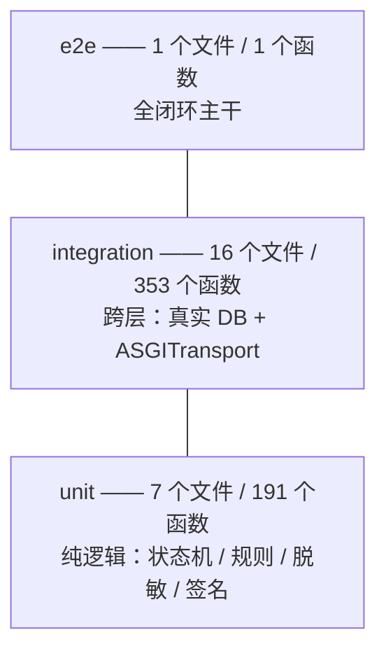
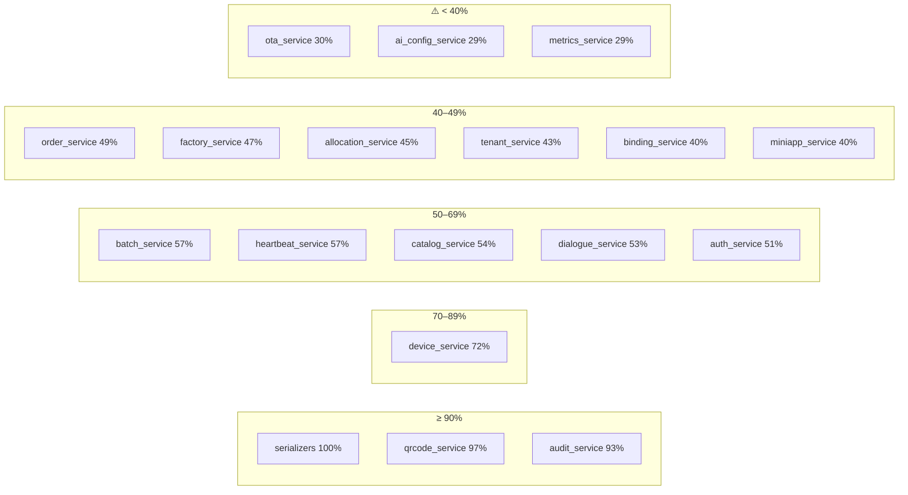
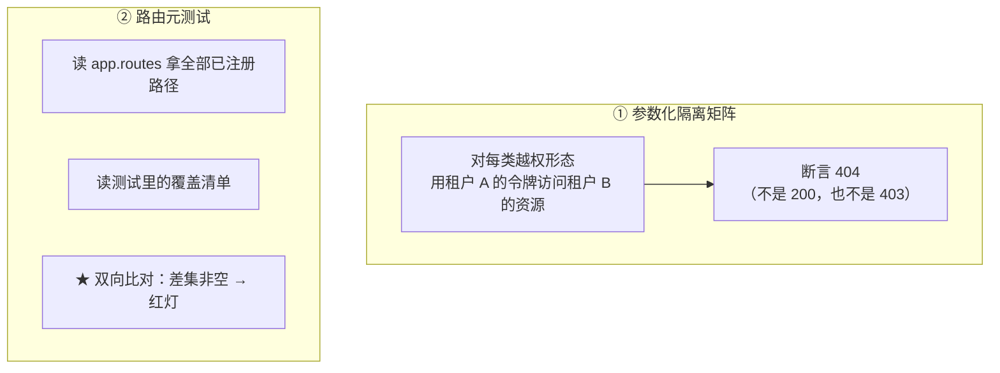
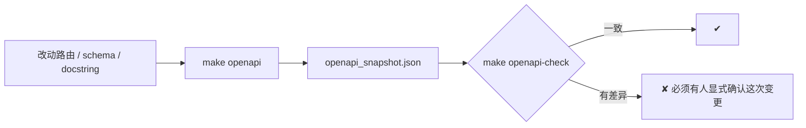
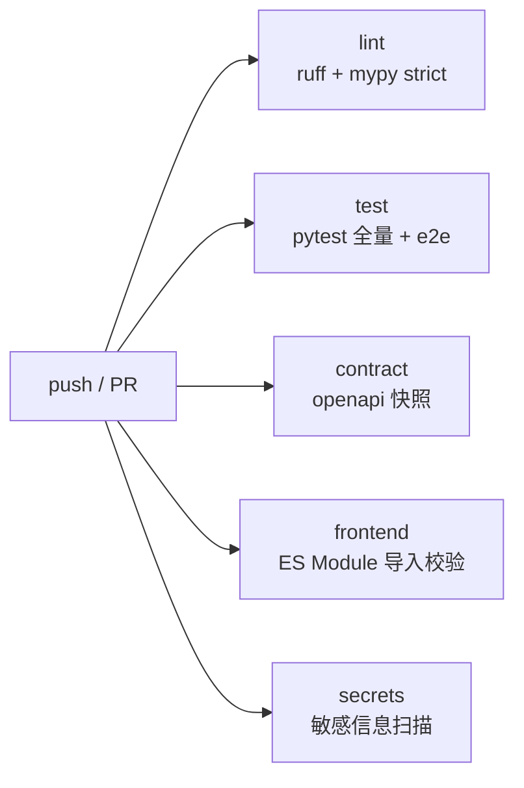
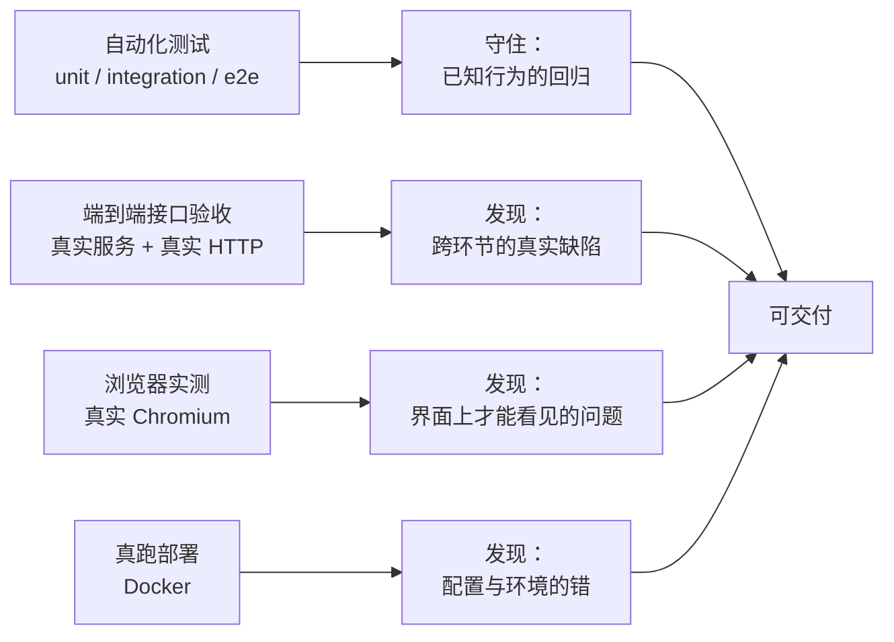

# 测试与质量保障

> **适用对象**：需要判断「这套系统被验证到什么程度」的开发、评审与验收人员
> **本文定位**：**测试结构、覆盖率的真实数字、契约门禁、以及本项目的测试方法论**
> **配套文档**：[`09-系统交付标准.md`](./09-系统交付标准.md)（验收清单与缺陷等级）、[`07-多租户与权限设计.md`](./07-多租户与权限设计.md)（隔离矩阵）、[`06-API接口文档.md`](./06-API接口文档.md)（契约门禁）、[`12-项目复盘.md`](./12-项目复盘.md)（这些教训的由来）
> **最后更新**：2026-09-17
> **文档中标注说明**：✅ = 已实测；⚠️ = 未验证 / 未实现

---

## 0. 结论先行

### 0.1 八道门禁

| 门禁 | 命令 | 实测结果 |
|---|---|---|
| 代码规范 | `make lint` | ✅ ruff 0 问题（含 `tests/` 与 `scripts/`） |
| 静态类型 | `make typecheck` | ✅ mypy **strict**，**95 个源文件**无问题 |
| 测试 | `make check` | ✅ **804 passed**（`make check` 单次实测 `804 passed in 476.25s`） |
| 接口契约 | `make openapi-check` | ✅ 实现与快照一致（**119 paths / 145 operations**） |
| 前端导入契约 | `make fe-check` | ✅ **399 处** import 全部匹配 |
| 文档一致性 | `make docs-check` | ✅ 端点 / 表 / 错误码 / 权限码 / 枚举值 / 引用 / 边界声明 |
| 迁移一致性 | `python -m alembic check` | ✅ 模型与迁移**零漂移**；升降往返可逆 |
| 敏感信息 | `scripts/scan_secrets.py` | ✅ **236 个被跟踪文件 0 命中** |

> `make check` = `lint` + `typecheck` + `test` + `openapi-check` + **`docs-check`**（五个子目标）。
> 其中 `docs-check` 是本阶段新增的文档一致性门禁 —— **文档与代码脱节会让主门禁红灯**。

### 0.2 ★ 最需要如实说明的一个数字

| 项 | 值 |
|---|---|
| **总覆盖率** | **70%**（10354 语句 / **3108 未覆盖**） |
| 覆盖率最低的三个服务 | `ai_config_service` **29%**、`metrics_service` **29%**、`ota_service` **30%** |

> ★ **804 个用例全绿 ≠ 测试充分。**
> 本项目的覆盖率只有 70%，且三个 P9 服务低于 31%。
> 原因是这些域的分支多（Wi-Fi/4G 差异、分区保存、快照重建、逐台推送），
> 而测试集中在**主路径与关键守卫**（隔离、幂等、安全失败），**长尾分支未覆盖**。
> 任何引用本文的人都不应把「804 passed」读成「质量已充分保障」。

### 0.3 两个测试计数口径（必须区分）

| 口径 | 数值 | 含义 |
|---|---|---|
| **测试函数** | **545** 个（24 个文件） | 源码里 `def test_...` 的个数 |
| **测试用例** | **804** 个 | pytest 实际执行的用例数，**差额来自 `@pytest.mark.parametrize` 展开** |

例：租户隔离矩阵用 `parametrize` 把「端点 × 越权形态」展开，
一个测试函数可能对应几十个用例。**两个数字都对，只是口径不同。**

---

## 1. 测试金字塔

### 1.1 结构



| 层 | 文件数 | 测试函数 | 覆盖什么 | 为什么放这一层 |
|---|---|---|---|---|
| **unit** | 7 | **191** | 状态机迁移表、领域规则、脱敏不变量、二维码编解码、权限与安全工具、Provider 注册顺序 | 这些是**纯函数或纯常量**，最适合也最便宜 |
| **integration** | 16 | **353** | 跨层行为：接口 + 服务 + 数据库 + 隔离 | 需要真实数据库与真实请求链路 |
| **e2e** | 1 | **1** | 主干闭环（一条测试串完 12 个环节） | 证明「整条链路能一起工作」 |
| **合计** | **24** | **545** | | |

### 1.2 单元测试清单（7 个文件 / 191 个函数）

| 文件 | 函数数 | 覆盖内容 | 为什么值得单测 |
|---|---|---|---|
| `test_mask.py` | **50** | 脱敏边界全表、不变量（长度恒等、幂等）、白名单一致性 | 脱敏是安全红线，**且它的不变量最容易在重构中被破坏** |
| `test_provider_registry.py` | **31** | 四层解析顺序（纯函数，不碰数据库） | 顺序最容易写错、也最容易测 |
| `test_qrcode.py` | **26** | JX / JD 双格式生成与解析、HMAC 验签、字段顺序 | 参考实现曾把 `clientId` 误传到 `tenantId` 位置——**用断言钉死字段顺序** |
| `test_domain_rules.py` | **25** | 领域规则（在线窗口、分配可执行性等） | 与框架无关 |
| `test_security.py` | **23** | 口令哈希、JWT 签发与解签、令牌类型隔离、启动期校验 | 安全基座 |
| `test_order_state_machine.py` | **20** | `ORDER_TRANSITIONS` 的每条边与终态 | 状态机是业务正确性的地基 |
| `test_device_state_machine.py` | **16** | `ASSET_TRANSITIONS`、**可冻结/可分配集合与迁移表严格相等**（`ADR-10`） | 「集合 == 迁移表对应边」这条决策必须被钉死，否则会再次漂移 |

### 1.3 集成测试清单（16 个文件 / 353 个函数）

| 文件 | 函数数 | 覆盖内容 |
|---|---|---|
| `test_catalog.py` | **51** | 目录域全链路（云服务商 / 模板 / 授权 / 客户产品 / 小程序配置） |
| `test_binding.py` | **39** | precheck → bind → unbind 全链路、篡改拒绝、令牌销毁、幂等重放 |
| `test_factory_flow.py` | **36** | 派单 → 烧录 → 抽检 → 出货全链路 + 跨厂隔离 + 归属范围 + 状态机驱动 |
| `test_auth.py` | **34** | 登录 / 刷新 / 锁定 / 强制改密 / **禁用租户登录**（`P-04`） |
| `test_device_heartbeat.py` | **27** | 设备密钥签发 / 心跳鉴权 / 180 秒窗口口径 / 模拟掉线 |
| `test_order_flow.py` | **25** | 下单 → 审核 → 生成 → 入库全链路 |
| `test_allocation.py` | **23** | 分配单创建 / 执行 / 部分失败 / 重跑 / 幂等 |
| `test_tenant_isolation.py` | **22**（参数化后展开为大量用例） | ★ **租户与工厂隔离矩阵 + 路由元测试** |
| `test_activation.py` | **20** | 扫码解析双分支、4G/Wi-Fi 激活、SN 不一致、幂等重复激活 |
| `test_batch_import.py` | **17** | CSV 预检 / 导入 / 错误报告 / 幂等 / **文件错配拒绝** |
| `test_tenant_scope.py` | **13** | 作用域收口函数的行为 |
| `test_ota.py` | **12** | 固件包与推送；★ **Wi-Fi 推送 409 且不留任何记录** |
| `test_ai_mock.py` | **11** | 离线引擎的意图路由与内容安全 |
| `test_metrics_isolation.py` | **9** | ★ 核心断言「**快照之和 == 实时聚合**」 + 按产品隔离 |
| `test_factory_desensitize.py` | **7** | ★ 脱敏红线（含**平台端对照**，防止「数据本来就没有」的假通过） |
| `test_vendor_unavailable.py` | **7** | ★ `ADR-07` 安全失败：未配置密钥 → `VENDOR_UNAVAILABLE` + 审计 |

### 1.4 端到端（1 个文件 / 1 个函数）

`test_full_loop.py` —— 一条测试串完主干：

> 客户开通与授权 → 云服务商 → 产品模板 → 授权 → 客户产品 → 商户下单 → 平台审核 →
> 生成设备（Wi-Fi 本地 SN）→ 入库 → 派单工厂 → 烧录上报 → 抽检 → 出货 →
> 分配（`SHIPPED → ALLOCATED`）→ 终端用户登录 → 扫码解析 → 激活并绑定 →
> SSE 流式对话 → 会话与消息落库 → 设备四维终态与七种时间线事件

**两个设计要点**：

| 要点 | 说明 |
|---|---|
| **逐步断言而非只断结果** | 任一环断裂都能从断言消息定位到具体环节 |
| **含脱敏红线** | 全程断言工厂端响应不出现客户名 / 联系方式 / 金额字段 |

> ⚠️ **只有 1 条用例**：它证明「主干能通」，**不证明分支正确**。
> 分支靠 integration 层覆盖。

---

## 2. 覆盖率（如实记录）

### 2.1 总量

| 项 | 值 |
|---|---|
| 语句总数 | **10354** |
| 未覆盖语句 | **3108** |
| **总覆盖率** | **70%** |
| 命令 | `make coverage`（`pytest --cov=app`） |
| 排除项 | `app/main.py`、`*/alembic/*`、`*/tests/*`、`*/__init__.py`；`pragma: no cover`、`if TYPE_CHECKING:` |

### 2.2 服务层分布



| 覆盖率 | 文件 |
|---|---|
| **100%** | `serializers.py`（脱敏序列化，31 行） |
| 90–99% | `qrcode_service.py` 97%、`audit_service.py` 93% |
| 70–89% | `device_service.py` 72% |
| 50–69% | `batch_service.py` 57%、`heartbeat_service.py` 57%、`catalog_service.py` 54%、`dialogue_service.py` 53%、`auth_service.py` 51% |
| 40–49% | `order_service.py` 49%、`factory_service.py` 47%、`allocation_service.py` 45%、`tenant_service.py` 43%、`binding_service.py` 40%、`miniapp_service.py` 40% |
| **< 40%** | `ota_service.py` **30%**、`ai_config_service.py` **29%**、`metrics_service.py` **29%** |

### 2.3 为什么会这样（根因，不是借口）

| 原因 | 具体表现 |
|---|---|
| **分支密度高** | `ai_config_service` 要处理「供应商 / 提示词 / 角色 / 音色 / 内容安全」五个分区 × 两种联网方式（Wi-Fi 不支持角色） |
| **测试集中在主路径与守卫** | 优先级判断：**隔离、幂等、安全失败**这三类「错了会造成严重后果」的行为先覆盖 |
| **长尾分支未覆盖** | 例：OTA 的 `PARTIAL_FAILED` 路径、快照重建的边界日期、知识库解析的各种失败形态 |
| **`serializers` 100% 是反面参照** | 它行数最少（31 行）且是纯函数——**覆盖率高不等于重要**，重要度应由「错了会怎样」决定 |

> **改进方向**（明确写出，而不是含糊地说「以后会提高」）：
> ① 先给 `metrics_service` 的聚合分支补参数化用例（`P-07` 的守卫已在那，扩展成本低）；
> ② `ota_service` 补 `PARTIAL_FAILED` 与推送中断；
> ③ `ai_config_service` 补五个分区的独立保存与联网方式差异。

---

## 3. 租户与工厂隔离矩阵

### 3.1 两条防线



### 3.2 覆盖的越权形态

| 形态 | 例子 | 覆盖阶段 |
|---|---|---|
| **路径参数** | `GET /merchant/devices/{他人的 device_id}` → 404 | P5 |
| **查询参数** | `GET /merchant/metrics/overview?productId=<他人的产品>` → 404 | ★ **P9 首次覆盖** |
| **跨厂** | 工厂 A 访问工厂 B 的工单详情 / 二维码 / 烧录 → 404 | P6 |
| **列表范围** | 他人租户设备列表返回 0 条（而不是 403） | P5 |
| **令牌类型** | 小程序令牌调管理端接口 → 401；管理端令牌调小程序接口 → 401 | P8 |

★ **「查询参数形态的越权」值得单独强调**：路径参数越权比较直观，
但 `?productId=<他人的产品>` 这种形态**不改变路径、只改变筛选条件**。
如果服务层没校验参数归属，泄漏的**不是一条资源，而是他人的全部数据**。
这是本项目在 P9 才第一次覆盖的盲区。

### 3.3 路由元测试（防「静默漏测」）

```python
# 思路（伪代码）
registered = {r.path for r in app.routes}
declared   = load_covered_paths_from_test_matrix()
assert registered - declared == set()   # 有端点没被覆盖 → 红灯
assert declared - registered == set()   # 清单里有不存在的端点 → 红灯
```

> **为什么这条元测试至关重要**：矩阵测试的价值完全取决于「清单是否完整」。
> 新增了端点却忘了加进清单，**矩阵依然全绿**——它只是没测而已。
> 双向比对把这种「静默漏测」变成红灯。
>
> 这与本项目的一条通用教训一致：**会静默通过的检查比没有检查更危险。**

---

## 4. 契约测试与门禁

### 4.1 四类契约

| 契约 | 实现 | 门禁 |
|---|---|---|
| **接口契约** | `tests/contract/openapi_snapshot.json`（★ 在**仓库根**，不在 `backend/`） | `make openapi-check` |
| **前端导入契约** | 每个 `import` 的路径存在、具名导出确实被导出 | `make fe-check` |
| **数据库契约** | ORM 模型 ↔ Alembic 迁移 | `alembic check`（零漂移） |
| **文档契约** | 文档声明的端点 / 表 / 错误码 / 权限码 / 枚举值 / 引用 | `make docs-check` |

### 4.2 接口契约为什么必须门禁



**前端是按契约写的**，因此「接口悄悄变了」就是破坏性变更。

> ⚠️ **一个容易忽略的点**：**改端点的 `docstring` 或字段描述也会让快照过期**。
> 这类差异不会被任何类型检查发现——只有 `make openapi-check` 会报出来。

### 4.3 `make docs-check` 的八类校验

| # | 校验 | 不一致的后果 |
|---|---|---|
| 1 | `docs/06` 的端点表格与方法/路径 vs **OpenAPI 快照**（双向） | 读者照文档调接口会 404 |
| 2 | `docs/05` 字段字典的表名集合 vs 迁移/模型（**并在脚本内交叉校验迁移与模型一致**） | 读者照文档写 SQL 会报表不存在 |
| 3 | `docs/06` 的错误码 vs `ErrorCode`，**且校验文档写的 HTTP 状态与 `_STATUS_MAP` 一致** | 前端按错误码做的分支永不命中 |
| 4 | `docs/07` 的权限码 vs `permissions.py`（双向），**并检查有没有写错格式的权限码** | 配权限时发现码不存在 |
| 5 | `docs/05` 状态枚举小节的取值 vs `enums.py` 成员 | 文档描述的状态根本不存在 |
| 6 | 文档引用的 `make <target>` / `scripts/<file>` / 相对链接是否存在 | 链接 404、命令报 no rule |
| 7 | `docs/11` 的**逐文件测试用例数** vs 源码，且三个分组的文件数/函数数都对得上 | 读者核对数字时发现对不上 |
| 8 | 每份 `docs/NN-*.md` 是否含「已知局限 / 取证边界」；是否引用了不上传目录的内部路径 | 边界声明被漏写；不该上传的目录被引用 |

> ★ **这门禁自己也被验过，而且改过两次**：
> ① 首跑报出 5 处问题（含一处会让分组合计对不上的手写数字错误），因此**第 7 类校验是被一次真实错误逼出来的**；
> ② 第 4 类的「格式写错」子检查同样来自一次真实错误——文档里把 `factory:batch:read`
> 写成了**少一段冒号**的形式（`factory` + `:` + `batch` 后直接接了动作，缺了资源与动作之间的分隔），
> 而当时的正则**只匹配格式正确的权限码**，于是这个错码**静默通过**了。
> **教训：只校验「正确的形状」会漏掉「形状都不对」的输入。**

---

## 5. CI 流程

### 5.1 五个并行 job



| job | 命令 | 为什么独立 |
|---|---|---|
| `lint` | `ruff check` + `mypy app` | 20–40 秒，**反馈最快**；挂了不必等测试跑完 |
| `test` | `pytest -q` + `pytest tests/e2e` | 分钟级 |
| `contract` | `export_openapi.py --check` | 需要构造 app |
| `frontend` | `verify_frontend_imports.py` | 无依赖，秒级 |
| `secrets` | `scan_secrets.py` | 以 `git ls-files` 为准，`fetch-depth: 1` |

**设计约定**：每个 job 的命令与本地 Makefile 目标**逐字一致**（只把 `backend/.venv/bin/python` 换成 `python`），
目的是「本地能过、CI 也一定能过」，避免出现「CI 红了但本地复现不出来」。

### 5.2 ⚠️ 两个刻意的取舍 + 一个未验证项

| 项 | 说明 |
|---|---|
| **没有单独的 `docker` job** | 镜像构建含 pip 全量安装（分钟级）。理由写在 `ci.yml` 注释里：Dockerfile 只在依赖清单变化时才需要重验，放在部署流程更合适 |
| **`test` job 刻意不创建 `.env`** | 测试必须能在「什么都不配」的干净环境跑通（克隆即跑的前提）。测试夹具自带环境变量与临时数据库 |
| ⚠️ **CI 从未在真实 GitHub 上跑过** | 本机**无 remote**，无法推送到 Actions。命令与本地一致，但 YAML 语法与表达式**只做了本地静态审查**。→ **首次推送后必须实跑确认** |

---

## 6. `P-01` ~ `P-08` 遗留缺陷修复对照

这八条来自原型 PRD-03 第五章，是项目启动时就已知的问题。**逐条列出处理与验证方式**：

| 编号 | 问题 | 修复方案 | 归属 | 验证方式 |
|---|---|---|---|---|
| `P-01` | 子页面刷新状态丢失 | 路由参数化 `#/tenants/:id`、`#/client-products/:id`、`#/orders/:id`、`#/devices/:id`、`#/products/:id` | P2 | ✅ 浏览器实测：进入详情页后 F5，**URL 与页面内容均保持**，未回落首页 |
| `P-02` | B 端产品详情返回路径错误 | `back()` 按角色决定目标 | P2 | ✅ 浏览器实测：商户端返回「我的产品」 |
| `P-03` | 新建产品未绑定客户 | 创建时必须指定租户与模板并校验授权（`PRODUCT_NOT_AUTHORIZED`） | P3 | ✅ 浏览器实测：建后在客户详情页可见；切到 t-002 只显示其自有产品 |
| `P-04` | 禁用客户仍可登录 | 登录与刷新两条路径都校验 `tenant.status`，返回 `TENANT_DISABLED`（**账号本身仍 ACTIVE**） | **P1** | ✅ 实测：禁用租户登录被拒；`test_auth.py` 覆盖 |
| `P-05` | 直接访问子页面异常 | 路由守卫；未登录重定向 `/login?redirect=...&reason=unauthenticated` | P2 | ✅ 浏览器实测：跨 Origin 直访 `/platform/` 被拦截 |
| `P-06` | 删除无级联校验 | 删除前校验关联，返回 `409 CASCADE_CONFLICT` + `details` 各计数 | P3 | ✅ 浏览器实测：模板有关联授权时删除被拒，`details={authorizations:1, clientProducts:0}` |
| `P-07` | **维度数据非真实汇总** | 所有维度数据来自真实 `GROUP BY`，**没有任何系数摊派**；核心守卫是「**快照之和 == 实时聚合**」 | P9 | ✅ `test_metrics_isolation.py`（9 条）；浏览器实测 24 小时分布**不是平的** |
| `P-08` | **运营数据全局共享** | 所有指标端点强制 `productId` 且校验归属；四张指标表的唯一键都含 `client_product_id` | P9 | ✅ 实测两产品指标不同（6 vs 30）；`productId` 传他人产品 → 404 |

> **注意 `P-04` 的归属是 P1 而不是 P5**：任务清单原写 P5，实际在 P1 做登录链路时已修复，
> P5 阶段做了复核确认。**编号是问题的编号，不是修复阶段**——这类不一致在对照表里必须写清。

### 6.1 另有 `P-09` 级的发现：实施中自己发现的新缺陷

上表是「**事先已知**」的问题。本项目在实施中还**自己发现并修复**了一批缺陷——
它们的价值更高，因为**没有人事先知道它们存在**：

| # | 缺陷 | 等级 | 是**怎么**发现的 |
|---|---|---|---|
| 1 | `make up` 从 P0 起就是坏的（Makefile 路径错） | 严重 | **真跑 Docker**（P10） |
| 2 | nginx 的 WS location 写成 `/api/v1/ws/`（真实路径不在 API 前缀下） | 严重 | 真跑 Docker + 真实 WS 握手 |
| 3 | 容器 `FRONTEND_ROOT` 推算到 `/` → **整个 UI 404 而 API 正常**，日志只有一条 WARNING | 严重 | 真跑 Docker |
| 4 | `--workers 4` 下每个 worker 各播种一次（并发写同一 SQLite） | 严重 | 真跑 Docker |
| 5 | 未指纹化的 JS/CSS 被声明 `immutable` 强缓存一年 | 严重 | 真跑 Docker（发版后无法失效） |
| 6 | 「已激活但未绑定」时重复激活只回放结果、不补绑定 → 对话被 WS `4403` 拒绝 | 严重 | **浏览器实测**（P8） |
| 7 | 小时分布聚合缺 `GROUP BY`（`SELECT count(*), created_at`）→ **看板数字悄悄错** | 严重 | **自己的测试断言**（P9） |
| 8 | 工单二维码清单多打标签（工单 3 台导出 5 张） | 严重 | **端到端接口验收**（P6） |
| 9 | 抽检范围过宽（同订单未派工设备也计入合格率） | 严重 | 端到端接口验收（P6） |
| 10 | 分配弹窗选完租户后设备列表为空 → **分配功能完全不可用** | 一般 | 浏览器实测（P5） |
| 11 | 同一路径两个处理函数，生效取决于 include 顺序 | 一般 | 自己的测试/验收（P9） |
| 12 | 批次 CSV 用于另一订单时静默复用旧批次（设备挂到旧订单） | 严重 | 独立验证代理（P4） |
| 13 | 空白串可当「解绑原因」落库 | 一般 | 独立验证代理（P5） |
| 14 | 二维码前缀大小写导致「格式合法但判为伪造」的自相矛盾 | 一般 | 独立验证代理（P5） |
| 15 | 冒烟脚本在误删计数函数后仍打印「全部通过」 | 严重 | **对照断言数才发现**（P10） |
| 16 | `smoke_test.sh` 的 `json_get` 取值恒为空（heredoc 与响应体争 stdin） | 严重 | 真跑脚本（P10） |
| 17 | 脱敏按字面首尾取字符 → `星********）`（括号占可见位） | 轻微 | 接口验收观察（P6） |
| 18 | 页头按钮显示成字面 `<span>刷新</span>`（模板二次转义） | 轻微 | 浏览器实测（P5） |
| 19 | 状态相关页头动作不随状态更新（须手动 F5） | 一般 | 浏览器实测（P4） |
| 20 | 演示数据时间戳落在未来 → 「今天」的图表恒为空 | 一般 | 自己的验收（P9） |

> ★ **20 条里有 14 条是「主会话自己动手」发现的**（端到端验收 / 浏览器 / 真跑部署），
> 3 条由独立验证代理发现，3 条由自己的测试断言发现。
> **没有一条是「代理报告全绿」时被发现的**——这句结论在 `## 7.` 展开。

---

## 7. 本项目的测试方法论

### 7.1 ★ 代理自测全绿 ≠ 功能可用

本项目在 P4–P9 期间采用「主会话 + AI Agent 并行」的开发方式（AI Agent 写代码与测试）。
**实测结论**：

| 阶段 | AI Agent 交付 | 结果 | 真缺陷由谁发现 |
|---|---|---|---|
| P6 | 275 条测试**全绿** | 代理报告完成 | **3 个真缺陷全部由主会话的端到端验收 / 浏览器实测发现** |
| P8 | 20 条测试**全绿** | 代理报告完成 | **1 个真缺陷由浏览器实测发现**（「激活成功但对话被拒」） |
| P9 | 46 条测试**全绿** | 代理报告完成 | **3 个真缺陷由主会话发现**（含 1 个由自己的测试断言发现） |
| P10 | —— | —— | **12 个问题全部只能靠真跑 Docker 发现** |

**为什么会这样**：

| 原因 | 说明 |
|---|---|
| 自动化测试覆盖的是「**我以为的路径**」 | 测试写的是实现者脑子里的流程；真实使用会走别的路径 |
| 静态检查查不出**配置与环境的错** | `make up` 坏了 10 个阶段，任何一个 lint / typecheck / test 都不会报 |
| 界面问题只有渲染出来才看得见 | 按钮文案、动作是否随状态更新、脱敏后的观感 |

### 7.2 ★ 会静默通过的检查比没有检查更危险

| 事件 | 后果 | 对策 |
|---|---|---|
| 冒烟脚本在**误删计数函数**后仍打印「0 通过 / **全部通过**」 | 一个**已经失效的检查**持续给出绿色信号 | 加 `MIN_EXPECTED_CHECKS=25` 守卫：断言数不足即判「脚本异常」 |
| 一条 flaky 测试（约 1/16 概率假通过，因为篡改末位时末位本来就是 `0`） | 一个**会随机不变换**的用例比没有用例更糟 | 改为显式翻转末位，**并断言「改动确实发生」** |
| 敏感信息扫描器首版报 133 条误报 | 规则太宽 → 真泄露会被淹没 | 收敛规则，**并补一个「规则确能命中」的自测** |

**共同规律**：三件事都是「检查本身可能有毛病」。
因此本项目的一条做法是——**让检查能区分「规则不响」与「规则坏了」**。

### 7.3 其它四条做法

| # | 做法 | 具体体现 |
|---|---|---|
| 1 | **把不变量钉成单测，两侧必须同改** | 「可冻结集合 == `ASSET_TRANSITIONS[FROZEN]`」（`test_device_state_machine.py`）；「序列化白名单 == 响应模型 `model_fields`」（`test_mask.py`） |
| 2 | **给「数据不存在」加对照实验** | `test_factory_desensitize.py` 会同时断言**平台端能看到客户名**——否则「工厂端看不到」可能只是因为**数据本来就没写** |
| 3 | **用同一断言守住「两条路径必须一致」** | `test_metrics_isolation.py` 的核心断言「**快照之和 == 实时聚合**」——用系数摊派的实现**过不了**这条 |
| 4 | **拒绝写入断言也要有** | `test_ota.py` 断言 Wi-Fi 推送 409 且**不留任何推送记录**——「拒绝」必须是真的没发生 |

### 7.4 测试与验收的分工



**四者不可互相替代**——这是本项目投入产出比最高的一条经验。

---

## 附录：已知局限与取证边界

1. ★ **覆盖率只有 70%**，且 `ai_config_service`(29%) / `metrics_service`(29%) / `ota_service`(30%) 低于 31%。
   → 后果：这三个域的长尾分支**未被自动化覆盖**；`804 passed` **不能**读成「测试充分」。
2. ★ **CI 从未在真实 GitHub 上跑过**（本机无 remote）；YAML 语法与表达式只做了本地静态审查。
   → **首次推送后必须实跑确认**。
3. ⚠️ **未在 CI 中构建镜像**，因此「Dockerfile 改坏了」不会在 CI 暴露（P10 的 12 个问题里有多个属于此类）。
4. ⚠️ **e2e 只有 1 条用例**：覆盖主干闭环，**不覆盖分支**。
5. ⚠️ **`make smoke` 只覆盖读路径 + 2 个幂等写**：通过不代表写路径正确。
6. ⚠️ **无压测**：没有性能基线、没有并发测试、没有劣化曲线。
7. ⚠️ **无安全渗透测试**；`pip-audit` 等依赖扫描未纳入 CI。
8. ⚠️ **SQLite 下的并发写未测**：单进程测试环境无法暴露写锁竞争。
9. ⚠️ **隔离矩阵的覆盖清单需人工维护**：路由元测试能发现「有端点没登记」，
   但**登记方式是否正确**（是否真的用 B 租户令牌访问了 A 租户资源）仍需人判断。
10. **本文的缺陷清单来自 `项目进度.md` 与 `todolist.md` 的记录**，
    可能遗漏了未登记到追踪文件的小修复。
11. **20 条 `P-09` 级缺陷中，有 3 条由独立验证代理发现**——
    说明「另派一个不写实现的代理做对抗性验证」是有效的补充手段，但它**仍不能替代真跑**。
12. **测试执行时间约 8–9 分钟**（804 用例 + 覆盖率），因此本地不会在每次保存时全量跑；
    这带来「改了没跑」的风险。
