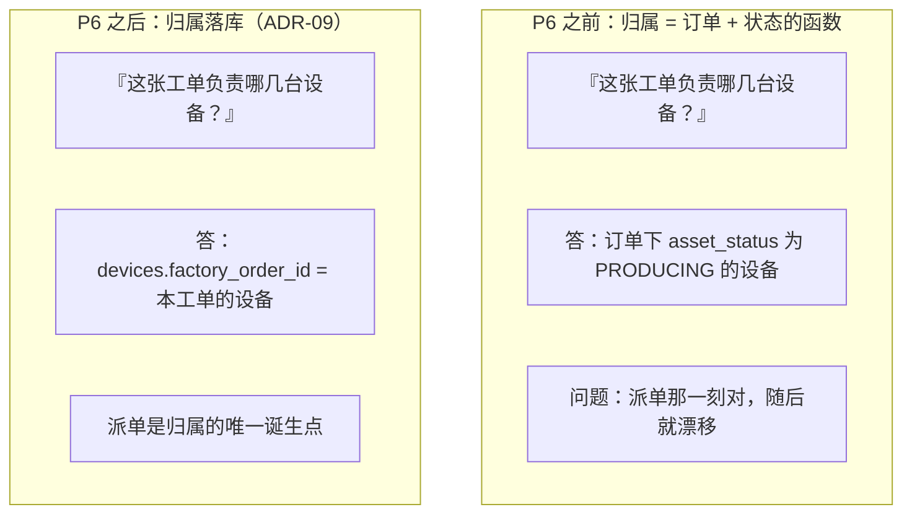

# 项目复盘

> **适用对象**：项目作者本人、评审者、以及想从别人的坑里学到东西的工程师
> **本文定位**：**背景与目标 → 整合决策 → 架构演进 → 关键问题与解法 → 度量结果 → 不足与路线图 → 经验沉淀**
> **配套文档**：[`11-测试与质量保障.md`](./11-测试与质量保障.md)（测试方法与缺陷清单）、[`03-系统架构图.md`](./03-系统架构图.md)（架构与 `ADR`）、[`../todolist.md`](../todolist.md) 附录 A/B/C（缺陷对照与 `ADR` 摘要）
> **最后更新**：2026-09-17
> **文档中标注说明**：✅ = 已实测或有记录可查；⚠️ = 未验证 / 未完成

---

## 0. 结论先行

### 0.1 度量结果

| 项 | 数值 |
|---|---|
| 开发阶段 | **12**（P0–P11） |
| 数据库表 | **46** |
| HTTP 端点 | **145**（OpenAPI `paths` **119**）+ WebSocket 1 |
| 业务枚举 | **35** 个类 / **145** 个成员 |
| 错误码 / 权限码 / 内置角色 | **31** / **54** / **6** |
| 后端源文件（mypy strict 口径） | **95** |
| 前端模块 | 页面 **45** + 共享 **28**（零构建） |
| 测试 | **553** 个测试函数（**814** 个用例） / 26 个文件 |
| **代码覆盖率** | ⚠️ **70%**（三个 P9 服务 < 31%） |
| 迁移版本 | **15**（`0001`–`0015`） |
| 里程碑 | **M0–M5 全部达成**（M5 公开就绪于 P11-C 收尾时达成） |
| 文档 | **14** 篇专业文档 + 1 个文档一致性门禁 |
| 端到端验收 | P6 **71/71**、P8 **50/50**、P9 浏览器 6 项、P10 冒烟 **57/57** |

### 0.2 一句话结论

> **这套系统的技术主干是可靠的**（隔离、状态机、幂等、安全失败都有实测与断言守着），
> **但它离「能上生产」还有明确距离**：覆盖率 70%、CI 未真实运行、无真实厂商联调、
> 合规能力未实现。这些不是「待办事项」，而是**必须写在结论里的边界**。

### 0.3 最值得记住的三件事

| # | 结论 | 代价 |
|---|---|---|
| 1 | **可部署性只能靠真的部署一次来证明** | `make up` 从 P0 起就是坏的，**坏了 10 个阶段**，直到 P10 真跑 Docker 才发现 |
| 2 | **代理自测全绿 ≠ 功能可用** | P6/P8/P9 共 7 个真缺陷，**全部由主会话的端到端验收 / 浏览器实测发现**，而代理交付的测试都是全绿的 |
| 3 | **会静默通过的检查比没有检查更危险** | 冒烟脚本曾在误删计数函数后仍打印「全部通过」 |

---

## 1. 背景与目标

### 1.1 项目是什么

**ToyVerse Cloud** —— 多租户 AI 智能玩具 SaaS 平台，覆盖
「客户开通 → 产品配置 → 下单 → 设备生成 → 工厂烧录 → 终端激活 → AI 运营」的全生命周期。

| 端 | 使用者 | 核心职责 |
|---|---|---|
| 平台端 | 平台运营方 | 租户、目录、订单审核、设备、批次、分配、工厂工单、OTA、运营看板 |
| 商户端 | 品牌方（租户） | 我的产品、AI 配置、知识库、下单、设备与绑定、运营数据 |
| 工厂端 | 烧录工厂（跨租户） | 工单、烧录上报、抽检、出货、固件版本 |
| 终端用户端 | 消费者（H5） | 扫码激活、与玩具对话、4G 充值、设备设置 |

### 1.2 项目性质（决定了它的取舍）

本项目有**两个并行目的**，这一点深刻影响了所有决策：

| 目的 | 对决策的影响 |
|---|---|
| **作品集**（展示工程能力） | 追求「克隆即可运行」「零构建前端」「诚实的文档与局限声明」——因为评审者会亲手跑 |
| **学习手册**（作为产品经理的学习材料） | 追求「把为什么讲清楚」——`ADR`、遗留缺陷对照、验收记录都写进仓库 |

> 这也解释了一个看起来不寻常的选择：**用了大量精力记录缺陷与局限**
> （20 条 `P-09` 级缺陷、7 条 P10 部署局限、每份文档末尾的取证边界）。
> 对交付来说这些是「负面信息」，对作品集与学习来说，**它们是主要价值**。

### 1.3 目标与非目标

**目标**：把「多租户 AI 玩具平台」的四端主干完整实现，并在**真实服务**上可验证。

**非目标**（明确排除，避免范围蔓延）：

| 非目标 | 理由 |
|---|---|
| 自研硬件 | 平台是软件层 |
| 自研大模型 | AI 通过 `AIProvider` 抽象接入第三方 |
| 内容电商 / C 端分发 | 内容库只服务「设备能讲什么」 |
| 真实支付通道 | 支付是可配置的模拟通道 |
| 生产级合规 | ⚠️ 未实现 PIPL / COPPA（原样记录，不粉饰） |

---

## 2. 三个遗留项目的整合决策

本项目不是从零开始——它整合了三个来源，**策略是「各取所长」而不是代码合并**：

| 来源 | 本质 | 贡献 | 不采纳的部分 |
|---|---|---|---|
| 早期静态原型 | 纯静态可点击原型，**无后端无数据库** | UI/交互规范、领域模型、PRD、状态机、二维码规则、设计系统 | 「任意密码可登录」的假登录 |
| 早期实现的运行时快照 | 仅有运行时构建、无源码 | 数据库 Schema 结构（15 张表）、多租户 RBAC 设计、部署拓扑、菜单结构 | 见下表「安全缺陷」 |
| 早期可运行 MVP | Node + Python 单文件 | 业务闭环语义（幂等绑定、confirm-token、冻结校验、审计、180 秒在线窗口） | 服务端的路径穿越漏洞 |

### 2.1 为什么不能直接合并

| 原因 | 说明 |
|---|---|
| **三者技术栈不同** | Java/Spring 运行时构建、Node+Python 单文件、静态 HTML —— 无法机械合并 |
| **早期实现只有运行时快照** | 源码已不可得，但其数据库迁移脚本可读，Schema 结构可完整复用 |
| **原型的「AI 配置」是桩** | `AI配置` 页是占位视图——**早期实现与原型都没有任何 AI 实现**，因此 AI 部分是全新设计（`ADR-04`） |

### 2.2 明确不移植的安全缺陷（`todolist.md` 附录 B）

| 来源 | 问题 | 处理 |
|---|---|---|
| MVP `server.py` | 静态文件**路径穿越漏洞** | **不移植** Python 版，只移植硬化后的语义并加路径规范化 |
| MVP `.env` | **硬编码弱口令** | **绝不迁移**；改为强密码 + 首次登录强制改密 + 启动期拒绝弱口令 |
| MVP `public/app.js` | 未转义的 `innerHTML` 模板注入 | 前端统一转义工具 `shared/ui/dom.js` |
| 原型 `admin.js` | `SecretKey` **明文展示在前端** | 后端 Fernet 加密存储，响应永不含 SK |
| 原型 `data.js:595` | JD 二维码**参数顺序错误**（`clientId` 误传 `tenantId` 位置） | 修正并用单测**钉死字段顺序** |
| 早期实现 `EventTestController` | 生产环境测试端点 | 不实现 |
| 早期实现的开发种子迁移脚本 | 开发种子数据进生产迁移路径 | 种子与迁移分离，由 `SEED_DEMO_DATA` 开关控制 |

> **复盘视角**：这张表的价值不在于「我们没照抄错误」，而在于——
> **早期实现的每个安全缺陷都是「当时看起来没问题」的写法**。
> 把它们列出来，比说一句「我们注意了安全」有用得多。

---

## 3. 架构演进

### 3.1 十条架构决策（`ADR-01`–`ADR-10`）

| # | 决策 | 一句话理由 |
|---|---|---|
| `ADR-01` | 平台管理员 `tenant_id = NULL`（全局长） | 早期实现把它挂在 `t-001`，与「平台是全局长」矛盾 |
| `ADR-02` | 烧录工厂独立 `factories` 表，账号 `tenant_id = NULL` | 工厂跨租户，不属于任何单一租户 |
| `ADR-03` | 设备状态以**四维**为权威 | 单一状态列无法表达「已分配但未激活」这类合法组合 |
| `ADR-04` | AI 业务标准以原型与 PRD-03 为准 | 早期实现**没有** AI 实现（只有占位视图桩） |
| `ADR-05` | 默认 SQLite，PostgreSQL 可选 | 保证「克隆即跑」，同时保留生产级选项 |
| `ADR-06` | 前端零构建 ES Module | 无需 `npm install`，降低作品集使用门槛 |
| `ADR-07` | 未配置密钥的厂商返回 `VENDOR_UNAVAILABLE`，**绝不伪造成功** | 假成功比报错更危险 |
| `ADR-08` | 多租户过滤只在 repository 层收口 | 从架构上杜绝越权 |
| `ADR-09` | **设备与工单的归属落库**（`devices.factory_order_id`） | 「归属」是事实，不是状态的函数 |
| `ADR-10` | 可冻结 / 可分配集合**按业务能力定义**，并与 `ASSET_TRANSITIONS` 严格对称 | 对称性应来自语义，不是来自把集合改小 |

### 3.2 ★ 两条决策是被**实测逼出来**的

这两条是本次复盘中最有代表性的演进——

#### `ADR-09`：从「状态推断归属」到「归属落库」

**漂移的两个真实后果**（P6 端到端验收实测）：

| 后果 | 具体现象 |
|---|---|
| 工单二维码清单多打标签 | 工单委托 **3** 台，清单返回 **5** 条（订单里另 1 台被冻结、1 台已先分配给客户）——工厂会多打 2 张标签，而**标签一旦贴上就很难挽回** |
| 抽检范围过宽 | 一台**从未进入生产**的同订单设备也能被这张工单抽检并计入合格率，**污染质量口径** |

> **教训**：一个「看起来等价的推断」，会因为**后来引入的新状态**（冻结、已分配）而失效。
> 当某个事实**有唯一的诞生点**（这里是「派单」），就应该把它落库。

#### `ADR-10`：从「让图看起来对称」到「按业务能力定义」

| 阶段 | 选择 | 后果 |
|---|---|---|
| P4 | 为求对称，把可冻结集合**收紧**为 `{IN_STOCK}` | 「已出货给商户的设备」**无法停服**——欠费停机、内容违规停用都做不到；绑定流程里的冻结校验退化成**不可达的防御性代码** |
| P6 | **放宽**为 `{IN_STOCK, ALLOCATED, BOUND}` 并**补齐三条入边** | 能力缺口补齐；解冻仍按 `previous_asset_status` **原路恢复** |

> **教训**：集合的定义依据应该是**业务能力**，不是「让状态图看起来对称」。
> 真正的对称性来自「入边与出边描述同一件事」——
> 而且这种对称性应该**由单测钉死**（`test_device_state_machine.py` 断言
> 「可冻结集合 == `ASSET_TRANSITIONS[FROZEN]`」），否则下一次改动还会漂移。

### 3.3 架构演进的时间线

| 阶段 | 关键演进 |
|---|---|
| P1 | 地基：配置与启动期校验、统一错误码、traceId、**租户作用域收口**（`ADR-08`）、JWT |
| P2 | 前端地基：设计系统、参数化 hash 路由、路由守卫（修 `P-01`/`P-02`/`P-05`） |
| P3 | 目录域：密钥加密落库（**密钥只进不出**） |
| P7 | AI 抽象层 + **离线模拟引擎**（`ADR-04`/`ADR-07`） |
| P4 | 订单与设备：状态机、二维码双格式、**设备四维**（`ADR-03`）、批次导入 |
| P5 | 分配与绑定：幂等键、confirm-token 不建表、设备密钥 |
| P6 | 工厂端：**归属落库**（`ADR-09`）、**集合按能力定义**（`ADR-10`）、字段白名单脱敏 |
| P8 | 小程序：**令牌类型双向隔离**、双路径激活、WS + SSE |
| P9 | AI 配置与运营：实时聚合 vs 快照、`P-07`/`P-08` 守卫 |
| P10 | 部署：**真跑 Docker**、冒烟、敏感信息扫描、CI |
| P11 | 文档集 + 文档一致性门禁 |

---

## 4. 关键问题与解法

以下 12 个问题按「**问题 → 根因 → 解法 → 教训**」组织，全部来自 `项目进度.md` 的真实记录。

### 4.1 设备四维：为什么不能只有一个状态列

| | |
|---|---|
| **问题** | 原型的 9 个状态标签无法表达「已分配但未激活」「已激活但已解绑」这类**合法组合** |
| **根因** | 把四个正交的事实（货是谁的 / 有没有激活 / 在线吗 / 绑没绑）压进一个字段 |
| **解法** | 按 `ADR-03` 拆成四维（`asset_status` / `activation_status` / `online_status` / `bind_status`），展示标签由 `derive_device_label()` **合成** |
| **教训** | 状态设计的判据是「**能否表达所有合法组合**」，不是「字段少一点更好看」 |

### 4.2 `in_stock` 同名不同域

| | |
|---|---|
| **问题** | `orders.status = IN_STOCK` 与 `devices.asset_status = IN_STOCK` 同名，极易误读 |
| **根因** | 「订单走到哪一步」与「货在谁手里」是两个维度，但碰巧用了同一个词 |
| **解法** | 明确语义（订单的 = 可派单；设备的 = **平台库存、未分配给任何租户**），并在 [`05-数据模型与ER图.md`](./05-数据模型与ER图.md) 单设一节说明 |
| **教训** | **一个真实代价**：若不区分，会写出「查所有 `IN_STOCK` 设备来分配」——
而订单生成的设备**建时就带 `tenant_id`**，它们不是平台库存。这也是种子数据里**必须补 4 台平台自有库存设备**的原因（否则分配页的选设备列表永远是空的） |

### 4.3 工厂脱敏：白名单而不是黑名单

| | |
|---|---|
| **问题** | 工厂端不能看到客户名 / 金额 / 联系方式 |
| **根因** | 若用「过滤掉敏感字段」的黑名单，**新增字段会自动泄漏**——因为没人记得把它加进黑名单 |
| **解法** | ① `FactoryOrderSerializer` 的 **`ALLOWED_FIELDS` 白名单**；② 序列化**只用显式传参构造**（不 `model_validate(order)`，否则 ORM 新增字段会被自动搬运）；③ 脱敏字段命名为 `customerNameMasked`——**响应模型里根本没有 `customerName`** |
| **教训** | 让「忘记脱敏」**在类型层面写不出来**，比写一份「记得脱敏」的规范有效得多 |

### 4.4 「已激活但未绑定」：一个合法状态引发的缺陷

| | |
|---|---|
| **问题** | 用户扫码激活，界面显示「激活成功」，但库里没有绑定关系——一进对话页就被 WebSocket 以 `4403` 拒绝，且**界面上看不出原因** |
| **根因** | 「已激活 + 未绑定」是**合法状态**（设备在别处激活过，或上一位用户**解绑**过——解绑**刻意不改变**激活状态）。而重复激活的幂等分支只回放结果、**不补绑定** |
| **解法** | 幂等分支**同时保证绑定关系**（已绑当前用户则空操作、未绑定则补绑、绑给别人则 409）；`_bind_to_end_user` 加「同用户已绑定 → 空操作」早返回（否则 `bind_count` 会被灌水，而它的用途正是识别反复解绑重绑的异常设备） |
| **教训** | **幂等不只是「返回同样的结果」，还要「保证目标状态成立」**。只回放而不收敛状态，会在合法状态组合下暴露 |

### 4.5 三方依赖的安全失败（`ADR-07`）

| | |
|---|---|
| **问题** | 未配置密钥的厂商调用应该返回什么？ |
| **根因** | 返回「伪造的成功」会让调用方以为链路已通——**这是最危险的一种错** |
| **解法** | 一律 `VENDOR_UNAVAILABLE`(503)，写 `VENDOR_CALL_FAILED` 审计；订单**退回 `APPROVED`**（不留在 `GENERATING`）、**设备表零新增**（不留半成品）；OTA 被拒时**不留任何推送记录** |
| **教训** | **「拒绝」必须是真的没发生**。这条延伸出一个实现细节：**流式响应一旦开始就无法改 HTTP 状态码**，因此能力与密钥校验必须在构造 `StreamingResponse` **之前**完成 |

### 4.6 看板数字悄悄错（`P-07` 类缺陷）

| | |
|---|---|
| **问题** | 24 小时分布被算成「某个小时 1 次」而不是「9 点 3 次、14 点 3 次」 |
| **根因** | 复用了「聚合基座」`_message_base`（`select(func.count())` 起手）再叠加行级列 `created_at`，生成 `SELECT count(*), created_at FROM ...`——**没有 `GROUP BY`**，SQLite 只返回**一行** |
| **解法** | 需要逐行数据时必须显式 `select(...).select_from(...)`；并给 `_message_base` 补「⚠️ 只用于聚合」的警告 docstring |
| **教训** | 这是**最难发现的一类缺陷**：不报错、总量还勉强对得上。防御手段是**让两条路径互相校验**——`test_metrics_isolation.py` 断言「**快照之和 == 实时聚合**」，用系数摊派的实现过不了这条 |

### 4.7 同一路径两个处理函数

| | |
|---|---|
| **问题** | P4 与 P9 各自定义了 `/merchant/products`，**生效的取决于 `router.py` 的 include 顺序** |
| **根因** | 路径唯一性没有被当成契约 |
| **解法** | 收敛为一个富化版本（列表也带设备计数与 AI 摘要，避免前端逐行回查造成 N+1），删除旧版并在原处留下说明 |
| **教训** | 「改了别处的 import 顺序就静默换实现」是一种**没有编译错误的换血**。新增端点前先 grep 路径 |

### 4.8 `make up` 坏了 10 个阶段

| | |
|---|---|
| **问题** | Makefile 写 `cd deploy && docker compose up`，而 compose 文件在仓库根 |
| **根因** | 只跑 `make test` 永远不会执行 Makefile 的 docker 目标——**「文档写了」与「真的能跑」之间没有任何检查** |
| **解法** | 改为在仓库根执行，并拆出 `up-nginx` / `up-full` |
| **教训** | **★ 可部署性只能靠真的部署一次来证明。** 这条在 P10 上被反复验证：12 个问题**没有一个**能靠读代码或跑集成测试发现 |

### 4.9 整个 UI 404 而 API 正常

| | |
|---|---|
| **问题** | 容器里 `/platform/` 返回 404，但 `/api/v1/health` 正常，日志里**只有一条 WARNING** |
| **根因** | `FRONTEND_ROOT` 靠「`__file__` 上溯固定级数」推算，而容器布局是 `/app/app/...`（**没有 `backend/` 这一层**），于是数到了 `/` |
| **解法** | `_guess_repo_root()` + `_resolve_frontend_root()`（多级兜底）**加上** compose 里显式声明 `FRONTEND_DIR` |
| **教训** | ① **「部分可用」比「全不可用」更难排查**——API 正常会让人先怀疑前端；② **部署配置不该依赖推算** |

### 4.10 多 worker 各自播种

| | |
|---|---|
| **问题** | `--workers 4` 下 4 个进程各播种一次，并发写同一 SQLite（实测 1 成功 3 失败） |
| **根因** | uvicorn 的 `--workers N` 会 fork N 个进程，**每个进程都执行 lifespan** |
| **解法** | `SEED_AT_STARTUP=false`，改由容器入口脚本在 **fork 之前**执行一次 |
| **教训** | 数据「看起来有了」不代表写完了——**赢得竞争的那个 worker 可能只写了一半**。这是**偶发**而非确定性行为，属最难复现的一类 |

### 4.11 会静默通过的检查

| | |
|---|---|
| **问题** | `smoke_test.sh` 在**误删计数函数**后仍打印「0 通过 / **全部通过**」 |
| **根因** | 脚本的「通过」判据是「没有失败」，而不是「执行了预期数量的断言」 |
| **解法** | 恢复 `ok`/`bad`/`skip` 计数器 + 加 `MIN_EXPECTED_CHECKS=25` 守卫 |
| **教训** | **★ 会静默通过的检查比没有检查更危险**——它让你以为有保障。同类问题还有：一条约 1/16 概率假通过的 flaky 测试；一个规则太宽的扫描器（133 条误报） |

### 4.12 脱敏的观感也属于质量问题

| | |
|---|---|
| **问题** | 客户名脱敏后显示成 `星********）`——括号占了可见位，看起来像坏数据 |
| **根因** | 脱敏取「字面」首尾字符，而名字末尾是括号 |
| **解法** | 改为取「首个/末个**文字字符**」，得到 `星********户`，**长度恒等**（保持幂等性与全部不变量） |
| **教训** | 它泄漏的不只是观感——**「后面跟着一段括号备注」这一结构信息也一起泄漏了**。脱敏要按**语义**而不是按字节 |

### 4.13 ★ 改一个 `.env` 里的账号名，整站就起不来

| | |
|---|---|
| **问题** | 复用已有数据卷启动容器 → 应用**启动即崩、无限重启**（`Restarting (1)`） |
| **根因** | 初始账号播种 `_seed_admin_users` **按 `account` 查重、却按固定 `id` 插入**——两个判据不一致 |
| **触发链** | `.env` 里把管理员**登录账号换成了另一个号码** → 按新名字查不到 → 认为「还没有」→ 拿同一个固定 `id` 再插一次 → `IntegrityError: UNIQUE constraint failed: user_accounts.id` |
| **为什么严重** | 容器入口是「**先播种、再起服务**」→ 一个配置项就能让**已有库的部署**进入无限重启；而且它只在「改过账号名 + 复用旧卷」时出现，**新库、测试库、CI 全都复现不出来** |
| **解法** | 查重一律按 **`id`**（稳定标识）；三条路径都覆盖：同名 → 空操作（**不动密码**）、改名 → 同步登录名并告警、目标名字被**别的 `id`** 占用 → 跳过并告警 |
| **验证** | ① 在**真实的故障卷**上复现 → 修复 → 应用变 `healthy`、日志出现改名告警、`password_hash` 未变、重启幂等；② 新增 5 条回归测试，其中改名那条在**修复前会失败**（已实测） |
| **教训** | ★ **「查重键」与「写入键」必须是同一个键。** 这是一类很容易写出的静默不一致——写的人想着「用户是用账号登录的，当然按账号查」，但插入用的是主键。**这类缺陷只有真跑容器、且带历史数据时才会暴露**，正好是 `## 7.5` 与 `4.8` 教训的又一例 |

### 4.14 ★ 一个被实测推翻的假设：读路径上 PG 并不更快

| | |
|---|---|
| **假设** | 「PostgreSQL 全面优于 SQLite，切 PG 一定更快」——这是本项目此前心照不宣的判断 |
| **实测** | 20 并发 × 15 秒：读 **73.6 QPS（SQLite）vs 72.0（PG）**，**基本持平**；PG 中位延迟更低（149 vs 257 ms），但 SQLite **尾延迟好得多**（p95 436 vs 994 ms、max 904 vs 2339 ms） |
| **真相** | PG 的优势**集中在写路径**（93.0 vs 30.7 QPS，失败 0 vs 4）。读路径上 SQLite 省掉了容器网络与 asyncpg 协议开销，反而更"稳" |
| **教训** | ★ **「更强的组件」不等于「每个维度都更强」。** 不实测就会把选型结论说成「PG 什么都更快」，从而让「读多写少的小部署用 SQLite」看起来像一种妥协——**而它其实是一个合理选择**。精确的结论是：**只有需要并发写（或多实例）时才必须上 PG** |

### 4.15 ★ CI 配置「写对了」却从未生效：分支名对不上

| | |
|---|---|
| **问题** | 仓库推上 GitHub 后，Actions 里**一个 run 都没有** |
| **根因** | `.github/workflows/ci.yml` 的 `on.push.branches` 写的是 **`master`**，而仓库默认分支是 **`main`** → **推送不触发任何 CI** |
| **为什么长期没发现** | 本机**没有 remote**，只能做「本地静态审查」：YAML 能解析、5 个 job 结构正确、每条命令都与 `make check` 逐字一致——**所有本地能验的都验过了，唯独验不了「它会不会被触发」** |
| **发现方式** | 推送后查 GitHub API：`GET /repos/{owner}/{repo}/actions/runs` → **`total_count = 0`** |
| **修复** | `push` / `pull_request` 的 branches 改为 `main`；本地分支名也从历史遗留的 `master` 统一为 `main` |
| **修复后** | run #1 五个 job 全绿（lint 43s / pytest 2m42s / contract 25s / frontend 5s / secrets 6s） |
| **教训** | ★ **「配置存在」不等于「配置生效」。** 这是本项目第三次遇到同一类问题（P10 的 `make up` 坏了 10 个阶段、nginx 的 WS location 写错、现在是 CI 触发分支）。三者的共同点：**都能被「读一遍」认定为正确，只有真的跑一次才会暴露。** 对 CI 这类「声明式配置」，唯一有效的验收就是**推一次、然后去查它有没有真的跑**——查的是运行记录，不是配置文件 |

---

## 5. 度量结果

### 5.1 客观数字

| 维度 | 数值 | 评价 |
|---|---|---|
| 功能完整度 | 四端主干全部可跑；端到端闭环有自动化测试 | ✅ 好 |
| 接口规模 | 145 个端点、46 张表、15 个迁移 | ✅ 中等偏上 |
| 测试规模 | 553 个函数 / 814 个用例 | ✅ 数量可观 |
| **覆盖率** | ⚠️ **70%**，三个 P9 服务 < 31% | ✘ **最大短板之一** |
| 类型严格度 | mypy **strict**，95 个文件无问题 | ✅ 好 |
| 契约门禁 | 接口 / 前端导入 / 迁移 / **文档**四类 | ✅ 好 |
| 可部署性 | 一键起服务、57 项冒烟、持久化验证、**TLS 与多实例已实测** | ✅ 好 |
| 性能基线 | 单机 20 并发 × 15 秒：读 73.6 / 写 30.7 QPS（SQLite）→ 读写 93.0 QPS（PG）；**仅一轮短测** | ⚠️ 量级可用，**不足以做容量规划** |
| 安全基线 | 隔离、脱敏、密钥、安全失败都有实测 | ✅ 好 |
| 合规能力 | ⚠️ **未实现** PIPL / COPPA | ✘ **不能用于真实儿童产品** |
| CI 真实性 | ✅ **已在真实 GitHub 跑通**（run #1 五 job 全绿）；★ 首跑即抓到「触发分支写成 `master` → 永不触发」 | ✅ 已验证 |

### 5.2 主观评估

**做得好的**：

| # | 项 | 为什么 |
|---|---|---|
| 1 | **边界与局限的记录** | 每份文档都有「已知局限/取证边界」，逐条写「限制 → 后果 → 补齐方式」。这在工程上不常见，但它让评审者能准确判断「能用到哪」 |
| 2 | **架构红线可执行** | 八条红线里「租户过滤收口」「字段白名单」「安全失败」都有代码位置与测试守着，不是口号 |
| 3 | **把「不变量」钉成断言** | 「可冻结集合 == 迁移表入边」「白名单 == 响应模型字段」——让「两侧必须同改」变成红灯 |
| 4 | **验收方式本身被固化** | 「真实服务 + 真实 HTTP + 浏览器 + 真跑 Docker」四层，并且有实测证据说明**四者不可互相替代** |

**做得勉强的**：

| # | 项 | 具体表现 |
|---|---|---|
| 1 | **测试深度不均衡** | 数量够（814），但集中在主路径；P9 三个服务 < 31% |
| 2 | **部署验证来得太晚** | 到 P10 才真跑 Docker，导致 12 个问题积压到最后一起爆发 |
| 3 | **前后端共享模块有已知缺陷** | `shared/core/ws.js` 与 `api.js` 与真实协议不符，小程序端用「继承覆盖」绕开——**共享模块本身仍不可用** |
| 4 | **部分菜单是空壳** | 13 个菜单项渲染「建设中」（平台 7 / 商户 5 / 工厂 1） |
| 5 | **AI 部分只有骨架** | 四家适配器未联调，火山签名仍是占位 |

---

## 6. 不足与路线图

### 6.1 明确未做

| 项 | 说明 |
|---|---|
| **学习手册**（`learning/`） | ✅ **P11-B 已交付**：20 个文件 / 8177 行；⚠️ 但**不上传仓库**，因此公开仓库里看不到它 |
| **各端截图** | ✅ **P11-C 已交付**：`docs/assets/` 14 张（登录页 + 平台端 6 + 商户端 4 + 工厂端 2 + 小程序 1） |
| **README 终版** | ✅ **P11-C 已交付**：界面预览 / 规模速查 / 验收方式 / 已知局限四节 |
| 工厂端「批次查询」页 | 菜单存在、**后端端点也未实现**（权限码已预留） |
| 内容库写能力与内容审核流程 | 当前**只读** |
| 知识库向量化检索 | 关键词级，`embedding_model` 保留未用 |
| 语音通道前端 | 后端帧与 `provider.asr/tts` 就绪，**前端无录音与播放** |
| ~~多实例部署与负载均衡~~ | ✅ **P11 收尾已实测**：2 实例 + 1 Nginx 轮询 **31 / 29**、WS 正常；★ 但**共享 SQLite 卷写无收益且报 500** → **多实例必须配 PostgreSQL**，而「多实例 + PG」仍未验证 |
| WAF / 限流 / KMS 密钥轮换 | 未实现 |
| **PIPL / COPPA 合规** | ⚠️ 涉及儿童语音数据，**生产前必须补** |
| 定时任务基础设施 | 无 Celery / 调度器，因此过期数据清理依赖人工 |

### 6.2 做了但不够

| 项 | 现状 | 建议 |
|---|---|---|
| **运营快照的时区口径** | 按 **UTC** 归档，与商户本地日期可能差一天（凌晨 8 点前尤明显）。`tenants.timezone` 已存在但**未参与聚合** | 按租户时区归档：会同时影响四张快照表、小时归并与前端日期选择 |
| **覆盖率** | 70%，三个 P9 服务 < 31% | 优先补 `metrics_service` 的聚合分支（`P-07` 守卫已在那，扩展成本低） |
| **CI** | ✅ 已在真实 GitHub 跑通（五 job 全绿）；⚠️ 不构建镜像 | 把镜像构建放到发布流程；后续可加依赖漏洞扫描（`pip-audit`） |
| **PostgreSQL** | ✅ **已完成**（P11 收尾真跑 + 压测）：迁移 `0015` + 种子 + 冒烟 **57/57**；并发写 **93.0 QPS / 0 失败**（SQLite 对照 30.7 QPS / 4×500）；⚠️ 连接池参数未调优、长时间稳定性未测 | 若要上生产：调连接池 + 跑一次长稳测试 |
| **Nginx** | ✅ TLS（自签）与多实例均已实测（`wss` 4401、轮询 31/29）；⚠️ 仓库未附证书，多实例缺外部状态支撑 | 补真实证书；多实例需解决限流与 WS 会话路由的共享状态 |
| **压测** | ✅ 有了一轮基线（20 并发 × 15 秒，SQLite vs PG）；⚠️ **无劣化曲线、无参数扫描、未长时间观测** | 需要容量结论时：加长时长、扫描 `--workers` 与连接池、补重写端点（批量导入 / 分配执行） |
| `factory_orders.order_id` | **无唯一索引**，「一单一张工单」是服务层约束 | 补一次迁移加 `UNIQUE(order_id)` |
| `STORAGE_BACKEND=s3` | **显式安全失败**（不假装可用） | 补齐 S3 实现，或明确只用 `local` + 持久卷 |
| `shared/core/ws.js` / `api.js` | 与真实协议不符，小程序端继承覆盖绕开 | 修共享模块（否则其他端复用会出问题） |
| 演示数据 | 固件包**没有上传文件**，因此 OTA 推送如实失败 | 是 `ADR-07` 的预期表现；要演示成功路径需上传真实固件文件 |
| 文档 | 叙述性描述无法自动校验 | 把 `docs/` 加入相关 PR 的必改清单 |

### 6.3 如果重做一次，会先做什么

| # | 会做的事 | 为什么 |
|---|---|---|
| 1 | **在 P1 就加一个「真跑一次部署」的检查** | `make up` 坏了 10 个阶段。哪怕只是每周跑一次 `make up && make smoke`，也能把这个缺陷的暴露时间从 10 个阶段缩短到 1 周 |
| 2 | **把覆盖率门禁放进 CI 并设阈值** | 覆盖率是「事后很难补」的指标；一开始不设，就会一直靠后置 |
| 3 | **同一个框架下先打通一条最小闭环，再做广度** | 现在 145 个端点是横向铺开的；纵向先跑通能更早暴露集成问题 |
| 4 | **给「归属」这类事实一开始就落库** | `ADR-09` 的代价是「先按推断实现，再回头迁移 + 回填」（且历史数据无法回填） |
| 5 | **代理交付的测试，一开始就要求「跑通真实链路」而不是「测试全绿」** | 省下的是返工时间 |

---

## 7. 经验沉淀

八条可带走的方法论。每条都标注了它的**代价**——没有代价的经验通常是空话。

| # | 经验 | 代价 / 出处 |
|---|---|---|
| 1 | **验收必须真跑**（真实服务 + 真实 HTTP + 浏览器 + 真跑部署），四者不可互相替代 | P6/P8/P9 的 7 个真缺陷 + P10 的 12 个问题 |
| 2 | **「测试全绿」不等于「功能可用」**；代理（或自己）写的测试覆盖的是「我以为的路径」 | 代理交付 275 条测试全绿，而 3 个真缺陷一个都没测到 |
| 3 | **会静默通过的检查比没有检查更危险**——检查必须能区分「规则不响」与「规则坏了」 | 冒烟脚本误删计数函数后仍打印「全部通过」 |
| 4 | **「归属」是事实，不是状态的函数**——有唯一诞生点的事实就该落库 | 工单委托 3 台导出 5 张标签 |
| 5 | **脱敏用白名单，不用黑名单**；并让「忘记脱敏」在类型层面写不出来 | 黑名单下新增字段会自动泄漏 |
| 6 | **集合/规则要与状态机严格对称，并交给单测钉死** | 「为求对称把集合改小」导致已出货设备无法停服 |
| 7 | **失败要可区分**：`PENDING` 与 `PARSED` 是两个独立事实；「未知」不要伪装成「零」（比率分母为 0 时返回 `null`） | 上传成功 ≠ 能被检索；`0%` 会被读成「用户全流失」 |
| 8 | **一致性应该由门禁保证，而不是靠人记得** | 文档会悄悄过期 → `make docs-check`；接口会悄悄变 → `make openapi-check`；`import` 会写错 → `make fe-check` |

### 7.1 一条关于「诚实」的经验

本项目的文档里到处是 `⚠️` 与「已知局限」。这不是自我否定，而是**一种工程能力**：

| 做法 | 收益 |
|---|---|
| 区分「已实测 / 已实现但未联调 / 未实现 / 未取证」四档 | 评审者能准确判断「能用到哪」，而不是靠猜 |
| 每条局限写「限制 → **具体后果** → 何时/如何补齐」 | 把「可能有风险」这种无信息量的声明变成可执行的整改项 |
| 给「数据不存在」加对照实验 | `test_factory_desensitize.py` 同时断言**平台端能看到客户名**——否则「工厂端看不到」可能只是**数据本来就没写** |

> **最后一句话**：这个项目最有价值的产出可能不是 145 个端点，
> 而是**一份真实记录了「哪些地方我以为行、实际不行」的清单**。

---

## 附录：已知局限与取证边界

1. ★ **本文是项目自身的复盘，缺少外部视角**：没有用户、客户、同事的反馈；
   所有「做得好/勉强」的评价都是自评，**不具备独立评审的效力**。
2. **度量数字来自本机环境**（单机、SQLite、无并发），不能直接外推到生产。
3. **AI 相关能力的复盘只到离线引擎层面**：真实厂商链路未联调，因此关于「AI 效果」的任何结论都不成立。
4. **`## 4.` 的 12 个问题选自 `项目进度.md` 记录的缺陷**，可能遗漏未登记到追踪文件的小修复。
5. **`## 5.2` 的主观评估是自评**，其中「做得好的」部分尤其需要外部验证。
6. **`## 6.3`「如果重做一次」是事后判断**，带有后见之明偏差；当时的信息条件下未必能得出同样结论。
7. **P11 已全部完成**（A 文档集 / B 学习手册 / C 收尾）：专业文档集 14 篇 + 文档一致性门禁、
   学习手册 20 文件 8177 行（**不上传仓库**）、14 张各端截图、README 终版；
   两项最终验证通过（`learning/` 未被跟踪；陌生环境按 README 从克隆到四端可用 ≈91 秒）。
8. ✅ **M5「公开就绪」已达成**（2026-09-17）。⚠️ 但「公开就绪」不等于「生产就绪」：
   真实厂商联调、儿童数据合规、覆盖率与压测仍未完成 —— 见 `## 6.1` 与各文档的「已知局限」。
9. **本文引用的一切数字均可在仓库内复核**（`项目进度.md`、`todolist.md`、`CHANGELOG.md`、
   以及 `make check` / `make docs-check` 的输出），但**未经过第三方审计**。
